# Echoes of Spira — changelog

Every build that has gone live or to a preview, newest first, from the first alpha to today, and the day the
project began: 58 entries. Dates are US Eastern. FFX, FFX-2 or both tells you which game a change touches.
Each entry lists its changes as text and shows a picture from that build (from release 39.2 on, up to three,
kept under `docs/screenshots/`); where there is an "All pictures for this build" link it opens a page with every
picture, before and after where both exist. Engineering detail lives in `docs/handoff/release-NN.md`.

Echoes of Spira was called Pyrefly Reprise until 2026-10-04, so older pictures show the old name and the site
address still carries it.

## 2026-10-09 · Release candidate 1: Final Fantasy X and X-2 battles from the game's own code (not live)

Address: none yet (branch re-parity-rc1 on main 00fc1bbf, release 39.4.2; not pushed, not deployed, no review run)

- **FFX:** every attack, spell, item and Overdrive now decides whether it hits, whether it is a
  critical hit and how much damage it does the way the game's own program does, read from Bailey's
  Steam copy and checked against it: the game's accuracy formula for each command, its order of
  steps, its random draws in its order. Spells, items, Overdrives, aeon specials and several boss
  attacks have no hit roll in the game and never miss (Seymour's Cross Cleave is one; the party
  could dodge it before). Only the commands the game marks can land a critical hit: no spell does
  any more (Lulu's Firaga and Thundaga lose their small chance), a few physical skills do
  (Kimahri's Jump), and Daigoro's attack and Braska's Final Aeon's Triumphant Grasp do not. Luck
  counts one point a stack in the critical sum, not ten. Damage follows the game's order of steps
  (3 to 4 percent of ordinary hits were a point off), a natural Defense of 0 is no longer raised to
  1, a petrified target takes no damage (Mortibody's Shattering Claw does nothing to a stoned party
  member), the party's percent bonuses reach heals, and the five possessed aeons' plain attack
  misses about half the time against the party's Evasion, as the game's record says.
- **FFX, Chapter I:** Seymour Flux and the Mortiorchis follow the game's own script. One shared
  cycle runs the pair, Flux Banishes an aeon on his next turn, his Protect and Reflect come once
  each at 52,500 and 35,000 HP, and the Mortiorchis comes back at 4,000, 3,000, 2,000, 1,000 and
  1,000 HP and takes Flux's turn counter after each of its turns, so Full-Life follows the Lance of
  Atrophy far less often. With Cross Cleave unable to miss, the shipped auto-battle line wins all 500
  test seeds (it won 267 of 500 on release 39.4.2).
- **FFX, Chapter II:** Yunalesca follows her script. Her counters follow every action that reaches
  her, a miss included; a form changes after the last hit of the blow that ended it and the rest of
  a multi-hit blow is discarded; against a summoned aeon her Mind Blast and Osmose land on the aeon
  on the field; Form II's counter advances on aeon turns. Harder: the shipped line wins 483 of 500
  seeds (498 before) and loses 55 percent more party members.
- **FFX, Chapter III:** Braska's Final Aeon, the Yu Pagodas, the five possessed aeons and Yu Yevon
  follow their scripts. His Overdrive runs on a fixed gauge (+2 or +3 a turn, +5 a hit, +20 a
  Power Wave) and fires the turn after it reads 100; Talk clears it when his next turn starts; Jecht
  Beam comes a third of the time in his first and third phases. A destroyed Pagoda comes back after
  two or three of its own turns (one if Slowed) carrying the damage it absorbed. A possessed aeon's
  special lands on one actor (Bahamut's Impulse on all, Anima always Pain), a character the fayth
  revives acts next, and Yu Yevon casts Gravija on every turn after his first, on the front line and
  himself but not his Pagodas; his seventh damaging hit makes his next turn Osmose on each of the
  three, then Ultima. A party that swings at him with a Zombie weapon now wins in about 24 turns, not
  hundreds. The chapter still wins 486 of 500 seeds (487 before).
- **FFX, Chapter VII:** Seymour, the Guado Guardians and Anima follow the script. Seymour's Shell and
  the Guardians' Protect are real first turns, a Guardian drinks an Auto-Potion (+1,000 HP) when it
  is damaged (not after a steal), Guard cover shields a Guardian from single-target blows, Anima's
  gauge fills +5 a Pain and +5 an action that reaches her, a lethal blow before the summon lands
  whole and Seymour is put back on 6,000 as Anima comes, and in act three he casts two spells at two
  party slots (the Anima summon line is now triggered by the summon itself). The shipped line wins
  443 of 500 seeds (482 before).
- **FFX, Chapter X:** Natus owns the element order, his phase follows his HP down and back up,
  Mortibody's Desperado ladder scores Shell, Haste, Reflect and the four Nuls, an aeon is Banished at
  once, and Natus loses half of a Multi-ra when the third party slot is down. The shipped line, which
  Hastes two and Shells three, now calls Desperado about half the time Mortibody checks. 386 of 500
  seeds (393 before).
- **FFX, Chapter XII:** Seymour Omnis and the Mortiphasm discs follow the script. The discs turn Fire,
  Ice, Water, Thunder and reset Ice, Water, Thunder, Fire; he always casts four spells, in the
  order the disc layout fixes; the reset turn casts nothing; hits during the glow are ignored. The
  readout strip names four spells. Easier: 427 of 500 seeds (281 before).
- **FFX, Chapter VIII:** Evrae and Cid follow the game's scripts. Evrae Hastes himself once his HP is
  under 10,666 and, in his Haste phase, answers a hit from afar with a Swooping Scythe (and a hit up
  close with a fresh Haste while Slow holds); his Stone Gaze counter fills by the class of the
  command that hit him (a weapon attack +2, a spell +1, anything else nothing), once per action, a
  miss included, and keeps firing after the Haste phase starts; Cid is slower (an action every 42
  ticks, not 36). **New, by Bailey's word ("Turn it on"): delaying Evrae now matters.** Delay Attack
  counts 1 and Delay Buster 3, and at 3 his Haste phase starts with no HP lost, as the game's script
  has it. The shipped line wins 490 of 500 seeds (488 before) and never uses Delay, so nothing it
  plays moved.
- **FFX, Chapter IX:** Yojimbo follows his script. He opens with a Summon aimed at Lady Ginnem and
  acts before the party; inside each Overdrive-gauge band the game's own odds apply (80 to 99:
  Wakizashi 25, Kozuka 25, Daigoro 50 percent; 50 to 79: 20, 20, 60; 25 to 49: Kozuka 25, Daigoro
  75), Zanmato leaves the gauge at 2, and his "+3 when targeted" counts once per action that reaches
  him, a miss included. Easier: 485 of 500 seeds (428 before), mostly because Daigoro (the dog's
  bite) comes up more often and Wakizashi and Kozuka less (8.5 a run, 14.7 before).
- **FFX, Chapter XIV:** Isaaru's three aeons follow their scripts. Each opens with a Summon aimed at
  Isaaru and acts before the party; Grothia and Pterya fill their Overdrive gauges on every attack at
  Yuna even with no aeon out; against an aeon each picks its special one time in three, the plain
  Attack otherwise; Spathi's first Mega Flare comes one turn later. 423 of 500 seeds (434 before:
  inside the noise).
- **FFX, Chapter XVII:** the Fins, Genais and the Core follow their scripts. The Left Fin rams with
  the game's odds by how often he has been hit (one in three, two in three, then always), the Right
  Fin latches on at the first hit that leaves him under 16,250, and a Fin's Negation is scored from
  the party's buffs (Shell, Reflect, Protect and Haste, member by member). Genais starts inside its
  shell and leaves it on its first turn, heals itself with Cura on every hit while shelled, and
  answers a spell with Waterga once out; the Core counters with its own Fire, Blizzard, Thunder and
  Water, mostly when it is low, and its Negation chance falls as it is hit. Easier: 437 of 500 seeds
  (269 before; 87 percent against 54).
- **FFX, Chapter XVIII (Sin's face):** the game's script ends the fight with Giga-Graviton on Sin's
  12th turn (the chapter used 13), Sin takes the first turn of the fight, after his second pull Use,
  items, Wakka's reels and the aeon Overdrives of reach 1 reach him while melee does not, and the
  Gaze counter rises on every hit from the first. **Now almost unwinnable for the built-in
  auto-battle line: 3 of 500 seeds (124 on this candidate before the chapter's script went in, 151
  on 39.4.2).** Bailey chose to ship the game's 12 ("Ship 12, retune our line later") and to rework
  our own strategy line and the party preset in a later batch. The HUD clock opens at 12; the
  strategy guide card still says 13 (known stale text until that batch).
- **FFX-2:** every attack, spell, item and enemy move now decides whether it hits, whether it is a
  critical hit, how much damage it does, which status it inflicts and whether it steals the way the
  game's own program does, read from Bailey's Steam copy of FFX-2 and checked against it. Each move
  runs on the game's own row for it (accuracy rule, power, critical chance, element, number of hits,
  statuses) and each action is worked out in the game's order, with its random draws in that order.
  Moves the game never rolls to hit for never miss: nearly every item and spell, and several boss
  moves that used to miss about one time in ten (Vegnagun's Tail Beam and Noli Me Tangere, Ormi's
  Supercollider, the Dark Knight's Darkness). A physical hit counts both sides' Luck, Evasion and
  Accuracy as the game does: Shiva, Sandy and Ixion miss two to three times as often as before,
  Nooj and Ormi's Shield Bash a third to a half more often, and the Paragon's Attack never touches a
  girl who wears the Rabite's Foot. Critical hits follow the game's rule: the girls' Attack lands a
  critical hit on about 44 of every 100 hits that land (11 before), enemies land them where their
  row says (Nooj's Attack about one hit in ten), and a spell crits only if its row says so. Damage
  follows the game's whole-number steps (about 70 percent of ordinary physical hits were a few
  points off, up to 27), the chain bonus comes before the element, Shell halves what the row types
  as magic and Protect what it types as physical (Bahamut's Impulse is neither; Noli Me Tangere,
  Final Impact and the Grenade are physical), and a number applied to MP can no longer take a girl
  above her maximum. Statuses land by the game's one rule; Logos' Russian Roulette is five different
  results, one picked at random; Delta Attack leaves MP alone; Pilfer Gil takes between half and all
  of a fiend's gil (it took all of it before), and Chapter VI's fiends now carry some. The hit,
  critical and status chances the battle menu and the move advisor print come from the same rules.
- **FFX-2, Chapter IV:** Bahamut's Impulse is untyped in the game's row, so Shell no longer halves it
  and lowering his Magic no longer shrinks it (about 292 a hit under Shell, 191 before). **Mega Flare
  now hits at the game's own power 14, where we had 24** (Bailey: "Use 14 from the files"): a girl
  under Shell takes about 23 a hit instead of 69. The shipped line still wins every one of 500 seeds,
  in 42 party turns. Of the researched routes (30 seeds each): Shell without the Breaks wins 30 of 30
  (at least 28 before), healing alone 30 (1 before) and the Magic Break route alone 21 (at least 28
  before); with the 24 still in, as the candidate stood until Bailey's answer, they read 25, 14 and 2,
  because with no Shell and no cure the party is ground down, and a Mega Flare at a third of its old
  damage is what lets those routes live. Mashing Attack still never wins (0 of 30) but leaves Bahamut
  at 1,300 to 1,900 of his 8,400 HP.
- **FFX-2, Chapter V:** harder. The shipped line wins 430 of 500 seeds (474 before) and loses 5.5
  party members a run (3.1). The cause is three of the game's rows that differ from the numbers we
  had: the Leg's Berserk (a chance of 255 that lands even through the Leg's full resistance, where
  the old number did not), Mega Phoenix and the Leg's Slow. At a human pace (1.5 seconds a menu) the
  shipped line wins 2 of 10 seeds; it won 4.
- **FFX-2, Chapter VI:** the Grenade is a physical move in the game's row, so Leblanc's Protect
  halves the shipped line's workhorse; Logos lives past Leblanc's third turn and No Love Lost fires on
  11 of 20 seeds (2 before). The shipped line wins 491 of 500 seeds (488). Careless menu-mashing now
  wins the three acts on 22 of 40 seeds with no decision time (it lost 12 of 12); at a human pace it
  still loses every seed.
- **FFX-2, Chapter XI:** easier, 490 of 500 seeds (430 before). The Dark Knight's Darkness never
  misses (the game's row has no hit roll; it missed 11 times in 100) and hits harder by the game's
  whole-number steps (3,806 a hit, 2,449 before), so Shiva falls sooner and acts half as often.
- **FFX-2, Chapter XIII:** much easier, 213 of 500 seeds (36 before; 43 percent against 7). Two
  causes that overlap: the game's critical rule and the game's rows. Final Impact is a physical move
  in its row, so Protect halves it (1,734 a hit to 888), and Soul Spring hits HP and MP and drains
  both (about 1,000 a hit). The Paragon's Attack now misses a girl who wears the Rabite's Foot every
  time (it missed half of the time before) and no longer makes her Itchy; Trema's Beguiling Mire and
  Choking Mist miss 71 to 84 times in 100 (68 to 70 before).
- **FFX-2, Chapter XV:** harder, 234 of 500 seeds (274 before). The shades hit 5 to 12 percent
  harder per hit under the game's whole-number damage (Nooj's Attack 269 to 301, Baralai's 231 to
  251, Gippal's 223 to 236), 5 to 10 percent of their hits are now critical (none were), and the
  chain bonus builds on the girls they hit several times (without it the chapter would win 309).
- **FFX-2, Chapter XVI:** unchanged, 500 of 500 seeds (497 before). Ixion misses 14 of every 100
  Attacks against the party's Evasion, as the game's rule has it (5 before).
- **What changes in difficulty, FFX** (the shipped auto-battle line, 500 test seeds a chapter;
  release 39.4.2 in brackets): Chapter I is much easier, 500 (267), because Seymour's mount now takes
  its turns in step with him, as the game's script has it, which more than pays for Cross Cleave no
  longer being able to miss. Chapter XII is easier, 427 (281), because Omnis always casts four spells
  in the order the discs fix and his reset turn casts nothing. **Chapter XVII is much easier, 437
  (269)**, because Genais heals itself with Cura on every hit and so sits in its shell far less, and
  the Core counters mostly when it is low (its Fire, Blizzard, Thunder and Water fall from 12.5 to 7.2
  a run). **Chapter IX is easier, 485 (428)**, because the game's odds send Yojimbo's dog at the party
  more often than his blades, and his Summon first turn is a free turn for the party. **Chapter XVIII
  (Sin's face) is now almost unwinnable for the built-in line, 3 (151)**: the game's script ends the
  fight on Sin's 12th turn (the chapter used 13) and lets Sin act first, and the line and the party
  preset were tuned against 13 turns (it read 124 once no spell could land a critical hit, as the
  game has it); Bailey chose to ship the game's 12 and rework our own line and preset later. Chapter
  VII is a little harder, 443 (482), because Seymour's first turn is a real Shell. Chapter II is a
  little harder, 483 (498), and the party loses 55 percent more members, because Yunalesca's counters
  follow every action that reaches her, a miss included, and her Mind Blast and Osmose land on the
  summoned aeon. Chapters III, VIII (490), X and XIV (423) moved by 11 seeds or fewer, inside the
  sampling noise.
- **What changes in difficulty, FFX-2** (the same line and seeds; release 39.4.2 in brackets):
  Chapter XIII is much easier, 213 (36), because of the game's real critical rule (the girls' hits are
  critical about four times as often) and the game's ability rows (Final Impact is a physical move,
  so Protect halves it; Soul Spring drains HP and MP). Chapter XI is easier, 490 (430), because the
  Dark Knight's Darkness never misses and hits harder. Chapter V is harder, 430 (474), because three
  of the game's rows differ from the numbers we had (the Leg's Berserk lands through the Leg's full
  resistance, Mega Phoenix, the Leg's Slow). Chapter XV is harder, 234 (274), because the shades hit
  5 to 12 percent harder, a tenth of Nooj's hits are critical, and the chain bonus builds on the
  girls they hit several times. Chapters IV (500), VI (491; 488) and XVI (500; 497) do not move for
  the shipped line (Chapter IV's side routes do: Mega Flare at the game's power 14 lets a party with
  no Shell or no Breaks live through it).
- **Bailey's choices behind this candidate:** Chapter I stays 1:1 with the game's script ("Keep 1:1",
  his answer twice, Cross Cleave never missing among it), and where the game's script and one of his
  earlier Seymour decisions that rested on an estimate disagree, the script stands ("Script wins").
  On 2026-10-09 he also chose, for the three questions the boss scripts raised: Sin's clock stays at
  the game's 12 turns and our own strategy line is reworked later ("Ship 12, retune our line later");
  delaying Evrae starts his Haste phase ("Turn it on"); Mega Flare uses the game's 14 ("Use 14 from
  the files").
- **Both:** nothing else moved for the player. FF7 is unchanged: its engine logs are byte for byte
  the same, and no file its engine or data can reach changed except one shared type file, whose
  additions are types only; the FFX engine reaches none of the FFX-2 batch's files either. No art,
  audio or saves changed; the only interface edits are the Omnis readout strip, the enemy-intent
  previews' texts, Sin's turn clock (it opens at 12 and no longer prints "our estimate"), and the
  chances the FFX-2 battle menu and move advisor print.
- **Disclosed, FFX:** Chapter I is now won by the shipped line on every test seed (one sourced rule,
  the Mortiorchis copying Flux's turn counter, is the whole move) and Chapter XII by 85 percent; the
  painted Omnis discs still run the old colour order, so a one-step turn can read as a half turn on
  screen, and the strip still prints "colour order: our estimate"; the strategy guides, the advisor
  card and the auto-battle line for Chapters I, III and X still describe the old fights; Chapter XVIII
  is won by the built-in line on 3 of 500 seeds (the line and the party preset are tuned for 13
  turns; the rework is a later batch) and its guide card still says 13 turns where the HUD clock says
  12; the guide cards for Chapters VIII (the Stone Gaze note), IX (the odds, still labelled "our
  estimate") and XVII (the Negation card) still describe the old fights; Evrae's Haste story line plays
  when his HP crosses a third, not when a Delay starts the phase; the Chapter VII, X and XII readouts,
  the Anima summon line, Sin's turn clock and the enemy-intent previews had no real-input check in a
  browser yet.
- **Disclosed, FFX-2:** every printed chance is the game's rule applied to our own stat tables for
  the girls (every stat but HP differs from the game's stat builder in 334 of 576 sample cells,
  mostly higher in ours), so the shipped line's Attack crits 44 times in 100 hits; the chain's reset
  still uses the old 2-second window (3 after a critical hit) in place of the game's hit reaction,
  and a target inside it is always hit; no auto-ability but Break Damage Limit is modelled, so
  Chapter XIII's build is harder than the game's by the Protect and Shell Adamantite gives; eleven
  moves (Mega Flare among them) keep their authored "breaks the damage limit" flag where their rows
  cap at 9,999; monsters' levels, HP and stat bytes stay as authored (seven enemies differ from their
  rows); no guide text was rewritten, so the Chapter IV guide card still prints the old Mega Flare
  figure ("1,152 becomes 192", from the 24); the printed chances, the Pilfer Gil banner and the
  pause screen's chain count had no real-input check in a browser yet.
- **Still the old rules, FFX:** turn order, status infliction and durations, Delay and the per-turn
  ticks; the Overdrive gauge, Steal, Pilfer Gil, rewards, drops and the aeons' own stats; the order
  menu of Chapters VIII and XVII (the game offers one Trigger Command at a time, ours keeps "last
  order wins"); the game's own random number generators.
- **Still the old rules, FFX-2:** the ATB gauge, charge, recovery and interruption, the status
  timers, Poison and Regen; the girls' stat tables (the game's stat builder is not wired);
  auto-abilities, weapon elements and statuses, back attacks, Confusion's all-target flip and the
  Reflect bounce; the boss scripts of every FFX-2 chapter (Bahamut, Vegnagun and Shuyin, the Leblanc
  Syndicate, Fallen Aeons, Paragon and Trema, Den of Woe, Ixion); the game's own random number
  generators.
- **How it was checked:** tsc clean; the FFX engine's whole-chain logs on 18 pinned seeds match
  each lane's own record: 12 are byte for byte the earlier lanes' own, the six of Chapters VIII, IX
  and XIV equal the boss-script lane's own to the byte, and one chain link of an earlier merge moved
  two damage numbers with the merged hook order (explained and proved in
  docs/handoff/re-parity-rc1.md); the FFX-2 batch and the fifth lane move none of them; the FF7 logs
  pass unchanged; the FFX-2 engine's four golden logs (137 pinned replays) were re-baselined by its
  batch, with their outcomes listed in docs/handoff/re-parity-w3.md, reproduced on the merged tree,
  and had their Chapter IV rows (30 hashes of the main one, 3 and 12 in the other two) re-pinned once
  for Mega Flare at the game's power 14, with the first differing event named; the full unit suite
  once on the exact tree (979 files, 15,289 tests; 3 failures that also fail on the untouched 39.4.2
  tree: art installed after that release and not yet registered); 500 seeds a chapter through every
  FFX and every FFX-2 chain (the boss-script lane's five chapters equal its own run seed by seed,
  outcome, party turns and engine turns, on all 2,500 seed-runs; the FFX-2 chapters keep every seed's
  win or loss, Chapter IV moving only in turns with Mega Flare); a production build of the candidate
  before the FFX-2 batch and the fifth lane were merged (bundle index-BcR9TGJ3.js; the final build is
  cut after the next merge). Details, the conflicts of the five merges and the decisions still open:
  docs/handoff/re-parity-rc1.md.

## 2026-10-08 · Release 39.4.2 on echoesofspira.com

Address: https://echoesofspira.com (main a021787a, bundle cUSnFK7q)

- **FFX-2:** a hotfix for Chapter VI, the Leblanc Syndicate: the fiends stand where release 39.4
  stood them again, with the same gap to the party and the same camera, and keep the real sizes
  release 39.4.1 gave them (Ormi 1.15 times the girls' height, Logos 1.26, Leblanc 1.05, Dr. Goon
  1.10, Fem-Goon 1.01). This is Bailey's pick "Old spacing, real sizes", after he wrote that the way
  the battles were framed in 39.4.1, "right next to each other", was bad and that the chapter
  "looked way better before". At 1600x900 the fiends stand 0.59 to 0.83 of the girls' height on
  screen (the focused review's own measure on the exact build reads 0.60 to 0.85): in Act I Fem-Goon
  0.72, Dr. Goon 0.70 and Ormi 0.65; in Act II Ormi 0.83 and Logos 0.71; in Act III Ormi 0.83, Logos
  0.80 and Leblanc 0.59. Release 39.4 had them at 0.43 to 0.71 and 39.4.1 at 0.71 to 1.13. The
  nearest fiend is 172 to 223 px from the girls (39.4.1: 118 to 135; 39.4: 182 to 230). The camera
  is the same pose in all three builds and all three acts, and on a phone the girls are within 3
  percent of 39.4's size (39.4.1 had shrunk them 6 to 18 percent).
- **FFX-2:** the enemy-intent card now hangs over the highest fiend's head instead of over the
  acting fiend's, and its text folds to the room above it, so no card covers a head in any act at
  1280x720, 1600x900 or 1920x1080, whichever fiend acts next (39.4 had Ormi 100 percent covered in
  Act I, Logos 70 in Act II and Leblanc 100 in Act III; 39.4.1 had Logos 5 and 10 percent in Acts II
  and III). The move-advisor card is whole again: the cap 39.4.1 gave it in this chapter is out,
  because the nearest feet stand 40 px above its top, so it prints its full text. The hidden
  experimental chapter (the word `leblanc`) plays Chapter VI's room by reference and gets the same
  spots and the same card.
- **Both:** nothing else moved. The fight itself is unchanged: no battle-engine, enemy-data or
  golden file is in the change. FFX-2's Chapter IV and FFX's Chapter I first menus match live in 178
  of 178 and 175 of 175 HUD boxes within 3 pixels, with the same real attack landing; the shared
  enemy-intent mount gained one optional height limit that FFX never passes.
- **Disclosed, FFX-2:** the folded card prints less at the smallest windows: Act I's Blizzard card
  at 1600x900 shows Yuna's and Rikku's damage and folds Paine's row and the odds (F3943-01), and at
  1280x720 every act folds, and the fold can land inside the red DAMAGE banner (Act II's reads
  "DAMAGE · RANDOM" with its second line faded); holding J shows everything. On a phone the docked
  strip touches the top 5 to 7 px of one head in two debug-route captures (Ormi in Act I, Logos in
  Act III; none in five real-route loads; F3943-02), and Act I's first menu can still start with a
  goon partly off the edge of the screen (F3942-01, a defect 39.4 already had; milder here than on
  39.4.1: the worst goon 65 to 81 percent inside the screen at the first menu against 22 to 100 on
  39.4.1). The fiends read 0.60 to 0.85 of the girls instead of their real 1.01 to 1.26 because the
  old spacing keeps them far back (F3942-03: the price of the pick), and in Act III the plate names
  sit under the status rows, as on 39.4 and 39.4.1 (F3942-05).
- **Disclosed, both:** the build carries The Echo's title painting (art/title/echo.webp, 1.36 MB),
  the second title screen release 39.5 will offer, and the regenerated art index lists it; nothing
  loads it, so a player sees no change, but the file can be fetched by its address (F3943-03).
- **Still open, as on 39.4.1:** the carried disclosures F392-01 (pose changes snap in every
  chapter), F392-03 (the Zanmato gauge card on a phone in Chapter IX), F393-01 and F393-02 (the
  hidden chapter's feet and head sizes), F394-01 (Auron's coat in three repaired poses) and F394-02
  (a first menu downloads about 10 percent more art). The deep review is owed on this build: it
  carries 45 earlier builds. Not in this release: the FFX heroes' real heights, the Omnis disc order
  and the other fiends' real sizes (they wait for one combined release), and 39.5 (the second title
  screen, the chapter-select alternates, the voices).
- **Deploy notes:** it shipped under Bailey's owner override ("So have you corrected the Leblanc
  chapter the way I wanted you to? Push it live now please if it's done" and "As a hotfix") because
  45 builds already owe a deep review and the deploy gate would otherwise refuse. The deploy ran
  with the preflight tests skipped and the dirty tree allowed; seven files were uploaded (4,533 were
  already there) in 44.7 seconds and the Worker version is 38185bf4. docs/deploys.log records
  2026-10-09T01:03:34Z, which is 21:03 EDT on 2026-10-08. The three earlier builds are on preview
  addresses so the looks can be compared, each checked file by file: 39.4 at
  https://echoes-of-spira-preview.baileypillon.workers.dev/, 39.3 at
  https://echoes-of-spira-preview-393.baileypillon.workers.dev/ and 39.2 at
  https://echoes-of-spira-preview-392.baileypillon.workers.dev/.
- **How it was checked:** on the candidate (r394-int at a021787a, dist-gate bundle
  index-cUSnFK7q.js, 4,539 files): tsc clean; the 45 Leblanc, Syndicate, intent-card and advisor
  test files (534 tests) green; the full unit suite once with 60-second timeouts on the code head
  d9bbce21: 921 files and 13,640 tests passed. A focused review of the exact build (65 minutes) said
  SHIP, changed area FAIL (the three checks named above and the unrun continuity harness): Chapter
  VI's Acts I to III at 1600x900 and 2000x1012 by real keys (the first menu, target cycling, Escape,
  a real attack and a fiend's own action in each act), the chain to the results screen in 28
  seconds, the hidden word, 35 browser runs with 0 console errors and 0 failed requests, 61 frames a
  second; its own rebuild hashed differently from the deploy's in one generated file (the art
  index), which an addendum reconciles. The deploy compared 50 files byte for byte on both
  addresses. The live check (55 minutes) compared 4,539 of 4,539 files byte for byte, played Chapter
  VI's Act I by real keys from the title, then FFX's Chapter I to its first menu, a real attack, an
  options change and a reload, with 0 console errors and 0 responses of 400 or more, and said PASS.

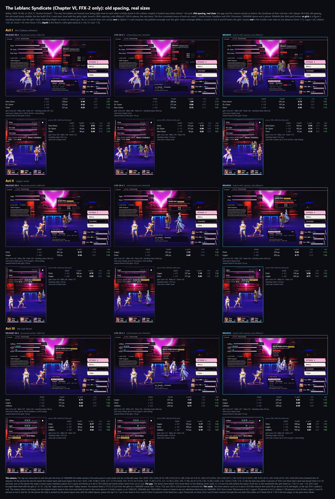

*FFX-2, Chapter VI: the first command menu of Acts I, II and III at 1600x900 and on a phone
(390x844), release 39.4 on the left of each trio, the live 39.4.1 in the middle and this hotfix on
the right, with each fiend's on-screen height over the girls' beside the real size from the game's
models. The camera is the same in all three; the fiends are back on 39.4's spots at the real sizes,
and the intent card no longer covers a head.*

## 2026-10-07 · Release 39.4.1 on echoesofspira.com

Address: https://echoesofspira.com (main 04cdcd45, bundle DAnPZ-iy)

- **FFX-2:** a hotfix for Chapter VI, the Leblanc Syndicate: every fiend is drawn at its real size
  from the game's HD models, against the three girls. Ormi is 1.15 times the girls' height, Logos
  1.26, Leblanc 1.05, Dr. Goon 1.10 and Fem-Goon 1.01. Before, the goons were drawn at 70 percent of
  the party's height and the real sizes of Logos and Ormi had never been used; the fiends stand well
  behind the girls, so on screen they read as about half a girl. At 1600x900 the fiends stood 0.44 to
  0.72 of the girls' height on screen and now stand 0.71 to 1.15: in Act I Ormi goes from 0.57 to
  1.10, Dr. Goon from 0.44 to 0.97 and Fem-Goon from 0.50 to 0.77; in Act II Ormi from 0.72 to 0.91
  and Logos from 0.57 to 1.15; in Act III Logos from 0.63 to 1.15, Ormi from 0.72 to 0.90 and Leblanc
  from 0.56 to 0.71. This is Bailey's pick of the Leblanc options, "Option 3: bosses forward", after
  he wrote that the characters looked huge and the bosses tiny.
- **FFX-2:** the fiends stand closer to the party, level with each other at the head, so a taller
  fiend stands nearer instead of further back. The camera is unchanged on desktop (the same pose
  within 0.04 units at 1600x900 in all three acts, the same lens), and on a phone it steps back a
  little so the bigger fiends still fit.
- **FFX-2:** the enemy-intent card no longer covers Ormi's head. In Act I it covered all of it (and
  in Act III all of Leblanc's); now it covers none of Ormi's, at most 4 percent of Logos's head in Act
  II and 9 to 10 percent in Act III (Leblanc's own card). No fiend touches the command list or the
  plates at 1600x900 or 2000x1012, and every fiend is inside the frame. The cost: the move-advisor
  card is capped in this chapter so it clears the bigger fiends' feet, which makes it three lines
  instead of up to six (it drops the damage, hit and crit numbers and the "most damage" line there).
  Whether Bailey wants that is his call (F3942-02).
- **FFX-2:** the hidden experimental chapter (the word `leblanc`) plays Chapter VI's room and fiends
  by reference, so it has the same sizes and spots.
- **Both:** nothing else moved. The fight itself is unchanged: the engine's event logs for all three
  acts of Chapter VI are byte for byte the same as on 39.4 over seeds 1 to 20 (and 1 to 10 with a
  1.5-second decision time), and no battle-engine or enemy-data file is in the change. FFX-2's Chapter
  IV and FFX's Chapter I first menus match 39.4 to within 3 pixels in 178 of 178 and 175 of 175 HUD
  boxes, with the same real attack landing. Against 39.4 the build differs in two files: the bundle
  (index-D57LJe-j.js out, index-DAnPZ-iy.js in) and index.html.
- **Disclosed, FFX-2:** on a phone, Act I's first menu can still start with a goon partly off the
  edge of the screen (F3942-01, major, a defect 39.4 already had: it lost a goon there entirely; the
  hotfix improves it and does not finish it). The intent card still grazes Logos's head, up to 10
  percent (F3942-04). Leblanc (0.71) and Fem-Goon (0.77) still read smaller than their real sizes
  (1.05 and 1.01), because the HUD leaves the fiends a window of about 207 px at 1600x900 and the
  shortest fiend of each act stands furthest back (F3942-03). In Act III the plate names sit under the
  status rows, as on 39.4 (F3942-05).
- **Still open, as on 39.4:** the carried disclosures F392-01 (pose changes snap in every chapter),
  F392-03 (the Zanmato gauge card on a phone in Chapter IX), F393-01 and F393-02 (the hidden chapter's
  feet and head sizes), F394-01 (Auron's coat in three repaired poses) and F394-02 (a first menu
  downloads about 10 percent more art). The deep review is owed on this build: it carries 44 earlier
  builds. Not in this release: the FFX heroes' real heights (alone they would make the heroes taller
  while the FFX bosses stay small, so they wait for the boss sizes) and the Omnis disc order (it
  changes battle rules, so it waits for a deep review); the sizes of the other fiends follow chapter
  by chapter.
- **Deploy notes:** it shipped under Bailey's owner override ("Push a hotfix for the sizing and
  perspective problem please") because 44 builds already owe a deep review and the deploy gate read
  the change as needing one first (no save-data file is in it; F3942-06). The deploy ran with the
  preflight tests skipped and the dirty tree allowed; three files were uploaded (4,535 were already
  there) and the Worker version is 1d742335. docs/deploys.log records 2026-10-08T02:33:53Z, which is
  22:33 EDT on 2026-10-07. The same evening Bailey also asked for 39.4 on the preview address,
  https://echoes-of-spira-preview.baileypillon.workers.dev/, so the old and the new sizes can be
  compared side by side: it was published there (version bec5819e, 39.4's bundle D57LJe-j) and the
  address served that bundle at the last check; 39.3 and 39.2 are queued for two more preview
  addresses.
- **How it was checked:** on the candidate (r394-int at 04cdcd45, dist-gate bundle
  index-DAnPZ-iy.js, 4,537 files): tsc clean; the Leblanc tests, the two new test files and the tests
  the diff touches (15 files, 270 tests) green; the full unit suite once with 60-second timeouts: 919
  files and 13,618 tests passed, after one failure was fixed (the new size table lacked the confidence
  tag the citation test wants in every FFX-2 data file). A focused review of the exact build (82
  minutes) said SHIP, changed area FAIL (the phone's Act I framing, which 39.4 already had, and
  polish): Chapter VI's Acts I to III at 1600x900, 2000x1012 and 390x844 by real keys (the first menu,
  target cycling, Escape, a real attack and a fiend's own action in each act), the chain to the
  Victory screen, 18 fresh phone loads, 47 runs with 0 console errors and 0 failed requests, 61 frames
  a second. The deploy compared 46 files byte for byte on both addresses. The live check (40 minutes)
  compared 4,537 of 4,537 files byte for byte, played Chapter VI's Act I by real keys from the title
  (fiends read 1.152, 1.101 and 1.006 of the girls' height from the page's own actors; on screen 1.10,
  0.97 and 0.77), the cancel path, pause and hide, a real attack and a fiend's own action, then FFX's
  Chapter I to its first menu, a real attack, an options change and a reload, with 0 console errors
  and 0 responses of 400 or more, and said PASS.

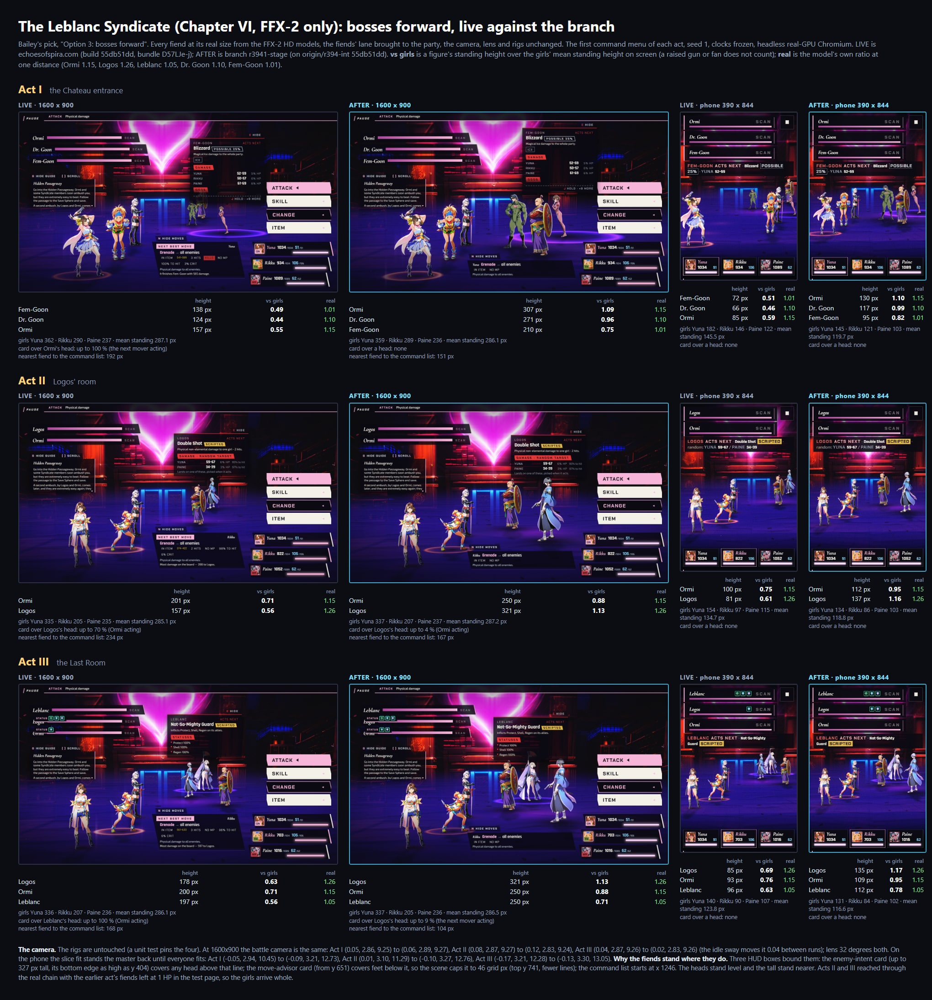

*FFX-2, Chapter VI: the first command menu of Acts I, II and III at 1600x900 and on a phone (390x844),
the live 39.4 on the left of each pair and the hotfix on the right, with each fiend's on-screen height
over the girls' beside the real size from the game's models. The camera is the same; the fiends are
at their real size and stand nearer, and the intent card no longer covers Ormi's head.*

## 2026-10-07 · Release 39.4 on echoesofspira.com

Address: https://echoesofspira.com (main 55db51dd, bundle D57LJe-j)

- **Both:** the art repairs Bailey approved this morning are installed: 586 character and boss poses
  (218 FFX and 368 FFX-2), 2,063 painting files in all (569 at the base size and 1,494 at the larger
  sizes a sharper screen draws). Nothing was redrawn. The repairs take the jagged white fringe off the
  edges of hair and cloth and make a costume's colour the same from one pose to the next, and every
  repaired painting keeps the exact pixel size of the one it replaces. At battle size the edge repair
  is subtle by design; at 3x the fringe is gone (the pictures below). Bailey's words: "yes install the
  555 repairs, go with your recommendations". 555 of the poses had nothing to decide; the other 31
  came as four calls, and he took the recommendation on each (the next three lines).
- **Both:** where a figure runs off the edge of its painting, a hard straight cut is now a soft fade
  about 30 to 35 pixels wide: 21 poses (12 FFX-2 and 9 FFX).
- **FFX-2:** Paine's Black Mage dress matches her idle in five poses (attack, cast, KO, ready,
  victory). Seven of its poses were violet and the idle is slate-blue; the research notes give no colour
  for the dress, so this was a picture call, and the two poses the repair could not do cleanly (follow
  and item) stay violet. Rikku's Thief critical pose lost one floating blue ellipse (121 pixels) beside
  her right boot; a reviewer could not tell a stray from a deliberate puddle, and Bailey took the
  recommendation to remove it.
- **FFX:** Yuna's skirt matches her idle in four poses (attack, hurt, item, ready).
- **FFX:** Evrae's (Chapter VIII) idle painting is a byte-for-byte twin of its near-idle painting again
  at the base size, 3x and 4x (the 2x never was one). The repairs had made two files out of two
  identical sources, 82,198 of 890,624 pixels apart along the edge, and a test requires the pair to be
  the same file; the near-idle's repaired painting now stands in for both. The pre-repair file is in the
  private art archive.
- **Both:** what was not installed looks as it did: 39 repairs that failed review (a thinner sword
  blade, mottled robes, erased fingers and the like), 5 FFX poses whose fade exists at the smaller
  sizes only, and 7 poses of FF7's fight. Of the 586 installed poses, 475 are repaired at all four
  sizes, 70 at the base size only (a sharper screen draws the older painting), 24 at the base size and
  2x only, and 17 FFX fiend poses (Grothia, Pterya, Spathi) at the larger sizes only (a 1600x900
  screen draws the base size, so it looks as before).
- **Both:** a figure's head keeps its size when it changes pose, a knock-out included (Bailey's pick,
  D-510). The stage now holds each pose's head to its idle's size on screen, under the frame's own
  camera, within 10 percent of the table's scale; `?headlock=off` puts the old behaviour back. In the
  continuity run, the two chapters that failed the head-size test (CHK-026) on 39.2 now pass. Chapter V
  (FFX-2, Vegnagun and Shuyin): the worst head step fell from 3.50 to 0.27 percent and the swaps over 1
  percent from 5 to 0. Chapter XVII (FFX, Sin's fins and core): 3.34 to 0.24 percent and 213 swaps to
  0. The five other chapters measured (I, II, VII, IX, XVIII) pass too, with 0 swaps over 1 percent in
  all seven. With `?headlock=off` on the same build the two still fail (3.51 and 3.78 percent), so the
  lock is the cause. The lock's own counters over seven chapters played by the debug autoplayer read
  56,507 planes held, 0 clamped, 0 warnings; the focused review's own real-key runs read 20,094 planes
  held and 0 clamped, and 0.29 and 0.24 percent worst steps in Chapters V and XVII.
- **FFX-2:** typing `leblanc` on the board opens the hidden chapter's party prep and leaves it up until
  Enter (F393-03). The word's last letter, C, is also the board's START key, and the chapter used to
  drop straight into its pre-battle scene, with party prep on screen for 2 ms.
- **Both:** an arrow pressed after typing part of a secret word is the board's again and moves the
  cursor (F393-04, the one regression 39.3 had against 39.2); the word `limit` for FF7's fight shares
  the fix and types as before. The chapter is FFX-2 only; the board is both games'.
- **FFX-2:** a run of the hidden chapter leaves the main save byte-identical (F393-05). It used to
  write six first-run tips and a timestamp into the save, and a first-time FFX-2 player who found the
  word first would have lost the first-battle hints of the real chapters. The cost: the hidden
  chapter's own hints replay once per page load. The coach code is shared and both games' real chapters
  teach their hints as before.
- **Both:** a new title-screen track: ElevenLabs Music's take "title 1", which Bailey picked by ear
  ("ok ill go with title 1"). A flute opens it and plays once (about 33 seconds), then 12 bars of piano
  repeat (the loop runs from 33.3 to 83.0 seconds of an 86.0-second file); the old file brought the
  piano in at about 8 seconds. Bailey heard the loop's wrap: "it sounds natural, keep it".
- **FFX:** new battle music for Seymour Flux (Chapter I) and Seymour Omnis (Chapter XII, which plays the
  same cue): take A, the epic orchestral one, 44 bars at about 132 bpm (the loop runs from 7.3 to 87.3
  seconds of a 90.3-second file). Bailey: "ill go with this  it sounds epic!". After listening to the
  loop jumps he said "this is the only one that isnt smooth, the other 2 are perfect"; this is one of
  the two.
- **Both:** new music for the chapter select board: take B, the default (Bailey: "I'll go with B"; its
  loop jump is the other one he called perfect). The plan to offer A and C as selectable alternates is
  not in this release.
- **FFX:** Chapters VII (Seymour Anima) and X (Seymour Natus) keep the battle music they had in 39.3.
  Take C, the organ one, had been picked for them ("Split: C early, A late"), but it is the one loop
  Bailey heard as not smooth, and the rework of it was stopped, so C is held out of 39.4.
- **Disclosed, Both:** the project's stereo gate (how the mix holds together in mono) fails on take A
  and take B, and the title passes it only just. Correlation, side-to-mid and mono loss against the 0.60,
  -6 dB and -1 dB it asks for: A 0.29, -2.6, -1.9; B 0.43, -4.0, -1.5; the title 0.602, -6.0, -1.0, and
  only because its 33-second flute opening is nearly mono (its looping piano part alone reads 0.469,
  -4.3, -1.36 and would miss all three). The takes ship as Bailey heard them; "narrow" versions of each
  (0.73 to 0.74 correlation) pass the gate and swap in with one command, and Bailey has not chosen
  between the two widths.
- **Disclosed, Both:** every take is band-limited: a steep wall near 16.6 to 17.1 kHz (27 to 38 dB deep;
  the files they replace had 6 to 12 dB), because the generator hands over a 128 kbps MP3 and the game's
  encode keeps the wall. Only generating again at a higher output format would remove it, and a new roll
  is a different piece of music. The shipped files are transcodes (MP3 to float to MP3).
- **Disclosed, Both:** the three takes are AI-generated, with ElevenLabs Music (model music_v2_5) from
  our own written briefs, cut to a loop and mastered here (one gain to -16 LUFS; no EQ, stereo repair
  or reverb). No prompt names a composer, franchise, character or melody; nobody has checked the
  takes against existing music, and no agent has heard any of it (Bailey chose by ear). They were
  generated on Bailey's paid ElevenLabs plan; the plan, the date and the terms are to be confirmed on
  the day a build ships. If a take cannot load, the game plays the older synthesized score for the cue,
  a different piece. The in-game credits do not name the service yet (the repo's audio credits file
  does).
- **Disclosed, Both:** shipped audio is 87.09 MB of the 90 MB cap.
- **Behind the scenes, Both:** against 39.3 the build holds the same 4,537 files and changes 2,070 of
  them: 1,662 in place (1,656 repaired paintings, the art manifest, the audio manifest, the three music
  files and index.html), 407 paintings that shipped as lossless WebP and now ship as PNG, and the
  bundle (index-Dk9resVW.js out, index-D57LJe-j.js in). The stylesheet, both workers and the other 2,467
  files are byte-identical. The 407 changed format because the repairs gave their edges soft, partly
  transparent pixels (39.3's WebPs had alpha of only 0 and 255; every one of the 407 repaired files now
  has partial alpha and colour under the transparent pixels), and the build ships a WebP only where
  every decoder draws it the same. The shipped total grows from 9,482.6 to 9,670.6 MB (+188.0 MB, 2.0
  percent): the art by 189.4 MB (the 407 from 142.6 to 253.9 MB, the 1,656 others by 78.1 MB) and the
  three music files shrink by 1.4 MB. A player's first menu downloads about 10 percent more art
  (14 to 16 MB, F394-02).
- **Still open, FFX (Auron):** after the colour match, Auron's coat is uneven in his cast, attack and
  victory poses (Chapters II, III, XVII and XVIII): pale blotches, a two-tone coat, flatter fold
  shading (F394-01, polish; it needs Bailey's eye).
- **Still open, FFX-2 (the hidden chapter):** the head lock does not cover it. Its figures still slide
  their feet up to 75 px at an enemy's attack and change size at pose changes (F393-01 and F393-02),
  its 183 placeholder poses stay exactly as 39.3 shipped them (the art repairs replaced 225 paintings of
  Chapter VI, not the hidden chapter's copies), a girl who changes dressphere is drawn in the older
  painting beside the new ones (F393-07), and the pre-battle scene's location label crosses the window
  glow (F393-06).
- **Still open, Both:** as on 39.3, pose changes in every chapter still snap (CHK-027: 0.28 to 0.97
  snaps a minute in the seven chapters measured, against a limit of 0.25), and on a phone in Chapter IX
  (FFX) the Zanmato gauge card hides Yojimbo and his fiends. Opening the chapter board creates an empty
  record for a chapter in memory, and any later save (a HUD toggle, a setting) writes it into the main
  save (F394-03, harmless, a suggestion). The deep review is owed on this build: it carries 43 earlier
  builds.
- **Deploy notes:** it shipped under Bailey's owner override ("yes deploy 39.4") because 43 builds
  already owe a deep review and at most two deploys may go out while one is owed. The deploy ran with
  the preflight tests skipped and the dirty tree allowed (the review's untracked build folder counts as
  one); the full suite had passed on the candidate (below). docs/deploys.log records 14:54 EDT, the
  moment the upload began; 2,061 files were uploaded (2,477 were already there), about 6.4 GB in 35
  minutes, and the byte-for-byte checks and the records ended at 16:12 EDT.
- **How it was checked:** on the candidate before the review (r394-int at 4d282a62, dist-gate bundle
  index-DBDUO1LL.js): tsc clean over 3,091 files; `qa.mjs --strict` 0 findings in 26 music cues, 87.09
  MB of the 90 MB cap; the audio tests 35 files and 585 tests passed; the browser proof on the built
  files: all 26 cues decode to their manifest length with no loop click and no level jump, the title
  and the board play from their files, Chapters I and XII play the new Seymour take and VII and X the
  unchanged one, 17 of 18 chapters play every cue they should (Trema's results screen was not reached,
  as on 2026-09-30), 0 console errors, 0 page errors, 0 failed requests; the door smoke (`leblanc`
  opens party prep and it holds, a party attack lands, 0 console errors, 0 404s) passed; the full unit
  suite ran 917 files and 13,629 tests with 60-second timeouts: 912 files and 13,582 tests passed, the
  rest skipped by design (5 files, 46 tests, 1 todo), 0 failed. Then a focused review of the exact
  build (55db51dd, rebuilt as bundle D57LJe-j; 78 minutes) said SHIP: changed area FAIL, but every
  failure carried or polish (F392-01, F392-03, F393-01, F393-02; new polish F394-01 and F394-02); the
  head-size check passed in Chapters V, XVII, I and IV, the door and the music behaved as above, 2,063
  repaired files all matched the approved list and their old pixel sizes, and 3,346 of 3,346 shipped
  images load in Chromium and WebKit. The deploy compared 2,114 files byte for byte on both
  addresses. The live check (45 minutes) compared 4,537 of 4,537 files byte for byte, played the board,
  `leblanc`, `limit`, Chapter I (FFX) and Chapter IV (FFX-2) by real keys with 0 console errors and 0
  responses of 400 or more, read the new Seymour take looping in Chapter I and the head lock holding
  Yuna's and Tidus's knock-outs at x1.0000, and said PASS.

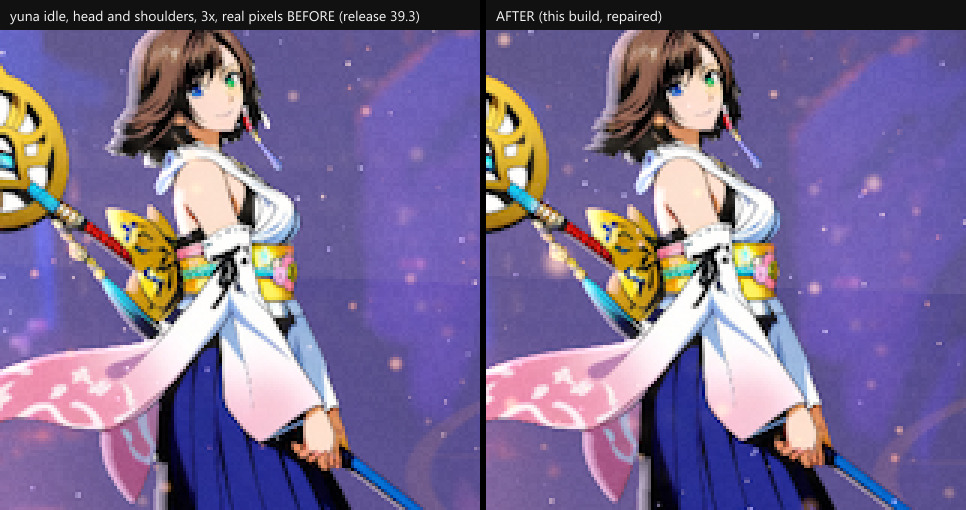

*FFX, Chapter II: Yuna's idle at 3x in real pixels, the live site (39.3) on the left and this build on the
right. The pale fringe along her hair and cloth edges is gone. At battle size the change is subtle by
design (a 1 to 3 pixel rim); the full six-pose sheet is `ch2-yuna-ffx-before-after.jpg` beside it.*

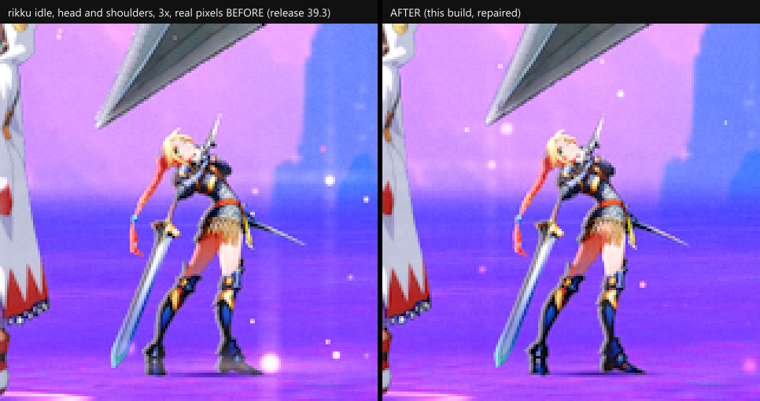

*FFX-2, Chapter V: Rikku as a Dark Knight, idle at 3x in real pixels, 39.3 beside this build; the six-pose
sheet is `ch5-rikku-dark-knight-ffx2-before-after.jpg`.*

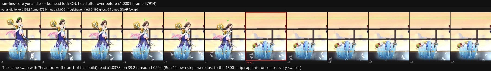

*FFX, Chapter XVII: the frames around Yuna's swap from idle to KO with the head lock on; the head after over
before reads x1.0001. With the lock off the same swap read x1.0378, and on 39.2 x1.0294.*

## 2026-10-07 · Release 39.3 on echoesofspira.com

Address: https://echoesofspira.com (main b80f772f, bundle Dk9resVW)

- **FFX-2:** a hidden experimental chapter, "Experimental: Leblanc (new art)". Type `leblanc` on the
  chapter board, the way `limit` opens FF7's fight, and it opens at once; the board still shows the
  usual 18 cards ("0 of 18 beaten") and nothing on it names the chapter. It is Chapter VI's
  encounter with the same party, fiends, scripts and numbers (the Syndicate at Chateau Leblanc in
  three acts: the entrance, Logos's room and the last room with Leblanc, Logos and Ormi), painted
  again with ChatGPT Images 2.5: 54 new paintings (44 poses the fight needs and 10 rarer ones), 7
  dialogue portraits, 4 pause close-ups and a new moonlit hall for the backdrop, graded toward the
  approved target, "mockup B". Chapter VI itself is unchanged. Bailey picked the word, putting it in
  the live build and shipping the paintings as they are; the individual paintings were chosen by the
  driver under his delegation, each one recorded as a pick he can overturn.
- **Both:** the door is shared plumbing and is neutral everywhere else. Chapters I, IV and VI ask for
  no experimental art and play with 39.2's own numbers; `limit` still opens FF7's fight; a wrong word
  opens nothing; a plain A still moves the cursor left. The chapter's wins and attempts go to its own
  store, so the board's counts do not move: after a win the board still shows nothing cleared.
- **Behind the scenes:** against 39.2 the build adds 691 files (689 of them the chapter's, the other
  two the new bundle and stylesheet), changes 3 (the art manifest, its derived list and index.html)
  and drops the old bundle and stylesheet; every other shipped file is byte-identical. The art
  manifest gained 135 entries, all the chapter's. The chapter's 260 1x paintings and their sidecars
  are archived in the private art repository; the larger size tiers are owed.
- **Still open, FFX-2 (the hidden chapter):** its figures slide their feet up to 75 px at an enemy's
  attack and change size at pose changes (heads up to 35 percent by mass), and 219 of 567 pose
  swaps show a double image: the defects the main chapters had, inside the new chapter (F393-01 and
  F393-02, disclosed). A girl who changes dressphere is drawn in the older painting beside the new
  ones (F393-07, a question for Bailey).
- **Still open, Both (the word):** the word's last letter is also the board's START key, so the
  chapter skips party prep (F393-03); after you type part of the word the first arrow press on the
  board is swallowed, the one regression against 39.2 (F393-04); a run writes six first-run tips and
  a timestamp into the main save, with no progress touched (F393-05); the pre-battle scene's
  location label crosses the pale window glow (F393-06). A fix for the first three is being built
  (branch r394-door); it is not live.
- **Still open, Both:** as on 39.2, pose changes in every chapter still snap, ghost and jerk (0.58
  snaps a minute against a limit of 0.25), and on a phone in Chapter IX (FFX) the Zanmato gauge card
  hides Yojimbo and his fiends. The deep review is owed on this build: it carries 42 earlier builds.
- **Deploy notes:** the full suite ran inside the deploy this time (906 files, 13,474 tests passed).
  It shipped under Bailey's owner override ("Finish 39.2 + hidden chapter (Recommended)") because 42
  builds owe a deep review. 307 files were uploaded and 4,231 were already there.
- **How it was checked:** a focused review of the candidate said SHIP (85 minutes; changed area
  FAIL, the failures being inside the new chapter); the deploy compared 737 files byte for byte on
  both addresses; the live check compared 4,537 of 4,537 files, played the board, `leblanc`,
  `limit`, Chapter I and Chapter IV by real keys with 0 console errors and 0 responses of 400 or
  more, and said PASS.

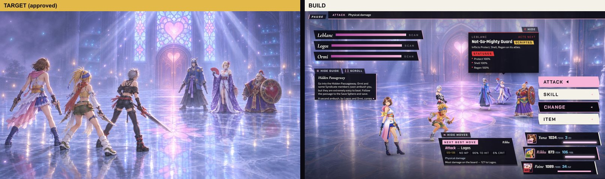

*Left: the approved target, mockup B (Moonlit Blue Hall). Right: the hidden chapter's Act III first menu on the 39.3 candidate at 1600x900, from the focused review.*

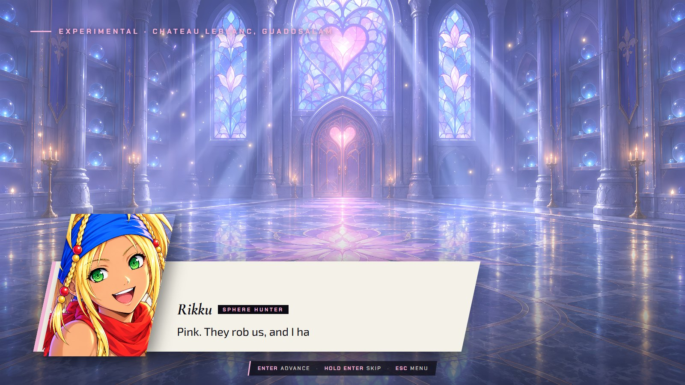

*The pre-battle scene on echoesofspira.com at 1600x900 right after typing the word: the new moonlit hall and Rikku's new portrait. The pink location label at the top left crosses the window glow (F393-06).*

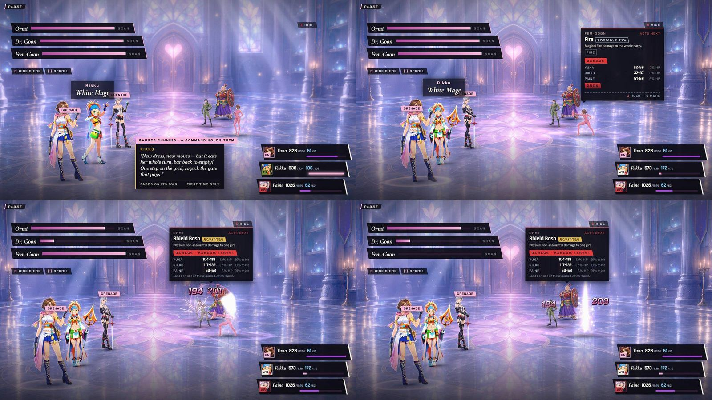

*A Change in the hidden chapter, four frames at 1600x900, from the focused review: Rikku becomes a White Mage and is drawn in the older painting beside Yuna's and Paine's new ones (F393-07).*

## 2026-10-07 · Release 39.2 on echoesofspira.com

Address: https://echoesofspira.com (main 002928c4, bundle BFTPT4o0)

- **FFX:** in Chapter IX Yojimbo holds one size. On 39.1 he swung from 0.99 to 1.34 times the
  party's height from one command menu to the next (285, 216, 216 and 279 px tall at the four menus
  the review sampled at 1600x900); now he stands at 1.13 to 1.20 times at every menu (251, 261, 261
  and 259 px). About 1.15 times was Bailey's pick and it stays an estimate: no source gives the
  proportion and the real game's screen has not been read yet. A phone is unchanged (he is 1.00
  times the party there).
- **Both:** no boss is re-sized between command menus: each is sized once per phase. The change
  reaches FFX's Seymour Natus, Braska's Final Aeon, Evrae and Yojimbo and FFX-2's Bahamut in code;
  measured, it changes Yojimbo and Bahamut (Chapter IV) and nothing else.
- **FFX-2:** in Chapter XIII (Trema) a Retry after Oversoul Paragon no longer replays a lost state.
  When fewer than two girls are standing, Retry opens at Trema's battle start with all three girls up
  at full HP and MP, Protect and Shell kept, the way a Save Sphere would; with two or more standing
  it replays the state as entered, as before. On 39.1 a Retry with one girl standing won 0 of 200
  test fights. The defeat card says nothing about it (an idea for Bailey's yes, F392-09). This was
  Bailey's pick among three measured answers.
- **Both:** REDUCE MOTION shortens the attack lunge. A strike that needed extra reach to touch its
  target now travels half of what 39.1's solver added, in the same 440 ms, so no lunge is longer
  than 2.9 units (4.4 with the setting off): in Chapter IV a fiend's lunge falls from a median 4.4
  units to 2.18. FFX's party and fiends and FFX-2's fiends change; FFX-2's girls have no run-in
  under REDUCE MOTION and are unchanged. The cost: a strike that needed the whole reach now stops
  part-way (up to 149 px short for Seymour Flux's Lance of Atrophy), a question for Bailey (F392-08).
- **FFX-2:** in Chapter IV Bahamut's reveal keeps Yuna in the frame. On 39.1 the camera's push cut
  her (her smallest visible share was 0.43 at 1280x720, 0.42 at 1600x900, 0.83 at 2000x1012 and 0.96
  at 2560x1080, over 12 runs); on 39.2 she is whole (smallest share 1.00) in all 15 of the review's
  runs at those four window sizes, with REDUCE MOTION on and off. Desktop windows only; a phone
  keeps its own framing. For about two seconds as the push ends she stands within 2 to 9 px of the
  left edge (polish, F392-05).
- **FFX:** the last pose-size fixes. In Chapter II Yunalesca's first form is sized by her head like
  every other figure, so her hurt, attack and cast poses are 23 to 33 percent smaller than on 39.1
  (head x0.99 of her idle's; it was x1.48, x1.42 and x1.29): a calmer, consistent picture that
  loses the attack's wide sweep, and Bailey kept it. In Chapter VII Yuna's and Rikku's victory poses
  are registered closer to their idles (x0.948 to x0.976 and x0.967 to x0.983) and the victory
  camera has room for them; Chapter I's feet no longer read as sliding (the check had read the
  figure's own jolt as a registration error: 4.2 px, now 0.9). The critic's pose-size check
  passes in 17 of 18 chapters in this review's run, against 15 of 18 in round 23's run on 39.1.
- **Behind the scenes:** the Bahamut route test has a 60 s timeout of its own (its heal-only case
  takes 10 s alone and 17 to 25 s in the full suite), and the comments in the Trema code and the
  contracts now name Bailey's answer. No game behaviour changed in either.
- **Still open, Both:** pose changes still snap, ghost and jerk in every chapter, as on 39.1: 0.58
  snaps a minute on both builds against a limit of 0.25 (F392-01). A knock-out is still a
  one-frame cut, and in Chapter V (FFX-2) the check found two knock-out swaps whose head changes by
  4 percent (0.4 px, invisible) against 3 allowed. The engine fix for Chapters V and XVII (Bailey's
  pick) is built on a branch and not live.
- **Still open, FFX (Chapter IX):** on a phone the Zanmato gauge card sits over Yojimbo and his two
  fiends (F392-03, as on 39.1; it needs Bailey's look before a layout change).
- **Deploy notes:** the first deploy run stopped at the full-suite gate on one 15 s timeout of
  `tests/unit/ui-pause-stack.test.ts` under load (it passes alone in 1.7 s, and the full suite had
  passed twice on this commit); the second was refused because the review's untracked build folder
  counts as a dirty tree; the third shipped with the preflight tests skipped and the dirty tree
  allowed (the driver's calls), under Bailey's owner override ("Yes, ship 39.2 on SHIP
  (Recommended)"). It went live at 00:25 EDT.
- **How it was checked:** a focused review of the candidate said SHIP (175 minutes; changed area
  FAIL: the pose-size lane's own target, the check in all 18 chapters, was met in 17); the deploy
  compared 46 files byte for byte on both addresses. No separate live check was run, because 39.3
  replaced this build about two hours later; the deep review it owed carries to 39.3.

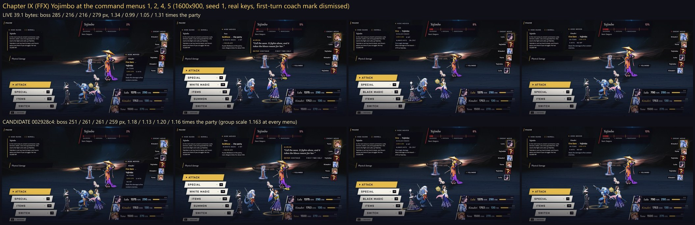

*Chapter IX (FFX) at command menus 1, 2, 4 and 5, 1600x900, real keys. Top: release 39.1, Yojimbo 285, 216, 216 and 279 px tall. Bottom: release 39.2, 251, 261, 261 and 259 px.*

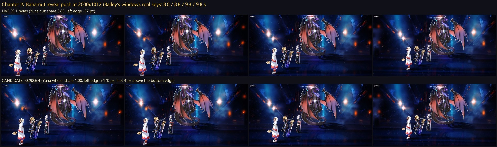

*Chapter IV (FFX-2) Bahamut's reveal at 2000x1012, the size of Bailey's own window, at 8.0, 8.8, 9.3 and 9.8 seconds. Top: release 39.1 cuts Yuna at the left edge (visible share 0.83). Bottom: release 39.2 keeps her whole (1.00).*

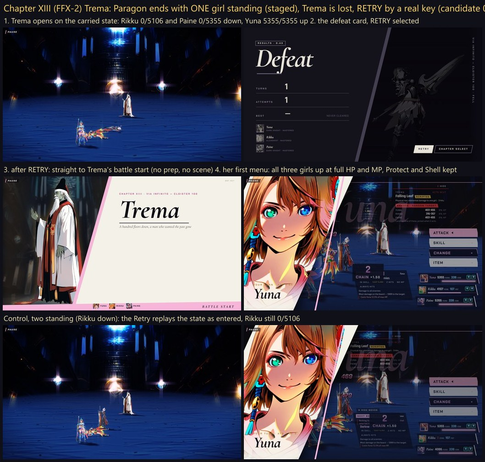

*Chapter XIII (FFX-2), Trema, with one girl left standing after Paragon (staged): the defeat card, then Retry opens at Trema's battle start with all three girls up. Bottom: the control, two girls standing, where Retry replays the state as entered.*

## 2026-10-06 · Release 39.1 on echoesofspira.com

Address: https://echoesofspira.com (main d3fe9fe5, bundle B6DQPYhY)

- **Both:** a new title screen. Yuna, Rikku and Paine look out over a lavender flower field to a golden
  crystal spire: the painting Bailey approved in the Art Room. The "Echoes of Spira" panel sits at the
  top left, above the three heroes, and the two black Tidus and Yuna cut-outs are gone. A phone shows
  all three heads. The picture, the panel's place and the cut-outs' removal are Bailey's picks.
- **Both:** characters and bosses show their paintings' own colours. The colour chain had never
  applied the display encode, so every painting was drawn with its gamma applied twice: darker, more
  saturated, white clothes and hair tinted lavender. Figures now go through it and read paler and
  calmer against the backdrops; Bahamut's wings go from deep red to the painting's salmon. Adding
  `?figtrue=0` to the address brings release 39's look back. This was Bailey's pick. Still open:
  Bahamut's dark body also lifts from near-black toward charcoal, and that is under investigation.
- **FFX:** every attack reaches its target. The lunge is worked out against the painted figures on
  screen, so a strike ends where the two paintings touch instead of at a fixed 1.4 units. In
  Chapter I Tidus used to stop 159 px short of Seymour Flux; the party's strikes there now end at
  0 px (3 of 3 within 12 px). Over the FFX chapters 73 to 80 percent of the party's strikes and 65 to
  82 percent of the fiends' end within 12 px of their target.
- **FFX-2:** fiends reach their target too (Bailey's call: the sources say nothing about how an FFX-2
  fiend approaches), and a girl who runs in reaches after her run-in. A girl who fires from where she
  stands (Gunner, Lady Luck and the other long-range dresspheres) still does not step in. Bahamut's
  strike at Yuna in Chapter IV left a 153 px gap and now closes it at the apex; Dr. Goon's gap to
  Rikku in Chapter VI fell from 560 px to 174 and Ixion's median gap from 231 px to 27.
- **Both:** a figure keeps its head size and stays planted when it changes pose, in every chapter.
  All 24 dresspheres, Lady Luck's three sets and the FFX party have measured head and foot positions,
  42 foes and bosses have a measured stance, and a KO's lying painting is compensated. In the
  critic's 18-chapter run on the live build, head swaps over the tolerance fell from 1,688 to 5 and
  feet slides from 1,749 to 1 of 10,500 measured swaps (the worst slide is 4.2 px). A KO still
  cuts in one frame (see "Still open").
- **FFX:** Lulu's critical pose stands lower and its head matches her idle's (head x1.08 of her idle's
  before, x0.98 now). **FFX-2:** Rikku's Berserker ready pose the same (x1.14 before, x1.00 now). Both
  were the one pose of their game where the minimum height rule had kept the head large; every other
  pose keeps the rule. This was Bailey's pick. No chapter's Garment Grid offers Berserker yet, so no one
  will see Rikku's until it does.
- **Both:** fewer 100 to 300 ms hitches when a sharp painting arrives. Release 39 swapped a 2x to 4x
  painting in mid-turn and the graphics card took 145 to 216 ms to accept it. Now the painting is sent
  ahead a slice at a time and swapped in between two draws. In Chapters I, IV and VIII at 1440p the
  frames over 50 ms that carried an upload fell from 13, 9 and 8 to 4, 0 and 0. It costs memory:
  Chapter I's first menu holds 1,338 MB of textures, up from 715. `?stage=off` puts the old path back.
  The critic's run did not see fewer slow frames in FFX-2's Vegnagun and Fallen Aeons.
- **FFX:** in Chapter XII Tidus, Yuna and Auron stand apart instead of in a heap: at the first menu the
  biggest overlap of two figures fell from 0.69 to 0.08 to 0.11 and the least visible figure rose from
  0.20 to 0.82 to 0.84 of itself. The cost is a party about a fifth smaller on screen. The four
  Mortiphasm discs stand 0.30 of Seymour's height higher, so none sits behind the party or the intent
  card.
- **FFX:** Seymour Natus's Sensor card no longer touches his wing tips at 1280x720 and 1366x768 (it
  covered 6.9 to 7.8 percent of him, now 0).
- **Both:** the move advisor's card never ends a sentence in "..." any more: a reason is whole or
  gone, and Chapters XII and XVIII print the card's effect.
- **Both:** the strategy guide never shows half a line and says it scrolls: a `[ ] SCROLL` chip
  beside G HIDE GUIDE (R-STICK SCROLL with a pad) and arrow marks at its foot. In the measured test
  64 of 72 states cut a line before and 0 do now. The phone's sheet is unchanged.
- **FFX-2:** the guide no longer disappears at TEXT SIZE 115 and 130 in Chapters IV and VI: it folds
  to its G GUIDE tab and G opens it over the boss strips, never over a girl.
- **FFX-2:** the dressphere close-up. The guide and the move advisor step out of the way while it is
  held, and it waits up to 1.0 s (was 0.6 s) for an enemy action already under way. In the test
  (Leblanc, Den of Woe, Fallen Aeons, Vegnagun) the close-up was shown in 23 of 32 changes, up from 20.
- **FFX-2:** the boss reveal in the Den of Woe and Fallen Aeons keeps every girl in the frame:
  Yuna's smallest visible share was 0 and is now 1.00, and the 6.0 s opening is as long as before.
  Bahamut's reveal in Chapter IV still lets Yuna out of the frame for about 2 s; fixing it would
  shrink the camera's push, which is Bailey's call.
- **FFX-2:** in Chapter IV the white blob in the gap of Bahamut's neck is gone: the lit pane strip of
  the Bevelle plate behind it is held down to 45 percent.
- **FFX:** in Chapter IX Yojimbo's blue sakura arrival is over in 3.6 s instead of 5.8 s (2.3 s when
  the opening is hurried).
- **Both:** the pause screen in a 4K or ultrawide window: where the window is larger than the 3360x1920
  plate, the same pause painting continues behind it, blurred and darkened, instead of a flat dark
  strip. A 1600x900 window is unchanged.
- **FFX:** in a 21:9 window the painted backdrops fade their side edges into the scene's colour where
  the painting ends inside the frame. Yunalesca's frame changes 9.2 percent at 2560x1080; at 1600x900 no
  FFX chapter changes a pixel. FFX-2's backdrops are untouched.
- **Behind the scenes:** a hidden mark key (the backtick) saves a record of a battle moment, shows
  nothing on screen and copies a short code you can paste to Bailey; `tools/replay-mark.mjs` plays it
  again. An FFX replay gives the same fight; an FFX-2 replay is near the moment, not it, because its
  ATB clock runs on real time. The critic did not exercise this key.
- **Behind the scenes:** the old title paintings were archived in a private art repository before
  the swap, with the history of every approved painting. The live site holds the same 3,289 art
  files, 8.3 GB in all.
- **Still open, Both:** a KO is still a one-frame cut from the standing painting to the lying one (78 of 96
  measured snaps; 0.58 snaps a minute against a limit of 0.25), and most pose changes still show two
  copies of the figure for a few frames (161 swaps at 0.40 or more). Big paintings still jump in one
  frame: Vegnagun's tail by 807 px, Sin's fins, Braska's pagoda hands by 550 px.
- **Still open, FFX-2 (Chapter XIII, Trema):** after a lost second link, Retry restarts from the state Paragon's
  fight ended in; with one girl standing it won 0 of 200 test fights, with nothing told to the player.
  This was already so on release 39. Bailey has three measured options to pick from.
- **Still open, FFX-2 (Chapter XIII, Trema):** the review saw no victory by real keys in 26 attempts and two long
  runs, so Trema's victory scene is still unseen for the sixth review in a row.
- **Still open, FFX (Chapter XVII):** following the move advisor's chain clears 97 of 200 test seeds; Genais's
  Sigh on link 3 is 60 of the 103 losses.
- **Still open, Both:** Bailey's listening verdict for the new music and sound effects is still missing, so audio
  is unscored; chapter rows still play stand-in cues; and the hidden FF7 fight's black screen on a
  cold cache is not yet confirmed fixed.
- **Not shown by the review:** the FFX-2 fiend and run-in reach, the Berserker and Lulu frames and the
  guide at larger TEXT SIZE were not each captured on the live build.
- **How it was checked:** a focused review of the candidate said SHIP (changed area unverified);
  the live check compared 3,848 of 3,848 files byte for byte with 0 console errors; deep review round 23
  on the live build said SHIP with the changed area FAIL, 17 of 18 chapters won by real keys, and the
  milestone not accepted.

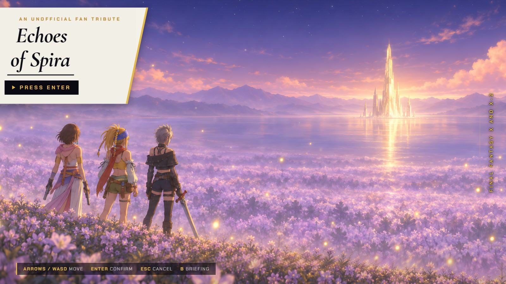

*The new title screen on the release 39.1 build at 1600x900: the approved Gullwings painting, the title panel at the top left.*

All pictures for this build: [docs/changelog/release-39-1.md](docs/changelog/release-39-1.md)

## 2026-10-05 · Release 39 on echoesofspira.com

Address: https://echoesofspira.com (main 816d80f9, bundle DIf_suBq)

- **Both:** high-resolution art. Paintings draw from 2x, 3x and 4x files wherever your window and
  graphics card can use them, so backdrops, floors and figures are far sharper at 1440p and 4K. A
  phone or a weak card keeps the lighter files, and a first battle on a strong desktop loads nearly
  twice as much art.
- **Both:** "F plus" is the new default way to draw a battle on a strong graphics card: twice the
  width and height, shrunk with a sharper filter, which brings out fine lines. It steps down by
  itself on a slower card, and a phone draws as before.
- **Both:** almost every character and boss painting has a smooth outline, with the white fringe taken
  out.
- **Both:** a figure keeps its size and stays planted when it changes pose. In our measured test
  battles the worst head-size jump fell from 57 percent to 8, and feet no longer slide sideways.
  Some size jumps and snaps are left; they are the next job.
- **FFX:** in Chapter III Braska's Final Aeon stands further right and back, clear of the party, the
  camera is calmer while a menu is open, and the strike runs far enough to reach him.
- **FFX:** Seymour Natus is bigger in Chapter X: 346 px tall at 1600x900, up from 207. His Sensor
  card stands above him, clear of his painting, in windows 1440x810 and wider.
- **FFX-2:** four visual fixes. The white rectangle at the start of an outfit change is gone, the
  close-up on a change starts with it, the camera keeps every girl in the frame when one runs in to
  attack, and the dark pipe slabs at the edges of Bevelle's plate in wide windows (Chapters IV and
  XIII) are gone.
- **FFX:** Defend is on a tab under the command window: Triangle on a pad, Q on a keyboard, a tap on
  a phone.
- **FFX:** Bushido and Swordplay answer taps and clicks, and the Bushido chips name the key for your
  device. The press that closes the last first-turn tip no longer also picks Attack.
- **Both:** the move advisor's card no longer shrinks to a stub in the narrow boxes of Chapters VII,
  IX, XII, XVII and XVIII: it keeps its cost and its effect.
- **FFX-2:** TEXT SIZE (115 and 130 percent) now reaches the battle screen, as it already did in
  FFX, and both games' pause screens follow it.
- **FFX-2:** Lady Luck joins the Garment Grid in Chapters V, XI, XIII, XV and XVI, with 45 new
  paintings for Yuna, Rikku and Paine. Her reels are timed by you: three reels run on a slow strip
  of pictured symbols, 5 a second, and a press stops the reel the pink arrow marks on the symbol on
  the gold line. A 12 second timer stops any reel left. The slow strip was Bailey's pick; the speed
  and the timer are our estimates.
- **Both:** the strategy guide is a scrolling page for each boss. It opens on the boss on the field
  and scrolls with the wheel, the `[` and `]` keys or the pad's right stick. In Chapter I it no
  longer says Defend answers Total Annihilation, which is a Magic attack: Shell does.
- **Both:** six backdrops get new 2x paintings that stay true to the originals (Mt. Gagazet, the
  Garden of Pain, Via Purifico and the Road to the Farplane among them), and Evrae has ten new
  high-resolution paintings in Chapter VIII.
- **FFX:** Tidus's four Swordplay moves now differ. Spiral Cut has the widest gold zone (22 percent)
  on the slowest sweep, Blitz Ace the narrowest (9 percent) on the fastest, and the timers are
  unchanged. The numbers are our estimate.
- **Both:** turning an EYE CANDY look on now switches its parts on too, when all of them were off. A
  part you turn off afterwards stays off.
- **Both:** interface polish. Battle labels keep a 14 px floor in 4:3 windows (they drew as small as
  8 px), the phone's pause text is 14 to 15 px (it was 12 to 13), and the chosen row of an Overdrive
  list is filled. In FFX the OD label stays inside a 1024 px window at every TEXT SIZE. In FFX-2 a
  queued command shows its chip over the girl at once, and the enemy-move card keeps off the girls
  at Yuna's White Magic list.
- **Both:** the first-run tip says "Start with this one." when you pick a chapter other than the
  first.
- **Behind the scenes:** the critic now measures pose size jumps and snapping frame by frame (two
  new checks, with score caps), and every deep review adds a first-time-fan reviewer. The live site
  now holds 3,289 art files, 8.3 GB in all (0.8 GB before). A figure true-colour switch is built in,
  off by default, waiting for Bailey's pick.

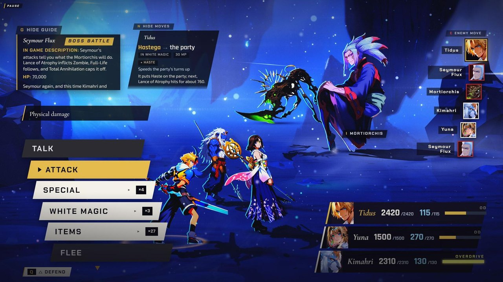

*Chapter I's first menu on the release 39 build at 2560x1440: sharper paintings, the scrolling guide at the top left and the new Defend tab at the bottom left.*

All pictures for this build: [docs/changelog/release-39.md](docs/changelog/release-39.md)

## 2026-10-04 · Old address: the "we've moved" note

Address: https://baileypillon.github.io/pyrefly-reprise/ (main dae5ed9e)

- **Both:** the old GitHub address now shows a note on its title screen: "Echoes of Spira has moved to
  echoesofspira.com · Saves made here stay here". Clicking it opens echoesofspira.com. The game there
  is still release 38, so saves made there keep working.

*The old address's title card with the note at the top right.*

All pictures for this build: [docs/changelog/legacy-moved-note.md](docs/changelog/legacy-moved-note.md)

## 2026-10-04 · Release 38 on echoesofspira.com

Address: https://echoesofspira.com (main 8136f2ed)

- **Both:** the game has its own address, **echoesofspira.com**, served by Cloudflare.
  www.echoesofspira.com forwards to it. It is release 38, unchanged: all 1,932 files were checked
  byte for byte on the new address after the upload.
- **Both:** saves are kept per address, so echoesofspira.com starts with fresh saves. The old
  GitHub address keeps its own saves and stays up.
- **Behind the scenes:** releases now go to Cloudflare by default. Only changed files are uploaded,
  earlier versions can be rolled back in seconds, and the critic and the tools follow the new address.

*The title card on echoesofspira.com at 1600x900.*

All pictures for this build: [docs/changelog/release-38-echoesofspira.md](docs/changelog/release-38-echoesofspira.md)

## 2026-10-04 · Cloudflare preview (release 38)

Address: https://echoes-of-spira-preview.baileypillon.workers.dev

- **Both:** release 38, unchanged, served from Cloudflare for the first time. It is the same files as
  the live build, served from the site root, and all 1,932 files were checked byte for byte after the
  upload.
- **Both:** saves are kept per address, so this preview starts with no saves. GitHub Pages keeps its
  own.

*Release 38's title card as checked on the live build. The Cloudflare preview serves the same files.*

All pictures for this build: [docs/changelog/cloudflare-preview.md](docs/changelog/cloudflare-preview.md)

## 2026-10-04 · Release 38

Address: https://baileypillon.github.io/pyrefly-reprise/ (main 6461999e)

- **Both:** the game is now called **Echoes of Spira**. It shows on the title card, the browser tab,
  the pause screen and the error screens. Saves from earlier builds still load.
- **Both:** 119 new paintings. They include the Yuna Thief, Rikku Warrior and Paine Thief dresspheres,
  which used to show stand-in figures. Also new: re-rolled poses, boss wind-ups, Lulu's Fury and 25
  sharper 2x versions.
- **Both:** spells and shots fly to their target, and the damage number lands with the hit.
- **FFX-2:** a girl runs to the enemy for a plain Attack and runs home. LOW EFFECTS and REDUCE MOTION
  keep the old attack.
- **FFX:** Evrae is repainted with a longer neck, so its coil no longer swallows the party
  (Chapter VIII). On narrower windows the camera stands back.
- **FFX:** in Chapter II the party and Yunalesca no longer stand inside each other at the first menu.
- **FFX-2:** Chapters IV and XV get painted backdrop edges instead of mirrored copies, so lamps no
  longer appear doubled.
- **FFX:** Seymour Flux's Lance of Atrophy and Braska's Final Aeon's Ultimate Jecht Shot hold on a
  warning painting first.
- **FFX:** Bushido plays the Overdrive you chose.
- **FFX:** a hurried opening of Chapter IX still plays the night-sakura arrival.
- **FFX-2:** where no clean close shot exists, the dressphere-change shot pushes in instead.
- **FFX-2:** the Trigger Happy bar and Lady Luck's reels sit above the enemy-intent card, with labels
  of at least 14 px.
- **Both:** the move advisor's card keeps its effect and number lines in the big-boss layouts, and the
  "Guide's pick" tag is gone.
- **Both:** smaller downloads. Art ships as lossless WebP wherever every browser draws the same
  pixels, and every image is load-tested in Chromium and WebKit before a deploy.
- **Both:** the title key art loads from the right address in every build.

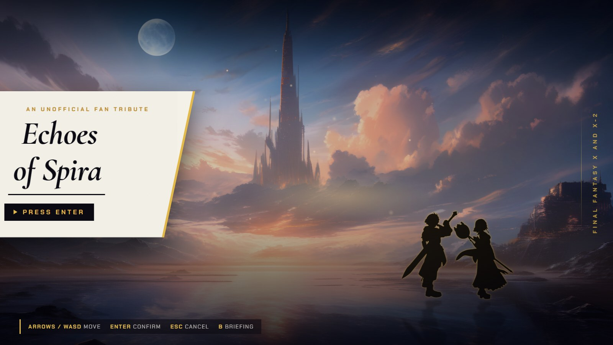

*The new title card, Echoes of Spira, at 1600x900.*

All pictures for this build: [docs/changelog/release-38.md](docs/changelog/release-38.md)

## 2026-10-03 · Release 37.1

Address: https://baileypillon.github.io/pyrefly-reprise/ (main f4244e1f)

- **FFX-2:** Trigger Happy counts gamepad R1 and taps or clicks on its bar, not only the R and Page
  Down keys, and its prompt names the right button for your device (MASH R, MASH R1, MASH TAP or MASH
  CLICK). Enter does not count, because it is not the bound button.
- **FFX:** in Chapter IX, Yojimbo and Daigoro appear at the first menu after a hurried opening.

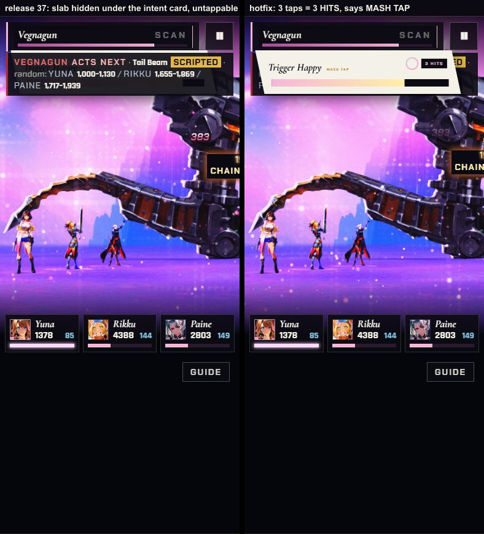

*Trigger Happy on a phone, release 37 (left) and 37.1 (right): the bar was hidden under the intent card and could not be tapped; now it sits on top and three taps count as three hits.*

All pictures for this build: [docs/changelog/release-37-1.md](docs/changelog/release-37-1.md)

## 2026-10-03 · Release 37

Address: https://baileypillon.github.io/pyrefly-reprise/ (main cd9dbbb0)

- **Both:** the pause screen's ten portraits come alive: they blink, glance aside, and their eyes
  follow the highlighted tab or row. LIVING PAINTINGS and REDUCE MOTION switch it off.
- **Both:** eight more backdrops get depth layers and a slow drift, with the far layers softening as
  the camera moves. FFX: Zanarkand, Dream's End, the Garden of Pain, Via Purifico. FFX-2: the
  Farplane, Leblanc, Via Infinito, the Den of Woe.
- **FFX-2:** all 77 dressphere twirl keys are in (the last 8 added), and the close-up now holds its
  full 1.6 seconds, so a change takes about a second longer. The coach line steps aside for it.
- **Both:** 35 more boss paintings. FFX-2: Bahamut, Vegnagun's tail, Leblanc and her gang, Trema,
  the Den of Woe shades, the Magus Sisters. FFX: Sin's fins and Genais, the Guado Guardian, Evrae,
  Mortibody.
- **FFX:** in Chapter IX, Lady Ginnem gets a breathing cool halo and a shell of pyrefly motes, in
  the fight and in the scene after it.
- **FFX-2:** Lady Luck's reels follow the sourced pay table (a spin pays or is a Dud) and your own
  spin reaches the battle. No dressphere grid offers her yet.
- **FFX-2:** Trigger Happy now takes your own press count instead of rolling 6 to 16 hits, but only
  the R and Page Down keys count; gamepad and touch get one hit until 37.1.
- **FFX-2:** the enemy's message and telegraph clear at the last blow, and on windows 2000 px wide
  and up Chapters IV and XV fill the frame with a mirrored backdrop edge (Chapter IV's lamp shows
  doubled).
- **Both:** a knocked-out party member lies clear of the status rows, and holding skip through a
  hurried opening reaches the first menu in about 4 seconds, not 12.
- **FFX:** the Chapter XVII move advisor follows the sensible line's priorities, so its top pick now
  wins about half the time, up from about 4 percent.
- **FFX:** overkilled enemies drop double items, Auron gives a one-time disc tip in Chapter XII,
  Braska's Final Aeon's Talk beat gets a smaller line card, and Ronso Rage is no longer called a
  timed input.
- **Behind the scenes:** no source maps ship any more (22.8 MB lighter), and the audio checks gain
  an automated listener that screens new music.

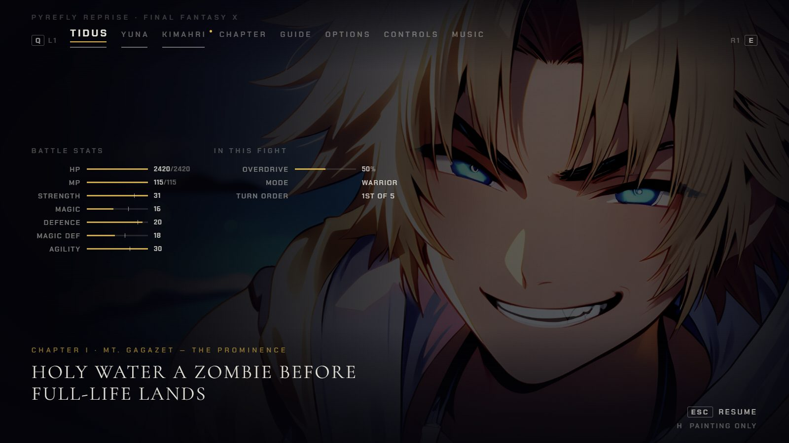

*Tidus's pause portrait, smiling: one moment of the loop in which the portraits blink, glance aside and follow the highlighted tab.*

All pictures for this build: [docs/changelog/release-37.md](docs/changelog/release-37.md)

## 2026-10-03 · Release 36

Address: https://baileypillon.github.io/pyrefly-reprise/ (main c69de96a)

- **Both:** a new EYE CANDY page in OPTIONS gives each part of the three looks (CINEMA LIGHT, LIVING
  PAINTINGS, BATTLE SPECTACLE) its own switch, nine in all. A look turned OFF turns its parts off,
  and the page says OFF HERE or LESS HERE where a phone or the low tier trims a part.
- **Both:** a big visuals pass, the MAX mix: big bosses framed larger with the party where the
  backdrop allows (Yojimbo, Bahamut), a depth-of-field blur, room fog, smoother edges, figures that
  breathe and buckle when knocked out, and splash art cropped to its focus.
- **FFX:** on desktop, the camera holds a close shot of the attacker during an Overdrive input, and
  the name banner sits clear of the party.
- **FFX-2:** a dressphere change plays a painted twirl (69 of the 77 keys). On desktop it also holds
  a close-up of the girl, skipped where a dressphere still has only a stand-in figure.
- **Both:** 122 paintings (42 replace older ones): Kimahri's single broken horn on all twelve of his
  paintings, whole wings for Valefor and Pterya, redone Yu Yevon, Yunalesca and Seymour Flux poses,
  new party poses, and new hurts for Leblanc, Ormi, Trema and the goon.
- **Behind the scenes:** the new switches change the save format, so the build was reviewed in depth
  before it went live, and every switch is proved to stop its effect by real keys and touch in both
  games.

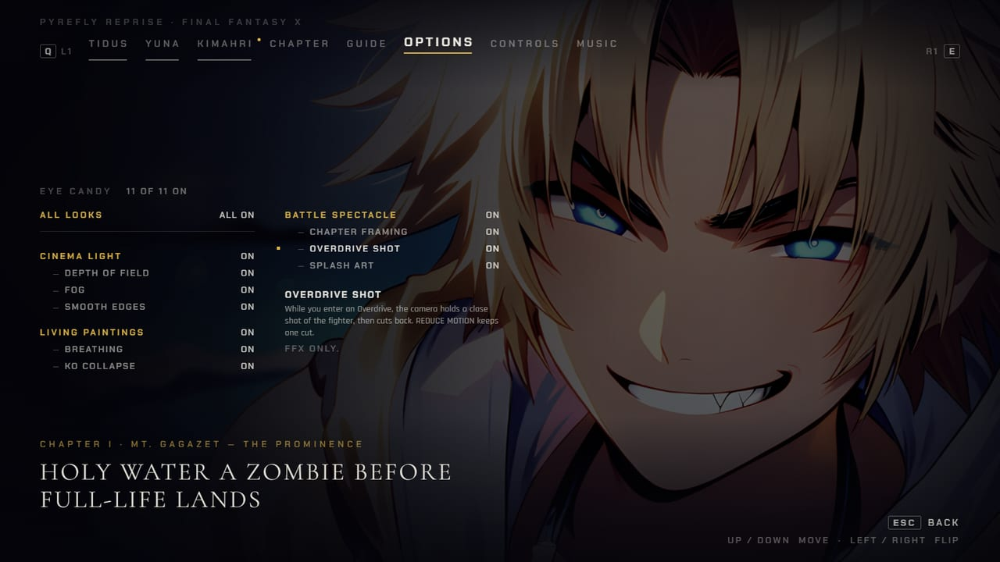

*The new EYE CANDY page in OPTIONS (FFX): three looks, each with its own switches.*

All pictures for this build: [docs/changelog/release-36.md](docs/changelog/release-36.md)

## 2026-10-02 · Release 35

Address: https://baileypillon.github.io/pyrefly-reprise/ (main ef3f6bbf)

- **Both:** 80 painted poses: wind-up, impact, follow-through, cast, item and victory paintings for
  the party (FFX: Tidus, Yuna, Auron, Wakka, Lulu, Rikku; FFX-2: 15 dresspheres) and hurt, KO and
  attack paintings for 31 bosses (13 FFX, 18 FFX-2). On desktop, 24 of the biggest paintings
  (Vegnagun's tail, Sin's fins, Overdrive Sin, Evrae and others) also ship sharper 2x masters;
  phones keep the 1x art.
- **Both:** attacks play in painted beats: the wind-up until the lunge reaches its apex, the impact
  painting at the apex, the follow-through when the hit lands. The lunge now holds at its apex until
  the hit or miss plays, so blows land on the strike.
- **FFX-2:** Yuna's White Mage dressphere wears her hood in its cast, item and victory paintings.
- **Both:** a knocked-out party member stays down through the victory instead of standing up to
  cheer, KO paintings are drawn at the standing figure's size, and a member with no KO painting lies
  on the floor.
- **FFX:** Mortiorchis leaves with Seymour Flux in a pyrefly dissolve instead of standing through
  the victory.
- **Both:** shadows follow the figure's shape instead of a box, and eye candy's rim light is capped
  at 1.5 screen pixels so low-density bosses lose their sticker halo.
- **FFX-2:** the Den of Woe returns toward its approved look (no star flares, teal floor and walls),
  the Road to the Farplane carries its stone below the frame instead of a flat violet band, and
  bloom stays off the girls on the bright Farplane plate.
- **Both:** layout fixes: panels fade while an Overdrive or Special splash prints through them,
  clipped labels wrap instead of ending in dots, panels stop covering the intent text and the enemy
  it describes, and the status line queues its messages (Esuna on three statuses shows every line).
- **FFX:** the first Esc at Chapter I's first command menu opens the pause, and after a victory or
  defeat the last enemy action's banner and the advisor card clear off the field.
- **FFX:** both Sin chapters show the advisor card at the first command menu, Chapter XVII's link on
  Sin's back lists no dead PULL BACK or CLOSE IN rows, and the Sphere Grid's AUTO-LEARN and ? button
  get key and gamepad routes.
- **Behind the scenes:** the deploy tool falls back to pushing changed files only when a full upload
  times out, and a stray 404 on battle entry is gone.

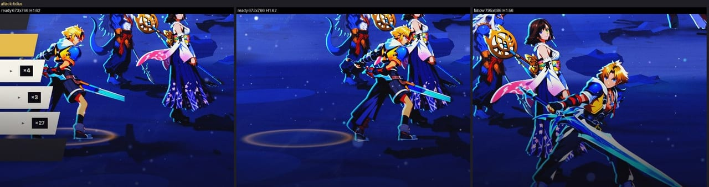

*Tidus's attack in Chapter I plays in painted beats: the wind-up, then the follow-through.*

All pictures for this build: [docs/changelog/release-35.md](docs/changelog/release-35.md)

## 2026-10-01 · Release 34

Address: https://baileypillon.github.io/pyrefly-reprise/ (main 25faec70)

- **Both:** new soundtrack renders for 23 cues: FFX's 16 are played by a sampled orchestra, FFX-2's
  seven get a band sound. The title, chapter-select and pause cues are unchanged.
- **Both:** a new recorded sound-effects set of 98 layered sounds, each game with its own voice (FFX
  sounds and weapons in FFX, FFX-2 twins in FFX-2). The title and board menus keep the old set.
- **Both:** a CREDITS row under ABOUT in the pause OPTIONS tab opens a scrolling list of every
  music, sound, type and tool credit.
- **FFX:** Overdrive inputs follow the sources: a wrong Swordplay or Bushido press restarts the
  sequence and only the timer running out fails, a failure deals the weaker sourced hit with no
  bonus or status, Blitz Ace ends with its Last Hit, and Tornado's timer is 3 seconds.
- **FFX:** in Chapter XVII, losing on Sin's back (link 3) retries at link 3, not from the Left Fin,
  and in the Sin chapters the move advisor weighs the race against Overdrive Sin's clock.
- **Both:** party members hunch when asleep and slouch (FFX, under half HP) or kneel (FFX-2, under a
  third) when low, in new paintings for Tidus, Yuna, Auron, Wakka, Lulu, Rikku and Kimahri and for
  FFX-2's Yuna Gunner, Rikku Thief and Paine Warrior.
- **FFX-2:** Bahamut's Mega Flare gets a splash painting in Chapter IV, and Paine's Songstress gets
  attack and hurt paintings.
- **Both:** Seymour kneels and falls in his own paintings at the end of Chapter VII and when he is
  knocked out, Isaaru and Shuyin kneel in theirs, and the silent 1.7-second empty plate before the
  Chapter VII results is gone.
- **Both:** pause and flow fixes: QUIT TO TITLE no longer shows two titles, RESTART ENCOUNTER no
  longer leaves the title over the fight, REPLAY BRIEFING can be dismissed, a click on RESUME closes
  the pause, and on a phone the first tap on a target aims and the second commits (a Hi-Potion can
  no longer kill a Zombie ally in one tap).
- **Both:** the cure-hint card keeps its text at 14 px or more and stays clear of the party chips,
  and changing TEXT SIZE from the pause with a menu open resizes the FFX command list (it used to
  cover the Talk row).
- **FFX-2:** Chapter XV's chain links open full-bleed instead of with the last link's victory arc
  still showing.
- **Behind the scenes:** three.js's licence notice now ships with the game, and the audio budget
  rose from 85 to 90 MB so the new effects ship at full MP3 quality.

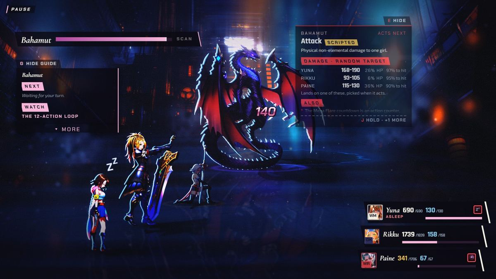

*Chapter IV: Yuna asleep and Paine kneeling at low HP, in their new resting paintings.*

All pictures for this build: [docs/changelog/release-34.md](docs/changelog/release-34.md)

## 2026-09-30 · Release 33

Address: https://baileypillon.github.io/pyrefly-reprise/ (main f302f163)

- **Both:** eye candy is on by default: golden-hour light and haze, drifting flakes and steam, a
  gentle figure sway, hit-stop, hit rings and splash cut-ins (FFX gold and calm, FFX-2 pink and
  quick). OPTIONS gets CINEMA LIGHT, LIVING PAINTINGS and BATTLE SPECTACLE rows to turn each off.
- **Both:** statuses show on the figures in their sourced looks, each game with its own table
  (Zombie's green glow, Poison bubbles, Sleep Z's, Stop's freeze and more), with drawn status icons
  on the plates and a one-line message when one lands or wears off.
- **Both:** guard rails: a healing item aimed at a Zombie ally shows a red warning with the damage,
  the guide's cure hint names the cure for the status in play, and a caption says when a status
  takes the command away.
- **Both:** a guided first run: after Auron's briefing, a three-step pointer shows the first
  chapter, START BATTLE and (in FFX) ATTACK. A returning player never sees it.
- **Both:** the camera is calmer by default: shorter, slower moves, no roll, no shake on routine
  hits.
- **FFX:** the Sphere Grid gets a first-time explainer card, AUTO-LEARN with undo, and a bigger
  layout with a node preview and route, a legend in words and a phone page.
- **Both:** the whole score is re-encoded at higher MP3 quality, so the music download grows from
  about 40 MB to about 78 MB.
- **Both:** sound effects are louder by default (+6 dB): new profiles start at 70 percent, a saved
  35 percent moves up to 70 once, and levels you set are kept.
- **Both:** battle pacing is steadier by default: FFX actions run 20 percent longer and damage
  numbers 30 percent longer, FFX-2 10 and 25 percent.

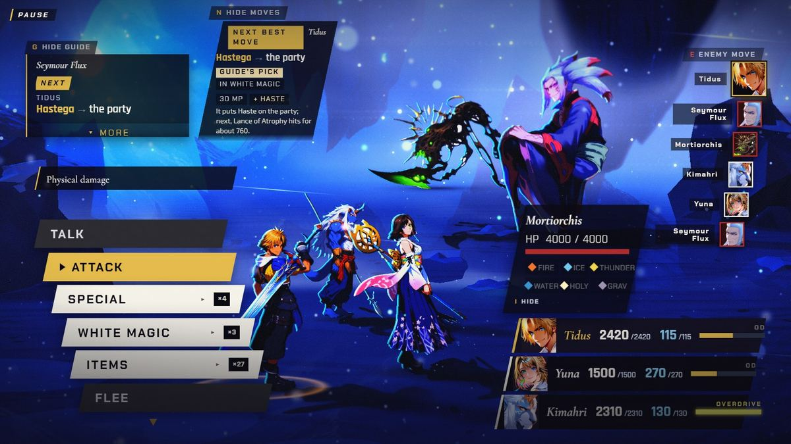

*Chapter I with the three looks on by default: golden-hour light, haze and drifting flakes.*

All pictures for this build: [docs/changelog/release-33.md](docs/changelog/release-33.md)

## 2026-09-30 · Release 32

Address: https://baileypillon.github.io/pyrefly-reprise/ (main 1a6fd3cc)

- **Both:** OPTIONS gains TEXT SIZE (100, 115 or 130 percent), REDUCE MOTION and LOW EFFECTS. TEXT
  SIZE enlarges the text in FFX's battle HUD and in dialogue cards (FFX-2's battle HUD and the pause
  stay at 100); REDUCE MOTION turns camera moves into cuts and stops shake; LOW EFFECTS thins hit
  sparks.
- **FFX:** six Sphere Grid fixes after a friend's playtest: a travelled step shows its real S.Lv
  price, an opened lock reads as open and stays open when you leave party prep and come back, HP and
  MP nodes add to the base stat, walk mode keeps the cursor on nodes you can reach, and clicks say
  what they do.
- **FFX:** a Zombie now shows first, in green, on the party plate, and aiming a healing item at a
  Zombie ally warns "Zombie: 1,000 damage" or "this KOs". A Hi-Potion on a zombified Kimahri in
  Chapter I used to hurt him with no warning.
- **Both:** long command lists scroll: the wheel and triangles work in FFX, and the highlight
  follows the scroll in FFX-2.
- **Both:** a miss plays a whiff instead of the menu's cancel tone.
- **Both:** the first-time coach line comes down with a tap or click on the menu, and says TAP on a
  phone.
- **Both:** the advisor card, guide rail and coach line step once per shot instead of sliding while
  the camera moves.
- **Behind the scenes:** calmer-camera, steadier-pacing and louder-effects presets can be tried with
  web-address switches (off by default). They became the defaults in release 33.

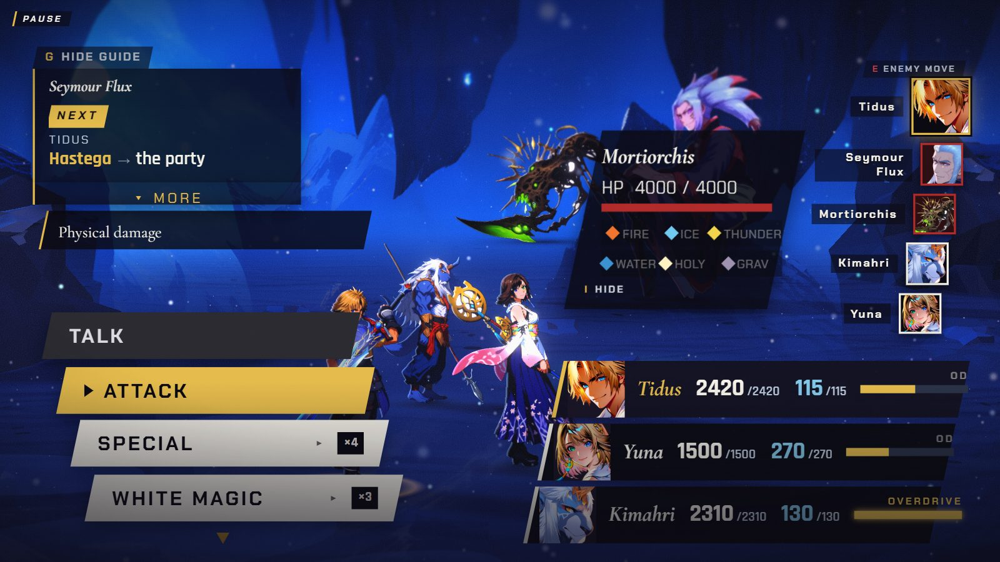

*The FFX battle HUD at the new TEXT SIZE of 130 percent.*

All pictures for this build: [docs/changelog/release-32.md](docs/changelog/release-32.md)

## 2026-09-29 · Release 31a

Address: https://baileypillon.github.io/pyrefly-reprise/ (build 52a431d0, cut from a side branch)

- **Both:** the whole score is re-mastered to fix the thin, hollow sound: the left and right
  channels were out of step with each other, and the bass is now centred. 23 of 25 cues change;
  Vegnagun's boss theme and the Bevelle Underground scene keep the old render.
- **Both:** chapter music and menu music no longer play together after you choose a chapter. A cue
  replaced before it was heard is stopped, not faded out from full volume.
- **FFX:** on a phone, long command lists get two page buttons and an "N-M OF T" counter in place of
  the tiny marks.
- **Behind the scenes:** this is release 31 without the OPTIONS accessibility rows, which change the
  save format and waited for a review. They came in release 32.

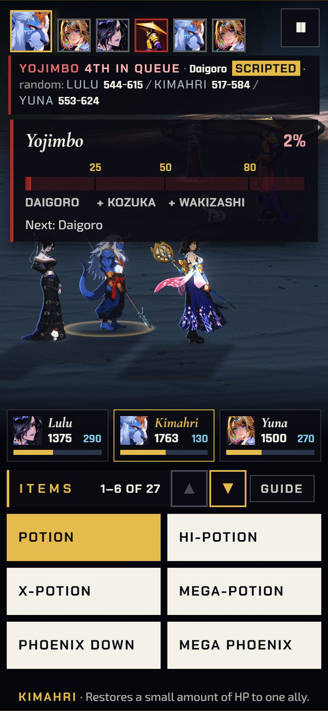

*The phone Items list in Chapter IX with its two page buttons and an "N-M OF 27" counter.*

All pictures for this build: [docs/changelog/release-31a.md](docs/changelog/release-31a.md)

## 2026-09-29 · Release 30

Address: https://baileypillon.github.io/pyrefly-reprise/ (main 1475ff6b)

- **FFX:** Sin arrives as two new chapters, bringing the board to 18. Chapter XVII, Sin: the Fins
  and the Core, has you tear off both fins, jump onto its back and destroy its Core, with no healing
  between links. Chapter XVIII, Sin: the Face, is a fight against the clock as its mouth opens.
- **FFX:** both Sin chapters come with new paintings (the head, both fins, Genais, the Core,
  backdrops, pause art and turn-list icons) and new HUD pieces: a mouth-ring clock in XVIII and a
  range-and-charge plate for the fins in XVII.
- **FFX-2:** Rikku and Paine get their own Songstress paintings, and the party rows frame their
  faces.
- **FFX:** a sharper move advisor: it now searches several turns ahead, in a background worker, on
  every device.
- **FFX:** Chapter VII's battle card shows Seymour instead of a Guado Guardian, the aftermath shows
  Seymour on screen with the kneel, fall and sending captioned (it was an empty plate), and the
  first Boost callout says "half again", not twice.
- **Both:** the move advisor no longer offers a revive on an enemy or on a living ally (it had
  offered Phoenix Down on the knocked-out Guado Guardian).

*Chapter XVII, Sin: the Fins and the Core: the first menu on the Fahrenheit's deck, with the Left Fin overhead.*

All pictures for this build: [docs/changelog/release-30.md](docs/changelog/release-30.md)

## 2026-09-29 · Release 29

Address: https://baileypillon.github.io/pyrefly-reprise/ (main 49005f73)

- **FFX:** Chapter VII (Seymour and Anima at Macalania Temple) is open for play, with its own scene
  music. The board now has 16 chapters.
- **FFX:** Chapters II and III use the sourced Zanarkand and inside-Sin aeon stats, so no aeon is
  weaker later in the story. Chapter II plays easier, and Chapter III's possessed-aeon gauntlet runs
  about 37 percent longer (the whole chapter, measured on release 38: about 27 minutes of fighting,
  seven links, a bench median of 137 turns).
- **FFX-2:** Chapter IV's pause portrait is the approved painting of Yuna and Bahamut again, in
  place of a darker re-render.
- **FFX-2:** a gamepad now drives the command menu.
- **Both:** a cold first load is much faster. On a 25 Mbit/s line the loading card used to hold for
  about 18 to 26 seconds in Chapters I and IV and now holds for 1 to 2 seconds. Each screen's art
  loads before the board's strips, in the order you need it.
- **Both:** audio fixes: a quick Esc-Esc no longer leaves the pause music over the fight, a gamepad
  press now starts the sound in Chromium browsers, and new profiles start with sound effects at 35
  percent (they were 90). Existing saves keep their level.
- **Both:** on a phone, a tap on overlapping target brackets picks the one under your finger (a
  Hi-Potion tapped on Yuna could land on Auron), and the first-time coach line no longer blocks taps
  on party reticles.
- **Both:** coach lines stay off the fighters' faces and weapons on desktop, and the battle PAUSE
  chip is back in Ink & Gold style at 14 px.
- **FFX:** Chapter VIII's Orders row greys out when no order is possible and says why, the enemy
  read-out no longer covers the turn list's names, and on a phone the Grand Summon subtitle wraps
  inside its panel.
- **Both:** clearer words: the advisor gives real reasons and no longer says "always hits" for Talk
  or heals, FFX results say why a member earned no AP, and Auron's Chapter III warning is reworded.
- **FFX-2:** Darkness's cost names who pays, the guide waits while a heal is charging, Chapter V's
  ending is captioned "The Farplane Glen", the Farplane voices get a FARPLANE plate and a faded
  portrait, and the Gullwings crew get name plates.

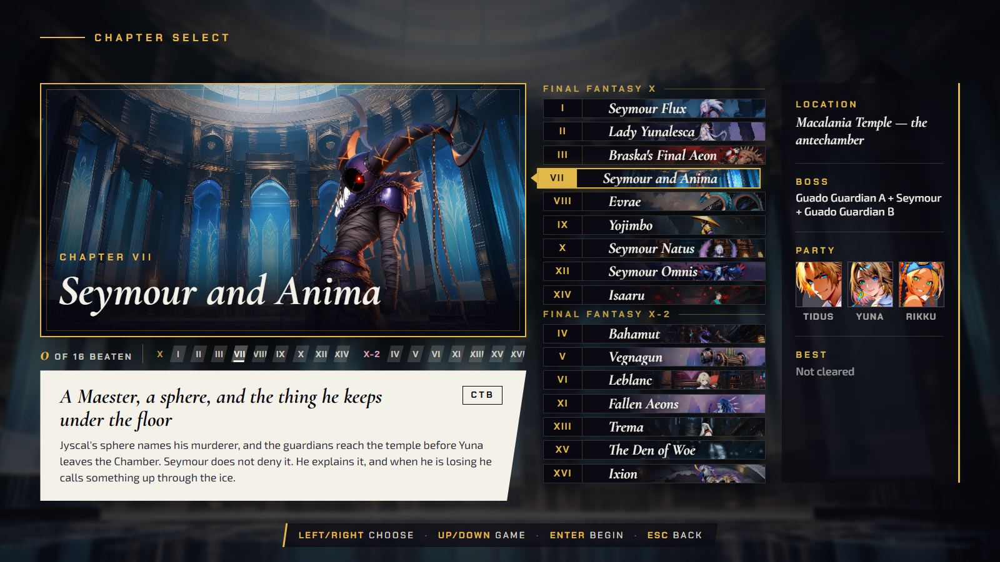

*Chapter VII, Seymour and Anima, selected on the desktop board: it is open for play.*

All pictures for this build: [docs/changelog/release-29.md](docs/changelog/release-29.md)

## 2026-09-28 · Release 28

Address: https://baileypillon.github.io/pyrefly-reprise/ (main 6ea8528f)

- **FFX-2:** on a phone, Ixion in Chapter XVI stands on lit stone instead of a dark slab.
- **FFX:** on a phone, Chapter IX's Grand Summon list stays above the Zanmato gauge and shows all
  five aeons.
- **FFX:** an aeon's status row shows its own portrait, the one on the turn list, instead of a letter.
- **FFX:** in Chapter III the folded Sensor chip lifts clear of the target while you aim.
- **FFX:** on a phone, Seymour Flux's hair tips no longer touch the right edge (Chapter I).

*Chapter XVI on a 390x844 phone: Ixion stands on lit stone instead of a dark slab.*

All pictures for this build: [docs/changelog/release-28.md](docs/changelog/release-28.md)

## 2026-09-28 · Release 27

Address: https://baileypillon.github.io/pyrefly-reprise/ (main be1e964a)

- **FF7 (hidden):** the hidden Guard Scorpion fight gets a high-fidelity pass. The sides are switched:
  your party stands on the left facing right, and the boss is on the right.
- **FF7 (hidden):** new painted "Film" art for Cloud, Barret and Guard Scorpion.
- **FF7 (hidden):** stronger "Spectacle" spell and hit effects with a white hit flash, an opening swirl
  with a short camera move, and a punchier menu look.
- **FF7 (hidden):** results in two windows, a Game Over that pans up, silent victory poses, and a phone
  framing that moves in on the party.
- **FF7 (hidden):** the boss stays solid through every hit (a flash had made its lower body look
  see-through), and Barret's aim stance no longer tilts and slides.
- **Both:** no change to any FFX or FFX-2 chapter.

*The hidden Guard Scorpion fight after its high-fidelity pass: Cloud and Barret on the left, the boss on the right.*

All pictures for this build: [docs/changelog/release-27.md](docs/changelog/release-27.md)

## 2026-09-28 · Release 26

Address: https://baileypillon.github.io/pyrefly-reprise/ (main d89541b6)

- **FFX-2:** new Chapter XVI, Ixion at Djose. One boss fight against Ixion in the Chamber of the
  Fayth, then a story close: Yuna's fall into the Farplane Abyss, Shuyin, and the four whistles. The
  Chamber and Abyss paintings are provisional.
- **FFX-2:** the move advisor counts commands already underway, so it no longer tells you to use a
  Mega-Potion you just chose, or a move you are holding.
- **Both:** the advisor puts a raise on top for a fallen ally the chapter's line would leave down.
- **FFX-2:** a hit an enemy is immune to no longer opens a chain. In Chapter VI, Leblanc's failsafe
  fires once and turn 5 is Fan Slap.
- **FFX:** Yuna's aeons use the sourced Mt. Gagazet stats in Chapters I and IX (for example Valefor
  1,530 HP and Bahamut 2,935 HP), and Bahamut in Chapters X and XIV takes the same row.
- **FFX-2:** an Itchy girl's card names Change, the only row her menu offers. Intent cards say what a
  move really does: Delta Attack leaves the party at 1 HP and 0 MP, and a Dispel removes buffs.
- **FFX-2:** advisor and intent cards step back while an action plays over a fighter, disabled command
  rows are opaque so every row state reads clearly, and on a phone the enemy-move line steps off
  Vegnagun's leg in Chapter V.
- **Both:** pause screen: the CHAPTER tab names the scene properly ("Cavern of the Stolen Fayth") and
  keeps the Chapter II and IX boss faces clear, the H key's legend says what it does, and long names
  are no longer cut.
- **Both:** on the chapter board, selecting a card no longer nudges the cards below it, and the chosen
  chapter's battle starts loading while you read its card (a cold first visit used to wait 14 to 20
  seconds).
- **Both:** small text is at least 14 px on the advisor and intent cards and on the phone title and
  chapter select. Yuna's portrait chips no longer crop through her hair, and the pause plate fades out
  at 4K instead of ending in a hard black edge.

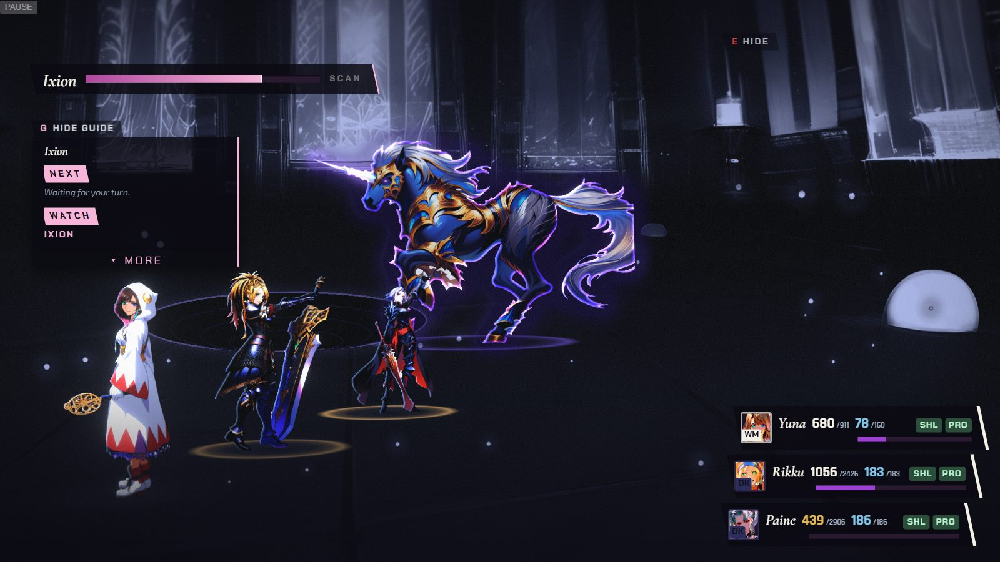

*New Chapter XVI: Ixion, in his violet possessed look, faces Yuna, Rikku and Paine in the Chamber of the Fayth (provisional painting).*

All pictures for this build: [docs/changelog/release-26.md](docs/changelog/release-26.md)

## 2026-09-27 · Release 25

Address: https://baileypillon.github.io/pyrefly-reprise/ (main 79adc4ff)

- **Both:** a battle opens with a transition chosen by situation, not the old swirl: FFX blurs out of
  a scene and shatters on a skip or retry, FFX-2 has its own shatter, and REDUCE MOTION cuts.
- **Both:** the party holds its battle stance after Yunalesca, Bahamut, Shuyin and Trema, with no
  victory pose.
- **FFX:** the enemy's ability name shows in the top help bar while it acts. It was never shown.
- **FFX:** attacking a lone enemy opens the target step first, as in the original game, and a target
  that is immune to Sensor says "Immune to sensors." instead of showing nothing.
- **FFX:** the TARGET plate names the aimed target and stays off the advisor card. In Chapter III the
  Sensor card folds while you aim, and cards fade while an action plays.
- **FFX:** a stalemate you cannot win ends on a WITHDREW card with RETRY.
- **FFX:** Yunalesca's hair and Valefor's wing no longer fade into a straight pale column. Chapter
  IX's sakura canopy ends on its own blossom, its tree is grounded, and the enemy shot clears the
  party's heads.
- **FFX:** on a phone, Seymour Flux stays below the HUD's top strips.
- **FFX-2:** Chapter XI names the Magus Sisters at their seam, and Chapter VI's Syndicate stands across
  the floor from the party.
- **FFX-2:** after a retry from a checkpoint, the summed spoils include the links you won before it.

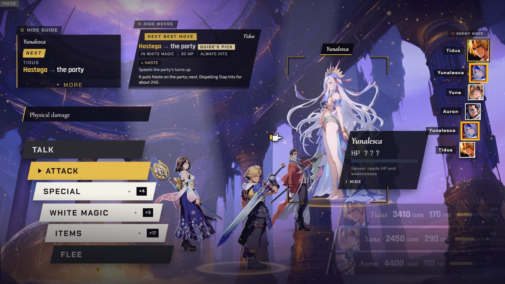

*Chapter II: choosing Attack against the lone Yunalesca goes straight to aiming, as in the original game.*

All pictures for this build: [docs/changelog/release-25.md](docs/changelog/release-25.md)

## 2026-09-27 · Release 24 (hotfix)

Address: https://baileypillon.github.io/pyrefly-reprise/ (main bc4e70ee)

- **FFX:** Yuna's Grand Summon now calls the aeon you pick. A crash in the picker had made it put
  Valefor out every time.
- **FFX:** backing out of Grand Summon, Mix or Rage with Esc returns you to the character's menu with
  the Overdrive gauge kept.
- **FFX:** Rikku's Mix list no longer opens empty.
- **FFX:** the Overdrive lists scroll to follow the cursor (Bahamut, the fifth Grand Summon row, was
  chosen out of sight).
- **FFX:** while an aeon is out the party leaves the field and returns when it is dismissed, KO'd or
  banished, and the status rows show the aeon's row alone.

*Chapter IX: the Grand Summon picker opens with Ixion chosen on its third row, and Ixion is the aeon that comes out.*

All pictures for this build: [docs/changelog/release-24.md](docs/changelog/release-24.md)

## 2026-09-27 · Release 23

Address: https://baileypillon.github.io/pyrefly-reprise/ (main ff3884fb)

- **FF7 (hidden):** a hidden Final Fantasy VII experiment: a Guard Scorpion fight in the No. 1 Reactor,
  with its own ATB battle, menus and Tail Laser warning, behind a secret door on the chapter select.
  It keeps its own record and never touches your save.
- **Both:** the camera rolls on an attack's first hit instead of its swing, and adds no time.
- **Both:** the party stays in frame. A push-in stops short of cutting a standing fighter, and FFX-2
  shots keep the enemy and the girls on screen.
- **Both:** on an upright phone every chapter stands the camera back at the start until the fight
  fits, and actions stay on that shot.
- **Both:** the first menu opens sooner, because opening callouts and the Sensor read now run under the
  fight.
- **Both:** a battle that takes more than 0.4 seconds to load shows the battle-start card, with a gold
  hairline.
- **FFX-2:** the next girl's cut-in is held for 0.8 seconds at most, so a charge's effect tag reads
  first. Vegnagun's parts get contact shadows where they meet the Farplane in Chapter V.
- **FFX:** Chapter IX's Yojimbo shot opens upward only on a 4:3 screen, so heads stay in frame.

*The hidden Final Fantasy VII fight: the first command window in the No. 1 Reactor, with its time gauges.*

All pictures for this build: [docs/changelog/release-23.md](docs/changelog/release-23.md)

## 2026-09-27 · Release 22

Address: https://baileypillon.github.io/pyrefly-reprise/ (main a44297ca)

- **Both:** mid-battle story lines show on a small card that stays clear of the party and of whoever
  is speaking.
- **Both:** a fiend that is sent dissolves into pyreflies from the feet up with a gold burn. Pyreflies
  drift only where the story puts them: none in the Chateau Leblanc, and Macalania's Chamber-door
  motes wait until Seymour falls.
- **Both:** the arena's light shifts on key beats (Seymour Flux's Reflect, Yunalesca's later forms,
  Anima, Bahamut's countdown, Vegnagun's links), and shadows under fighters read on dark floors.
- **Both:** Spiral Cut (FFX) and Mega Flare (FFX-2) are drawn as particle effects.
- **FFX-2:** in Chapter V, losing to Shuyin retries from Shuyin with your HP carried, Vegnagun's
  Bulwark rings are flattened to the picked frame, and the enemy-move card stays off Vegnagun's face
  and weapons.
- **FFX-2:** a chained fight shows the spoils of every battle, not just the last, and an
  all-petrified party is a Game Over at once.
- **FFX:** Chapter X's Talk gives Tidus, Auron and Yuna a line each, and Seymour answers. Mid-battle
  lines are spoken only by characters who are fielded, with stand-ins.
- **FFX:** in Chapter VIII, Rikku starts at sphere level 41 (our estimate; it was 53), and her line
  after Brother's is reworded.
- **FFX:** the target name plate sits off the party's faces, an Overdrive shows a "Tidus · Overdrive"
  plate, aeon tiles on the turn list show the aeon's painting instead of letters, and the Zanmato
  gauge holds until Yojimbo's strike ends. Kimahri's first turn has no dead key press.
- **Both:** the title opens on the picture, never black. The chapter board comes back on the last
  chosen chapter after a prep Esc, a results CONFIRM or a reload. The pause music stops when you
  resume a scene with no music, and a painting reloads once if a network hiccup drops it.
- **Both:** a smaller download: unused audio auditions and raw art renders no longer ship (about 180
  fewer files).

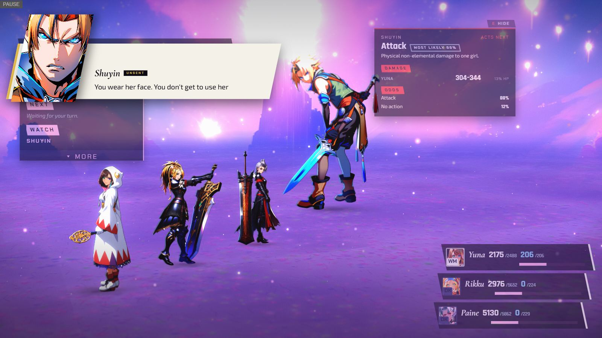

*Chapter V: Shuyin's line on a small card that stays clear of the girls and of Shuyin himself.*

All pictures for this build: [docs/changelog/release-22.md](docs/changelog/release-22.md)

## 2026-09-26 · Release 21

Address: https://baileypillon.github.io/pyrefly-reprise/ (main d8837334)

- **Both:** every spell now draws its own effect. Fire, Ice, Thunder, Water, Holy, Cure and physical
  blows get particle effects (a gold ring in FFX, a pink one in FFX-2), and the damage number waits
  until the spell lands. LOW EFFECTS and REDUCE MOTION keep the old glow.
- **FFX-2:** Chapter V stages Vegnagun as a colossus. Each part stands 4 to 6 girls tall under a low
  camera that looks up at it.
- **Both:** a boss draws its attack painting for a physical attack when it has one, and seven new boss
  poses arrive: Yojimbo's attack and hurt (FFX), and hurt poses for Trema, Logos, Leblanc, Ormi and a
  Syndicate goon (FFX-2).
- **Both:** on an upright phone the results page fills the screen: the painting full-bleed, ink
  tallies, party chips, and a CONFIRM or RETRY dock under your thumb.
- **FFX-2:** on a phone, Chapter XI's camera steps back on each Road link so every fighter is whole.
  On very wide windows the frame fills the whole window, the ALL ENEMIES / ALL ALLIES label scales
  with the stage, and a leftover menu cursor no longer shows as a corner reticle.
- **FFX:** in Chapter IX Kimahri no longer arrives with Doom already learned. The card's Doom row
  reads ??? until you lose once, and the guide teaches the race instead.
- **Both:** P opens and closes the pause, also over a pre-battle scene. On a touch screen the scene
  strip and Auron's briefing name taps, not keys.
- **Both:** advisor and intent text is plainer, the phone tip says which menu a move lives in, the
  "Guide's pick" tag only shows beside the move the guide names, and coach hints wait while a story
  card is up. FFX-2's advisor no longer says "call an aeon".
- **FFX-2:** Shuyin stands on the Farplane in Chapter V's close, the Farplane voice plays at most twice
  a battle, Chapter VI's Act III beats hold in either kill order, Leblanc's stray asterisks are gone,
  and Chapters VI and XV name their bosses on the card.
- **FFX:** Chapter VIII's party sound like themselves again and Evrae's Orders read as orders. In
  Chapter XII the advisor plans around Omnis's disc turns.
- **Behind the scenes:** tests now load a save from release 20 and check it still plays.

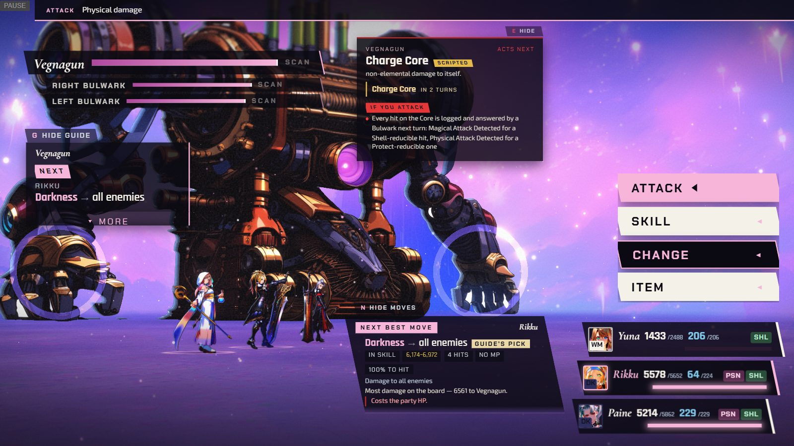

*Chapter V, link 3: Vegnagun's body fills the top of the picture and the girls stand at its feet.*

All pictures for this build: [docs/changelog/release-21.md](docs/changelog/release-21.md)

## 2026-09-26 · Release 20

Address: https://baileypillon.github.io/pyrefly-reprise/ (main ce05b02c)

- **FFX-2:** an all-target move now hits each target once. It used to wrap onto a girl already hit and,
  in Chapter V, skip a living Redoubt. Acta Est Fabula heals only the two Redoubts.
- **FFX-2:** an enemy's plain hit no longer closes your open command menu. Only a Delay or
  Action-cancel ability does.
- **FFX-2:** 23 new battle poses for the girls' dresspheres (Gunner, Warrior, Dark Knight, Alchemist,
  Songstress, White Mage, Black Mage and Rikku's Thief), seen in Chapters IV, V, VI and XIII.
- **FFX:** Sensor no longer opens a plate (a name, dashes and "SENSOR FAILED") for a target that is
  immune to it, such as Yojimbo, Isaaru and Seymour Omnis.

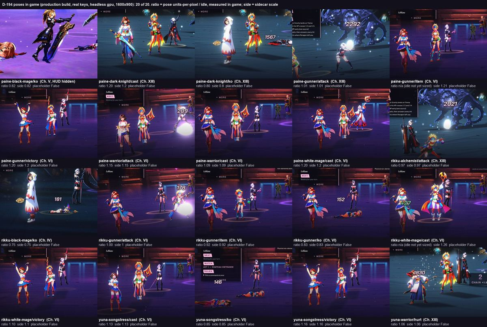

*Twenty of the 23 new dressphere poses as they play in Chapters IV, V, VI and XIII.*

All pictures for this build: [docs/changelog/release-20.md](docs/changelog/release-20.md)

## 2026-09-26 · Release 19

Address: https://baileypillon.github.io/pyrefly-reprise/ (main 43dca986)

- **FFX-2:** new Chapter XV, the Den of Woe. Three fights in a row against the shades of Baralai,
  Gippal and Nooj. You arrive with three Hero Drinks and eight extra levels.
- **FFX:** in Chapter III the advisor no longer sends a healing item at a Zombie ally, and it letters
  the twin Yu Pagodas A and B on its card, the strategy panel and the target plate.
- **Both:** the intent card lists every possible target of a random-target move, and the phone intent
  strip keeps its SCRIPTED / MOST LIKELY badge so a guess never reads as certain.
- **FFX-2:** Shuyin's charge bar names the spell he is casting (Chapter V).
- **Both:** the advisor card keeps the chip that names the menu a move lives in, even at its smallest
  size.

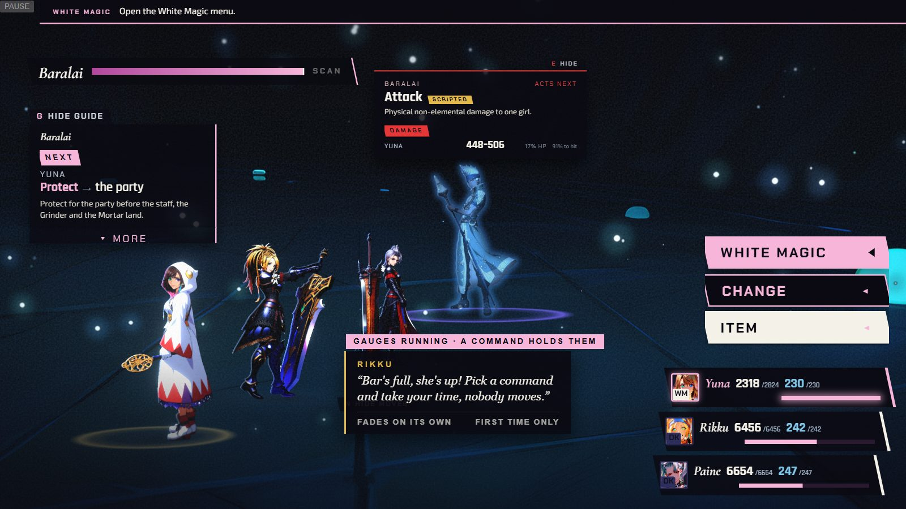

*New Chapter XV, the Den of Woe: the first menu against Baralai's shade.*

All pictures for this build: [docs/changelog/release-19.md](docs/changelog/release-19.md)

## 2026-09-26 · Release 18

Address: https://baileypillon.github.io/pyrefly-reprise/ (main b975397b)

- **Both:** a new chapter select. Every card paints its boss on its own scene, the list keeps a fixed
  shape so a second click always starts the card you picked, and a beaten chapter wears a VICTORY sash
  and a ribbon with your best time. A strip counts your clears ("5 OF 13 BEATEN"), and a COMING card
  holds Chapter VII's place.
- **FFX:** Chapter X, Seymour Natus, is playable: the fight on the Highbridge of Bevelle. Its guide
  teaches Hasting only Tidus and Auron.
- **FFX:** Chapter XII, Seymour Omnis, is playable in the Garden of Pain, with painted discs, a disc
  strip and an intent line on the HUD.
- **FFX:** Chapter XIV, Isaaru, is playable: Yuna's aeons face Isaaru's three, Grothia, Pterya and
  Spathi, in the Via Purifico.
- **FFX-2:** Chapter XI, the Fallen Aeons, is playable: Shiva, the Sisters and Anima in a row on the
  Road to the Farplane. Each action takes 3 seconds to play out, which makes the chapter much easier
  to win at a human pace.
- **Both:** a cutscene's fade to black no longer hides the dialogue. Lines after a fade used to play
  over a blank screen in Chapter I's epilogue, the post scenes of Chapters II to VIII and Chapter XIV's
  close.
- **FFX:** Mortiorchis (Chapter I) and Mortibody (Chapter X) come back on stage when Mortibsorption
  revives them, instead of fighting on unseen.

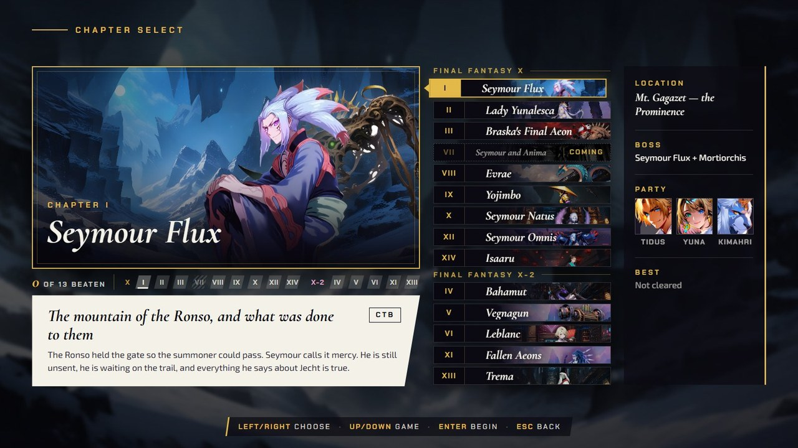

*The new chapter select: the boss painted on its own scene, a fixed list, and a strip that counts your clears.*

All pictures for this build: [docs/changelog/release-18.md](docs/changelog/release-18.md)

## 2026-09-25 · Release 17.1

Address: https://baileypillon.github.io/pyrefly-reprise/ (main 1a680e41)

- **FFX-2:** the results screen's portrait wedge shows Yuna, Rikku and Paine in their FFX-2 art; it had
  drawn their FFX versions. A fallen leader lies down in the dressphere she wore. FFX results are unchanged.
- **FFX-2:** on phones, tapping a menu row now moves the cursor to that row first, so the target card and
  Confirm name the command you tapped.

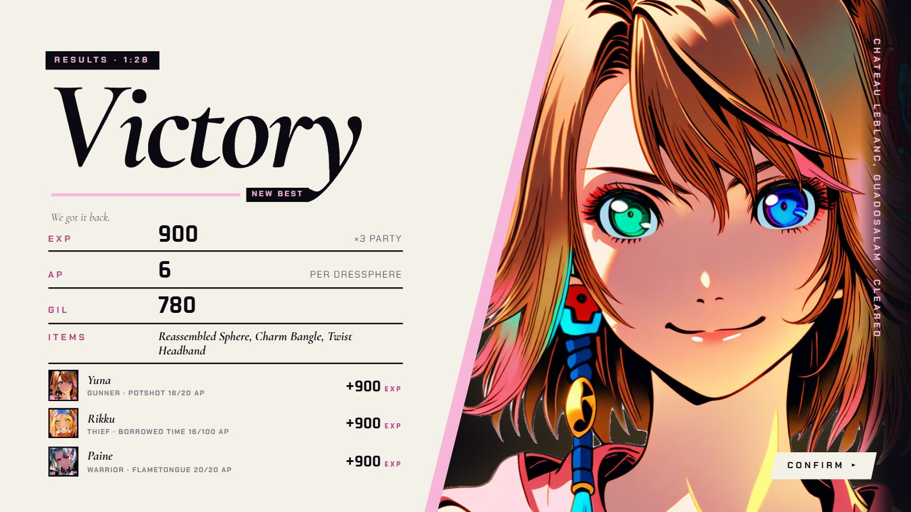

*Chapter VI results: Yuna stands in the portrait wedge in her FFX-2 art, not her FFX one.*

All pictures for this build: [docs/changelog/release-17-1.md](docs/changelog/release-17-1.md)

## 2026-09-25 · Release 17

Address: https://baileypillon.github.io/pyrefly-reprise/ (build e45ed3c1, cut from a side branch)

- **FFX-2:** 22 new painted battle poses for Yuna, Rikku and Paine in their dresspheres. Those moments used
  to show the standing painting.
- **Both:** the phone battle screen is repaired. ALL-target commands (Pray, Mega-Potion, group spells) get
  a touch Confirm step, the field slides to keep your party and the aimed figure whole, and every phone
  battle text is at least 14 px.
- **Both:** the results screen stands the speaker of the victory line in the portrait wedge, and the lines
  now rotate through the party. Chapter III's results card goes quiet.
- **FFX:** Chapter IX plays four mid-battle callouts, from Lulu, Auron, Kimahri and Yuna.
- **Both:** Chapter IX no longer draws placeholder silhouettes after an update. The browser re-checks the
  art list instead of trusting an old copy.
- **FFX-2:** Chapter XIII polish: the enemy-move card steers clear of the target ring, the pause CHAPTER tab
  leaves Trema's face clear and prints DRESSPHERE and GARMENT GRID in full, the phone view shows the
  Cloister fighters at full size, and the guide names the current link.
- **FFX-2:** an enemy hit on a girl whose command menu is open closes that menu, and she gets a fresh one
  at once.
- **Both:** a chapter's first attempt no longer always plays the same fight. It draws a fresh seed, so a
  newcomer's first try at Chapter I is no longer always the same loss.
- **FFX:** Chapter I's guide stops calling Protect a defence and stops promising a Holy Water turn.
- **FFX-2:** the guides for Chapters V and VI open with the Wait habit: pick a command at once, because the
  clock keeps running until you do.
- **Both:** Auron's briefing says plainly when each clock runs: in the FFX fights nothing moves until you
  act, and in the FFX-2 fights the clock keeps running until you pick a command.

*Chapter IV: Rikku's new Black Mage cast painting in play.*

All pictures for this build: [docs/changelog/release-17.md](docs/changelog/release-17.md)

## 2026-09-25 · Release 16

Address: https://baileypillon.github.io/pyrefly-reprise/ (main fc7f1a20)

- **FFX-2:** Chapter XIII, Trema, is playable: the optional superboss on Cloister 100 of the Via Infinito,
  Paragon first and then Trema, with a level 99 party.
- **FFX-2:** Paragon's Oversoul gets its own look: an "Oversoul!" caption, then a blue cast, rim and motes.
- **FFX-2:** in Chapter XIII, Beguiling Mire's Stop and Paragon's Confuse wear off, and normal Paragon's
  physical attacks always land, as the sources say.
- **FFX-2:** a dressphere change no longer drops a girl's accessories (Crystal Bangle, Rabite's Foot) for
  the rest of the battle.
- **Both:** the phone battle screen is rebuilt as a compact rail: the turn list or boss gauge on top, big
  command tiles in thumb reach, the advisor as a one-line tip with GUIDE, three party chips, and a target
  card with Back and Confirm.
- **FFX:** in Chapter VIII the party is laid along the rail, so the command stack no longer covers Tidus.
- **FFX-2:** in Chapter V the Body stands on a new spot so the Left Bulwark's ring and plate clear the
  command window, and the Bulwark name plates dock clear of the enemy-intent card.
- **FFX-2:** the enemy-move card now sits above the fighters, keeps its chip with it, and clears when its
  enemy is KO'd.

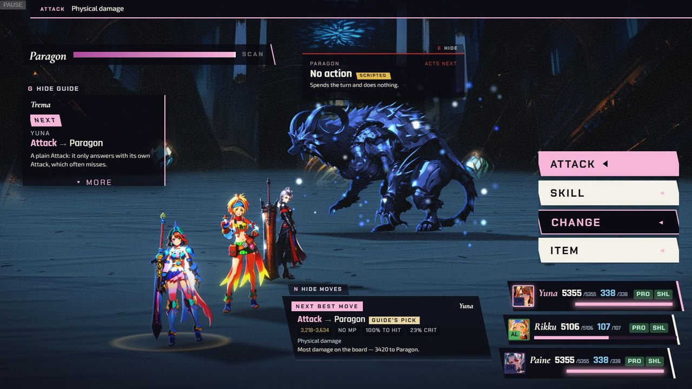

*New Chapter XIII, Trema: the first menu against Paragon.*

All pictures for this build: [docs/changelog/release-16.md](docs/changelog/release-16.md)

## 2026-09-25 · Release 15

Address: https://baileypillon.github.io/pyrefly-reprise/ (build 5be4babe, cut from a side branch)

- **FFX:** Chapter IX, Yojimbo, is playable: Lulu, Kimahri and Yuna face Yojimbo, Lady Ginnem and Daigoro in
  the last chamber of the Cavern of the Stolen Fayth, under a night-sakura tree, to a battle theme of its own.
- **FFX:** a gauge under Yojimbo's name shows how close his Zanmato is, and Doom's countdown shows over the
  doomed head and on the target plate.
- **FFX:** after the win Yojimbo and Daigoro are recalled, and Yuna's sending of Lady Ginnem is shown, not
  just told.
- **FFX:** summoned aeons no longer get the party's Items; an aeon's menu has no Item row.
- **Both:** petrified fighters now turn to stone: a grey tint with chips falling away.
- **FFX:** an enemy's Sensor chip leaves with the enemy instead of lingering after its fall.
- **FFX-2:** the top-right banner now shows Steal, Pilfer Gil and every other battle message, and a steal
  names its reward (Bahamut's says Mute Shock).
- **FFX-2:** Leblanc's fan is fully open in Chapter VI.
- **Both:** Auron's briefing counts the playable fights by itself, and the coaching lines stop calling the
  command menu a "list".
- **Both:** battles load in the background behind party prep and the opening scene, and the board's
  paintings are ready before the title wipes away, so the first menu comes up sooner.
- **Both:** chain fights keep one music track at a time: Chapter III's aeon gauntlet stays under Yu Yevon's
  theme, and Chapter V no longer starts Shuyin's theme early.
- **Behind the scenes:** the paintings for the next chapters (Omnis, Trema, Isaaru, Den of Woe) ride along
  in this build, but those chapters are not playable yet.

*New Chapter IX, Yojimbo: the first menu, with the Zanmato gauge under his name.*

All pictures for this build: [docs/changelog/release-15.md](docs/changelog/release-15.md)

## 2026-09-25 · Release 14

Address: https://baileypillon.github.io/pyrefly-reprise/ (main 1c22066e)

- **FFX:** Chapter I: a Poison tick that carries Seymour Flux below half health no longer opens his second
  phase. Only a real hit does, as the sources say.
- **FFX:** Chapter I's target bracket clears the advisor's card again, and Rikku stands clear of the command
  stack again in Chapter VIII.
- **FFX:** formations repaired after release 13: Yunalesca stands where she stood before, and Auron and
  Yuna are eased apart in Chapter III.
- **FFX-2:** Chapter V's Vegnagun Body is drawn where it stood before release 13.
- **FFX-2:** Vegnagun's parts get clearer labels: the Left Bulwark's plate leaves the CHANGE row, the
  overhead Nodes get arrow markers at the top edge, and the first aim lights its row.
- **Both:** on phones, the pause screen lifts its columns clear of the chapter caption when they would
  overlap.

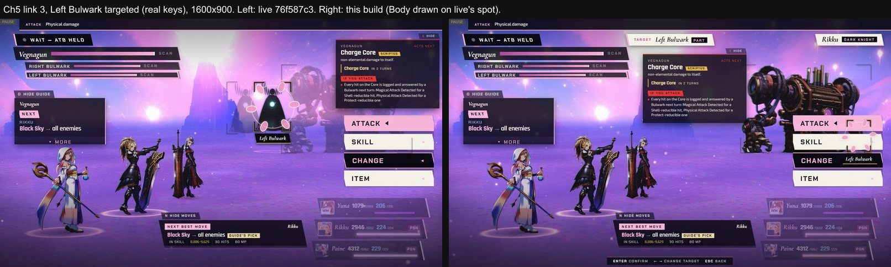

*Chapter V, third link: Vegnagun's Body, before (left) and after (right) it is drawn where it stood before release 13.*

All pictures for this build: [docs/changelog/release-14.md](docs/changelog/release-14.md)

## 2026-09-24 · Release 13

Address: https://baileypillon.github.io/pyrefly-reprise/ (main a999d133)

- **FFX:** in Chapters I and III Yuna has a new slot, so the command stack no longer hides her.
- **FFX:** the command menu is drawn above the turn cut-in instead of under it.
- **FFX:** the ALL ALLIES and ALL ENEMIES chip hangs off the chosen row, and the ITEMS breadcrumb no longer
  hides under the help card.
- **FFX:** Chapter I: Mortibsorption now runs Seymour's Protect and Reflect threshold counters instead of
  dropping them, as the sources say.
- **FFX-2:** magic never rolls to miss, on either side. Enchanted Ammo keeps its sourced roll.
- **FFX-2:** aiming shows a TARGET plate, the acting girl's name and dressphere, and a controls hint; a
  victory that lands under an open menu closes it.
- **Both:** on the pause screen faces stay clear of the stat columns: the portrait slides when nothing else
  clears the face, and Paine's column stacks in Chapters V and VI.
- **Both:** on phones the party-prep chapter card is one stacked, scrolling page with readable text (it was
  about 3 px); on desktop PG UP and PG DN scroll the chapter columns.
- **Behind the scenes:** Chapters IX (Yojimbo), X (Natus) and XI (Fallen Aeons) ride along switched off.
  The chapter board still lists seven playable chapters, with Chapter VII as COMING.

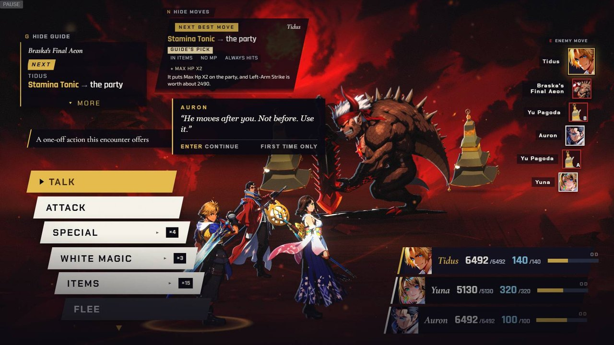

*Chapter III's first menu: Yuna stands in view beside the command stack.*

All pictures for this build: [docs/changelog/release-13.md](docs/changelog/release-13.md)

## 2026-09-24 · Hotfix 12.3

Address: https://baileypillon.github.io/pyrefly-reprise/ (build e3b8c2a3, cut from a side branch)

- **FFX-2:** Wait mode now works as in the original: the clock keeps running while a girl's top-level
  command list is open and holds only once you open a submenu or the target cursor. A skill you chose now
  plays out while the next girl is choosing, instead of everything waiting for all three.
- **FFX-2:** the coaching lines for Wait mode (the first-turn bubble, the briefing line and the badge) are
  reworded to match.
- **Both:** leaving a battle before its fight has started (Escape during the opening) no longer throws an
  error or leaves an invisible fight running.

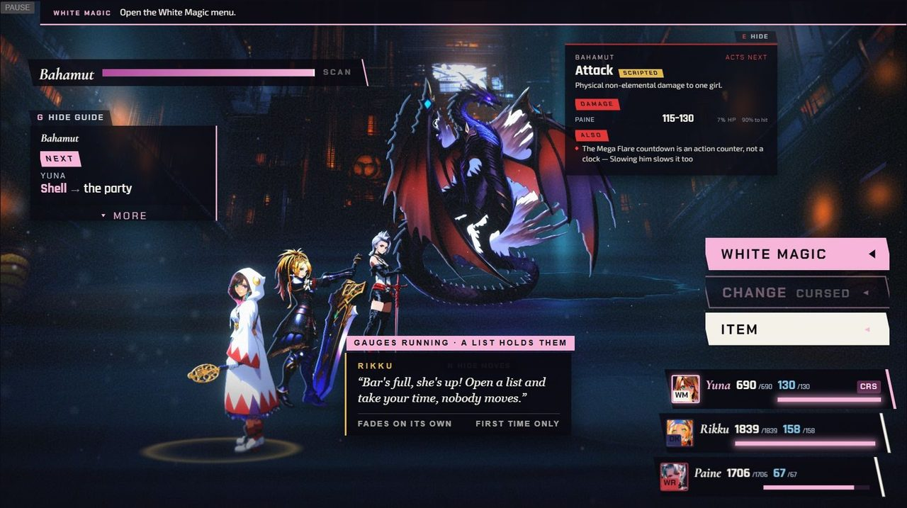

*Chapter IV under Wait mode: the reworded coaching line says the gauges keep running while a list holds them.*

All pictures for this build: [docs/changelog/hotfix-12-3.md](docs/changelog/hotfix-12-3.md)

## 2026-09-24 · Hotfix 12.2

Address: https://baileypillon.github.io/pyrefly-reprise/ (build dc2669ac, cut from a side branch)

- **Both:** the target cursor opens on the sensible side: an enemy for attacks, debuffs and Dispel, a party
  member for cures, and a KO'd one first for revives. It used to open on the leftmost figure, often a
  party member.
- **FFX-2:** a faithful Wait mode (the clock runs while a girl's top list is open) is built but switched
  off; add ?wait=split to the address to try it.

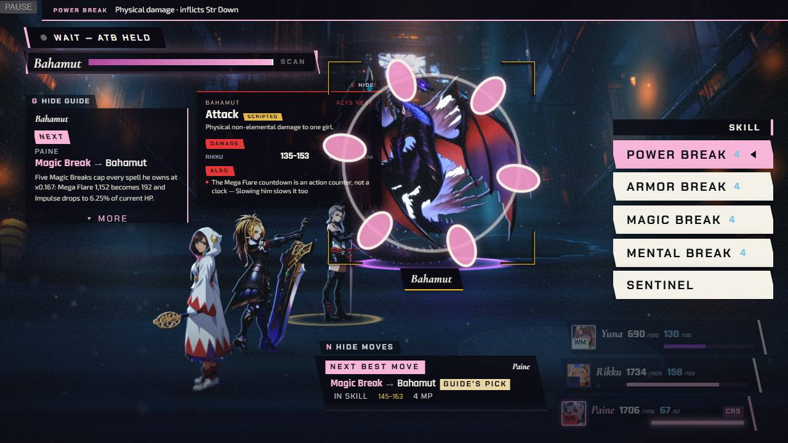

*Chapter IV: choosing Power Break now opens the target cursor on the enemy, not on Yuna.*

All pictures for this build: [docs/changelog/hotfix-12-2.md](docs/changelog/hotfix-12-2.md)

## 2026-09-24 · Hotfix 12.1

Address: https://baileypillon.github.io/pyrefly-reprise/ (build bcbdb483, cut from a side branch)

- **Both:** Chapter II's pause CHAPTER tab no longer lets Auron's snapshot blow up across the chapter text.

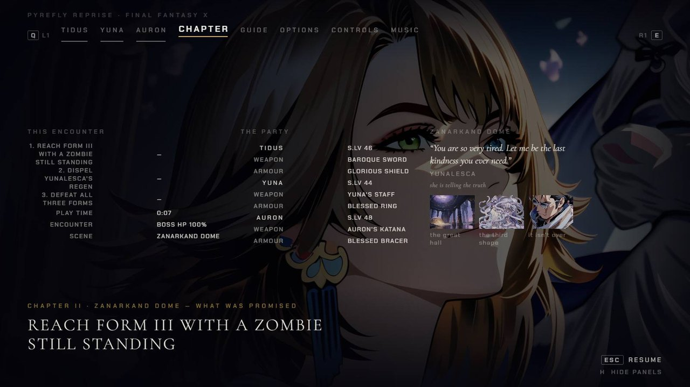

*Chapter II's pause CHAPTER tab: Auron's snapshot sits back in its strip.*

All pictures for this build: [docs/changelog/hotfix-12-1.md](docs/changelog/hotfix-12-1.md)

## 2026-09-24 · Release 12

Address: https://baileypillon.github.io/pyrefly-reprise/ (main 76f587c3)

- **FFX-2:** in Chapter VI, Dr. Goon and Fem-Goon are painted figures instead of stand-ins.
- **FFX-2:** Brother and Nooj speak with new dialogue portraits (Chapters VI and V).
- **FFX-2:** the one-line command-help band is back, pinned across the top of the screen. It clears the
  PAUSE chip and the enemy-intent card, and reads at phone width.
- **FFX-2:** while a command menu is open the camera stays on the idle frame instead of pushing in on the
  attacker, so the party and the target ring stay in view. Victory and story cameras still play.
- **FFX-2:** Vegnagun's tail has a steel tip instead of a green one (Chapter V).
- **Both:** on the pause screen each face is framed clear of the stat columns and stays on screen through
  the slow push-in; a resize glides to the new framing instead of jumping.
- **FFX:** Evrae's fall uses only approved paintings; its KO art no longer shows.
- **FFX:** the ALL ALLIES and ALL ENEMIES chip now clears the help card.
- **FFX:** the victory fanfare no longer plays through the aftermath scenes of Chapters I and II.

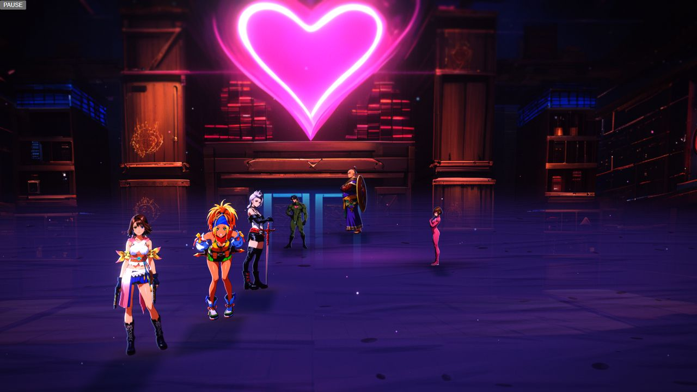

*Chapter VI: Dr. Goon (green) and Fem-Goon (pink) painted, with Ormi, facing Yuna, Rikku and Paine.*

All pictures for this build: [docs/changelog/release-12.md](docs/changelog/release-12.md)

## 2026-09-23 · Release 11

Address: https://baileypillon.github.io/pyrefly-reprise/ (main d9decadb)

- **FFX:** Chapter VIII, Evrae, the airship-deck fight, is unlocked and playable. The wyrm of Bevelle
  attacks the Fahrenheit's deck from range: tell Cid to pull back or move in, and the stage re-sets near
  and far. Chapter VII still waits as "Coming".
- **FFX:** Evrae has its own scene and boss music, and the aftermath plays in silence: the victory
  fanfare is cut where the Bevelle scene begins.
- **FFX:** Evrae shrinks as it falls out of the sky when it is beaten.
- **FFX:** Sensor no longer reveals Cid, so a blank enemy card for him no longer takes over Evrae's
  enemy plate.
- **FFX:** Wakka's callout waits a beat after the camera cuts to Evrae's Inhale, so you can read the
  warning first.
- **FFX:** with a breath charged at range, the advisor offers a spare Potion, never a Defend row the
  menu does not have and never a move that names Evrae.
- **Both:** a second open tab no longer overwrites the first tab's saves. Settings, unlocks, clears and
  best times are merged (a volume change could be lost on reload).

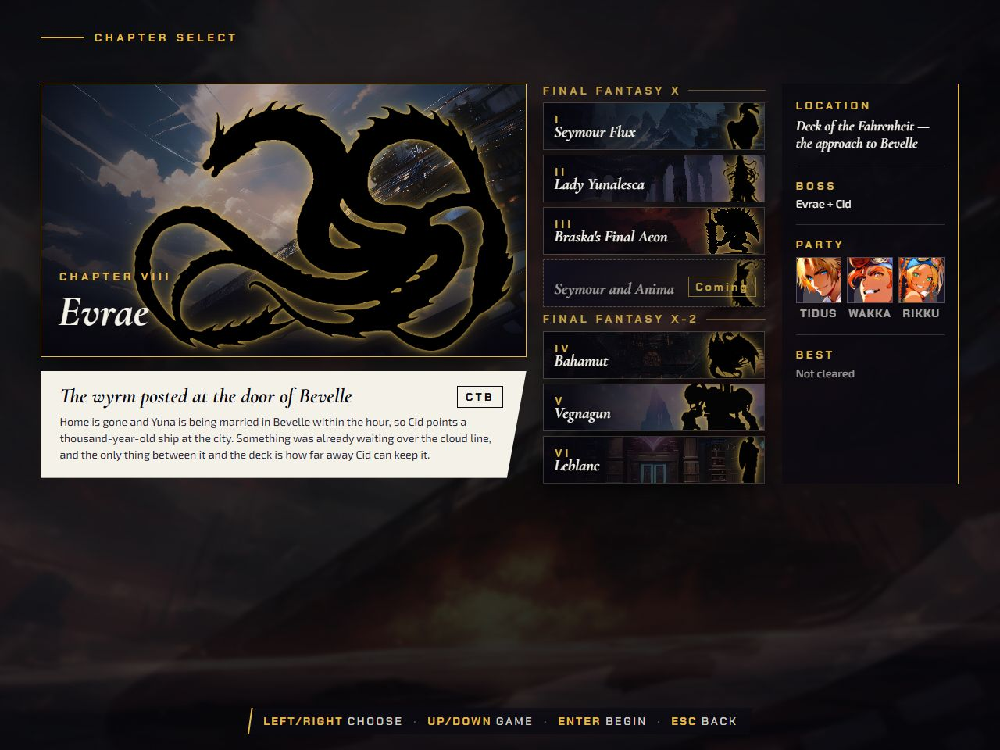

*Chapter VIII, Evrae, selected on the chapter board: it is open for play, and Chapter VII still shows COMING.*

All pictures for this build: [docs/changelog/release-11.md](docs/changelog/release-11.md)

## 2026-09-23 · Release 10

Address: https://baileypillon.github.io/pyrefly-reprise/ (main 5348c2e3)

- **FFX-2:** Chapter VI is finished to the chosen look. Leblanc, Logos and Ormi use their cast painting
  for every move and their idle when hit, Ormi's shield carries the Syndicate heart, and a beaten
  villain steps back and leaves instead of dissolving.
- **FFX-2:** Rikku's Steal and Pilfer Gil work in Chapter VI (they did nothing), and Grenades no longer
  always land a critical hit.
- **FFX-2:** Vegnagun's parts get their sourced steals and names (Node A to C, Right and Left Bulwark,
  Right and Left Redoubt) with no extra HUD letters, and the guide no longer suggests Reflecting the Leg.
- **FFX:** Doublecast now asks for a spell and an enemy target. Before, it cast twice on Lulu herself.
- **Both:** each party member's first turn opens with the turn cut-in, without delaying the menu, and a
  Confirm press skips the battle's opening camera sweep.
- **Both:** the pause owns the screen. Nothing paints over it, OPTIONS scrolls on a phone, the CHAPTER
  tab shows the chapter's own plate, and the text sits on the empty side of every portrait.
- **Both:** the enemy-intent panel hides under the pause, its odds match the move that was rolled, and
  a MORE key reveals clipped text.
- **Both:** a KO'd fighter lies on the floor, the target ring sits on the floor under lifted figures
  such as the Yu Pagodas, and the dim on non-targets is stronger.
- **FFX-2:** white costumes (Yuna's Gunner top, Leblanc's dress) no longer blow out under the bloom.
- **FFX-2:** Chapter V's fifth linked fight opens its menu on Shuyin and all three girls, and HP and MP
  carried into the next linked fight no longer read above the maximum.
- **FFX-2:** the first-time gauge hint speaks Wait mode instead of telling you not to wait.

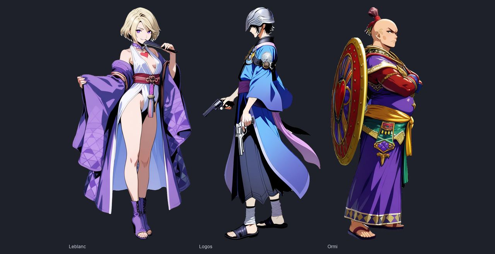

*Chapter VI's cast: the idle paintings of Leblanc, Logos and Ormi.*

All pictures for this build: [docs/changelog/release-10.md](docs/changelog/release-10.md)

## 2026-09-23 · Release 09

Address: https://baileypillon.github.io/pyrefly-reprise/ (main 5ddfde30)

- **FFX-2:** Chapter VI, The Leblanc Syndicate, is playable: "A Farce, Armed" at Chateau Leblanc, in
  three acts against Ormi, Logos and Leblanc. Its poses are the best candidates so far, and it borrows
  Chapter IV's music for now.
- **FFX-2:** Wait is the default battle mode again: an open command menu holds the clock. Active and an
  ATB speed (Slow, Normal, Fast) are options in the pause menu, and older saves flip to Wait once.
- **FFX-2:** a girl whose command is chain-locked keeps her menu and her command instead of losing the
  menu to the next ready girl.
- **FFX-2:** heals and items on your own side never miss, Leblanc's White Wind now heals and cures her
  crew, and the Syndicate stands at party scale (Ormi had towered over the party).
- **FFX-2:** the advisor no longer spends a cure, raise or item that another girl already has charging,
  and its card stays off the party's HP rows between linked fights.
- **FFX-2:** the first-turn badge reads correctly under Wait.
- **Both:** scene, boss and phase music now fades in at the right speed. It had been sitting near
  silence for whole fights.
- **Both:** the enemy-intent panel (E) fills in again. It had been opening empty.
- **Both:** the victory screen keeps the leader's whole head, the pause CHAPTER tab's pictures load and
  its captions wrap, the pause no longer lets mouse clicks through to the battle, and the advisor
  card's text is at least 12 px on desktop and phone.
- **FFX:** Auron's first-turn hint no longer covers the advisor card or the command list.
- **Both:** chapter select shows Chapter VI as playable and Chapters VII and VIII as locked "Coming"
  cards.

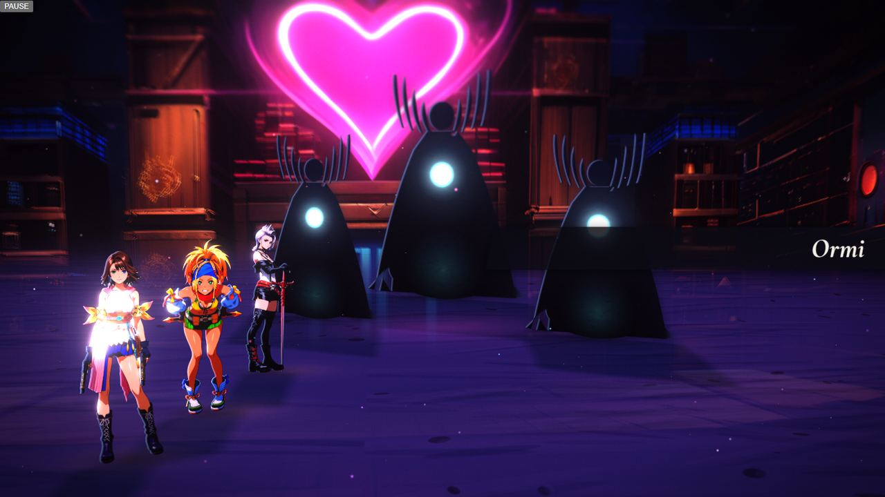

*New Chapter VI: the first fight at Chateau Leblanc.*

All pictures for this build: [docs/changelog/release-09.md](docs/changelog/release-09.md)

## 2026-09-21 · Release 08

Address: https://baileypillon.github.io/pyrefly-reprise/ (main 1b339718)

- **Both:** the pause screen is remade as a character screen with one painted close-up per member: a
  tab strip (each member, CHAPTER, GUIDE, OPTIONS, CONTROLS, MUSIC), thin meters over the painting, and
  the chapter's goal in one big line. RESTART ENCOUNTER now works from a chapter entered normally.
- **Both:** Auron's briefing is on: 20 skippable seconds in Auron's voice on a first launch, then a
  one-line hint the first time each mechanic matters. Replay it from the pause menu or the title, or
  switch the hints off.
- **FFX-2:** Active ATB: the clock keeps running while a command menu is open, and a command always
  goes to the girl whose menu was open.
- **Both:** the move advisor plans one enemy turn ahead and never recommends a move that does nothing.
  A test player that always follows its top pick now wins Chapter III in 39 of 40 runs, where it won none
  before.
- **Both:** the dialogue card fits every portrait to its slot, Jecht's face is fixed, and the card fits
  a phone.
- **FFX-2:** party prep, results and chapter select show real faces for Rikku and Paine instead of
  letters.
- **FFX:** Nulblaze, Nulfrost, Nulshock and Nultide cover the whole party.
- **FFX-2:** Eject now really removes its target from the fight. Before, it only showed a badge.
- **Both:** the 31 repainted poses from Build B.1 go back to the earlier paintings, which look better
  at full size. The 11 poses that filled gaps stay.
- **Both:** title and chapter select text is at least 14 px (12 on a phone), and on touch you can tap
  anywhere on the title plate to start.
- **Both:** the first-turn hint keeps the command menu visible, the pause tab strip scrolls to the
  selected tab, and phone tap targets and HUD labels are larger.

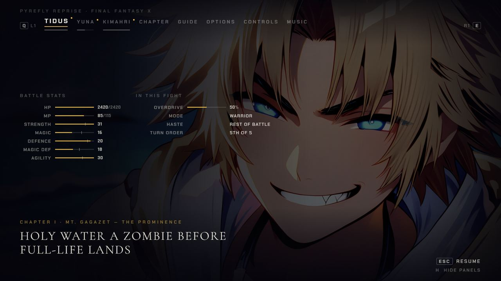

*The remade pause screen: Tidus's page in Chapter I, with a painted close-up, thin meters and the chapter's goal in one line.*

All pictures for this build: [docs/changelog/release-08.md](docs/changelog/release-08.md)

## 2026-09-21 · Build B.1

Address: https://baileypillon.github.io/pyrefly-reprise/ (main 8f482378)

- **Both:** the title screen moves. Painted layers drift with the pointer, stick and time, the two
  figures on the shore are ink silhouettes, and pyreflies rise through the frame, all on the approved
  key art.
- **Both:** chapter select is a board of eight cards in two game groups. An uncleared chapter shows its
  boss as an ink silhouette, a cleared one shows the painting, and three new chapters wait as locked
  "Coming" cards. Both screens are now full-bleed.
- **FFX:** new poses for Lulu, Rikku, Kimahri, Yunalesca's second and third forms, the Yu Pagoda and
  Jecht, part of 42 approved poses installed in this build.
- **FFX-2:** the rest of the 42: four Yuna dresspheres, both Paine dresspheres, the possessed Bahamut
  and three Vegnagun parts, plus Lenne's portrait.
- **Behind the scenes:** new release rules: ship when a build is better than the live one, with the
  deep review following on the live build.

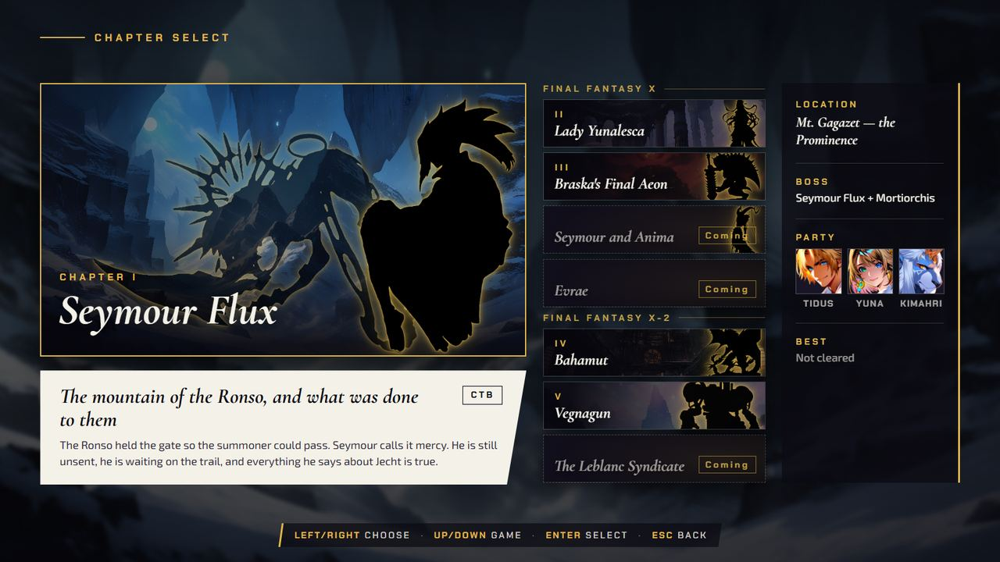

*The new chapter board: eight cards in two game groups, with each uncleared boss as an ink silhouette.*

All pictures for this build: [docs/changelog/build-b-1.md](docs/changelog/build-b-1.md)

## 2026-09-21 · Build A.2

Address: https://baileypillon.github.io/pyrefly-reprise/ (build fd0ae96d, cut from a side branch)

- **FFX:** Threaten and Sleep now play out. An enemy hit by either used to vanish from the turn queue,
  so the status never ran out, and a Threatened boss now stops countering.
- **FFX:** Yu Yevon: only your own actions draw his Curaga, and Gravija reaches everyone on the field,
  Pagodas included, so wearing him down works.
- **Both:** a party row no longer shows a downed ally alive for two seconds, and numbers no longer run
  ahead of their bars. The rows now move with each blow.
- **FFX:** results credit AP and S.Lv to whoever took a turn, and duplicate enemies keep their A and B
  letters when one dies.
- **Both:** wording fixes: single-target Haste is no longer called party-wide, the intent panel drops
  its empty Damage section for status moves, the pause says "Battle 2 of 4" instead of "Link", and the
  strategy guide always ends on a whole line.
- **Both:** saved volume and mute apply at start-up, not only after opening the pause.
- **FFX-2:** the Attack submenu no longer lists two ATTACK rows, the command list's scroll arrow sits
  on the list, and a Berserked girl with no Attack command no longer locks the battle on an empty menu.
- **FFX:** new dialogue portraits for young Auron, the Fayth boy, Braska and Yu Yevon.
- **FFX-2:** new dialogue portraits for Paine, Shuyin, Yuna and Rikku. Their names no longer print as
  "Yuna X2" and "Rikku X2".
- **Behind the scenes:** every deploy now ships a list of every file with its hash, so the live site
  can be checked byte for byte against the build.

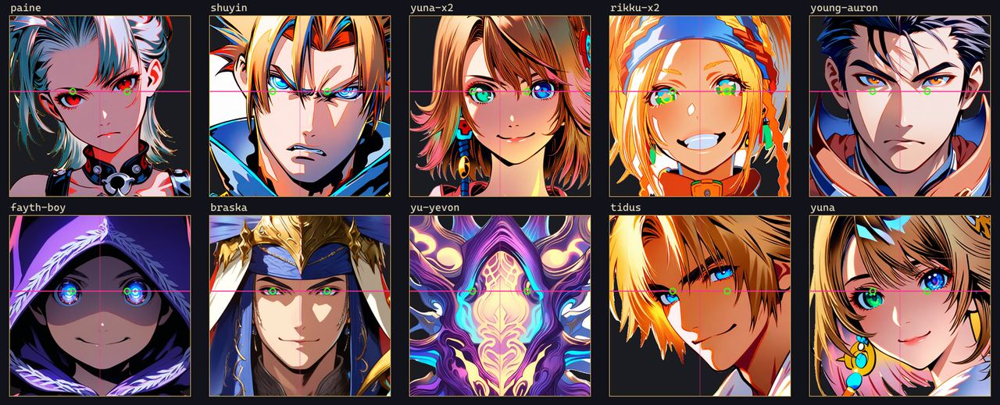

*The eight new dialogue portraits as face crops, with the eye line drawn on.*

All pictures for this build: [docs/changelog/build-a-2.md](docs/changelog/build-a-2.md)

## 2026-09-19 · Build A

Address: https://baileypillon.github.io/pyrefly-reprise/ (main 7191674d)

- **Both:** fights end properly. Chapter IV no longer freezes after Bahamut's last blow, and the closing
  scenes of Chapters I, II, III and V now play their dialogue. They had never shown it.
- **Both:** every boss fight plays its own theme (the first fight of each chapter had played the
  generic battle music), and the scene, victory, ending and pause music is wired in. The battle theme
  is re-rendered, as the shipped file came from an older score.
- **Both:** a BATTLE START card introduces each fight with the boss's painting, the chapter name and
  your party's faces. Enter now moves story scenes along, and holding it skips them.
- **FFX:** Wakka's Slots and Attack Reels deal real damage, Lulu's Fury casts every Black Magic spell
  she knows, and Steal, Mix, Death Fury and Zanmato now do what the menu says. Before, they spent a
  turn, often a full Overdrive gauge, on nothing.
- **FFX:** Talk works. It can zero Jecht's gauge, and against Seymour Flux it gives Kimahri +10 Strength
  and Yuna +10 Magic Defense, once each.
- **FFX:** Yu Yevon can be beaten (Doom through the Candle of Life, or Reflect), and Seymour Flux
  follows its Flare, wait, Flare loop.
- **FFX-2:** Charon now costs the girl who casts it. It had been a free, repeatable nuke.
- **FFX-2:** one Change command opens the dresspheres by name, a spherechange plays its flourish (a
  white column, petals, a ring from her feet, the outfit named), the chain counter shows a big numeral,
  and party prep gains a STATS tab.
- **Both:** the advisor (N) always answers for a fallen ally, even a Zombie.
- **Both:** target selection is clear: a pointing hand in FFX, a six-petal flower in FFX-2, a bracket
  sized to the figure, an ink name plate with its letter, an ALL label for party-wide moves, and a
  quiet dim on everyone else. No enemy hides behind another any more (the Yu Pagodas had been hidden).
- **FFX:** a party Switch no longer leaves the incoming member off the field, the Sensor card folds to
  a chip after seven seconds, and unscanned enemies show ??? with no HP bar.
- **Both:** the pause screen copes with 4:3 and small windows. The quote no longer prints across the
  menu rows.

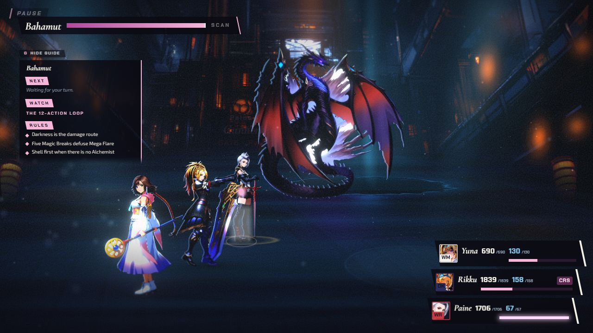

*Chapter IV: Paine's spherechange flourish, a pale column and a ring at her feet.*

All pictures for this build: [docs/changelog/build-a.md](docs/changelog/build-a.md)

## 2026-09-19 · Build of 2026-09-19 (main 5a82e712)

Address: https://baileypillon.github.io/pyrefly-reprise/ (main 5a82e712)

- **Both:** a new score. 21 pieces are re-recorded with sampled orchestral instruments and played from
  files, with the old in-browser synth as a fallback, and loops no longer click when they wrap. The
  title, chapter select and battle pieces play now; the scene, boss, victory and ending pieces reach
  the fights in Build A.
- **Both:** all 134 sound effects are rebuilt from struck glass, bells, harp, choir and breath, and sit
  in the music's hall.
- **Both:** the move advisor only recommends what the acting character can press, says which menu a
  move lives in ("Poison Fang, in Items"), hands the turn to whoever owns the move, and prices a revive
  from the board. Research citations leave the card, and its tag becomes "Guide's pick".
- **Both:** the pause screen's painting is full-bleed at any window shape, with 2x plates and type that
  scales, and its phone layout is fixed.
- **Both:** portrait crops are read from each painting, so heads are no longer cut through the chin
  (Auron's was).
- **FFX:** the HUD stays clean. The old "Choose a Rage" slab no longer lingers on the field, turn-list
  names fit, the advisor card finds free space instead of covering Tidus and Kimahri, and one tap of
  Esc backs out of a menu without also opening the pause.
- **FFX-2:** party prep gets Dresspheres (with the Garment Grid), Accessories and Items tabs, party rows
  show painted faces (Paine gets one at last), and the intent slab and advisor stop standing on the
  girls.
- **Both:** the strategy guide says "the party" when a move hits the party.

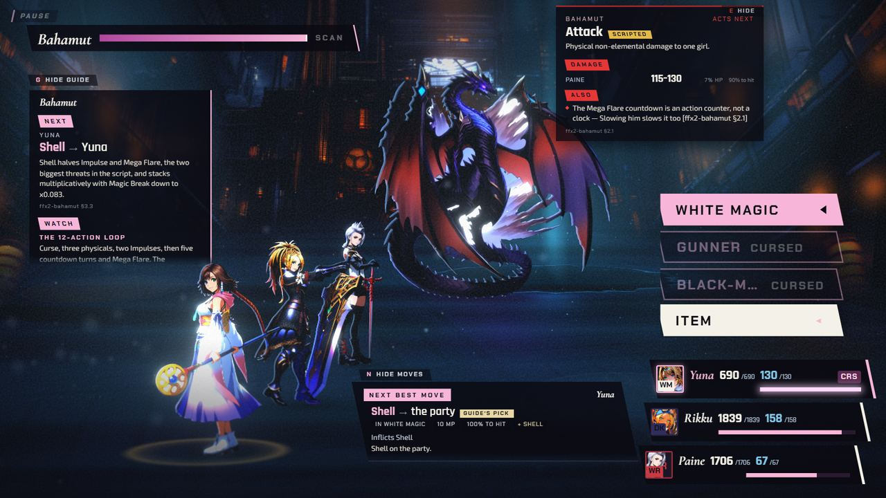

*Chapter IV's party rows now carry painted faces, Paine's at last.*

All pictures for this build: [docs/changelog/build-5a82e712.md](docs/changelog/build-5a82e712.md)

## 2026-09-18 · Build of 2026-09-18 (main 822ae16a)

Address: https://baileypillon.github.io/pyrefly-reprise/ (main 822ae16a)

- **Both:** Esc and P open the pause screen for real, even at the battle command menu. Esc still backs
  out of a submenu or targeting first, and H hides the pause panels to show the scene behind.
- **Both:** N opens a move advisor for the character whose turn it is, showing what each option is
  likely to do.
- **Both:** E opens an enemy-intent panel: the boss's next move, its damage and status ranges, and the
  counters that matter.
- **Both:** new painted art for the aeons, the FFX-2 cast and the remaining bosses.
- **FFX-2:** Chapter V's Lenne, Shuyin and Vegnagun head now show their shipped paintings.
- **Behind the scenes:** art is served through a generated manifest, so a missing variant no longer
  comes back as the page in place of an image and the network panel stays clean.

*The new move advisor card for Tidus in Chapter I (bottom centre), with the enemy-intent panel open above it.*

All pictures for this build: [docs/changelog/build-822ae16a.md](docs/changelog/build-822ae16a.md)

## 2026-09-18 · Build of 2026-09-18 (main 0c45fc8a)

Address: https://baileypillon.github.io/pyrefly-reprise/ (main 0c45fc8a)

- **Both:** a pause screen in the Ink & Gold style: a hero painting and command column over the frozen
  battle, chapter notes that check the objectives against the real battle, encounter progress and play
  time, party cards, a music player and a photo mode. Resume picks the fight up on the same turn.
- **Both:** the party-prep screens get a CHAPTER tab with the same notes, and FFX-2 prep gets its first
  tab.
- **Both:** expressive hero close-ups for all five chapters and the cast.
- **Both:** a strategy guide panel (G) with per-chapter rules, on by default in both battle HUDs.
- **Both:** fighters face their opponents and come alive: idle drift, a hit flash and a fall on KO,
  plus a quick turn in 3D.
- **Both:** battle moments: a swirl into battle with the party sliding on and a slow reveal of the
  boss's name, a punch-in on the acting fighter, a hard cut to the target on impact, and a charge
  warning with a zoom and a heartbeat vignette. FFX Overdrives get a banner with letterbox.
- **FFX-2:** Chapter IV's pause pictures no longer show an all-black tile.

*The new Ink & Gold pause screen over Chapter I.*

All pictures for this build: [docs/changelog/build-0c45fc8a.md](docs/changelog/build-0c45fc8a.md)

## 2026-09-17 · Build of 2026-09-17 (main aaf8362a)

Address: https://baileypillon.github.io/pyrefly-reprise/ (main aaf8362a)

- **Both:** essentially the same game as the morning build.
- **FFX:** newer paintings for most of the party (Tidus, Yuna, Auron, Kimahri, Wakka, Lulu, Rikku) and
  for several bosses (Mortiorchis, Seymour Flux, Braska's Final Aeon, Yunalesca, Yu Yevon and the Yu
  Pagodas).
- **Behind the scenes:** the first build pushed by the new deploy script, which also writes every
  deploy into a log.

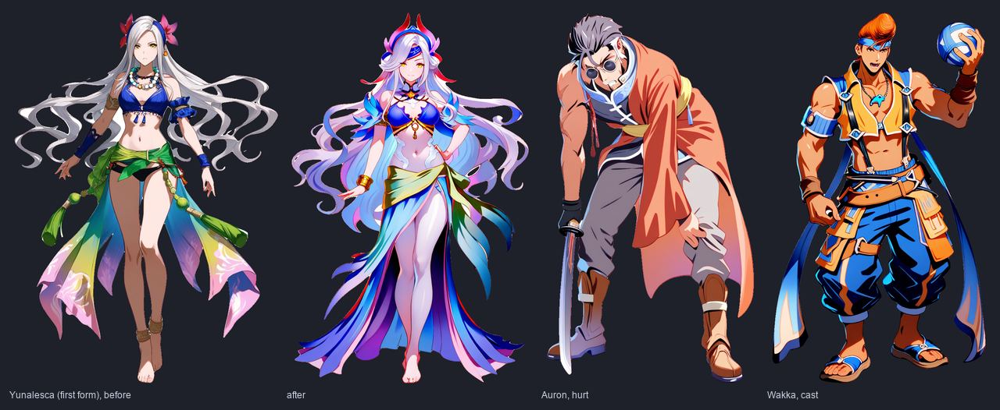

*Paintings that changed in this build: Yunalesca's first form (before, then after), Auron hurt and Wakka casting.*

All pictures for this build: [docs/changelog/build-aaf8362a.md](docs/changelog/build-aaf8362a.md)

## 2026-09-17 · Build of 2026-09-17, 11:14 (before deploys were logged)

Address: https://baileypillon.github.io/pyrefly-reprise/ (hand-built from the working tree, no main sha)

- **Both:** all five chapters can be won with the canon tactics, and the wrong tactics still lose. No
  boss was weakened to get there.
- **FFX:** Switch works. Every Switch row had been disabled, so four of the seven guardians could never
  enter a battle.
- **FFX:** Chapter I follows the research: Seymour Flux's attack cycle runs in the right order and
  Cross Cleave uses Seymour's stats instead of the mount's, Kimahri's Ronso Rage uses the Rage you pick
  (it always came out as Jump), and the aeons start with their researched Overdrive gauges.
- **FFX:** Chapter II's party carries Confuse Ward as the research says, and Chapter III's possessed aeons
  match the research (Passado hits 15 times).
- **FFX-2:** Vegnagun is the real fight. Darkness costs an eighth of the caster's max HP, the Bulwarks
  retaliate, the Nodes spin and Odi Et Amo fires.
- **FFX:** the Sphere Grid tab is a real, readable grid (it was a dark strip), party prep's Stats tab
  reflects equipment, the CTB turn list shows portraits instead of letters, Sensor shows element chips,
  and Dream's End's drifting fragments have real textures.
- **FFX-2:** the three girls stand in three slots (Yuna and Rikku had been drawn on top of each other),
  boss gauges carry names and numerals, and damage numbers appear in FFX-2 battles for the first time.
- **Both:** damage numbers sit on the fighters, fan out of one lane and dodge the menus, so multi-hit
  and chain numbers no longer stack. Enemies no longer hide behind the right-hand HUD column.
- **Both:** the results screen shows the real fight time (it read 0:00) and a distinct defeat panel,
  and best times are recorded.
- **Both:** a cast no longer blows Rikku out to pure white, and Braska's Final Aeon no longer turns into
  a flat green shape when it is healed.
- **Both:** chapter select and dialogue layouts are rebalanced, and mid-battle story lines play for
  every trigger and keep the HUD.

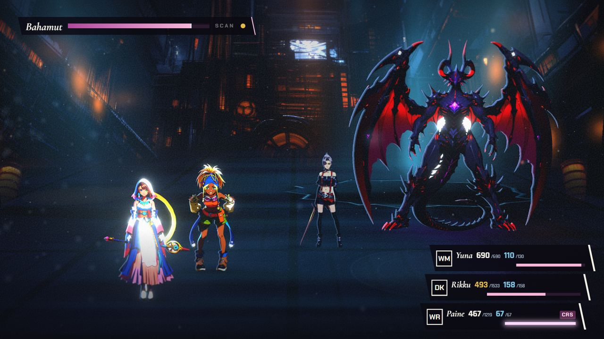

*Chapter IV: the three girls stand in three slots, where Yuna and Rikku had been drawn on top of each other.*

All pictures for this build: [docs/changelog/build-0917-1114.md](docs/changelog/build-0917-1114.md)

## 2026-09-16 · Alpha 3

Address: https://baileypillon.github.io/pyrefly-reprise/ (hand-built from the working tree, no main sha)

- **Both:** a hurt or KO'd fighter is no longer drawn oversized. A downed Tidus had lain at about twice
  his standing scale and overlapped the fighters beside him.
- **FFX:** the Zanarkand scene is relit.
- **FFX:** the command menu drops the Defend row, which is not a row in FFX's command window.
- **Both:** the story scripts are wired into the chapters.

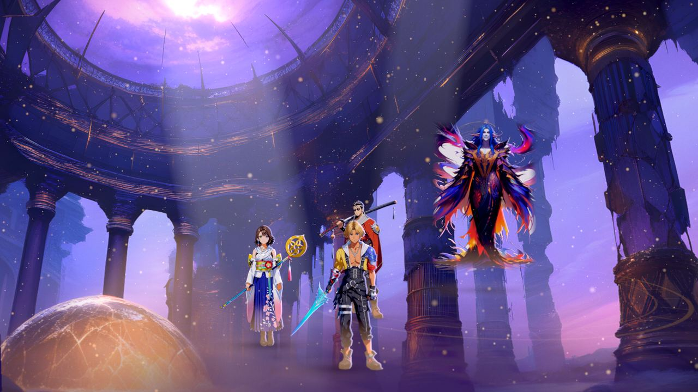

*The Zanarkand Dome scene after the relight.*

All pictures for this build: [docs/changelog/alpha-3.md](docs/changelog/alpha-3.md)

## 2026-09-16 · Alpha 2

Address: https://baileypillon.github.io/pyrefly-reprise/ (hand-built from the working tree, no main sha)

- **Both:** the Ink & Gold battle HUD work, audio and chapter-content wiring done since alpha 1.
- **FFX:** updated character paintings for Kimahri, Lulu and Yuna and for the second forms of Braska's
  Final Aeon and Yunalesca.

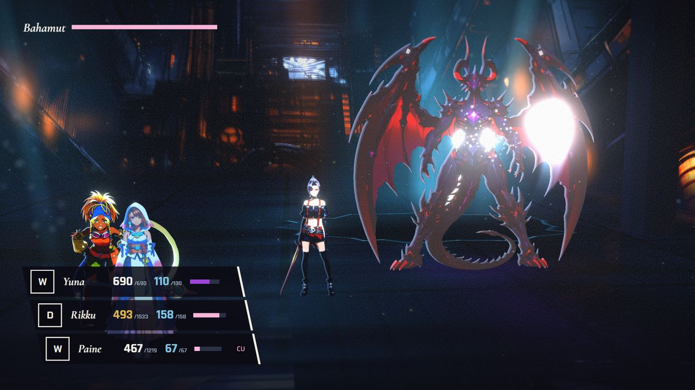

*Chapter IV in Alpha 2, with the Ink & Gold battle HUD.*

All pictures for this build: [docs/changelog/alpha-2.md](docs/changelog/alpha-2.md)

## 2026-09-16 · Alpha 1 (the first public build)

Address: https://baileypillon.github.io/pyrefly-reprise/ (hand-built from the working tree, no main sha)

- **Both:** the first public build, pushed by hand to GitHub Pages as an early alpha with all five
  planned chapters in place.
- **FFX:** Chapter I, Seymour Flux and Mortiorchis on Mt. Gagazet. Chapter II, Lady Yunalesca in three
  forms in the Zanarkand Dome. Chapter III, at Dream's End, is Braska's Final Aeon, five possessed aeons
  and then Yu Yevon, one link after another (measured on release 38: about 27 minutes of fighting,
  seven links, a bench median of 137 turns). Battles run on the Conditional Turn-Based rules.
- **FFX-2:** Chapter IV, Bahamut in Bevelle Underground. Chapter V, Vegnagun and then Shuyin on the
  Farplane. Battles run on Active Time Battle gauges, with dresspheres, spherechange and chains.
- **Both:** painted 2.5D from the start: a painted backdrop for each of the five scenes, painted title
  and chapter-select pictures, and painted party, aeon and boss figures, about 700 painted files in all.
- **Both:** Ink & Gold menus, gold for FFX and pink for FFX-2, across the title, chapter select, party
  prep (Sphere Grid, equipment, items and Overdrive modes, or the Garment Grid for FFX-2), dialogue,
  battle and results screens.
- **Both:** 18 original music tracks and sound effects, synthesised in the browser.
- **FFX:** 343 abilities and 69 items are wired into battle.

*The title screen of the first public build.*

All pictures for this build: [docs/changelog/alpha-1.md](docs/changelog/alpha-1.md)

## 2026-09-15 · Project start

- **Both:** the project begins as an unofficial, non-commercial fan tribute under the working title
  Pyrefly Reprise (it became Echoes of Spira on 2026-10-04): five of the most memorable boss
  encounters from Final Fantasy X and X-2, with faithful combat. All code, art, music and writing are
  original.
- **FFX:** three FFX encounters are planned: Seymour Flux and Mortiorchis on the Mt. Gagazet trail,
  Lady Yunalesca in the Zanarkand Dome, and Braska's Final Aeon through the possessed aeons to Yu Yevon
  at Dream's End.
- **FFX-2:** two FFX-2 encounters are planned: Bahamut in Bevelle Underground, and Vegnagun and then
  Shuyin on the Farplane.
- **Both:** built for the web with TypeScript, Vite and Three.js, with menus in HTML and CSS and music
  made in the browser. It was chosen over Unreal so a friend can open a link and play. FFX fights get a
  Conditional Turn-Based engine and FFX-2 fights an Active Time Battle engine.
- **Both:** the look was planned as pixel-art sprites in small 3D scenes. After the first screenshots
  read as a retro prototype, it changed the same day to painted 2.5D, with painted backdrops and
  painted character poses standing in lit 3D scenes.

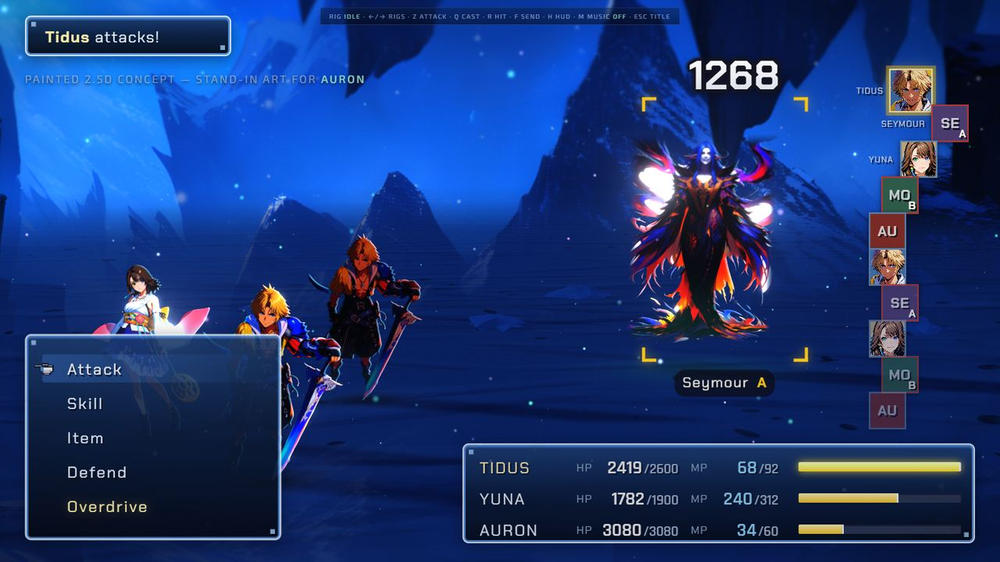

*The painted 2.5D battle concept the project switched to on its first day.*

All pictures for this build: [docs/changelog/project-start.md](docs/changelog/project-start.md)
