[Back to the changelog](../../CHANGELOG.md)

# 2026-09-16 · Alpha 1 (the first public build)

Address: https://baileypillon.github.io/pyrefly-reprise/ (hand-built from the working tree, no main sha)

*Where a caption says left and right, the left picture comes first.*

- **Both:** the first public build, pushed by hand to GitHub Pages as an early alpha with all five
  planned chapters in place.

  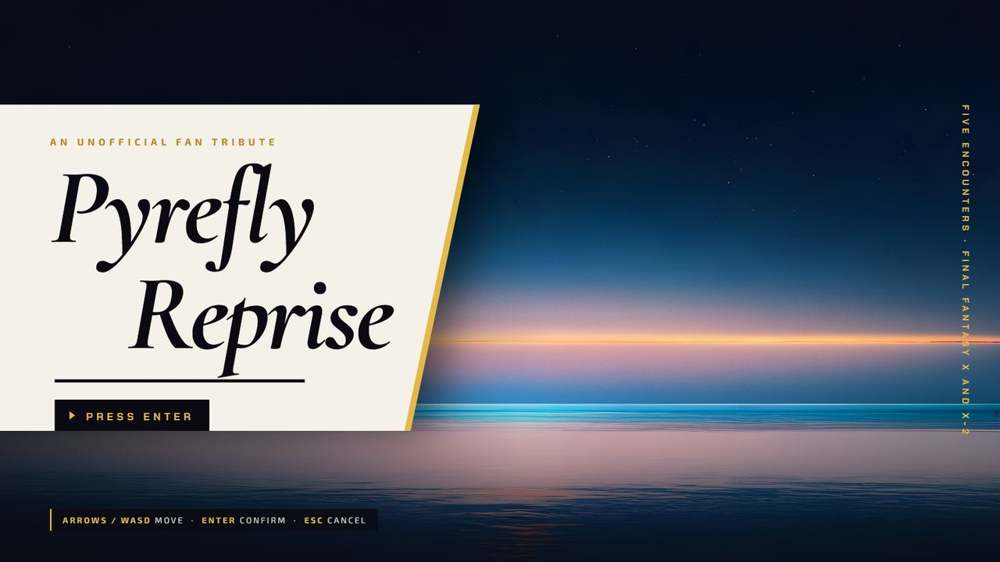

  *The title screen of the first public build.*

- **FFX:** Chapter I, Seymour Flux and Mortiorchis on Mt. Gagazet. Chapter II, Lady Yunalesca in three
  forms in the Zanarkand Dome. Chapter III, at Dream's End, is Braska's Final Aeon, five possessed aeons
  and then Yu Yevon, one link after another (measured on release 38: about 27 minutes of fighting,
  seven links, a bench median of 137 turns). Battles run on the Conditional Turn-Based rules.

  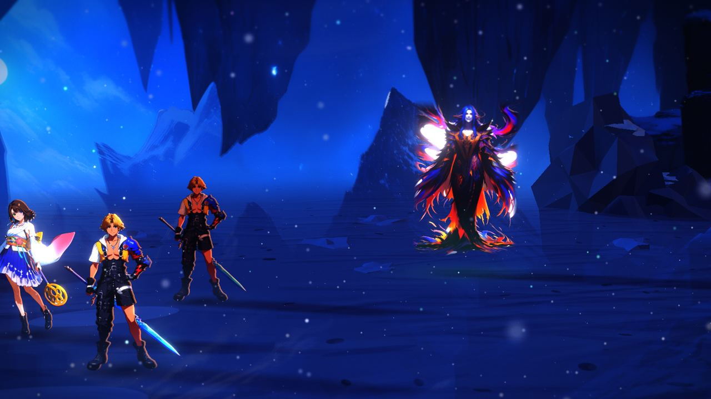
  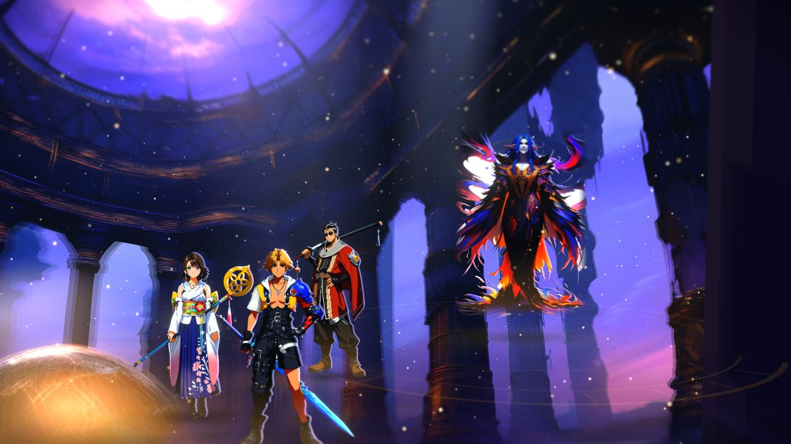
  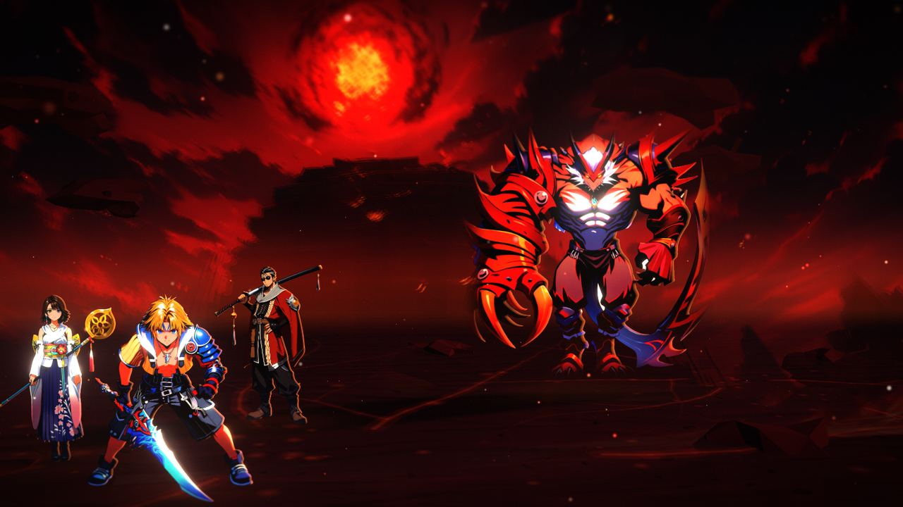

  *Scene tests for Chapter I (Mt. Gagazet), Chapter II (the Zanarkand Dome) and Chapter III (Dream's End).*

- **FFX-2:** Chapter IV, Bahamut in Bevelle Underground. Chapter V, Vegnagun and then Shuyin on the
  Farplane. Battles run on Active Time Battle gauges, with dresspheres, spherechange and chains.

  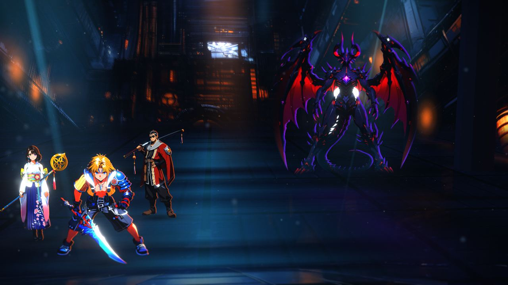
  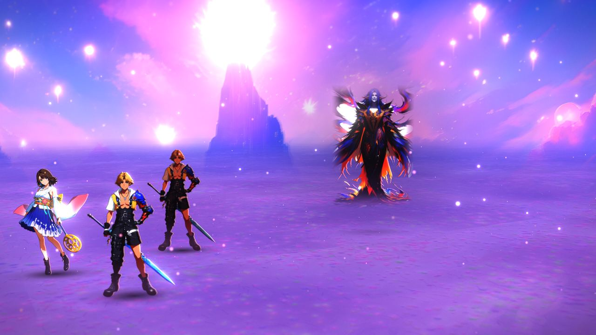

  *Scene tests for Chapter IV (Bevelle Underground) and Chapter V (the Farplane).*

- **Both:** painted 2.5D from the start: a painted backdrop for each of the five scenes, painted title
  and chapter-select pictures, and painted party, aeon and boss figures, about 700 painted files in all.

  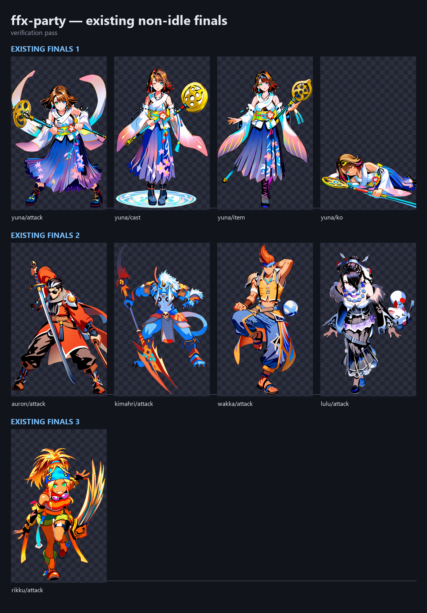
  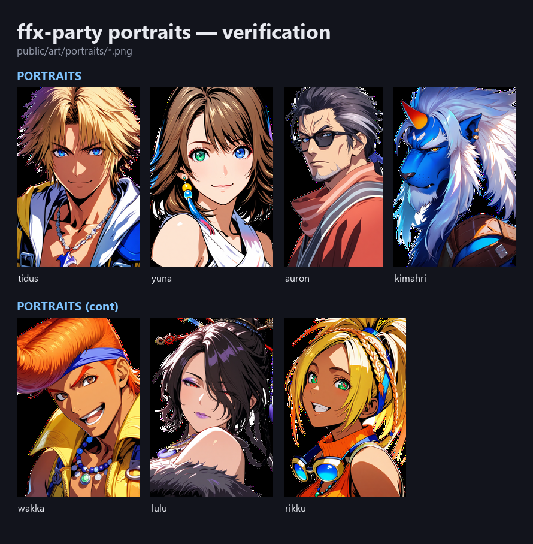

  *The FFX party's painted battle poses (left) and portraits (right).*

- **Both:** Ink & Gold menus, gold for FFX and pink for FFX-2, across the title, chapter select, party
  prep (Sphere Grid, equipment, items and Overdrive modes, or the Garment Grid for FFX-2), dialogue,
  battle and results screens.

  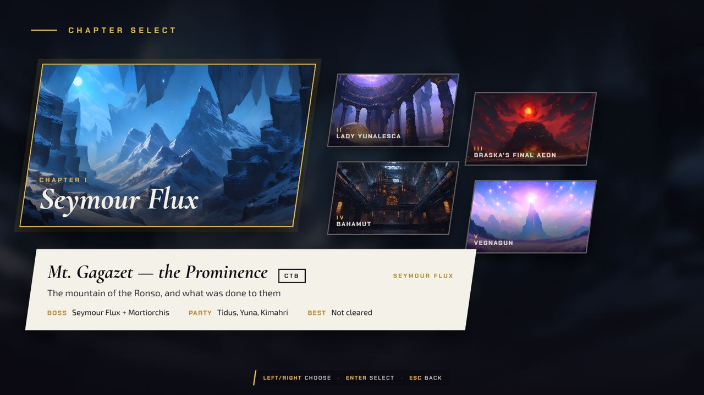
  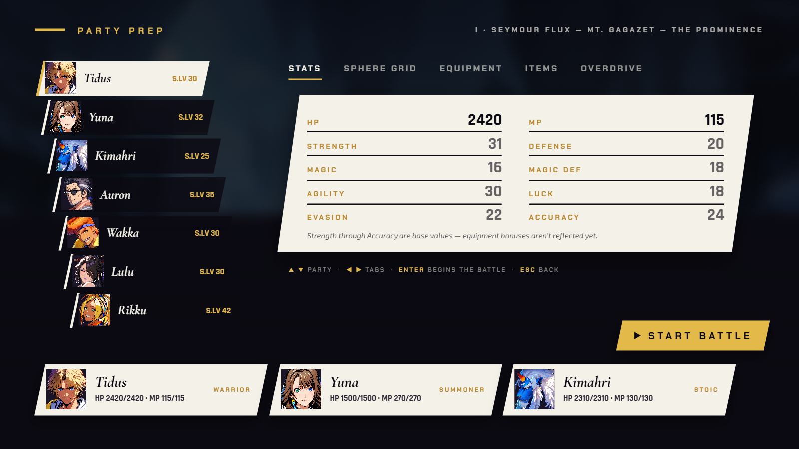
  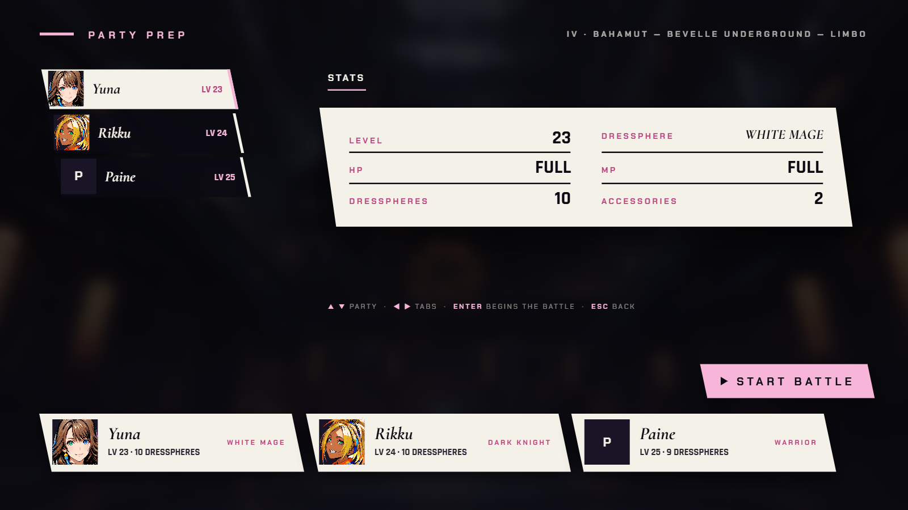
  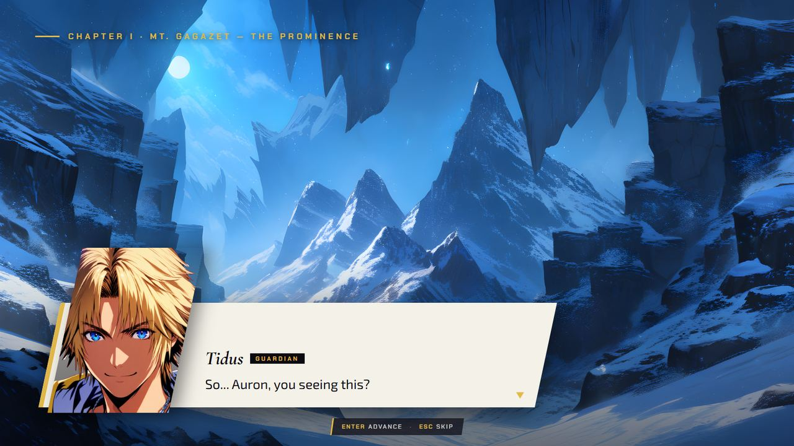
  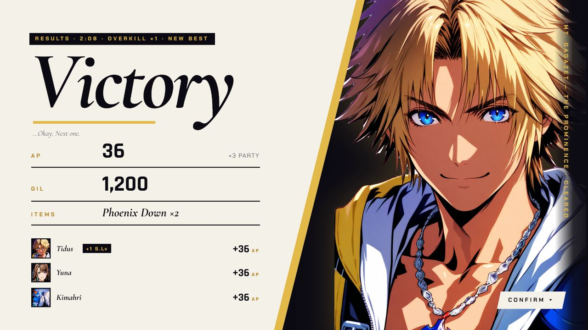
  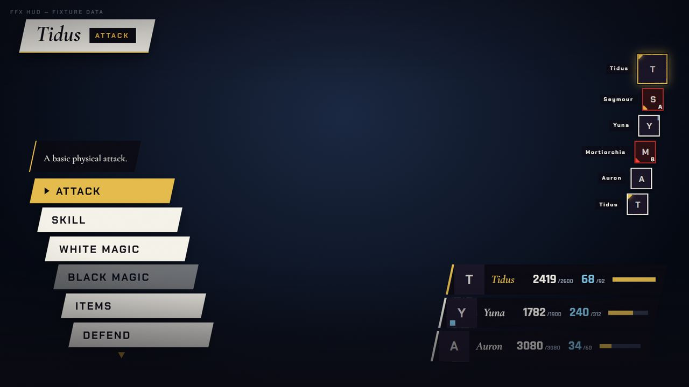
  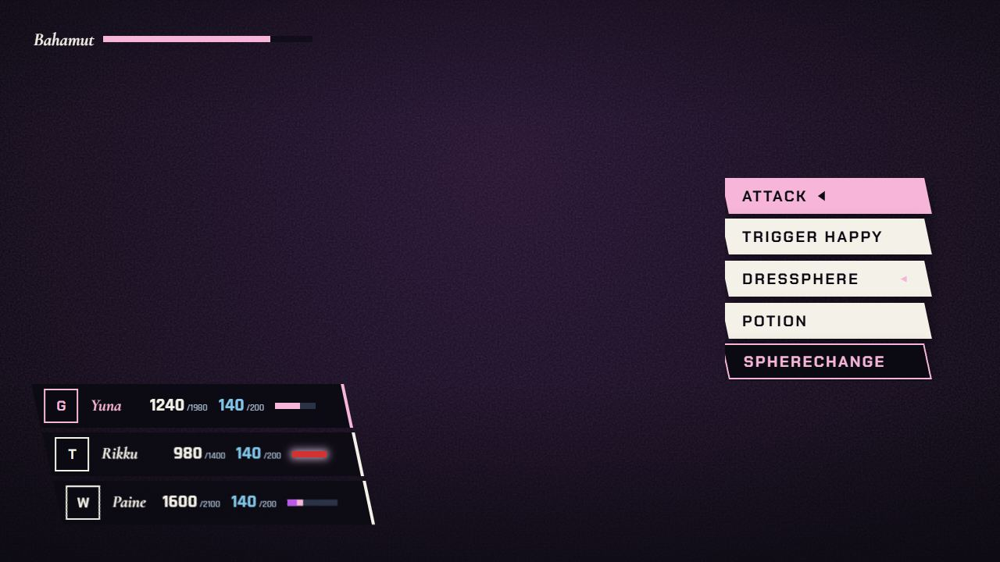

  *Ink & Gold: chapter select, FFX party prep in gold, FFX-2 party prep in pink, a dialogue card and the results screen; the last two are the battle HUD's FFX and FFX-2 command menus on the HUD's own test pages.*

- **Both:** 18 original music tracks and sound effects, synthesised in the browser.

- **FFX:** 343 abilities and 69 items are wired into battle.
