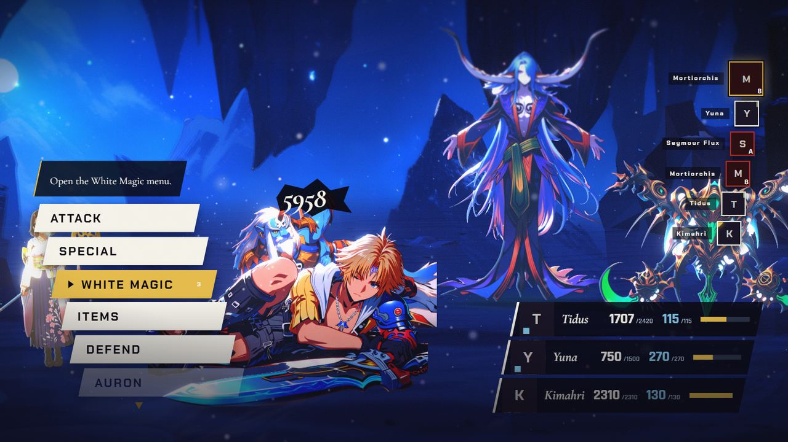
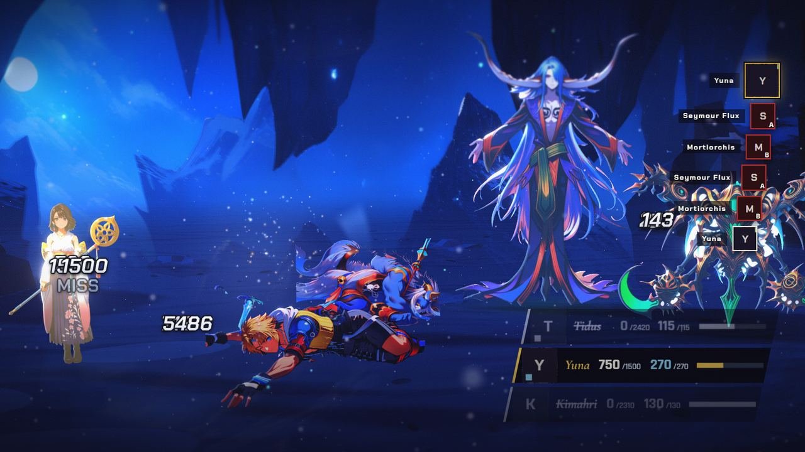
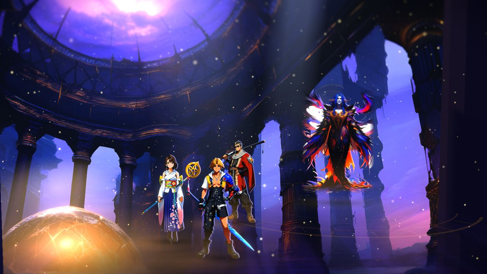
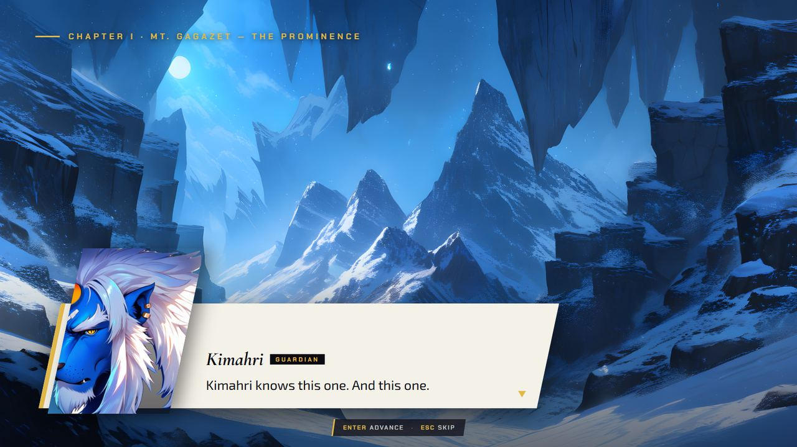
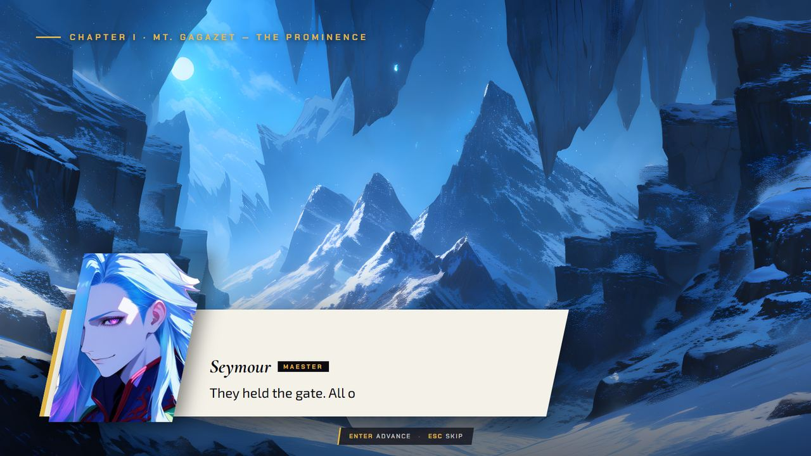

[Back to the changelog](../../CHANGELOG.md)

# 2026-09-16 · Alpha 3

Address: https://baileypillon.github.io/pyrefly-reprise/ (hand-built from the working tree, no main sha)

*Where a caption says left and right, the left picture comes first.*

- **Both:** a hurt or KO'd fighter is no longer drawn oversized. A downed Tidus had lain at about twice
  his standing scale and overlapped the fighters beside him.

  
  

  *A downed Tidus before (left), at about twice his standing size, and after (right).*

- **FFX:** the Zanarkand scene is relit.

  
  

  *The Zanarkand Dome scene test before (left, Alpha 1) and after (right, from the 2026-09-17 checkpoint) the relight.*

- **FFX:** the command menu drops the Defend row, which is not a row in FFX's command window.

  
  

  *Chapter I's command menu with its Defend row (left, Alpha 2) and without it (right).*

- **Both:** the story scripts are wired into the chapters.

  
  

  *Chapter I's pre-battle scene playing its own script: Kimahri (left) and Seymour (right).*
