[Back to the changelog](../../CHANGELOG.md)

# 2026-09-18 · Build of 2026-09-18 (main 0c45fc8a)

Address: https://baileypillon.github.io/pyrefly-reprise/ (main 0c45fc8a)

*Where a caption says left and right, the left picture comes first.*

- **Both:** a pause screen in the Ink & Gold style: a hero painting and command column over the frozen
  battle, chapter notes that check the objectives against the real battle, encounter progress and play
  time, party cards, a music player and a photo mode. Resume picks the fight up on the same turn.

  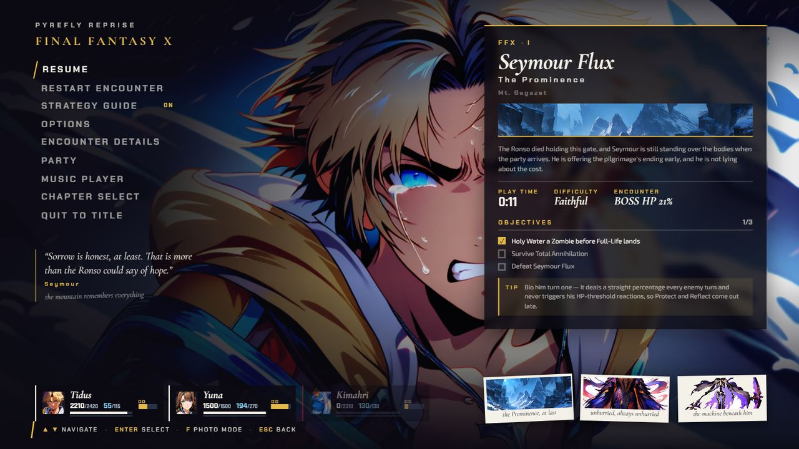
  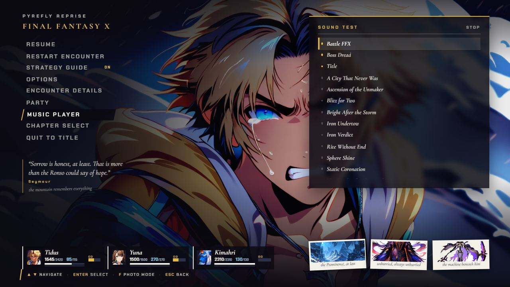
  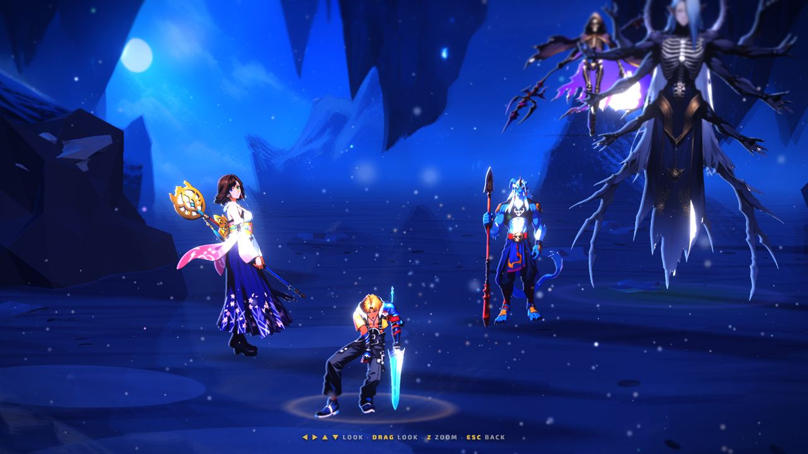

  *The new pause screen over Chapter I, its music player, and photo mode.*

- **Both:** the party-prep screens get a CHAPTER tab with the same notes, and FFX-2 prep gets its first
  tab.

  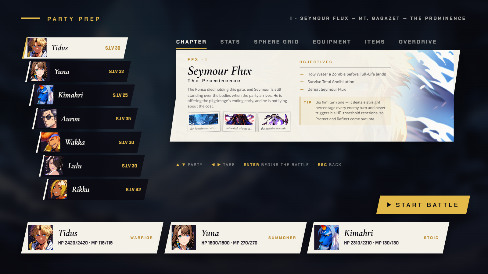

  *The FFX party-prep CHAPTER tab.*

- **Both:** expressive hero close-ups for all five chapters and the cast.

  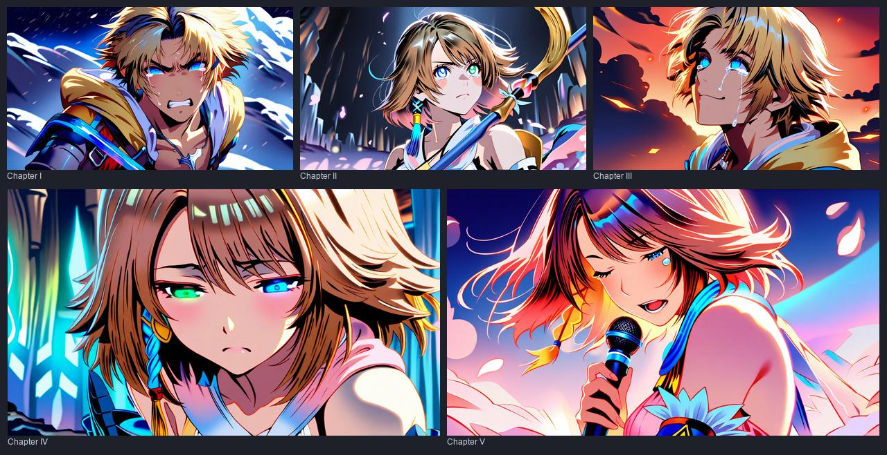

  *The hero close-ups for Chapters I to V.*

- **Both:** a strategy guide panel (G) with per-chapter rules, on by default in both battle HUDs.

  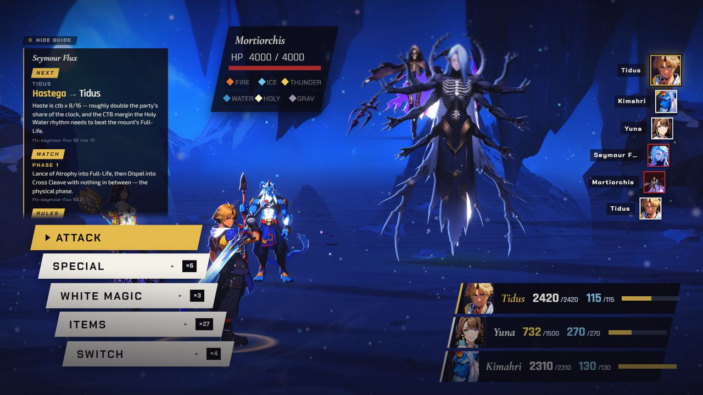
  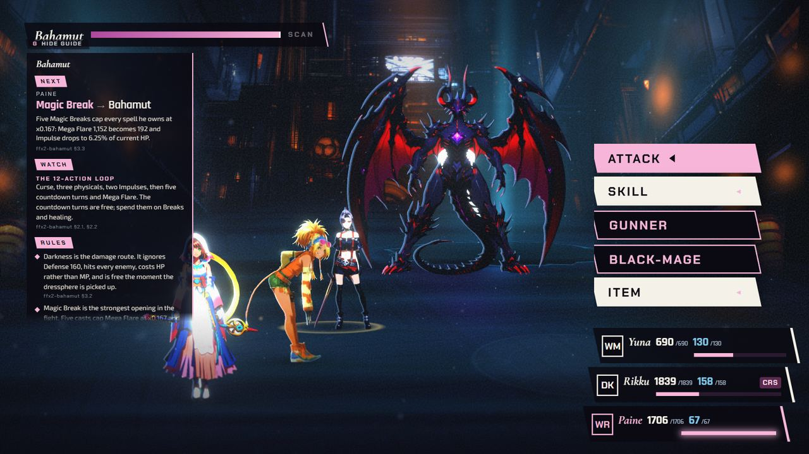

  *The strategy guide panel in Chapter I (left) and Chapter IV (right).*

- **Both:** fighters face their opponents and come alive: idle drift, a hit flash and a fall on KO,
  plus a quick turn in 3D.

  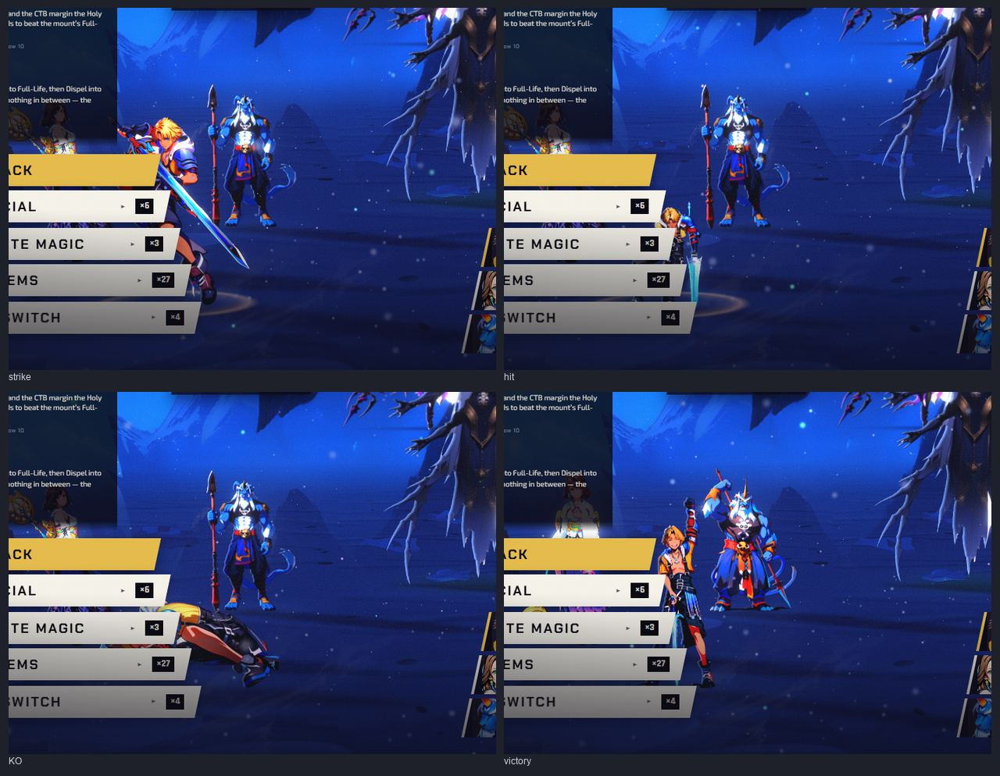

  *Tidus striking, hit, KO'd and in his victory hop (Chapter I).*

- **Both:** battle moments: a swirl into battle with the party sliding on and a slow reveal of the
  boss's name, a punch-in on the acting fighter, a hard cut to the target on impact, and a charge
  warning with a zoom and a heartbeat vignette. FFX Overdrives get a banner with letterbox.

  
  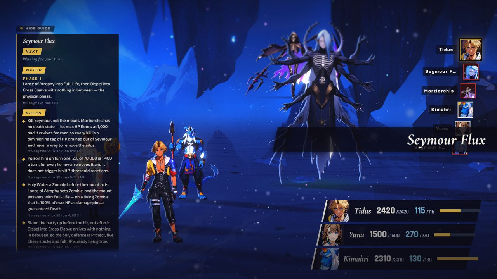
  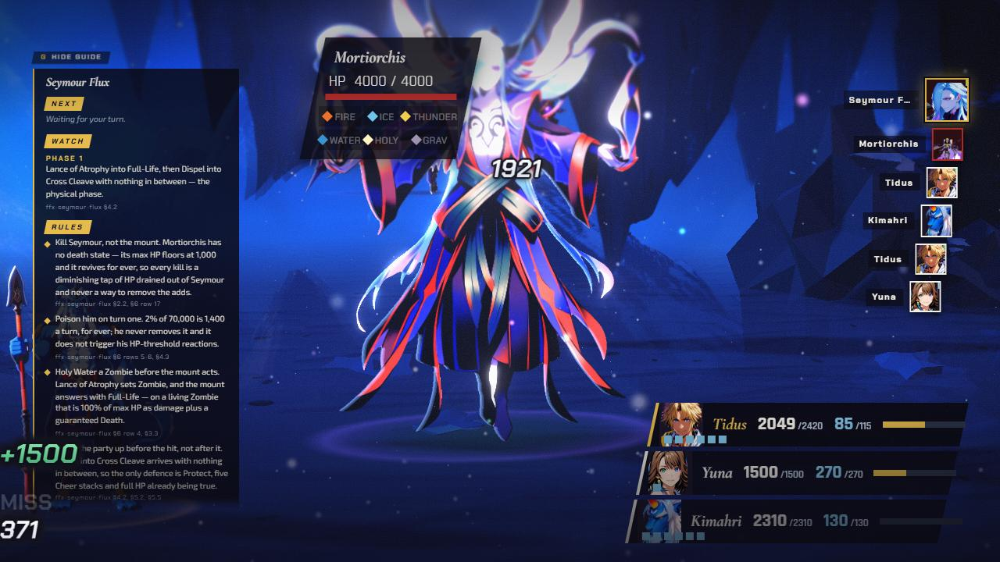
  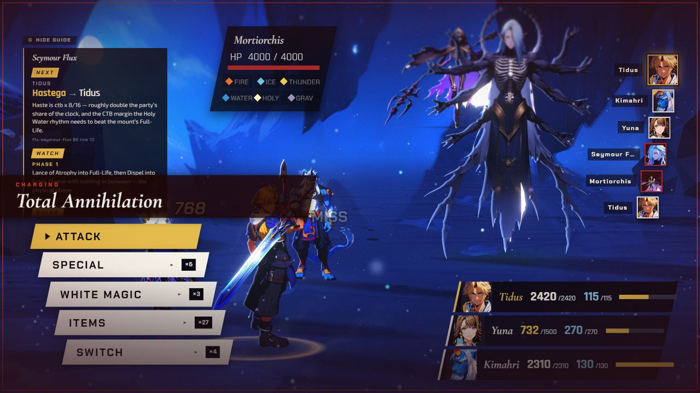
  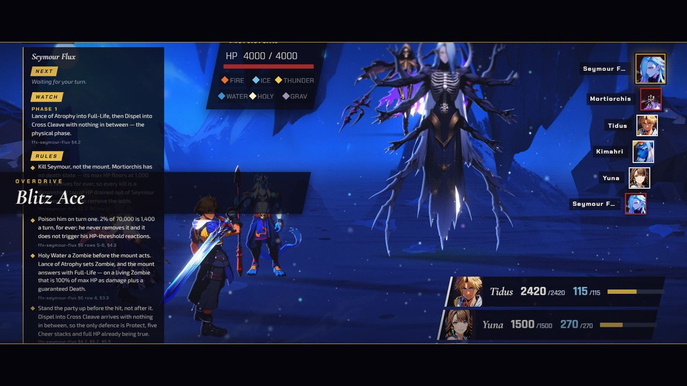

  *The swirl from the title into battle, the boss's name sliding in, the cut to the target on impact, a charge warning for Total Annihilation, and an Overdrive banner with letterbox.*

- **FFX-2:** Chapter IV's pause pictures no longer show an all-black tile.

  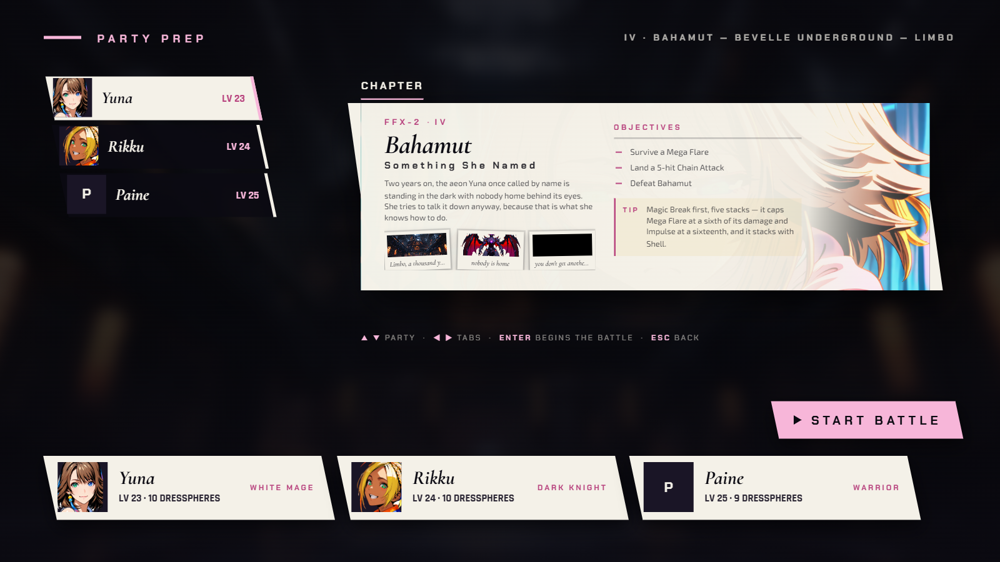
  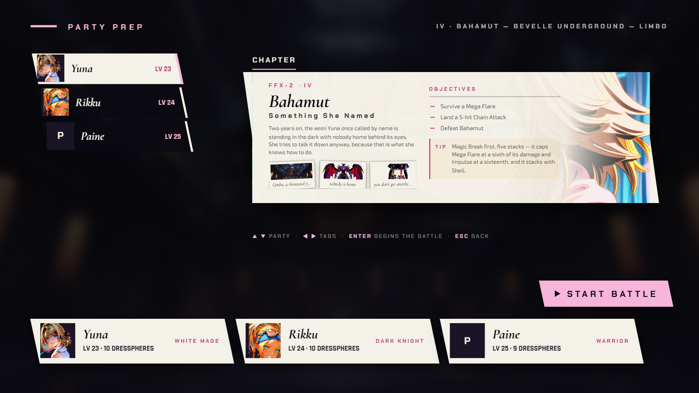

  *Party prep's CHAPTER tab for Chapter IV: before (left) the third picture is black; after (right) it is painted.*
