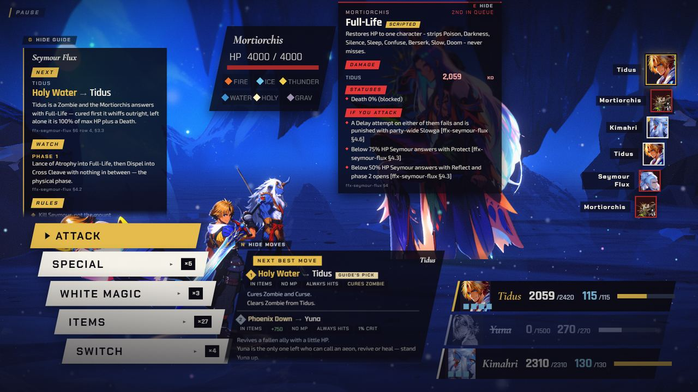
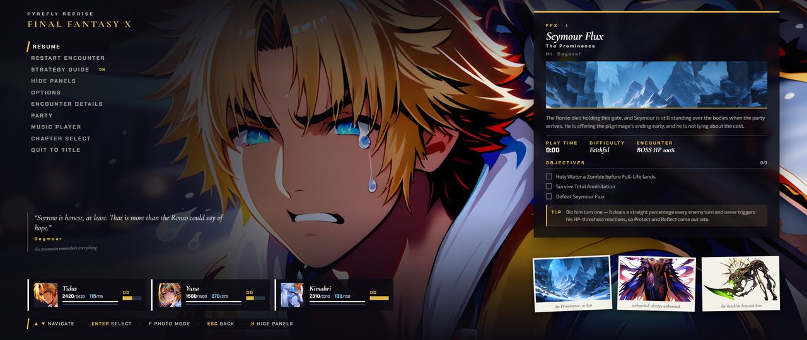
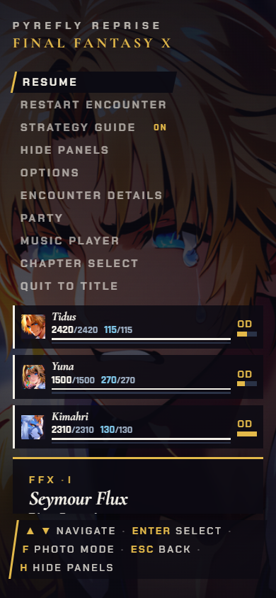
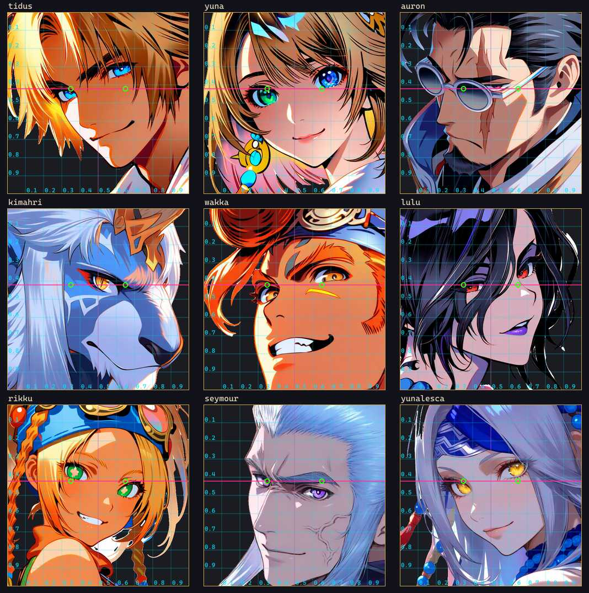
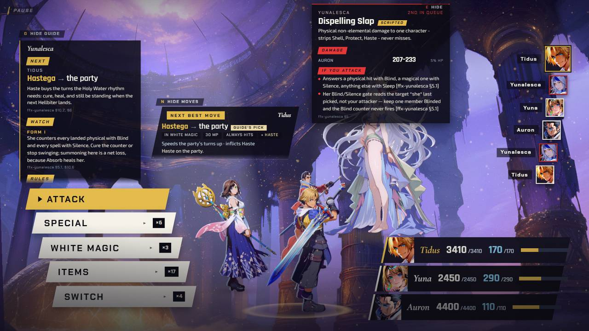
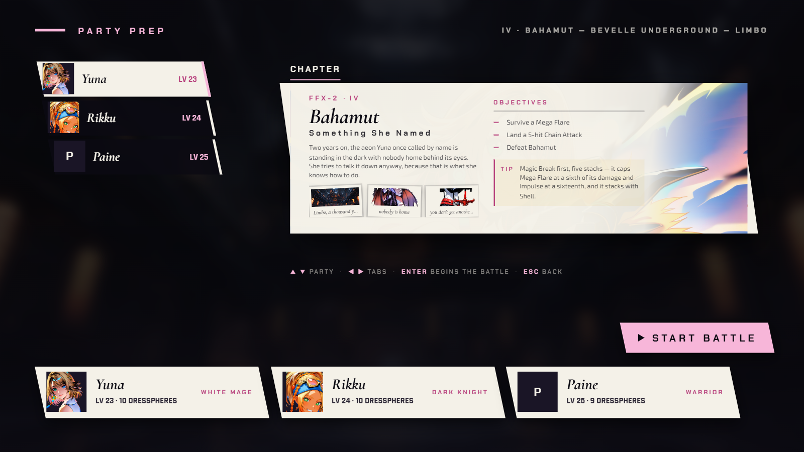
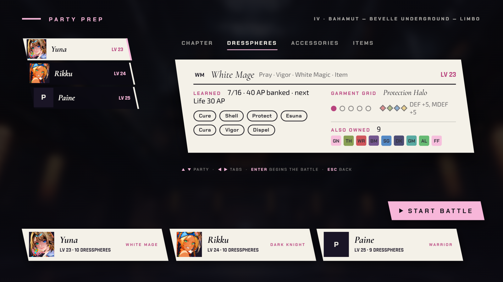

[Back to the changelog](../../CHANGELOG.md)

# 2026-09-19 · Build of 2026-09-19 (main 5a82e712)

Address: https://baileypillon.github.io/pyrefly-reprise/ (main 5a82e712)

*Where a caption says left and right, the left picture comes first.*

- **Both:** a new score. 21 pieces are re-recorded with sampled orchestral instruments and played from
  files, with the old in-browser synth as a fallback, and loops no longer click when they wrap. The
  title, chapter select and battle pieces play now; the scene, boss, victory and ending pieces reach
  the fights in Build A.

- **Both:** all 134 sound effects are rebuilt from struck glass, bells, harp, choir and breath, and sit
  in the music's hall.

- **Both:** the move advisor only recommends what the acting character can press, says which menu a
  move lives in ("Poison Fang, in Items"), hands the turn to whoever owns the move, and prices a revive
  from the board. Research citations leave the card, and its tag becomes "Guide's pick".

  

  *The advisor's card in Chapter I: it names the menu a move lives in ("In Items") and offers a Phoenix Down for the fallen Yuna.*

- **Both:** the pause screen's painting is full-bleed at any window shape, with 2x plates and type that
  scales, and its phone layout is fixed.

  
  

  *The pause painting in a 2560x1080 window (left) and the pause on a phone (right).*

- **Both:** portrait crops are read from each painting, so heads are no longer cut through the chin
  (Auron's was).

  

  *Face crops read off each painting, with the measured eye line drawn on.*

- **FFX:** the HUD stays clean. The old "Choose a Rage" slab no longer lingers on the field, turn-list
  names fit, the advisor card finds free space instead of covering Tidus and Kimahri, and one tap of
  Esc backs out of a menu without also opening the pause.

  

  *Chapter II: the advisor card sits in free space instead of covering the party.*

- **FFX-2:** party prep gets Dresspheres (with the Garment Grid), Accessories and Items tabs, party rows
  show painted faces (Paine gets one at last), and the intent slab and advisor stop standing on the
  girls.

  
  
  

  *FFX-2 party prep before (first, a single CHAPTER tab) and after (second, with a Dresspheres tab), and Chapter IV's party rows with painted faces (third).*

- **Both:** the strategy guide says "the party" when a move hits the party.

  *(no screenshot from the time)*
