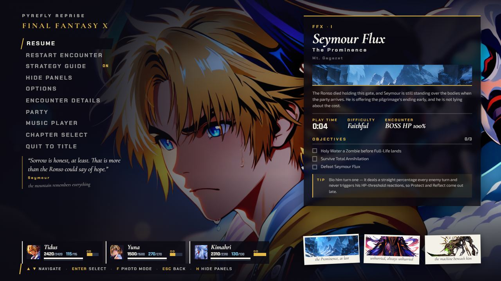
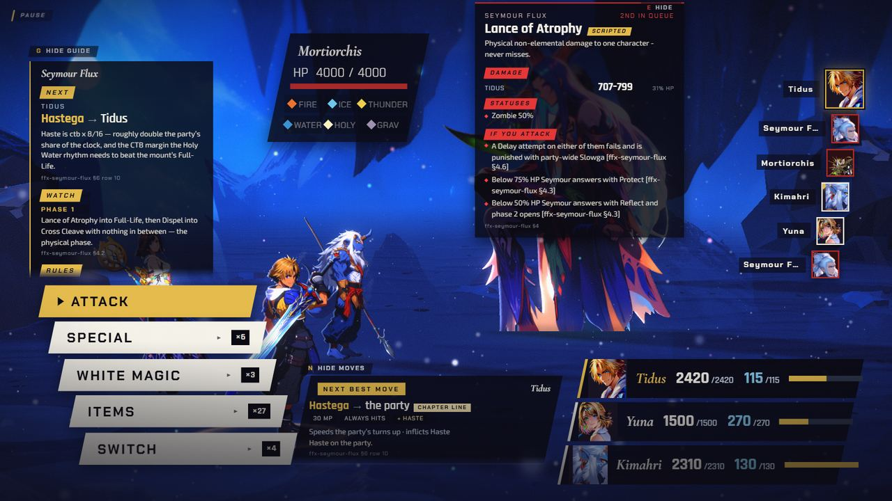
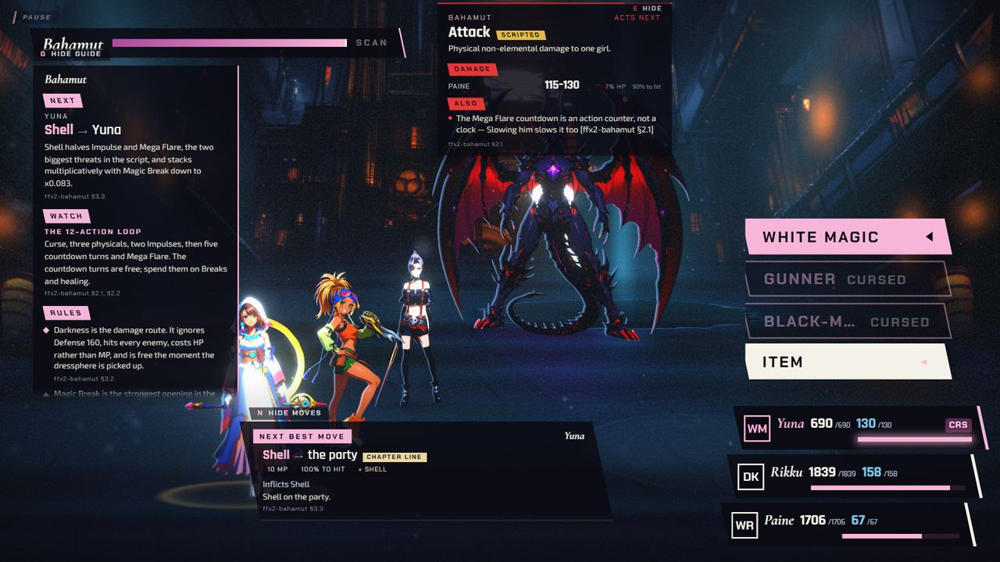
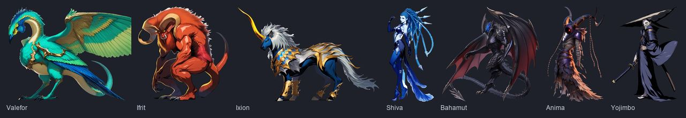
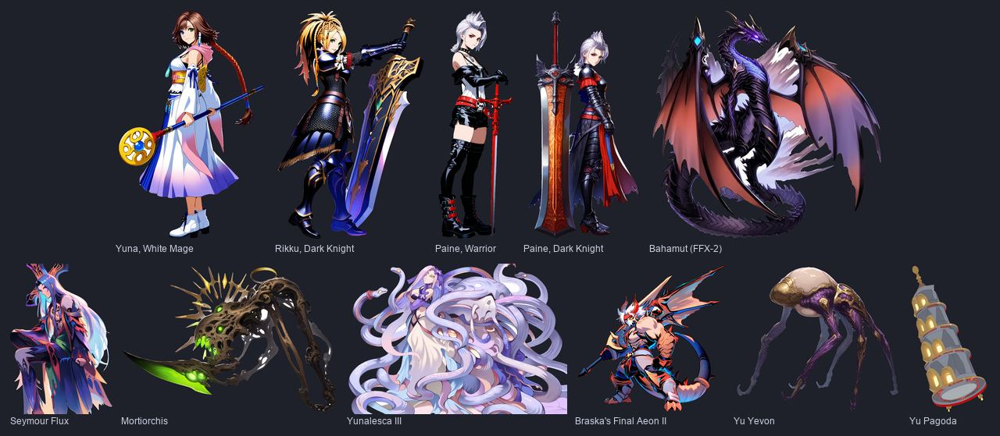
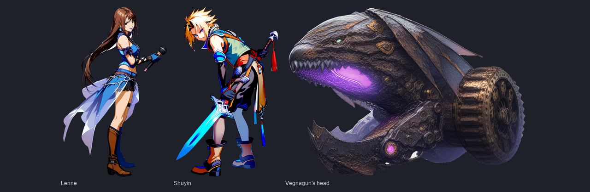

[Back to the changelog](../../CHANGELOG.md)

# 2026-09-18 · Build of 2026-09-18 (main 822ae16a)

Address: https://baileypillon.github.io/pyrefly-reprise/ (main 822ae16a)

*Where a caption says left and right, the left picture comes first.*

- **Both:** Esc and P open the pause screen for real, even at the battle command menu. Esc still backs
  out of a submenu or targeting first, and H hides the pause panels to show the scene behind.

  
  

  *Esc opens the pause over the battle (left); H hides its panels to show the painting (right).*

- **Both:** N opens a move advisor for the character whose turn it is, showing what each option is
  likely to do.

  

  *The move advisor card for Tidus in Chapter I (bottom centre), with the enemy-intent panel open above it.*

- **Both:** E opens an enemy-intent panel: the boss's next move, its damage and status ranges, and the
  counters that matter.

  

  *The enemy-intent panel in Chapter IV: Bahamut's next move and its damage.*

- **Both:** new painted art for the aeons, the FFX-2 cast and the remaining bosses.

  
  

  *New paintings in this build: the aeons (first), then the FFX-2 cast and the bosses (second).*

- **FFX-2:** Chapter V's Lenne, Shuyin and Vegnagun head now show their shipped paintings.

  

  *Lenne, Shuyin and Vegnagun's head as shipped.*

- **Behind the scenes:** art is served through a generated manifest, so a missing variant no longer
  comes back as the page in place of an image and the network panel stays clean.
