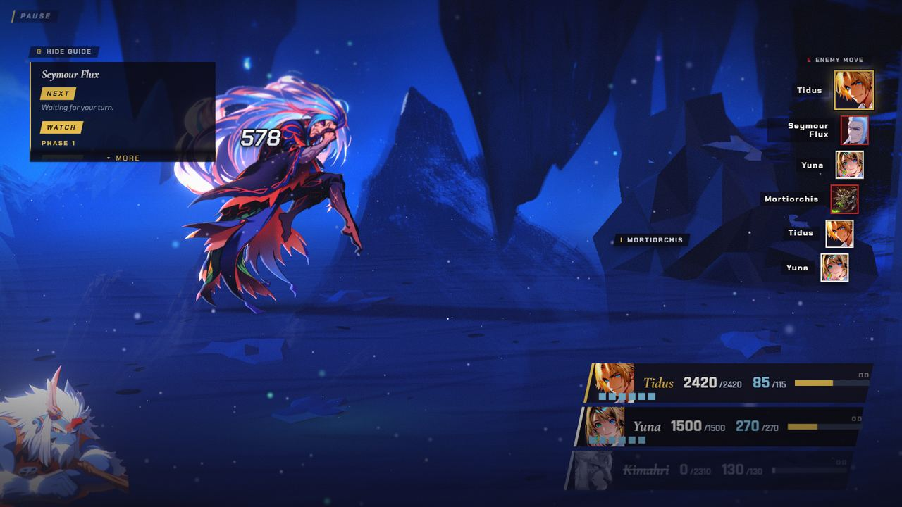
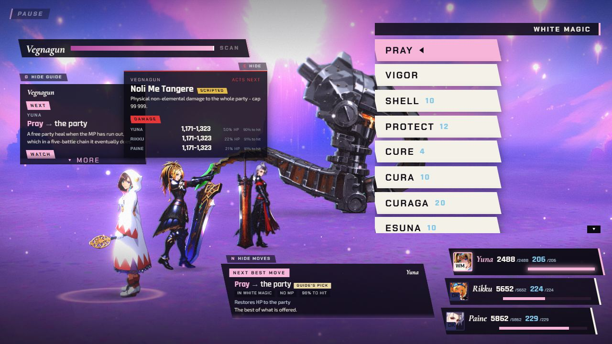
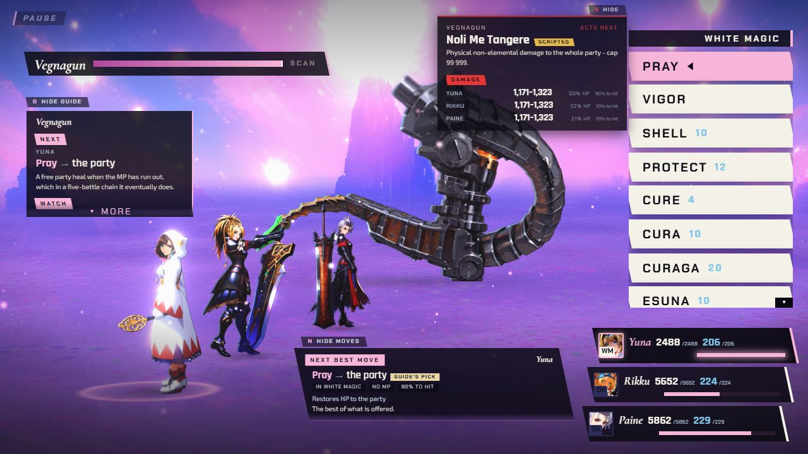
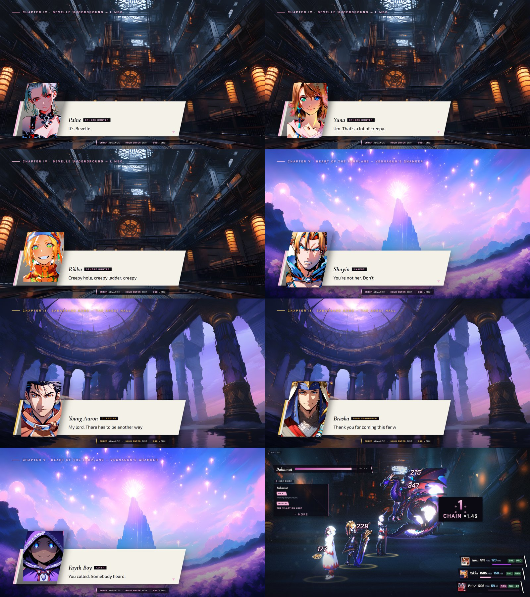

[Back to the changelog](../../CHANGELOG.md)

# 2026-09-21 · Build A.2

Address: https://baileypillon.github.io/pyrefly-reprise/ (build fd0ae96d, cut from a side branch)

*Where a caption says left and right, the left picture comes first.*

- **FFX:** Threaten and Sleep now play out. An enemy hit by either used to vanish from the turn queue,
  so the status never ran out, and a Threatened boss now stops countering.

- **FFX:** Yu Yevon: only your own actions draw his Curaga, and Gravija reaches everyone on the field,
  Pagodas included, so wearing him down works.

- **Both:** a party row no longer shows a downed ally alive for two seconds, and numbers no longer run
  ahead of their bars. The rows now move with each blow.

  

  *Chapter I: Kimahri's row is already greyed out at 0/2310 as the next damage number lands.*

- **FFX:** results credit AP and S.Lv to whoever took a turn, and duplicate enemies keep their A and B
  letters when one dies.

  *(no screenshot from the time)*

- **Both:** wording fixes: single-target Haste is no longer called party-wide, the intent panel drops
  its empty Damage section for status moves, the pause says "Battle 2 of 4" instead of "Link", and the
  strategy guide always ends on a whole line.

  *(no screenshot from the time)*

- **Both:** saved volume and mute apply at start-up, not only after opening the pause.

- **FFX-2:** the Attack submenu no longer lists two ATTACK rows, the command list's scroll arrow sits
  on the list, and a Berserked girl with no Attack command no longer locks the battle on an empty menu.

  
  

  *The FFX-2 command list: before (left) its scroll arrow floats off the list; after (right) it sits on the list.*

- **FFX:** new dialogue portraits for young Auron, the Fayth boy, Braska and Yu Yevon.

  

  *The eight new portraits as face crops with the eye line drawn on: Paine, Shuyin, Yuna and Rikku (FFX-2) and young Auron (top row), the Fayth boy, Braska and Yu Yevon (bottom row, first three); Tidus and Yuna at the end are reference crops.*

- **FFX-2:** new dialogue portraits for Paine, Shuyin, Yuna and Rikku. Their names no longer print as
  "Yuna X2" and "Rikku X2".

  

  *Dialogue cards with the new portraits: Paine, Yuna, Rikku and Shuyin (FFX-2), and young Auron, Braska and the Fayth boy (FFX).*

- **Behind the scenes:** every deploy now ships a list of every file with its hash, so the live site
  can be checked byte for byte against the build.
