[Back to the changelog](../../CHANGELOG.md)

# 2026-09-19 · Build A

Address: https://baileypillon.github.io/pyrefly-reprise/ (main 7191674d)

*Where a caption says left and right, the left picture comes first.*

- **Both:** fights end properly. Chapter IV no longer freezes after Bahamut's last blow, and the closing
  scenes of Chapters I, II, III and V now play their dialogue. They had never shown it.

  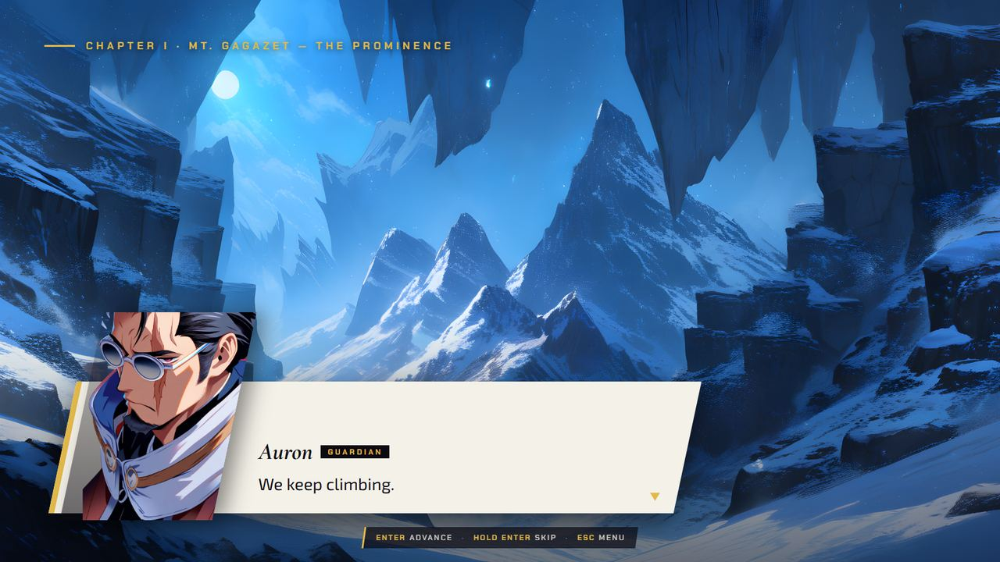

  *Chapter I's closing scene, with Auron's line on screen.*

- **Both:** every boss fight plays its own theme (the first fight of each chapter had played the
  generic battle music), and the scene, victory, ending and pause music is wired in. The battle theme
  is re-rendered, as the shipped file came from an older score.

- **Both:** a BATTLE START card introduces each fight with the boss's painting, the chapter name and
  your party's faces. Enter now moves story scenes along, and holding it skips them.

  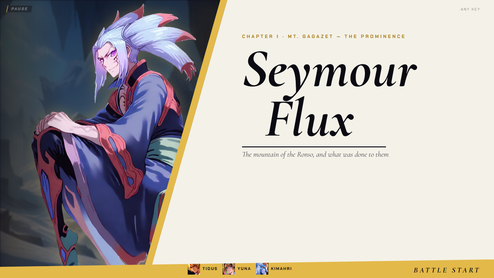
  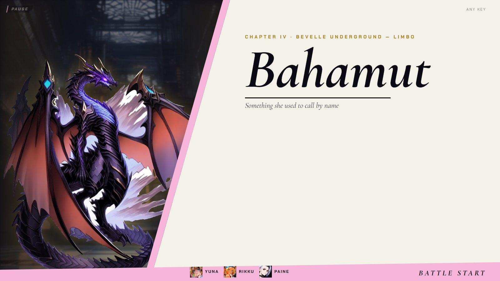

  *The BATTLE START cards for Chapter I (left) and Chapter IV (right).*

- **FFX:** Wakka's Slots and Attack Reels deal real damage, Lulu's Fury casts every Black Magic spell
  she knows, and Steal, Mix, Death Fury and Zanmato now do what the menu says. Before, they spent a
  turn, often a full Overdrive gauge, on nothing.

- **FFX:** Talk works. It can zero Jecht's gauge, and against Seymour Flux it gives Kimahri +10 Strength
  and Yuna +10 Magic Defense, once each.

- **FFX:** Yu Yevon can be beaten (Doom through the Candle of Life, or Reflect), and Seymour Flux
  follows its Flare, wait, Flare loop.

- **FFX-2:** Charon now costs the girl who casts it. It had been a free, repeatable nuke.

- **FFX-2:** one Change command opens the dresspheres by name, a spherechange plays its flourish (a
  white column, petals, a ring from her feet, the outfit named), the chain counter shows a big numeral,
  and party prep gains a STATS tab.

  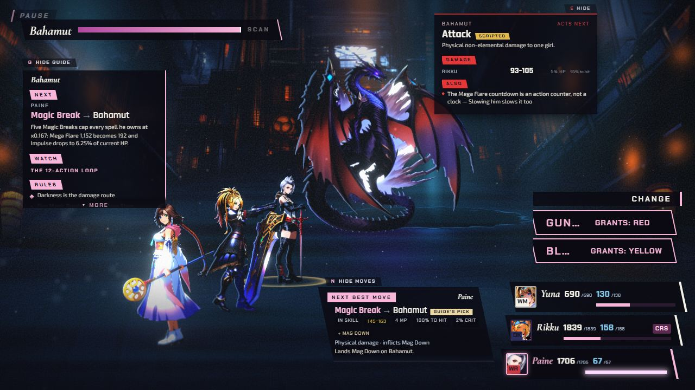
  
  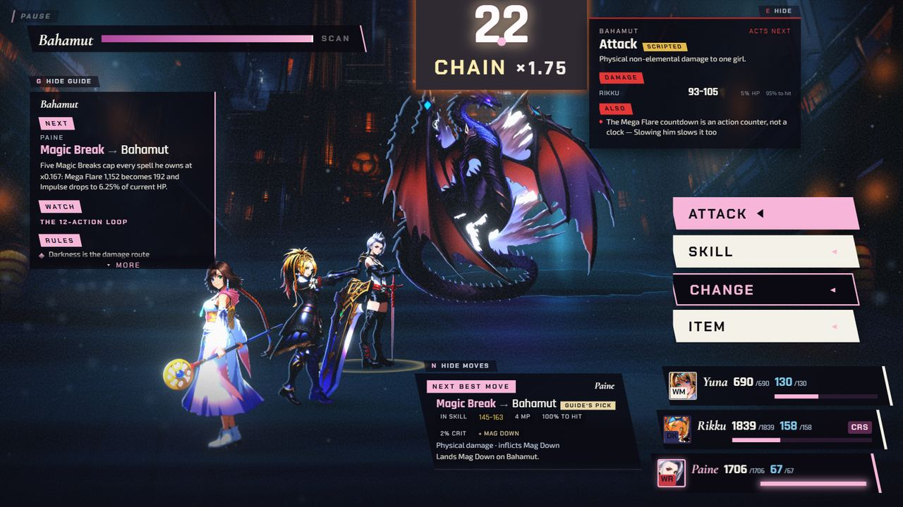
  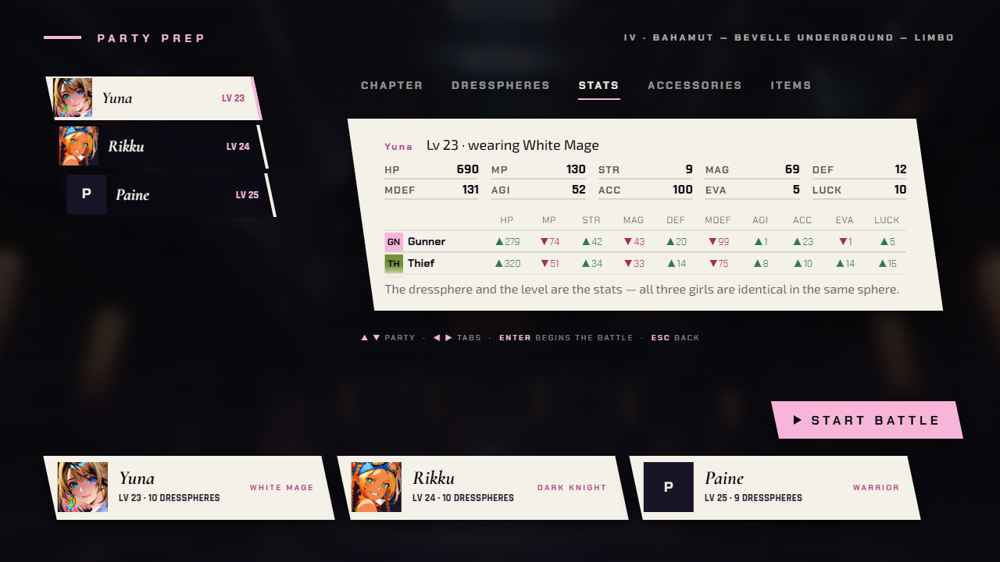

  *Chapter IV: the Change command naming each dressphere, Paine's spherechange flourish (a pale column and a ring at her feet) and the chain counter at 22, then the new STATS tab in party prep.*

- **Both:** the advisor (N) always answers for a fallen ally, even a Zombie.

  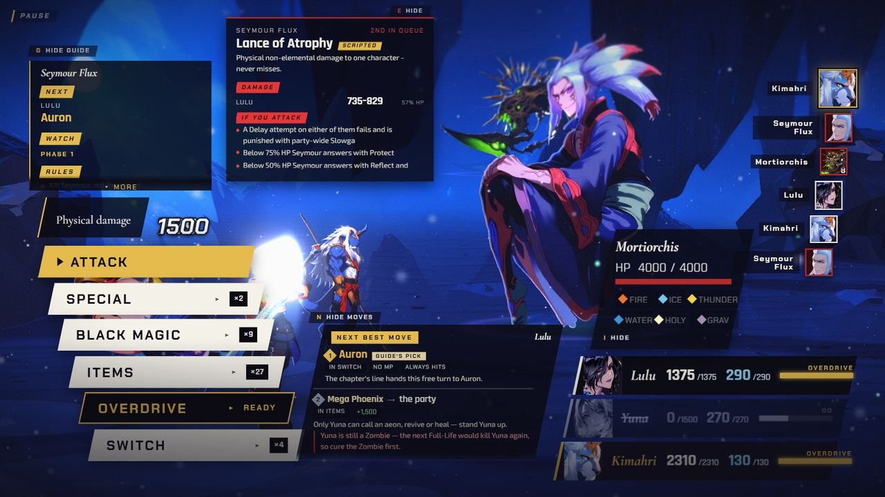
  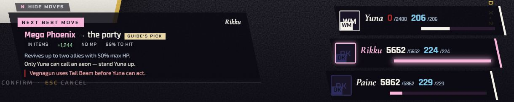

  *The advisor answering with an ally down: Chapter I with Yuna a downed Zombie (left), and Chapter V with Yuna down (right, cropped to the card and the party rows).*

- **Both:** target selection is clear: a pointing hand in FFX, a six-petal flower in FFX-2, a bracket
  sized to the figure, an ink name plate with its letter, an ALL label for party-wide moves, and a
  quiet dim on everyone else. No enemy hides behind another any more (the Yu Pagodas had been hidden).

  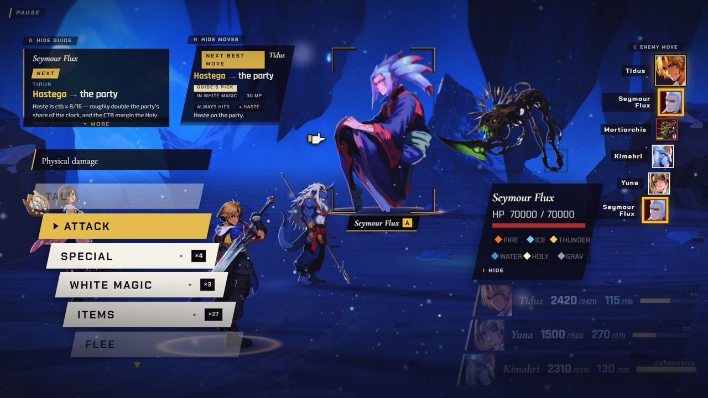
  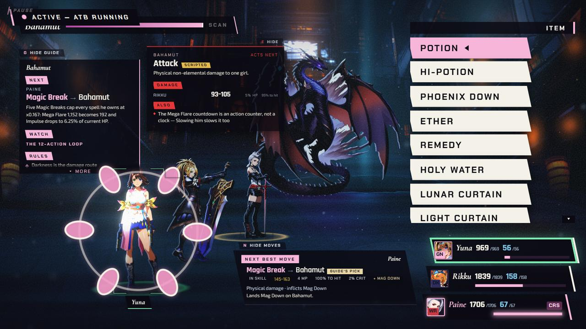
  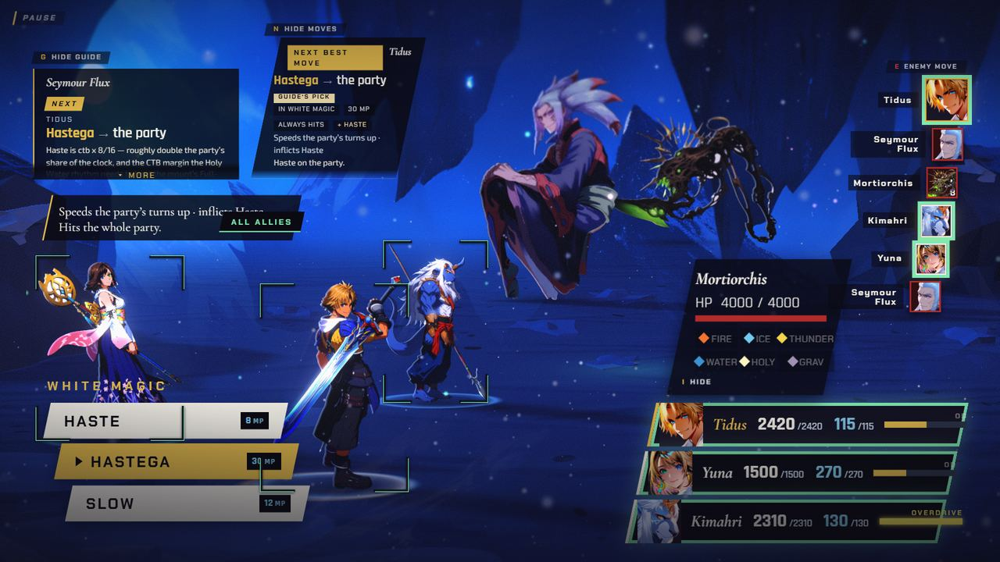
  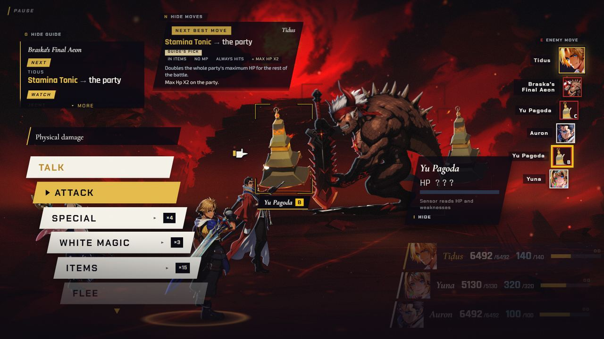

  *Targeting: the pointing hand on Seymour Flux (FFX), the six-petal flower on Yuna (FFX-2), the ALL label on a party-wide Hastega, and a Yu Pagoda picked out with its HP shown as ??? (Chapter III).*

- **FFX:** a party Switch no longer leaves the incoming member off the field, the Sensor card folds to
  a chip after seven seconds, and unscanned enemies show ??? with no HP bar.

  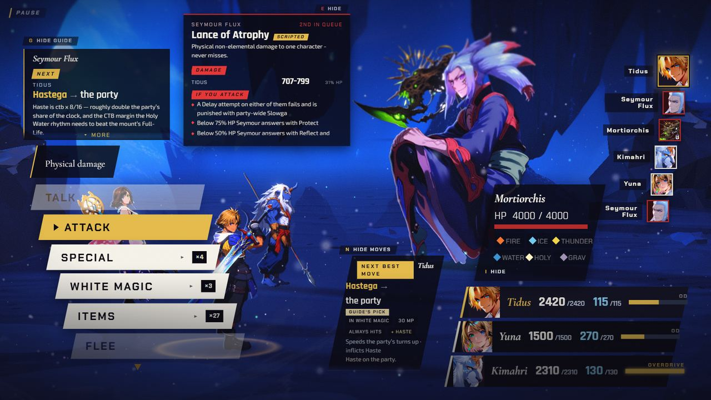
  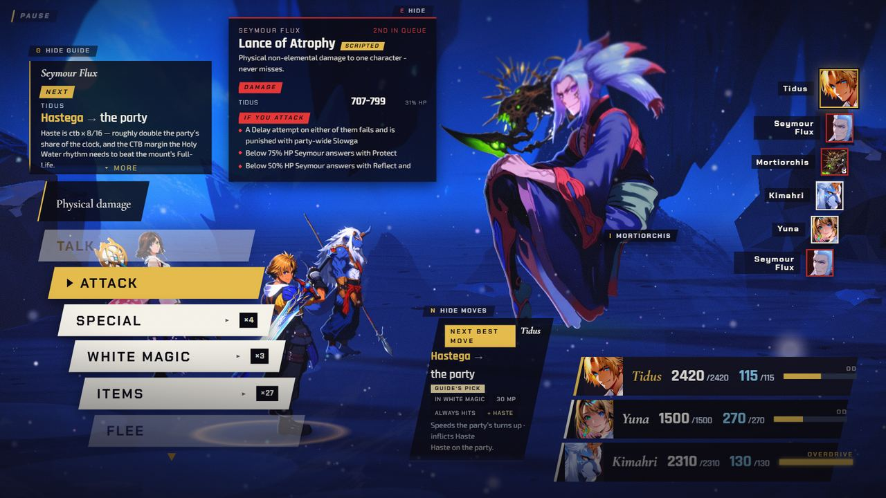

  *Chapter I: Sensor's card on Mortiorchis (left) and the chip it folds to (right).*

- **Both:** the pause screen copes with 4:3 and small windows. The quote no longer prints across the
  menu rows.

  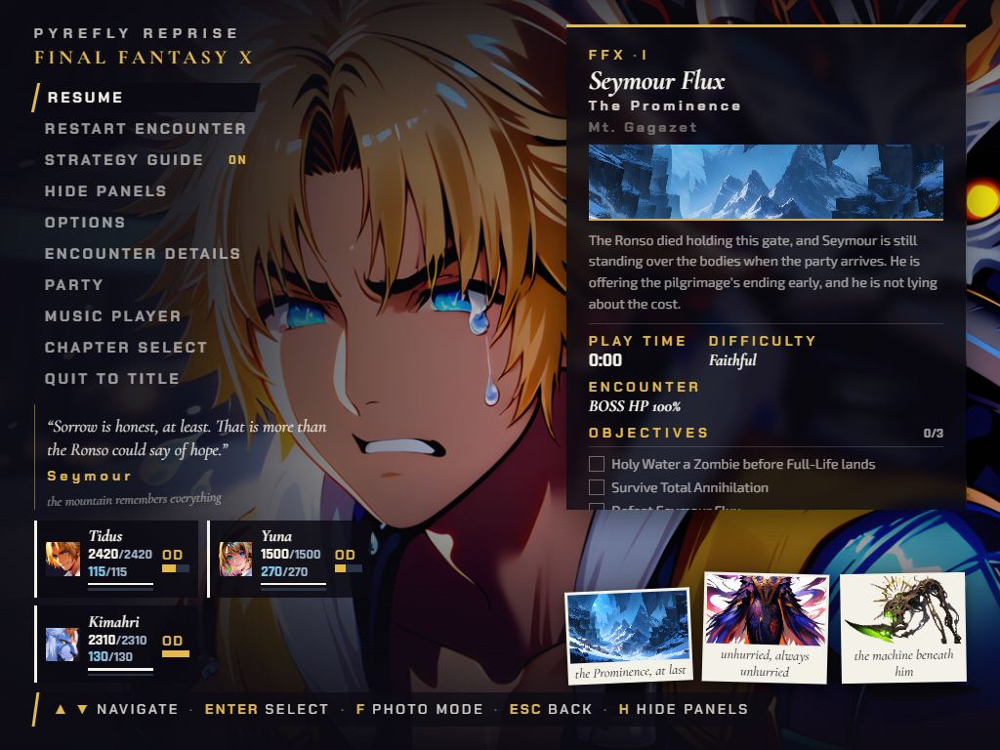
  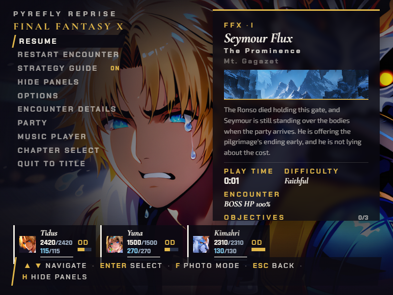

  *The pause screen at 1024x768 (left) and 800x600 (right).*
