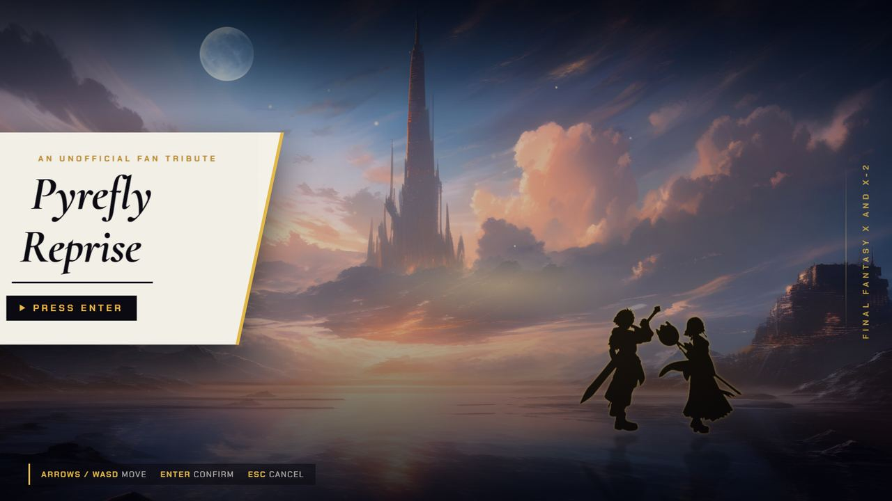
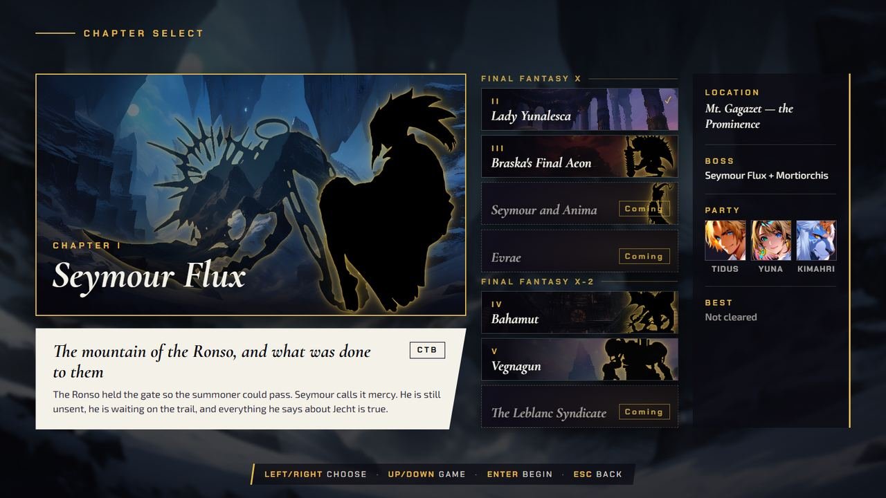
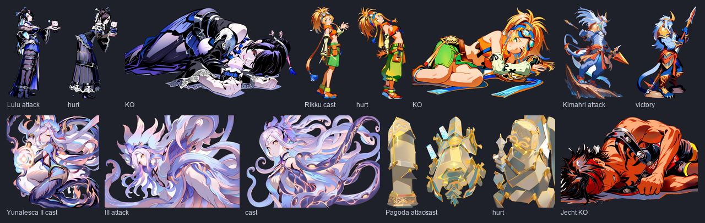
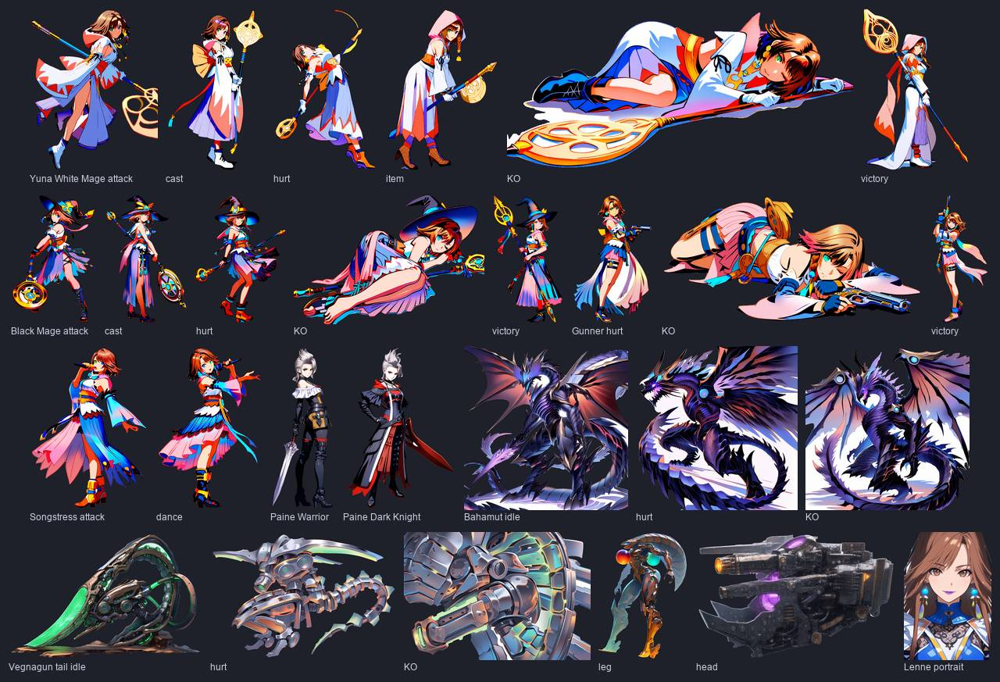

[Back to the changelog](../../CHANGELOG.md)

# 2026-09-21 · Build B.1

Address: https://baileypillon.github.io/pyrefly-reprise/ (main 8f482378)

*Where a caption says left and right, the left picture comes first.*

- **Both:** the title screen moves. Painted layers drift with the pointer, stick and time, the two
  figures on the shore are ink silhouettes, and pyreflies rise through the frame, all on the approved
  key art.

  
  

  *The title screen before (left) and in this build (right).*

- **Both:** chapter select is a board of eight cards in two game groups. An uncleared chapter shows its
  boss as an ink silhouette, a cleared one shows the painting, and three new chapters wait as locked
  "Coming" cards. Both screens are now full-bleed.

  
  
  

  *The chapter select before (left), the new board of eight cards (middle), and the board after clearing chapters (right).*

- **FFX:** new poses for Lulu, Rikku, Kimahri, Yunalesca's second and third forms, the Yu Pagoda and
  Jecht, part of 42 approved poses installed in this build.

  

  *The FFX poses installed in this build: Lulu, Rikku, Kimahri, Yunalesca's later forms, the Yu Pagoda and Jecht.*

- **FFX-2:** the rest of the 42: four Yuna dresspheres, both Paine dresspheres, the possessed Bahamut
  and three Vegnagun parts, plus Lenne's portrait.

  

  *The FFX-2 poses installed in this build, with Lenne's portrait last.*

- **Behind the scenes:** new release rules: ship when a build is better than the live one, with the
  deep review following on the live build.
