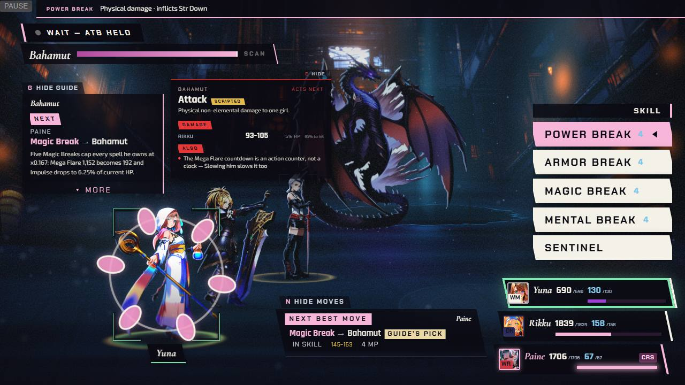
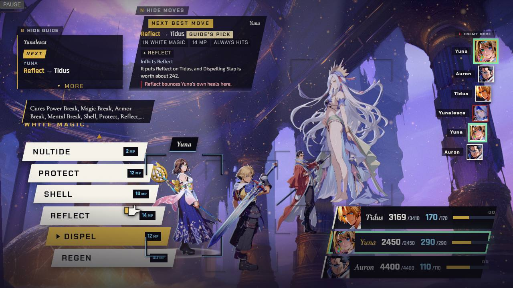
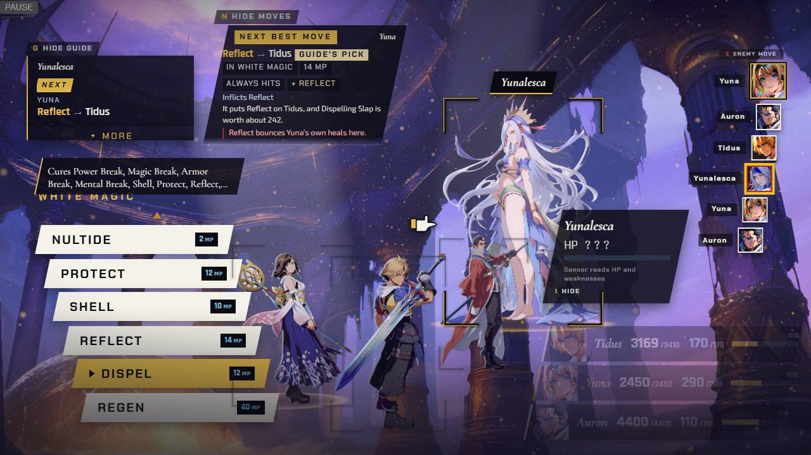

[Back to the changelog](../../CHANGELOG.md)

# 2026-09-24 · Hotfix 12.2

Address: https://baileypillon.github.io/pyrefly-reprise/ (build dc2669ac, cut from a side branch)

*Where a caption says left and right, the left picture comes first.*

- **Both:** the target cursor opens on the sensible side: an enemy for attacks, debuffs and Dispel, a party
  member for cures, and a KO'd one first for revives. It used to open on the leftmost figure, often a
  party member.

  
  
  
  

  *Power Break in Chapter IV and Dispel in Chapter II: the cursor opens on Yuna before (left of each pair) and on the enemy after (right).*

- **FFX-2:** a faithful Wait mode (the clock runs while a girl's top list is open) is built but switched
  off; add ?wait=split to the address to try it.
