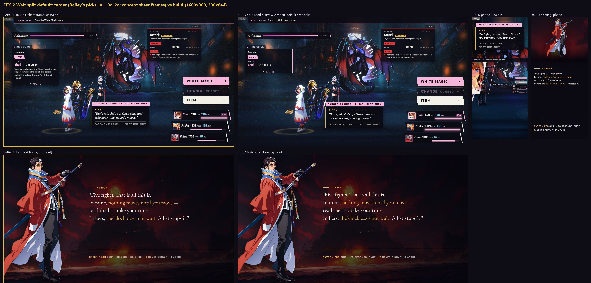

[Back to the changelog](../../CHANGELOG.md)

# 2026-09-24 · Hotfix 12.3

Address: https://baileypillon.github.io/pyrefly-reprise/ (build e3b8c2a3, cut from a side branch)

- **FFX-2:** Wait mode now works as in the original: the clock keeps running while a girl's top-level
  command list is open and holds only once you open a submenu or the target cursor. A skill you chose now
  plays out while the next girl is choosing, instead of everything waiting for all three.

- **FFX-2:** the coaching lines for Wait mode (the first-turn bubble, the briefing line and the badge) are
  reworded to match.

  

  *The new Wait coaching text in Chapter IV: target (left) and build (right), desktop and phone, plus the briefing line.*

- **Both:** leaving a battle before its fight has started (Escape during the opening) no longer throws an
  error or leaves an invisible fight running.
