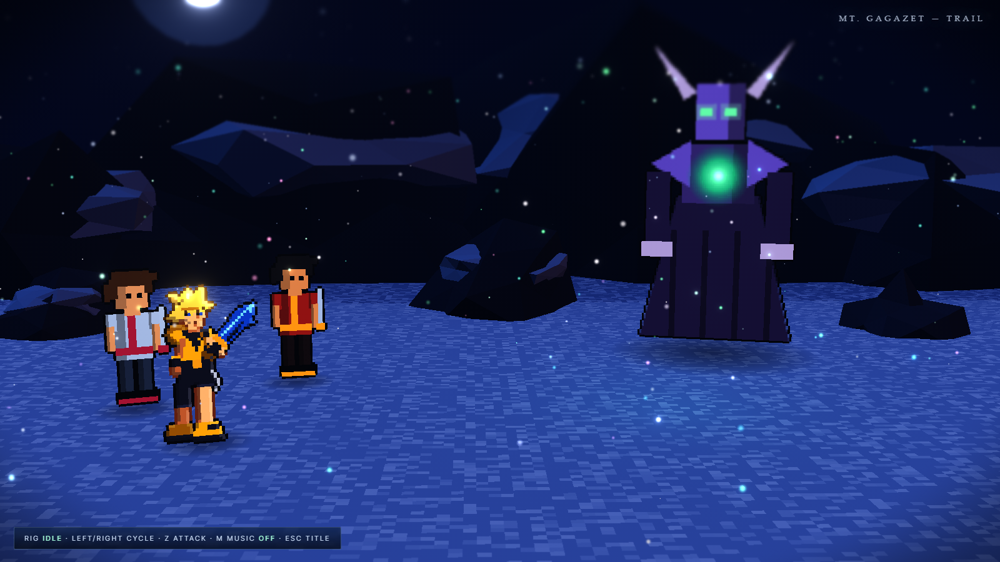
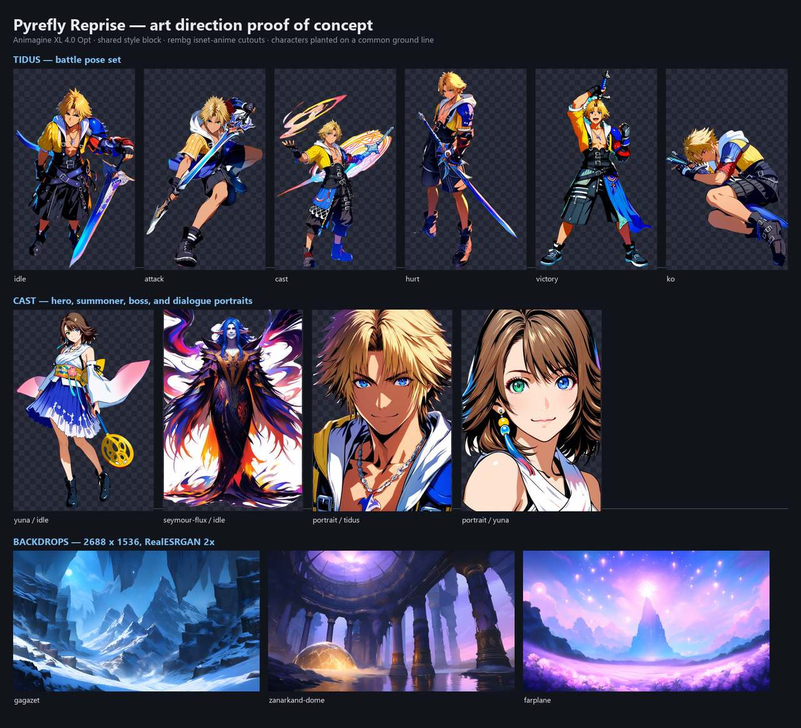

[Back to the changelog](../../CHANGELOG.md)

# 2026-09-15 · Project start

*Where a caption says left and right, the left picture comes first.*

- **Both:** the project begins as an unofficial, non-commercial fan tribute under the working title
  Pyrefly Reprise (it became Echoes of Spira on 2026-10-04): five of the most memorable boss
  encounters from Final Fantasy X and X-2, with faithful combat. All code, art, music and writing are
  original.

- **FFX:** three FFX encounters are planned: Seymour Flux and Mortiorchis on the Mt. Gagazet trail,
  Lady Yunalesca in the Zanarkand Dome, and Braska's Final Aeon through the possessed aeons to Yu Yevon
  at Dream's End.

- **FFX-2:** two FFX-2 encounters are planned: Bahamut in Bevelle Underground, and Vegnagun and then
  Shuyin on the Farplane.

- **Both:** built for the web with TypeScript, Vite and Three.js, with menus in HTML and CSS and music
  made in the browser. It was chosen over Unreal so a friend can open a link and play. FFX fights get a
  Conditional Turn-Based engine and FFX-2 fights an Active Time Battle engine.

- **Both:** the look was planned as pixel-art sprites in small 3D scenes. After the first screenshots
  read as a retro prototype, it changed the same day to painted 2.5D, with painted backdrops and
  painted character poses standing in lit 3D scenes.

  
  
  

  *The first prototype with pixel-art sprites (left), the art-direction proof of concept (middle) and the painted 2.5D battle concept (right).*
