[Back to the changelog](../../CHANGELOG.md)

# 2026-09-21 · Release 08

Address: https://baileypillon.github.io/pyrefly-reprise/ (main 1b339718)

*Where a caption says left and right, the left picture comes first.*

- **Both:** the pause screen is remade as a character screen with one painted close-up per member: a
  tab strip (each member, CHAPTER, GUIDE, OPTIONS, CONTROLS, MUSIC), thin meters over the painting, and
  the chapter's goal in one big line. RESTART ENCOUNTER now works from a chapter entered normally.

  
  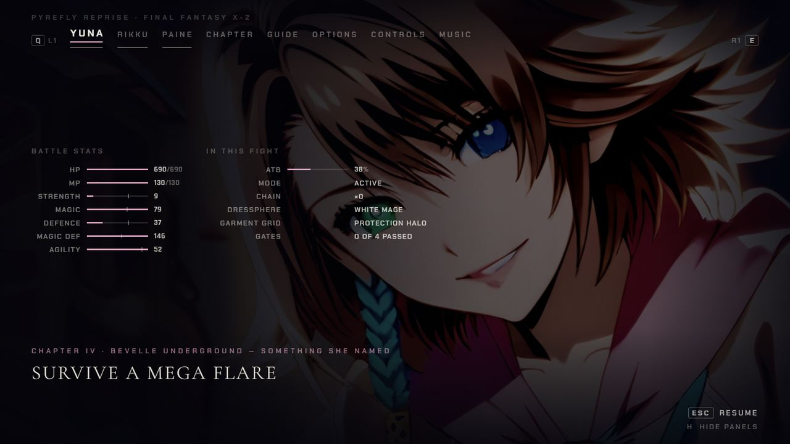

  *The remade pause: Tidus's page in Chapter I (left) and Yuna's page in Chapter IV (right).*

- **Both:** Auron's briefing is on: 20 skippable seconds in Auron's voice on a first launch, then a
  one-line hint the first time each mechanic matters. Replay it from the pause menu or the title, or
  switch the hints off.

  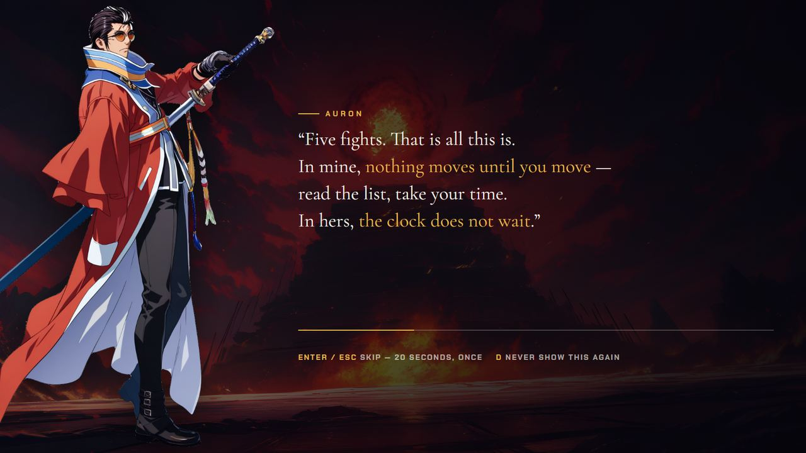
  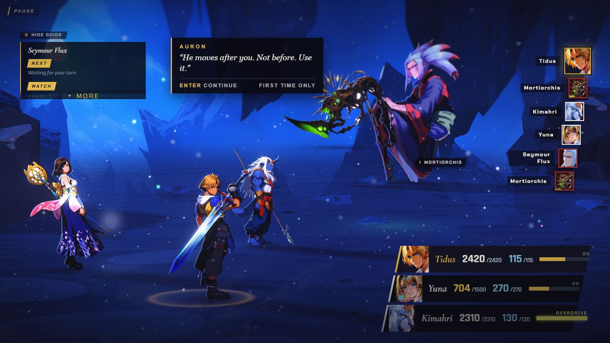

  *Auron's briefing (left) and a one-line hint the first time a mechanic matters (right).*

- **FFX-2:** Active ATB: the clock keeps running while a command menu is open, and a command always
  goes to the girl whose menu was open.

  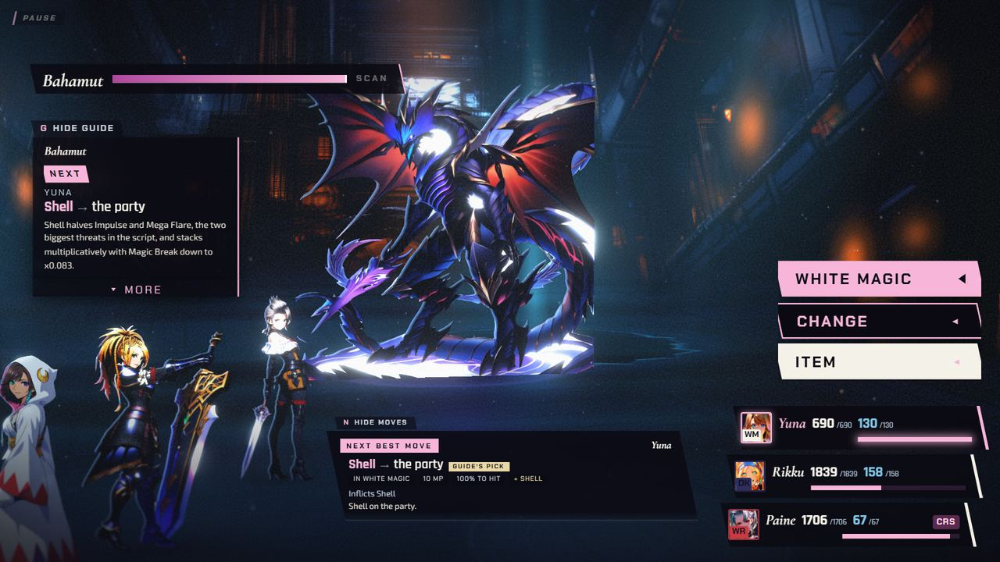
  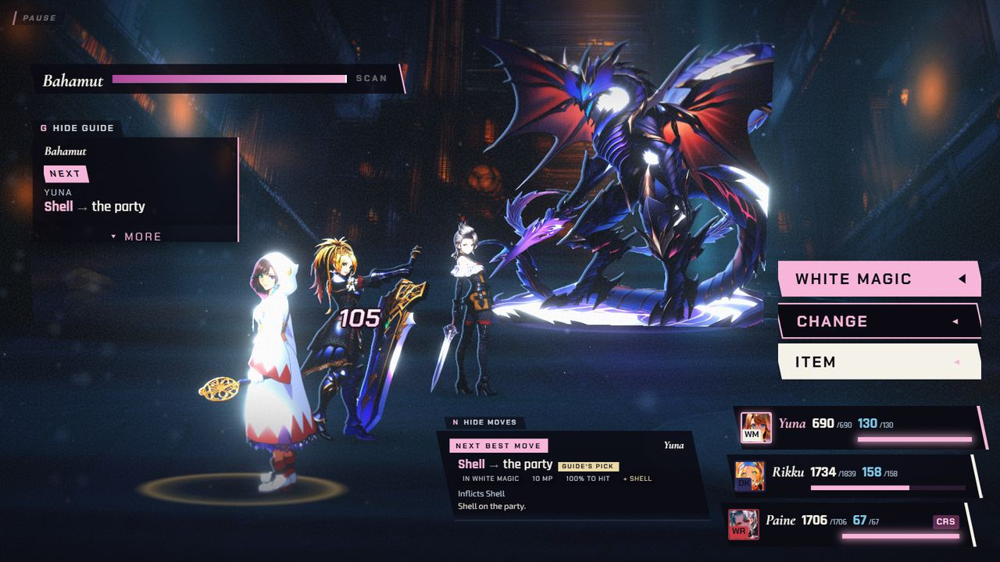

  *Chapter IV with a command menu left open: at the start (left) and two seconds later (right), when the clock has kept running and a hit has landed on Rikku (1839 down to 1734 HP).*

- **Both:** the move advisor plans one enemy turn ahead and never recommends a move that does nothing.
  A test player that always follows its top pick now wins Chapter III in 39 of 40 runs, where it won none
  before.

  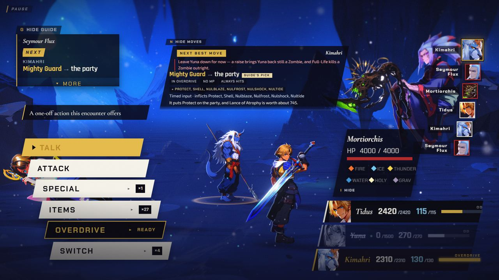

  *Chapter I: the advisor's card plans ahead and says to leave a Zombie Yuna down for now.*

- **Both:** the dialogue card fits every portrait to its slot, Jecht's face is fixed, and the card fits
  a phone.

  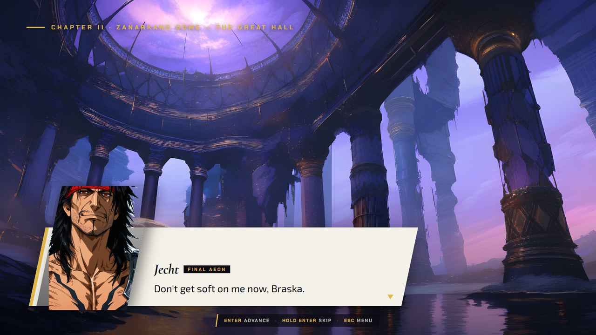
  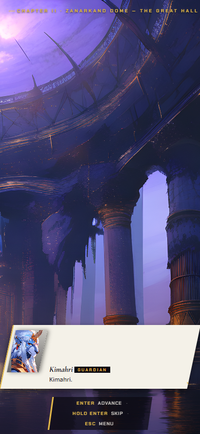

  *The dialogue card with Jecht's repaired face (left) and on a phone (right).*

- **FFX-2:** party prep, results and chapter select show real faces for Rikku and Paine instead of
  letters.

  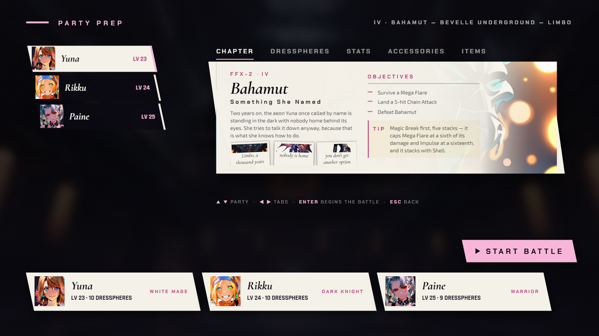

  *FFX-2 party prep with real faces for Rikku and Paine.*

- **FFX:** Nulblaze, Nulfrost, Nulshock and Nultide cover the whole party.

- **FFX-2:** Eject now really removes its target from the fight. Before, it only showed a badge.

  *(no screenshot from the time)*

- **Both:** the 31 repainted poses from Build B.1 go back to the earlier paintings, which look better
  at full size. The 11 poses that filled gaps stay.

  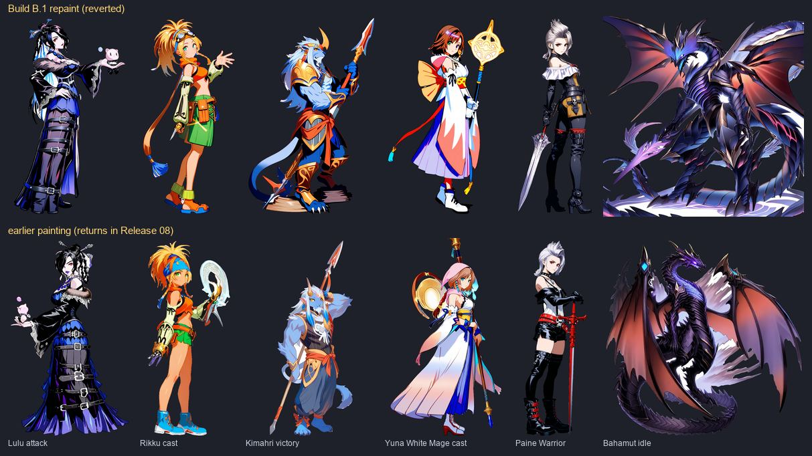

  *Build B.1's repaints (top row) and the earlier paintings that come back in this release (bottom row).*

- **Both:** title and chapter select text is at least 14 px (12 on a phone), and on touch you can tap
  anywhere on the title plate to start.

  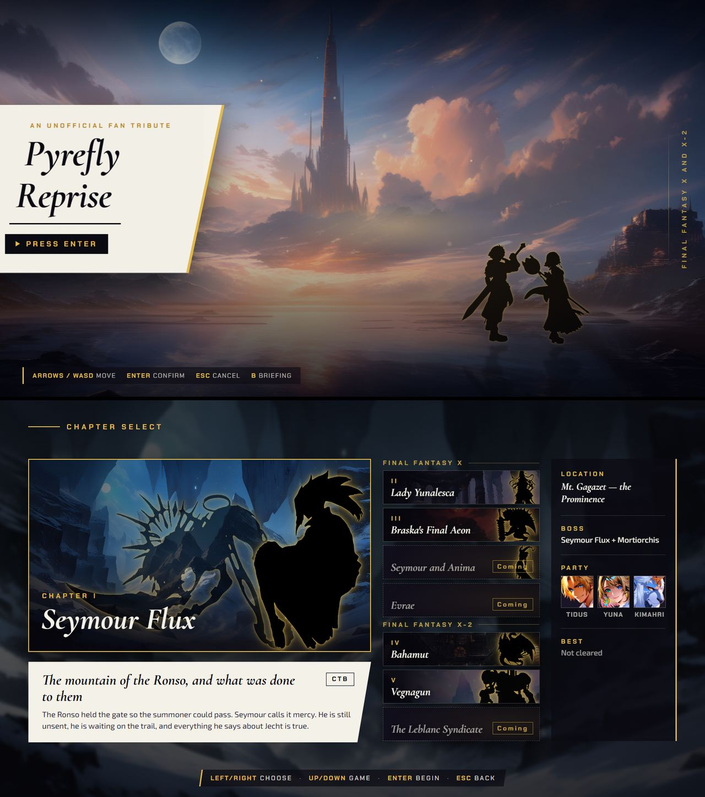
  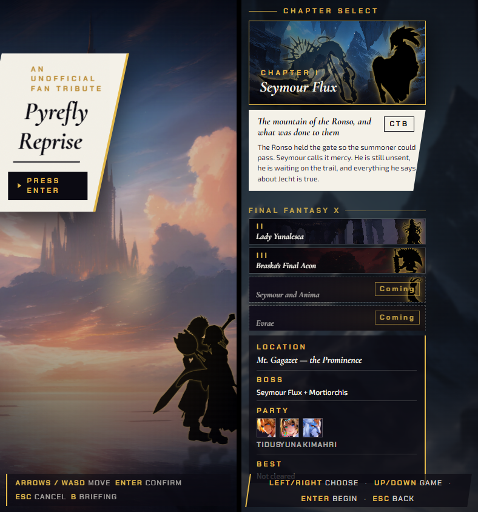

  *The title and chapter select at desktop size (left) and on a phone (right).*

- **Both:** the first-turn hint keeps the command menu visible, the pause tab strip scrolls to the
  selected tab, and phone tap targets and HUD labels are larger.

  
  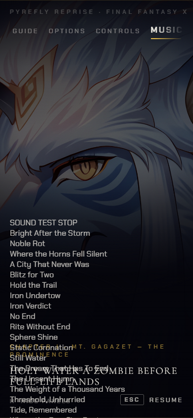

  *The first-turn hint beside the command menu (left) and the phone pause tab strip scrolled to the selected MUSIC tab (right).*
