[Back to the changelog](../../CHANGELOG.md)

# 2026-09-23 · Release 09

Address: https://baileypillon.github.io/pyrefly-reprise/ (main 5ddfde30)

*Where a caption says left and right, the left picture comes first.*

- **FFX-2:** Chapter VI, The Leblanc Syndicate, is playable: "A Farce, Armed" at Chateau Leblanc, in
  three acts against Ormi, Logos and Leblanc. Its poses are the best candidates so far, and it borrows
  Chapter IV's music for now.

  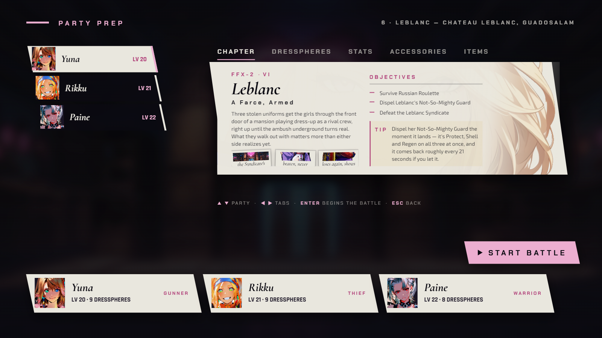
  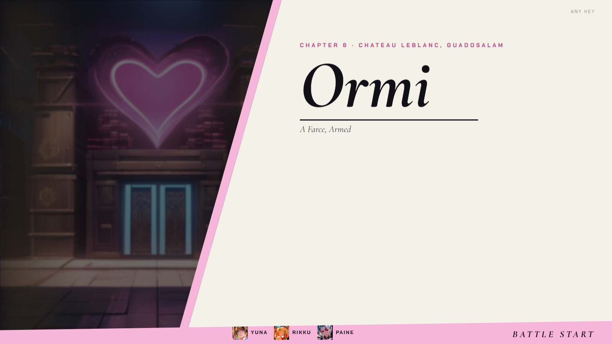
  

  *Chapter VI: party prep, the BATTLE START card for Ormi, and the first fight at Chateau Leblanc.*

- **FFX-2:** Wait is the default battle mode again: an open command menu holds the clock. Active and an
  ATB speed (Slow, Normal, Fast) are options in the pause menu, and older saves flip to Wait once.

  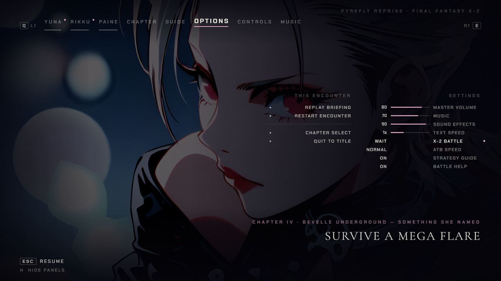
  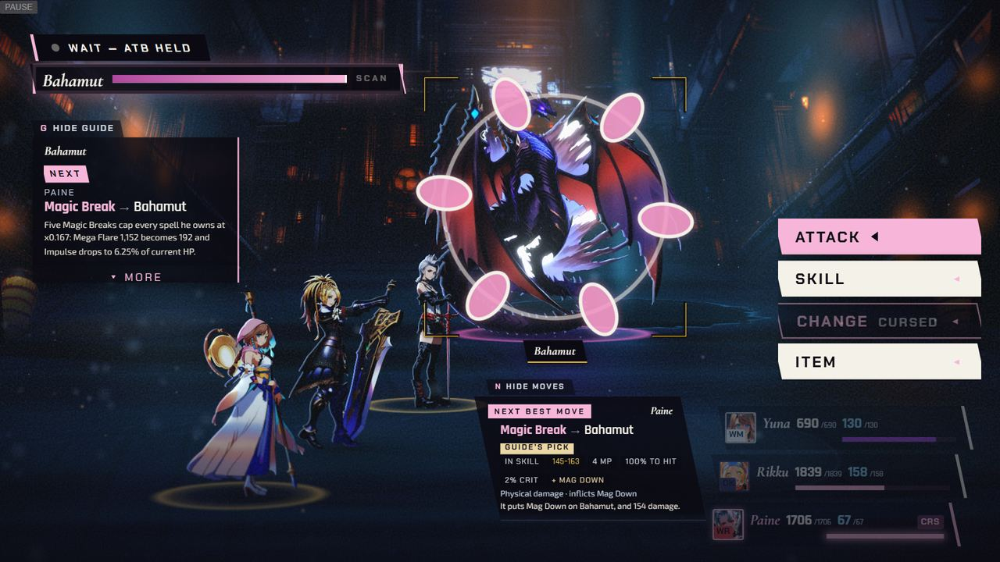

  *OPTIONS with X-2 BATTLE set to WAIT and the ATB SPEED row (left), and the WAIT - ATB HELD badge while a target is chosen (right).*

- **FFX-2:** a girl whose command is chain-locked keeps her menu and her command instead of losing the
  menu to the next ready girl.

  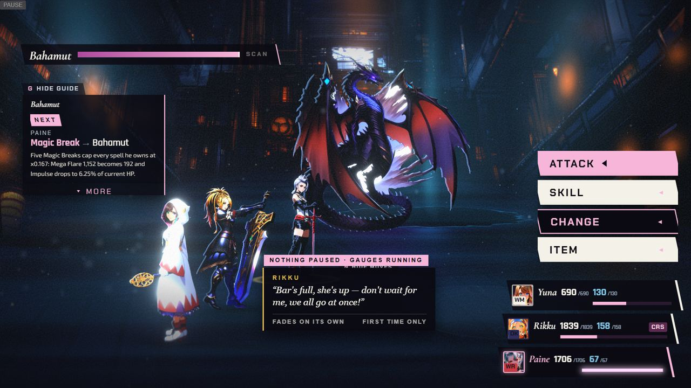

  *Chapter IV: a chain-locked girl's command menu stays open while the gauges run.*

- **FFX-2:** heals and items on your own side never miss, Leblanc's White Wind now heals and cures her
  crew, and the Syndicate stands at party scale (Ormi had towered over the party).

  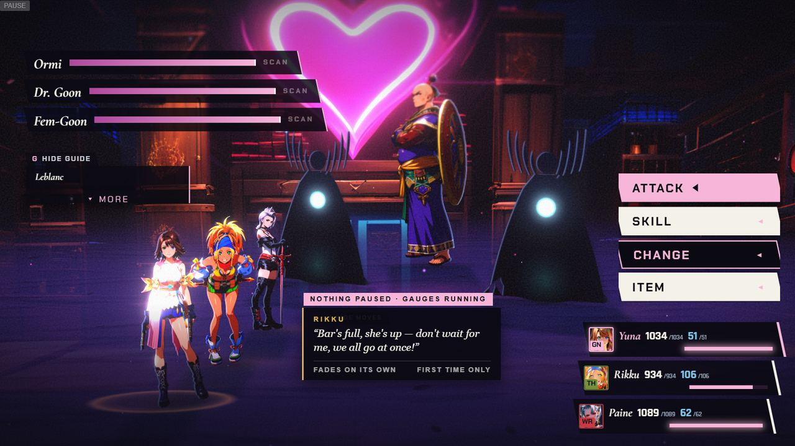

  *Chapter VI with the Syndicate at party scale.*

- **FFX-2:** the advisor no longer spends a cure, raise or item that another girl already has charging,
  and its card stays off the party's HP rows between linked fights.

  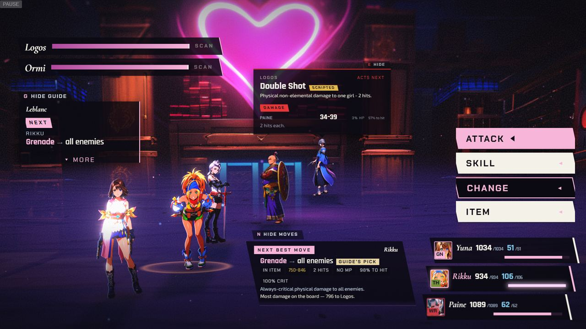

  *Chapter VI, between linked fights: the advisor's card sits clear of the party's HP rows.*

- **FFX-2:** the first-turn badge reads correctly under Wait.

  *(no screenshot from the time)*

- **Both:** scene, boss and phase music now fades in at the right speed. It had been sitting near
  silence for whole fights.

- **Both:** the enemy-intent panel (E) fills in again. It had been opening empty.

  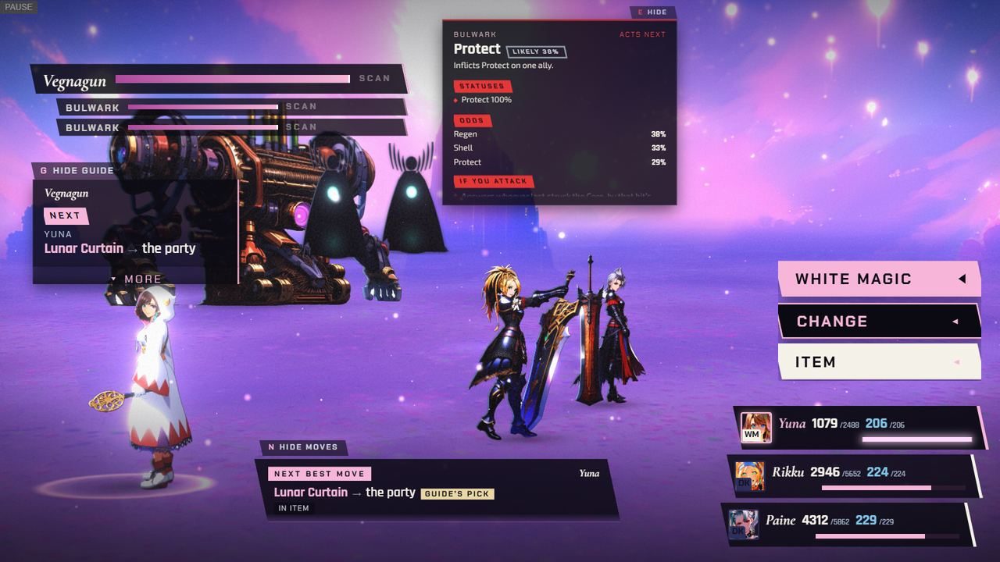

  *Chapter V: the enemy-intent panel filled in with the Bulwark's next move, the status it inflicts and the odds.*

- **Both:** the victory screen keeps the leader's whole head, the pause CHAPTER tab's pictures load and
  its captions wrap, the pause no longer lets mouse clicks through to the battle, and the advisor
  card's text is at least 12 px on desktop and phone.

  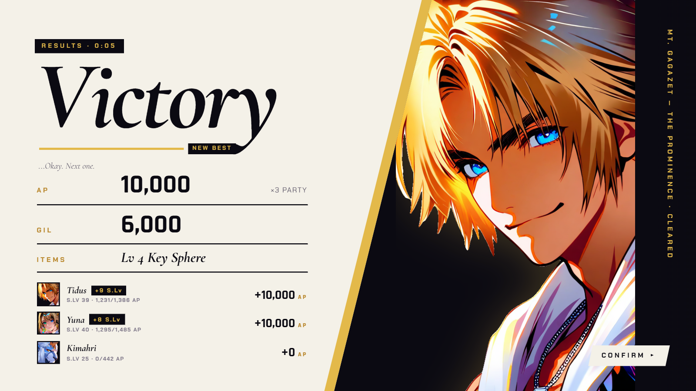
  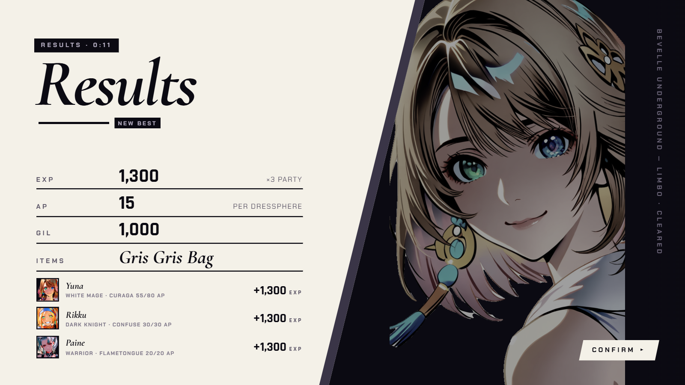
  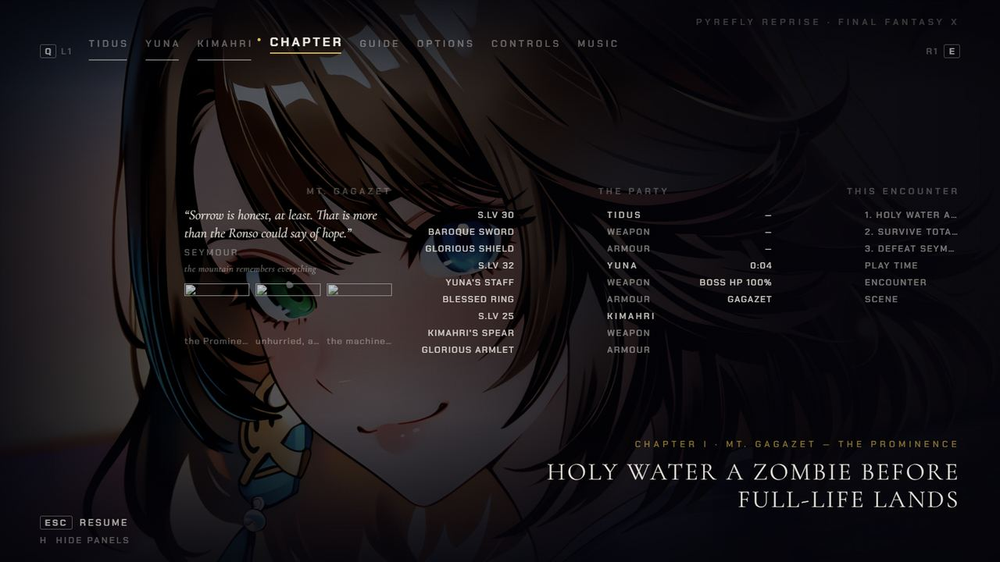
  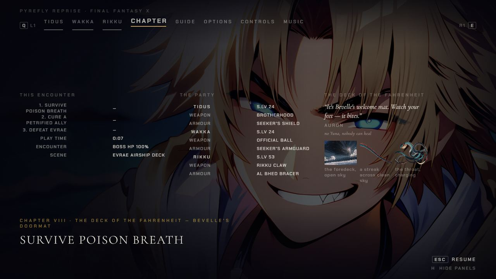

  *The FFX and FFX-2 results screens with the leader's whole head (first two), and the pause CHAPTER tab before (third, broken pictures) and after (fourth, pictures loaded; shown on the Chapter VIII test build).*

- **FFX:** Auron's first-turn hint no longer covers the advisor card or the command list.

  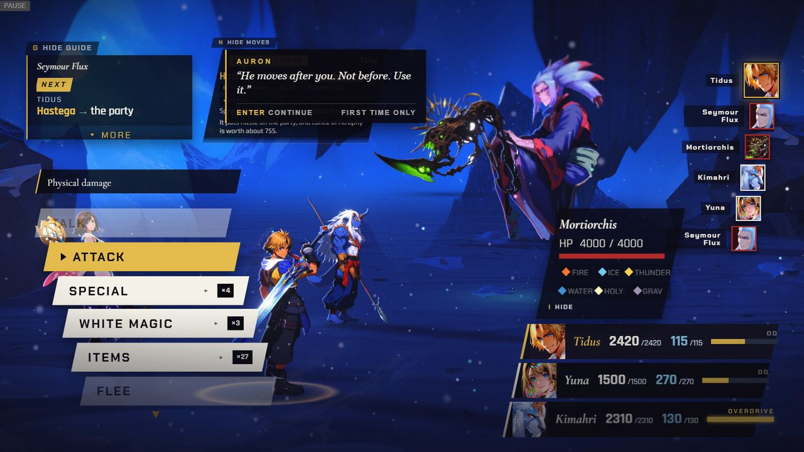
  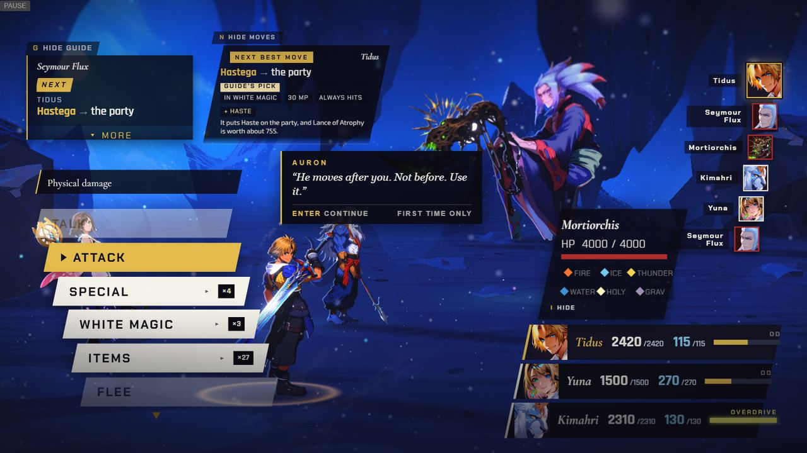

  *Auron's first-turn line before (left, it covers the advisor card) and after (right, it sits clear of the card and the command list).*

- **Both:** chapter select shows Chapter VI as playable and Chapters VII and VIII as locked "Coming"
  cards.

  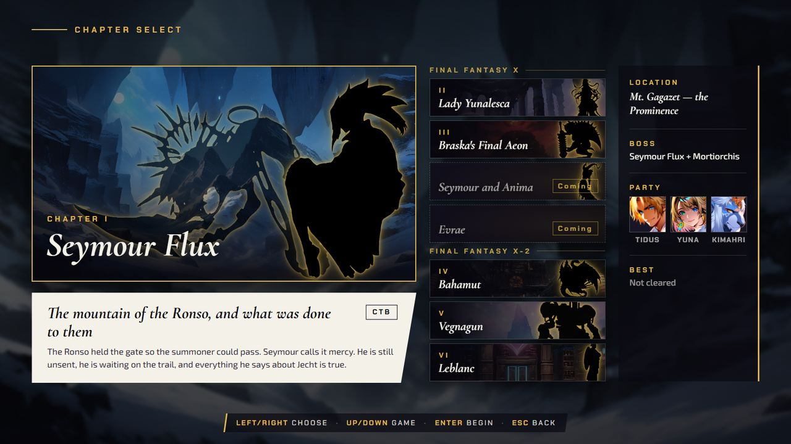

  *The chapter board with Chapter VI playable and Chapters VII and VIII as locked "Coming" cards.*
