[Back to the changelog](../../CHANGELOG.md)

# 2026-09-23 · Release 10

Address: https://baileypillon.github.io/pyrefly-reprise/ (main 5348c2e3)

*Where a caption says left and right, the left picture comes first.*

- **FFX-2:** Chapter VI is finished to the chosen look. Leblanc, Logos and Ormi use their cast painting
  for every move and their idle when hit, Ormi's shield carries the Syndicate heart, and a beaten
  villain steps back and leaves instead of dissolving.

  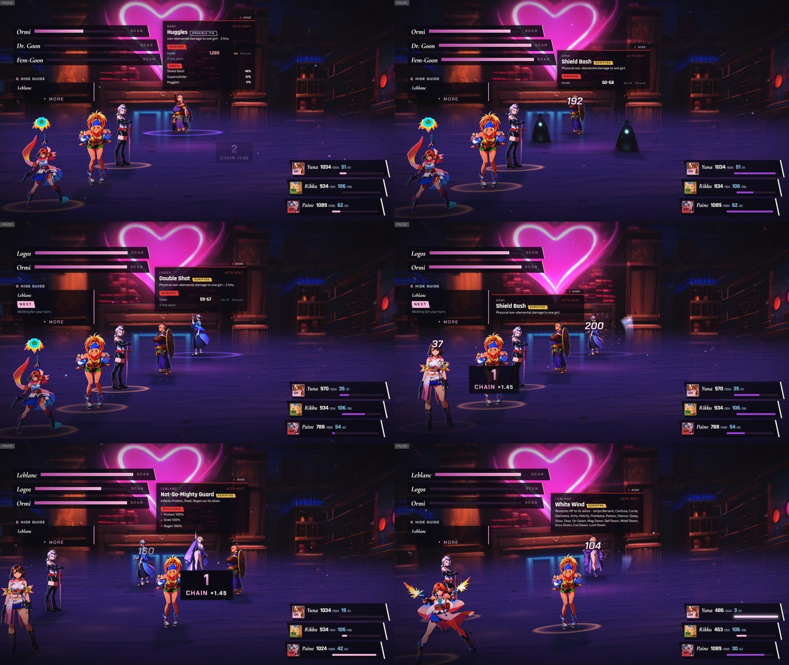
  
  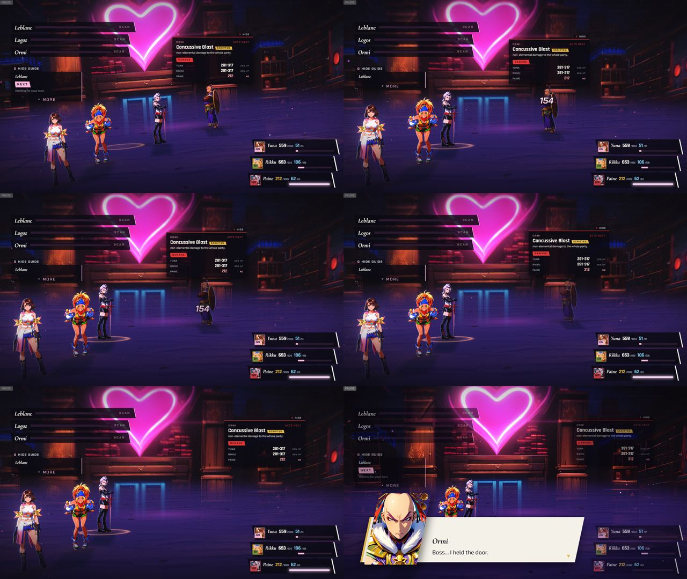

  *Chapter VI in its chosen look: the Syndicate casting and being hit (first), the idle paintings of Leblanc, Logos and Ormi with the heart on his shield (second), and a beaten Ormi dimming, stepping back and leaving the field before his parting line (third, frames in reading order).*

- **FFX-2:** Rikku's Steal and Pilfer Gil work in Chapter VI (they did nothing), and Grenades no longer
  always land a critical hit.

- **FFX-2:** Vegnagun's parts get their sourced steals and names (Node A to C, Right and Left Bulwark,
  Right and Left Redoubt) with no extra HUD letters, and the guide no longer suggests Reflecting the Leg.

  *(no screenshot from the time)*

- **FFX:** Doublecast now asks for a spell and an enemy target. Before, it cast twice on Lulu herself.

  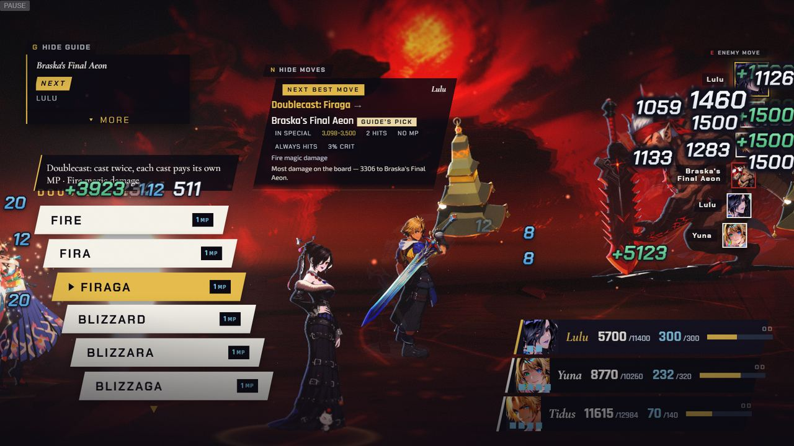
  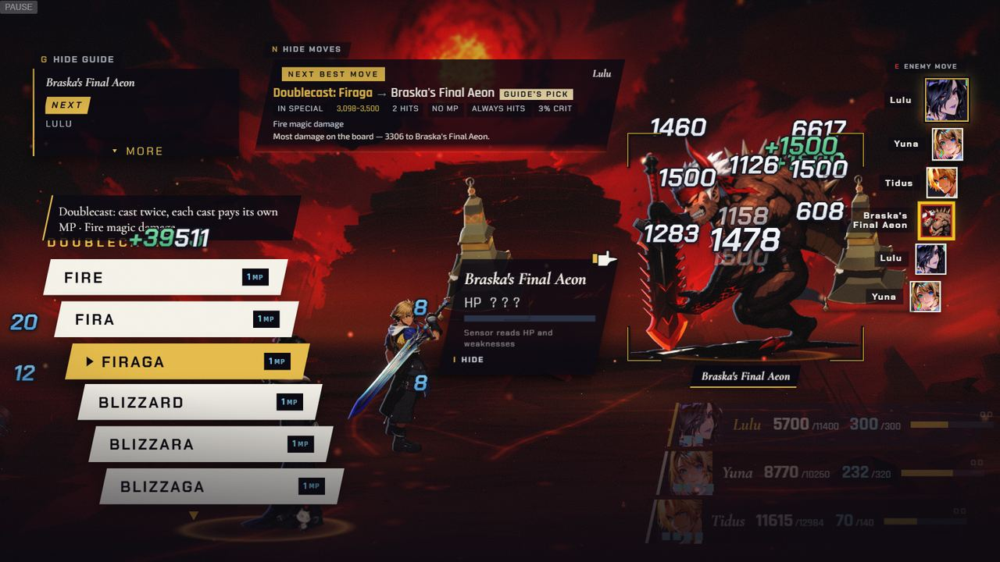

  *Chapter III: Doublecast asks for a spell (left), then for an enemy target (right).*

- **Both:** each party member's first turn opens with the turn cut-in, without delaying the menu, and a
  Confirm press skips the battle's opening camera sweep.

  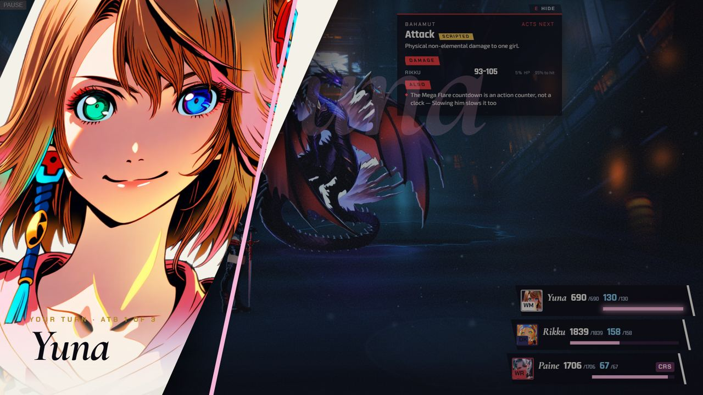
  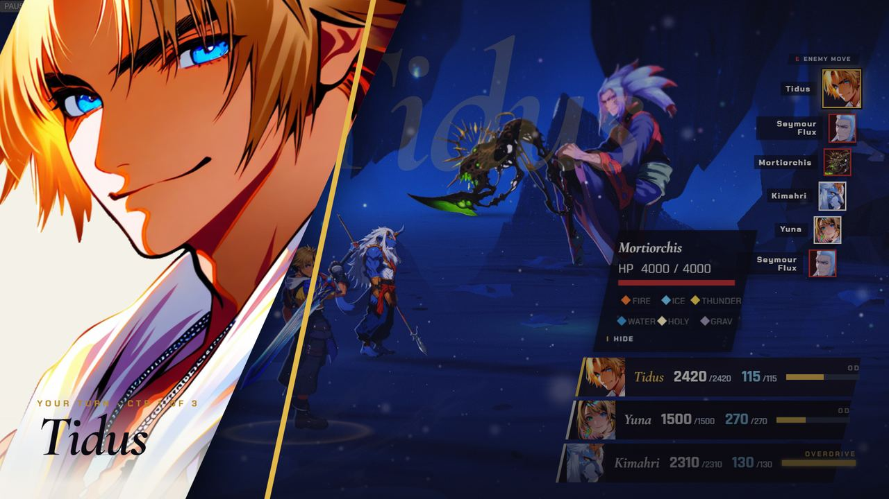

  *A first-turn cut-in: Yuna in Chapter IV (left) and Tidus in Chapter I (right).*

- **Both:** the pause owns the screen. Nothing paints over it, OPTIONS scrolls on a phone, the CHAPTER
  tab shows the chapter's own plate, and the text sits on the empty side of every portrait.

  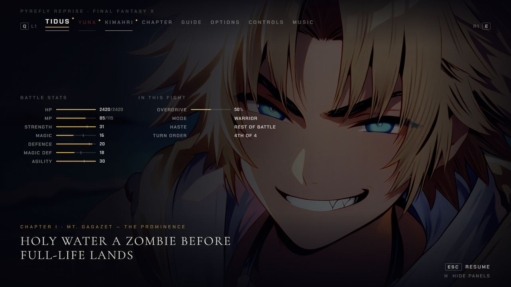
  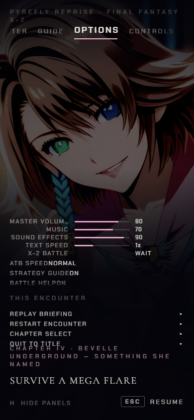
  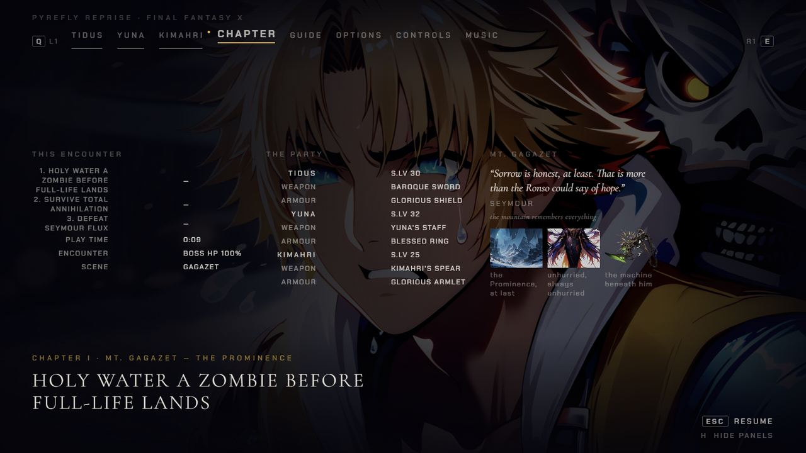
  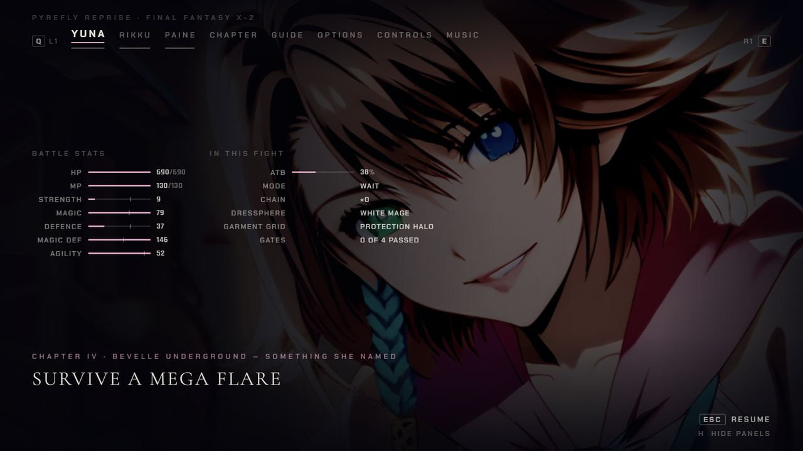

  *The pause with nothing painted over it (first), OPTIONS scrolled on a phone (second), the CHAPTER tab with the chapter's own plate (third) and Yuna's page with its text on the empty side of her portrait (fourth).*

- **Both:** the enemy-intent panel hides under the pause, its odds match the move that was rolled, and
  a MORE key reveals clipped text.

  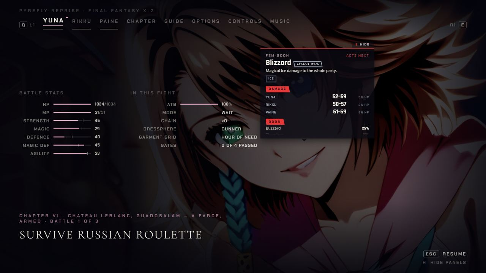
  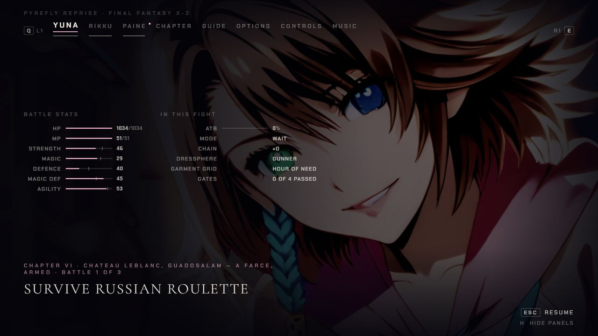

  *Chapter VI paused, before (left, Release 09) and after (right): the enemy-intent card no longer paints over Yuna's page.*

- **Both:** a KO'd fighter lies on the floor, the target ring sits on the floor under lifted figures
  such as the Yu Pagodas, and the dim on non-targets is stronger.

  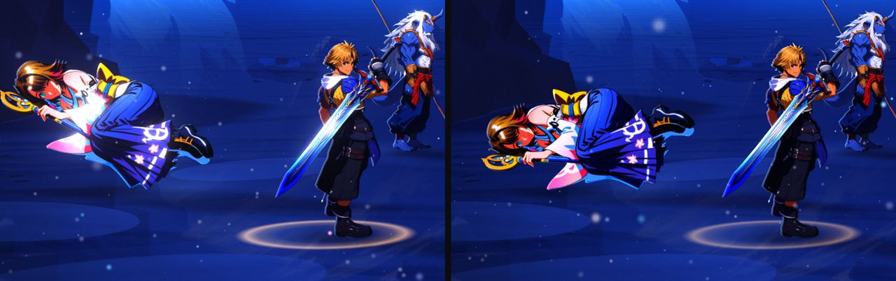
  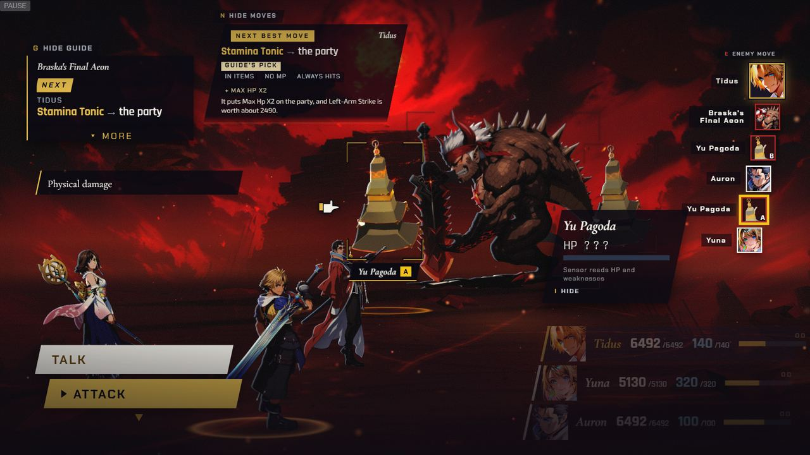

  *A KO'd Yuna in Chapter I, before (left half) and after (right half) lying on the floor, and the target ring on the floor under a lifted Yu Pagoda in Chapter III.*

- **FFX-2:** white costumes (Yuna's Gunner top, Leblanc's dress) no longer blow out under the bloom.

  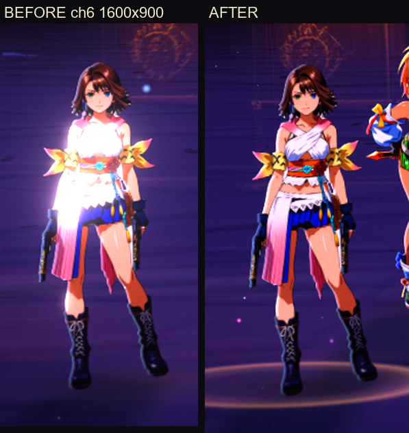
  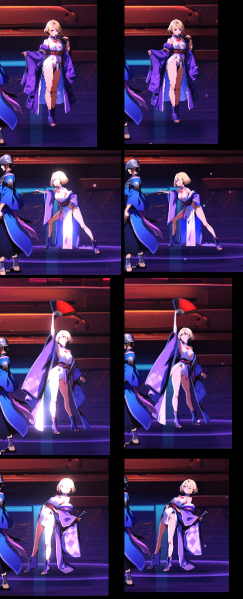

  *Before (left) and after (right): Yuna's Gunner top, then Leblanc's dress in four poses (before in the left column, after in the right).*

- **FFX-2:** Chapter V's fifth linked fight opens its menu on Shuyin and all three girls, and HP and MP
  carried into the next linked fight no longer read above the maximum.

  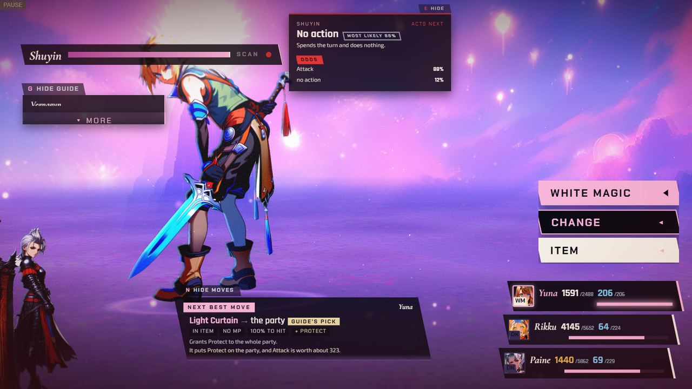
  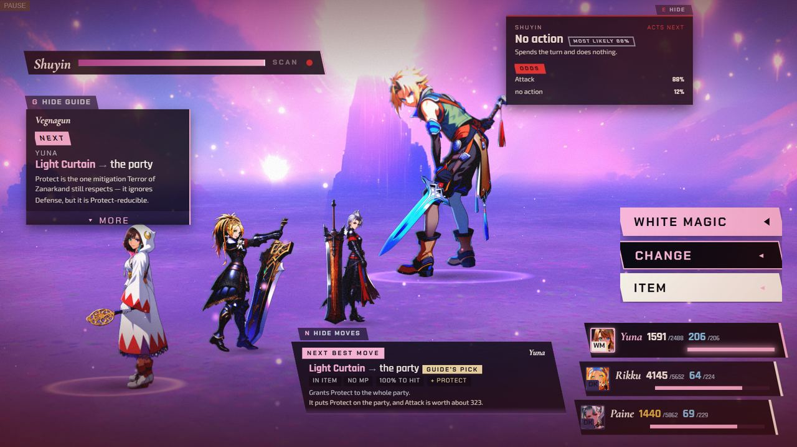

  *Chapter V's fifth fight, first menu: before (left) Shuyin fills the frame with only Paine at its edge; after (right) he stands with Yuna, Rikku and Paine in view.*

- **FFX-2:** the first-time gauge hint speaks Wait mode instead of telling you not to wait.

  *(no screenshot from the time)*
