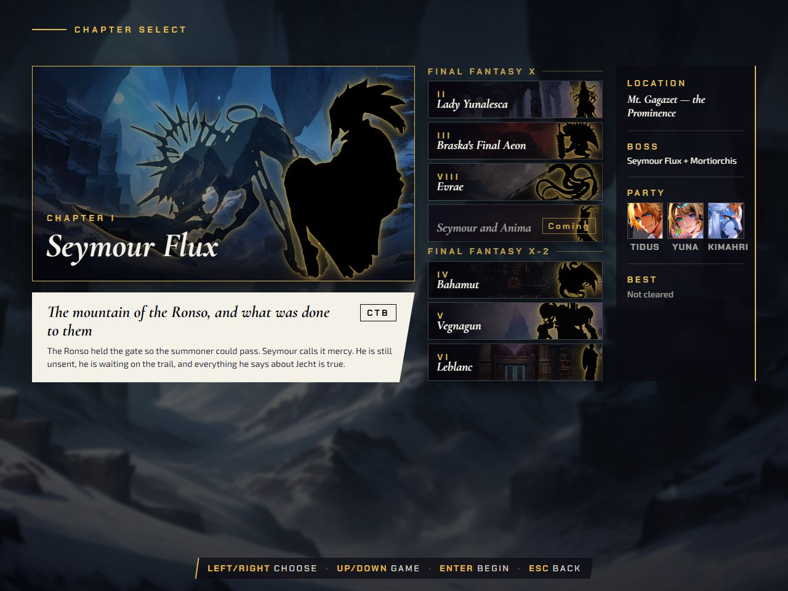
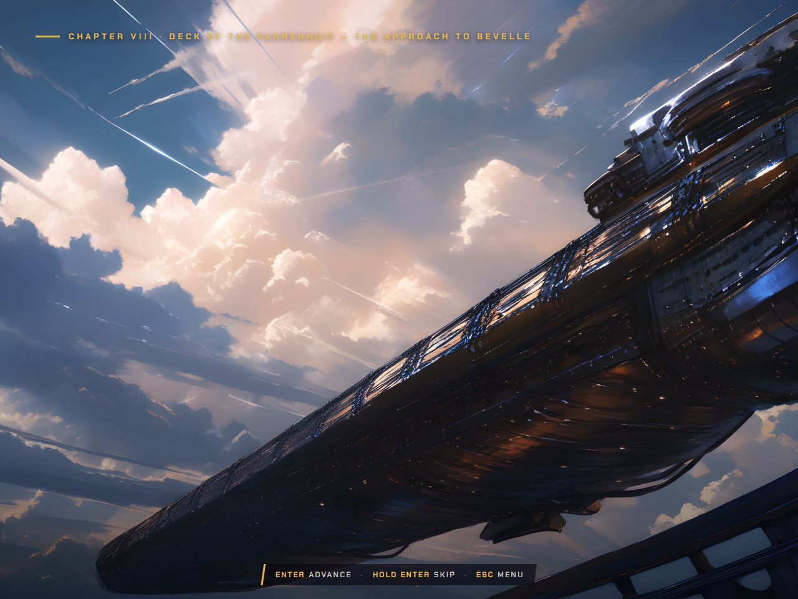
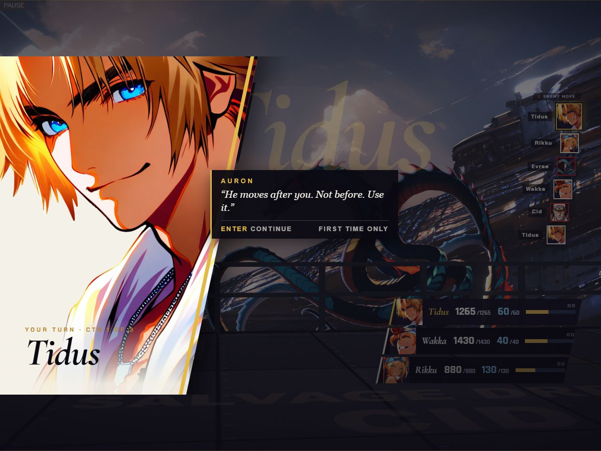
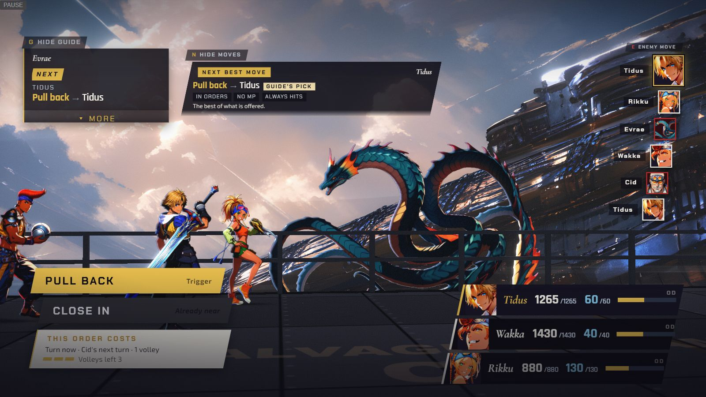
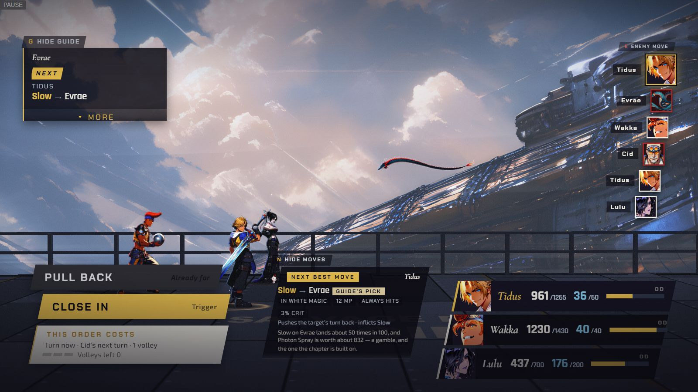
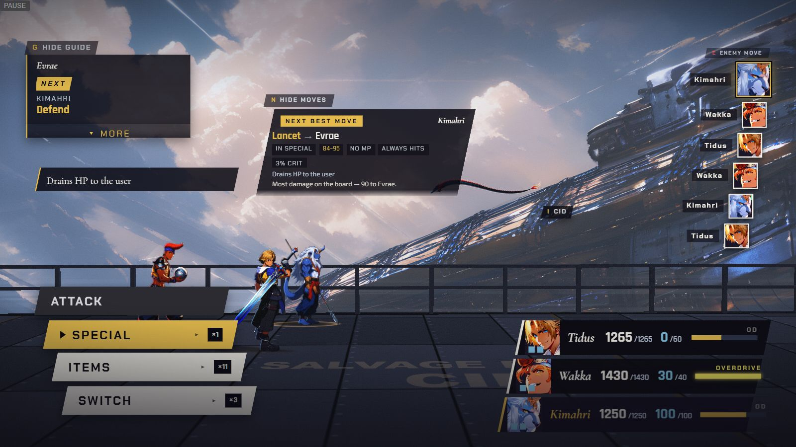

[Back to the changelog](../../CHANGELOG.md)

# 2026-09-23 · Release 11

Address: https://baileypillon.github.io/pyrefly-reprise/ (main d9decadb)

- **FFX:** Chapter VIII, Evrae, the airship-deck fight, is unlocked and playable. The wyrm of Bevelle
  attacks the Fahrenheit's deck from range: tell Cid to pull back or move in, and the stage re-sets near
  and far. Chapter VII still waits as "Coming".

  
  
  
  

  *The chapter board with Chapter VIII open and Chapter VII still COMING (first), Chapter VIII selected with Evrae as an ink silhouette (second), the pre-battle scene over the Fahrenheit's deck (third), and Chapter VIII's first menu with Auron's first-time line (fourth).*

  
  

  *Chapter VIII's ORDERS widget, from the chapter's end-to-end run: PULL BACK is the order while the ship is near, with CLOSE IN greyed as "Already near" (first), and CLOSE IN is the order while it is far (second). Each shows what the order costs.*

- **FFX:** Evrae has its own scene and boss music, and the aftermath plays in silence: the victory
  fanfare is cut where the Bevelle scene begins.

- **FFX:** Evrae shrinks as it falls out of the sky when it is beaten.

  *(no screenshot from the time)*

- **FFX:** Sensor no longer reveals Cid, so a blank enemy card for him no longer takes over Evrae's
  enemy plate.

  *(no screenshot from the time)*

- **FFX:** Wakka's callout waits a beat after the camera cuts to Evrae's Inhale, so you can read the
  warning first.

- **FFX:** with a breath charged at range, the advisor offers a spare Potion, never a Defend row the
  menu does not have and never a move that names Evrae.

  

  *Before the fix, in the chapter's end-to-end run: with Evrae's breath charged at range, the guide card tells Kimahri to Defend, but his menu has no Defend row.*

  *(no screenshot from the time of the fixed advice)*

- **Both:** a second open tab no longer overwrites the first tab's saves. Settings, unlocks, clears and
  best times are merged (a volume change could be lost on reload).
