[Back to the changelog](../../CHANGELOG.md)

# 2026-09-24 · Release 12

Address: https://baileypillon.github.io/pyrefly-reprise/ (main 76f587c3)

*Where a caption says left and right, the left picture comes first.*

- **FFX-2:** in Chapter VI, Dr. Goon and Fem-Goon are painted figures instead of stand-ins.

  

  *Chapter VI: Dr. Goon (green) and Fem-Goon (pink) painted, with Ormi, facing Yuna, Rikku and Paine.*

- **FFX-2:** Brother and Nooj speak with new dialogue portraits (Chapters VI and V).

  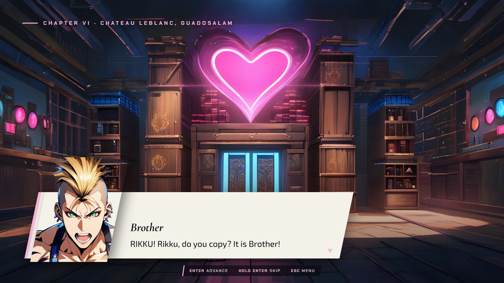
  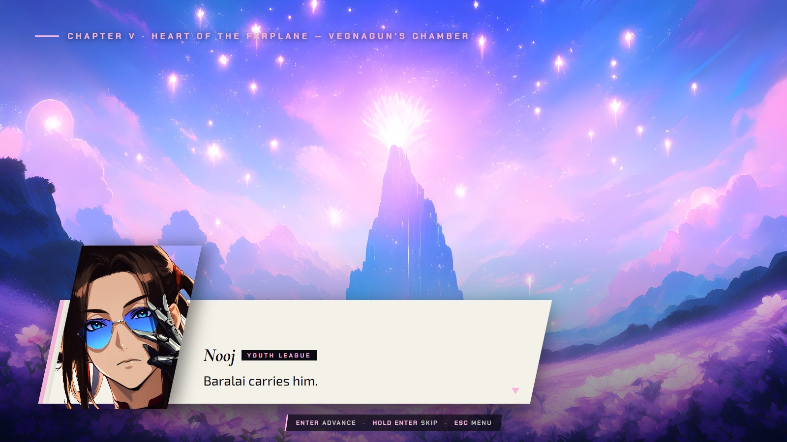

  *Brother in Chapter VI (left) and Nooj in Chapter V (right).*

- **FFX-2:** the one-line command-help band is back, pinned across the top of the screen. It clears the
  PAUSE chip and the enemy-intent card, and reads at phone width.

  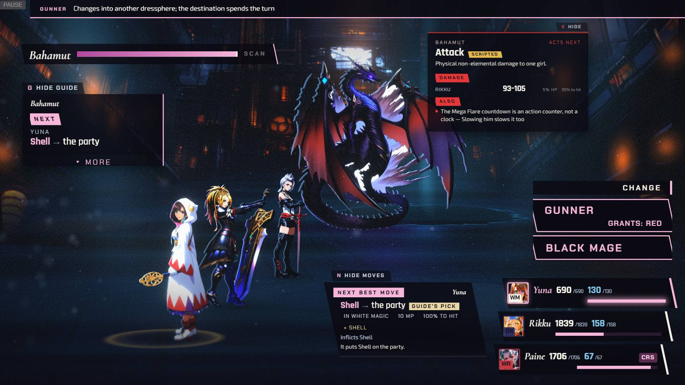

  *Chapter IV's command-help band across the top.*

- **FFX-2:** while a command menu is open the camera stays on the idle frame instead of pushing in on the
  attacker, so the party and the target ring stay in view. Victory and story cameras still play.

  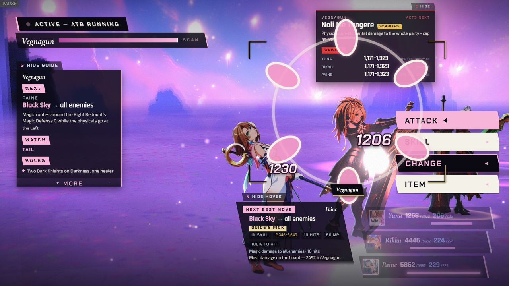
  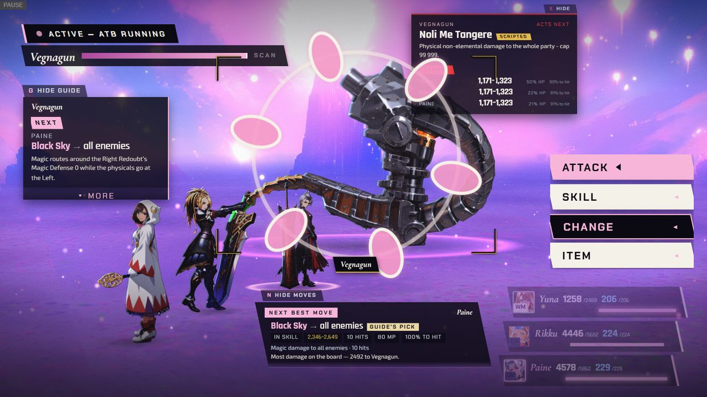

  *Chapter V while aiming: the camera pushes in and loses the party before (left); it holds with all three girls whole after (right).*

- **FFX-2:** Vegnagun's tail has a steel tip instead of a green one (Chapter V).

  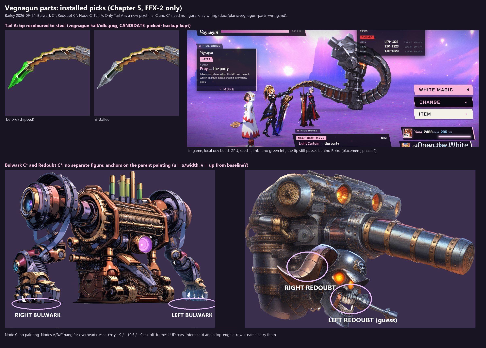

  *The tail tip before (green) and after (steel), and in the Chapter V fight.*

- **Both:** on the pause screen each face is framed clear of the stat columns and stays on screen through
  the slow push-in; a resize glides to the new framing instead of jumping.

  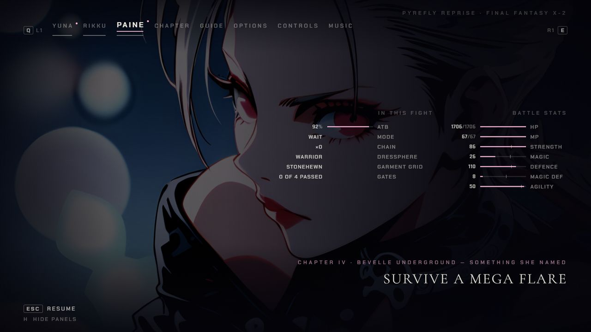
  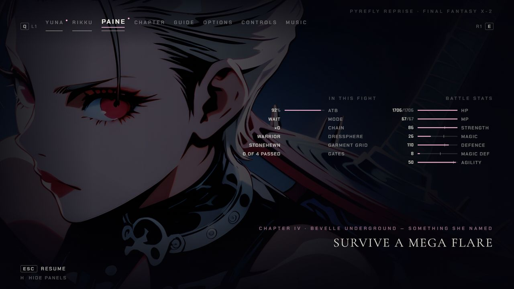

  *Paine's tab in Chapter IV: the stats sit across her eye before (left); the columns clear her face after (right).*

- **FFX:** Evrae's fall uses only approved paintings; its KO art no longer shows.

  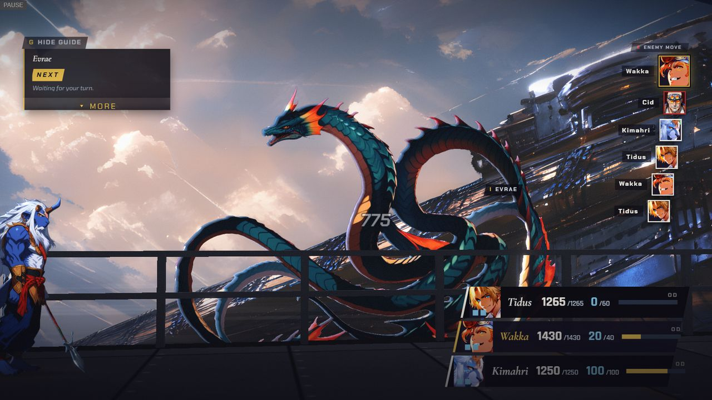
  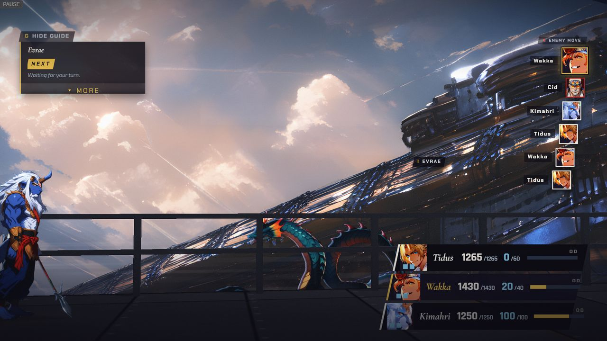

  *Chapter VIII: Evrae at full size when hit (left), then smaller as it drops away (right).*

- **FFX:** the ALL ALLIES and ALL ENEMIES chip now clears the help card.

  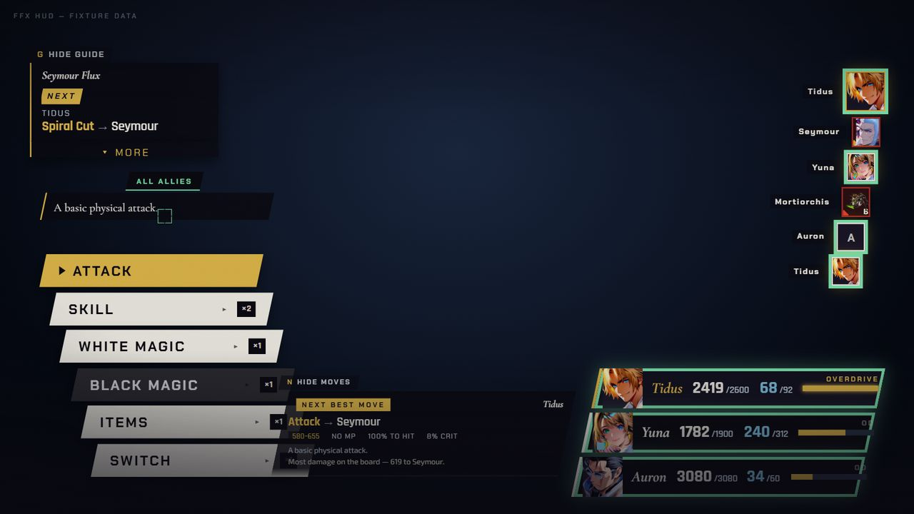

  *The chip above the help card, drawn from the HUD test fixture (not a battle frame).*

- **FFX:** the victory fanfare no longer plays through the aftermath scenes of Chapters I and II.
