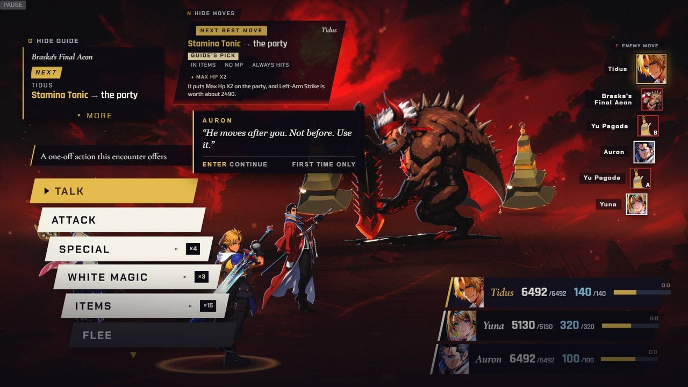
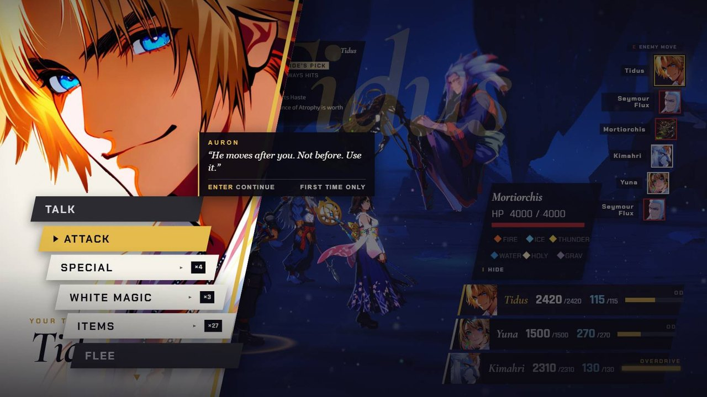
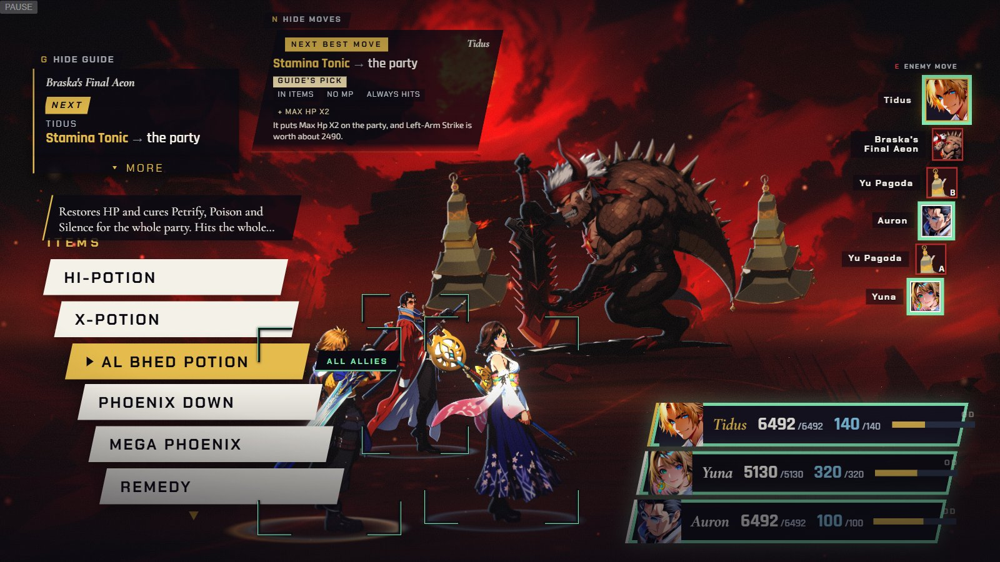
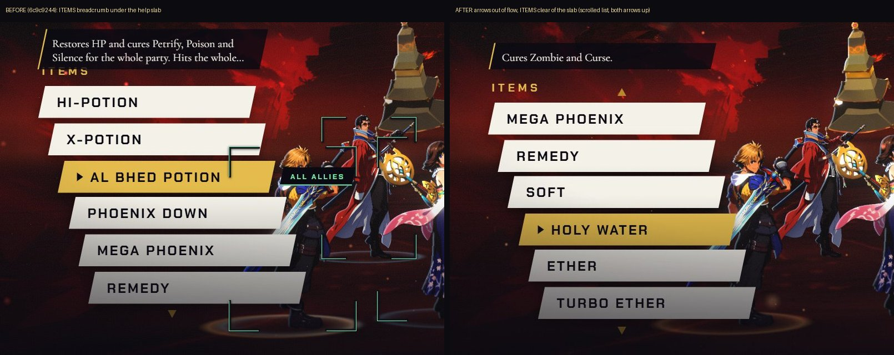
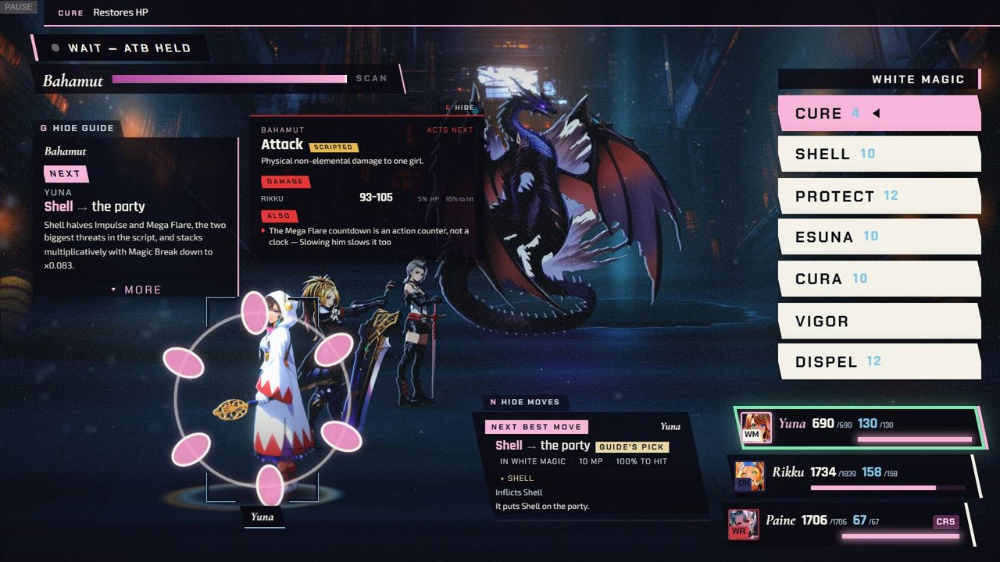
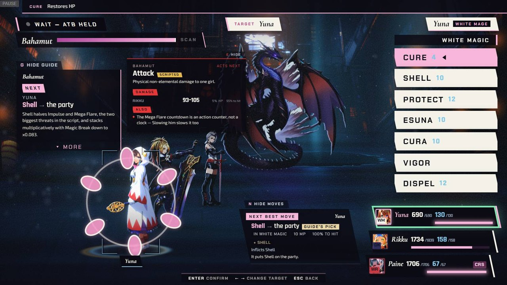
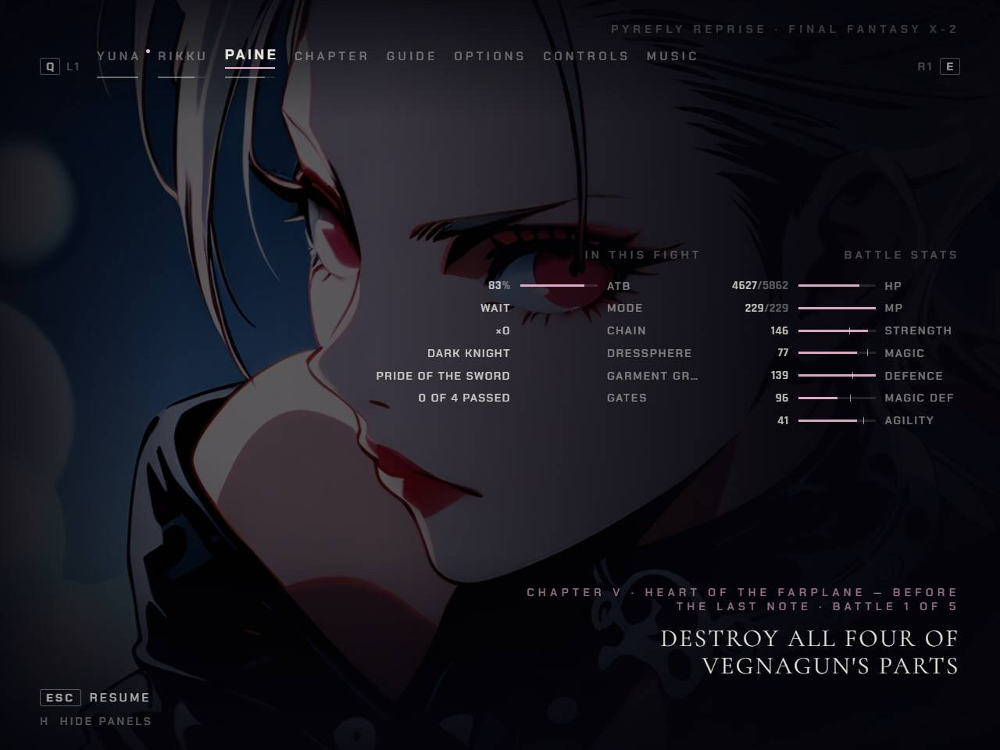
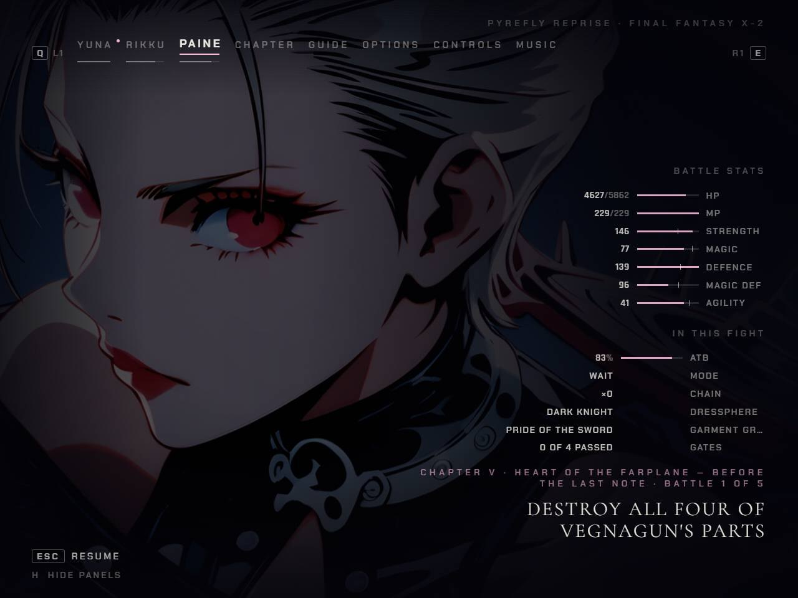
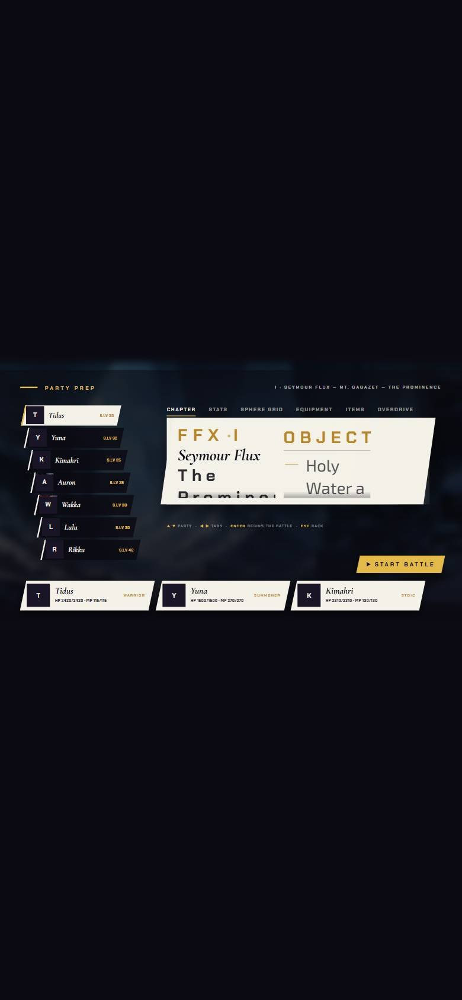
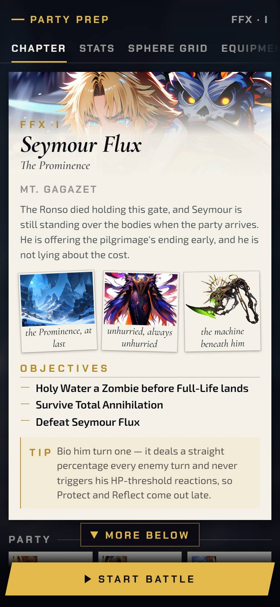

[Back to the changelog](../../CHANGELOG.md)

# 2026-09-24 · Release 13

Address: https://baileypillon.github.io/pyrefly-reprise/ (main a999d133)

*Where a caption says left and right, the left picture comes first.*

- **FFX:** in Chapters I and III Yuna has a new slot, so the command stack no longer hides her.

  
  

  *Chapter III's first menu: Yuna is hidden behind the stack before (left) and in view after (right).*

- **FFX:** the command menu is drawn above the turn cut-in instead of under it.

  
  

  *Chapter I's turn cut-in: the slab covers the menu before (left); the menu sits above it after (right).*

- **FFX:** the ALL ALLIES and ALL ENEMIES chip hangs off the chosen row, and the ITEMS breadcrumb no longer
  hides under the help card.

  
  

  *The chip beside the chosen Al Bhed Potion row (left), and the ITEMS breadcrumb before and after (right).*

- **FFX:** Chapter I: Mortibsorption now runs Seymour's Protect and Reflect threshold counters instead of
  dropping them, as the sources say.

- **FFX-2:** magic never rolls to miss, on either side. Enchanted Ammo keeps its sourced roll.

- **FFX-2:** aiming shows a TARGET plate, the acting girl's name and dressphere, and a controls hint; a
  victory that lands under an open menu closes it.

  
  

  *Chapter IV's target step: only the ring before (left); the TARGET plate, actor plate and hint after (right).*

- **Both:** on the pause screen faces stay clear of the stat columns: the portrait slides when nothing else
  clears the face, and Paine's column stacks in Chapters V and VI.

  
  

  *Paine's tab in Chapter V at 1280x960: the stats sit across her face before (left) and clear it after (right).*

- **Both:** on phones the party-prep chapter card is one stacked, scrolling page with readable text (it was
  about 3 px); on desktop PG UP and PG DN scroll the chapter columns.

  
  

  *The Chapter I prep card on a phone: before (left) and after (right).*

- **Behind the scenes:** Chapters IX (Yojimbo), X (Natus) and XI (Fallen Aeons) ride along switched off.
  The chapter board still lists seven playable chapters, with Chapter VII as COMING.
