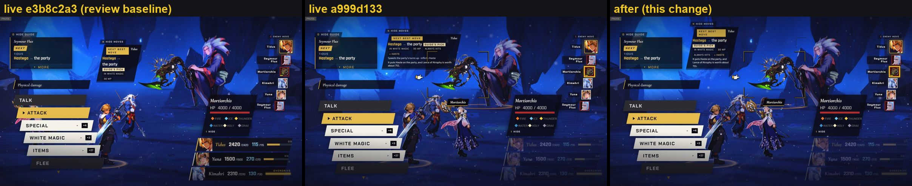
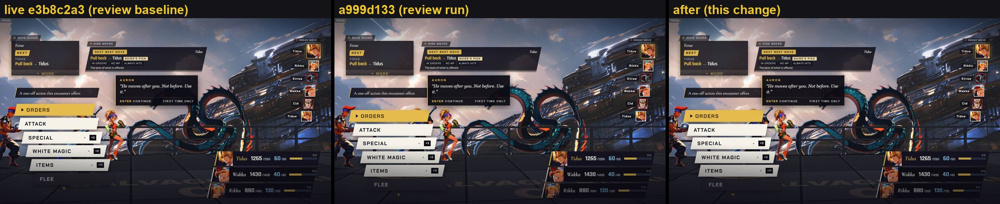
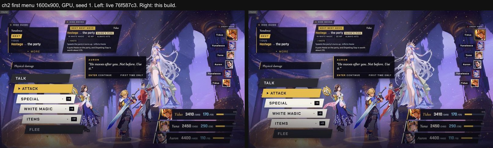
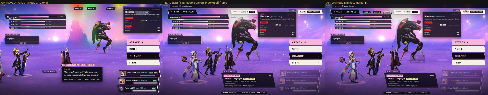
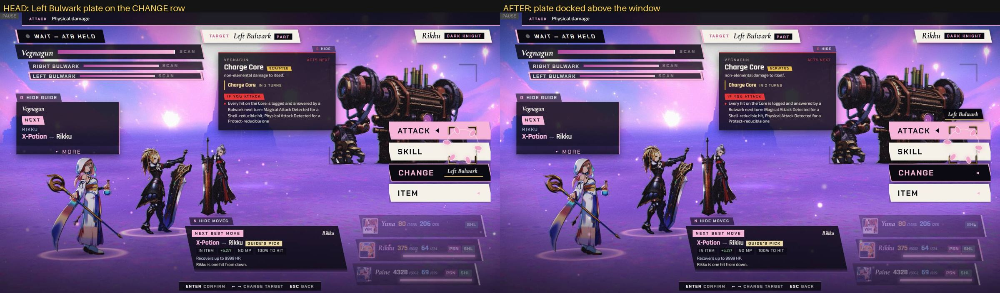
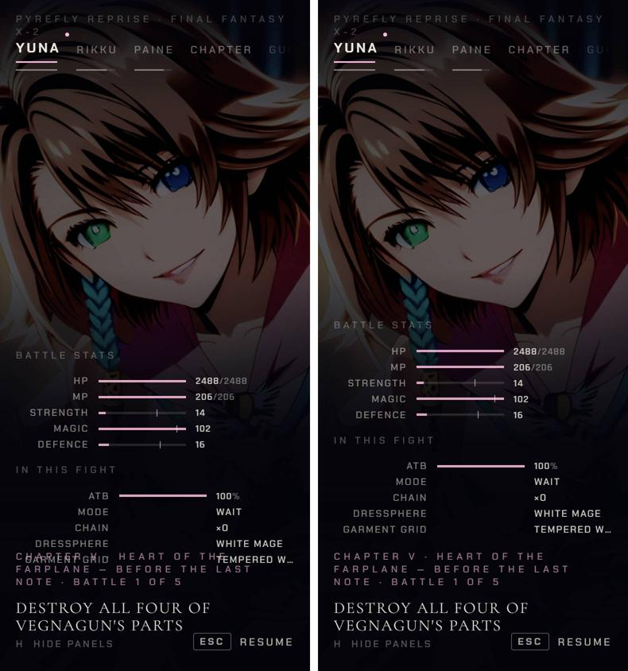

[Back to the changelog](../../CHANGELOG.md)

# 2026-09-25 · Release 14

Address: https://baileypillon.github.io/pyrefly-reprise/ (main 1c22066e)

*Where a caption says left and right, the left picture comes first.*

- **FFX:** Chapter I: a Poison tick that carries Seymour Flux below half health no longer opens his second
  phase. Only a real hit does, as the sources say.

- **FFX:** Chapter I's target bracket clears the advisor's card again, and Rikku stands clear of the command
  stack again in Chapter VIII.

  
  

  *Chapter I's target step and Chapter VIII's first menu in the hotfix 12.3 build (left), release 13 (middle) and this build (right).*

- **FFX:** formations repaired after release 13: Yunalesca stands where she stood before, and Auron and
  Yuna are eased apart in Chapter III.

  

  *Chapter II's first menu: before release 13 (left) and this build (right).*

- **FFX-2:** Chapter V's Vegnagun Body is drawn where it stood before release 13.

  

  *Chapter V, third link: before release 13 (left) and this build (right).*

- **FFX-2:** Vegnagun's parts get clearer labels: the Left Bulwark's plate leaves the CHANGE row, the
  overhead Nodes get arrow markers at the top edge, and the first aim lights its row.

  
  

  *Node markers (target, then before, then after) and the Left Bulwark's plate (before, then after).*

- **Both:** on phones, the pause screen lifts its columns clear of the chapter caption when they would
  overlap.

  

  *Yuna's pause tab in Chapter V on a phone: before (left) and after (right).*
