[Back to the changelog](../../CHANGELOG.md)

# 2026-09-25 · Release 15

Address: https://baileypillon.github.io/pyrefly-reprise/ (build 5be4babe, cut from a side branch)

*Where a caption says left and right, the left picture comes first.*

- **FFX:** Chapter IX, Yojimbo, is playable: Lulu, Kimahri and Yuna face Yojimbo, Lady Ginnem and Daigoro in
  the last chamber of the Cavern of the Stolen Fayth, under a night-sakura tree, to a battle theme of its own.

  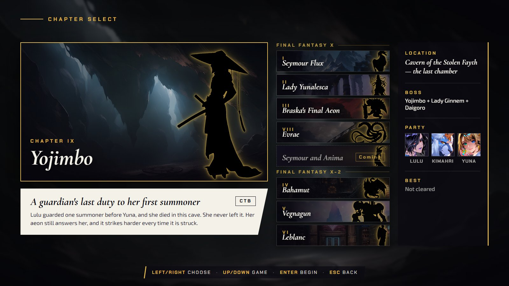
  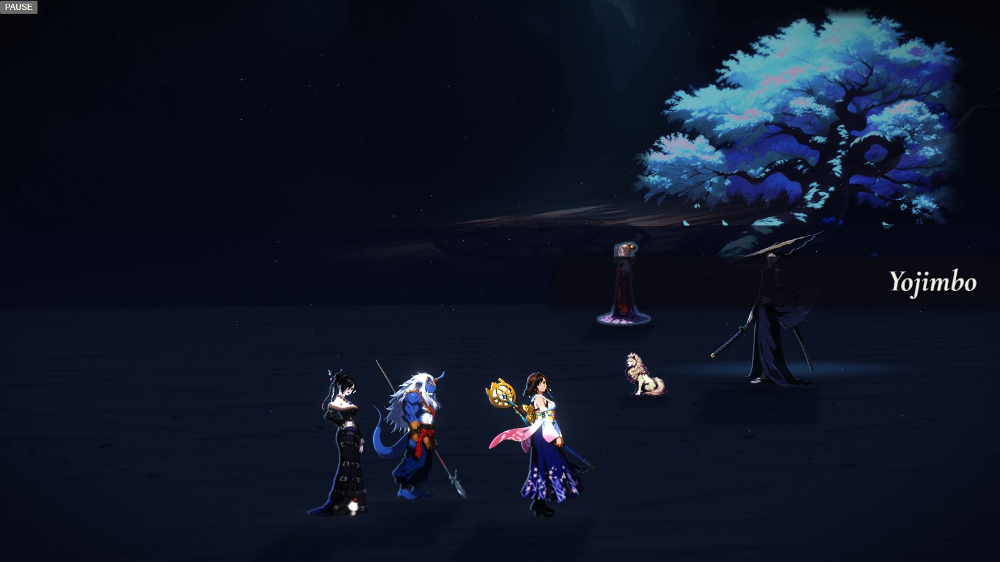
  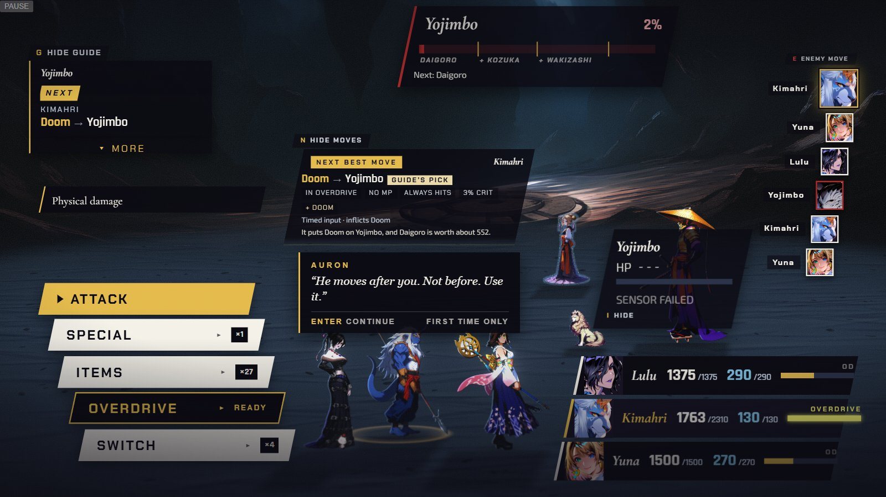

  *Chapter IX: the board card, the arrival under the sakura tree, and the first menu with the Zanmato gauge under Yojimbo's name.*

- **FFX:** a gauge under Yojimbo's name shows how close his Zanmato is, and Doom's countdown shows over the
  doomed head and on the target plate.

  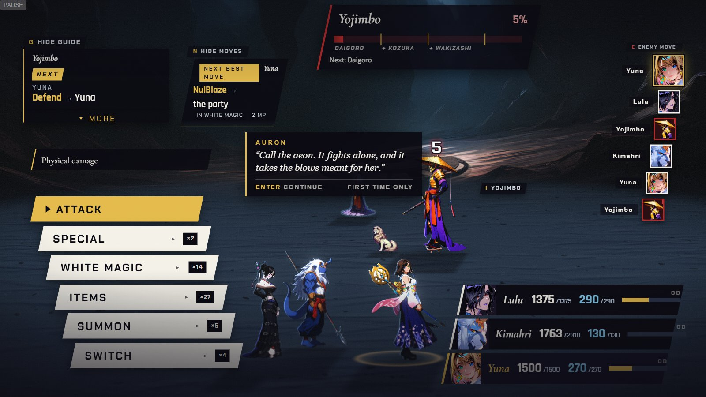

  *Doom's countdown (5) over Yojimbo, with the gauge under his name.*

- **FFX:** after the win Yojimbo and Daigoro are recalled, and Yuna's sending of Lady Ginnem is shown, not
  just told.

  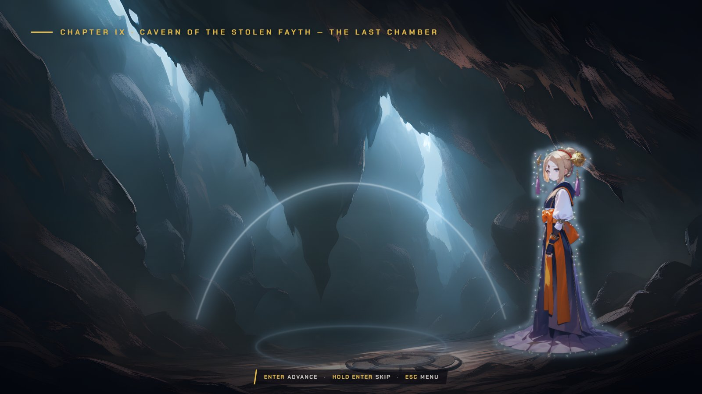

  *Lady Ginnem's sending in the aftermath.*

- **FFX:** summoned aeons no longer get the party's Items; an aeon's menu has no Item row.

  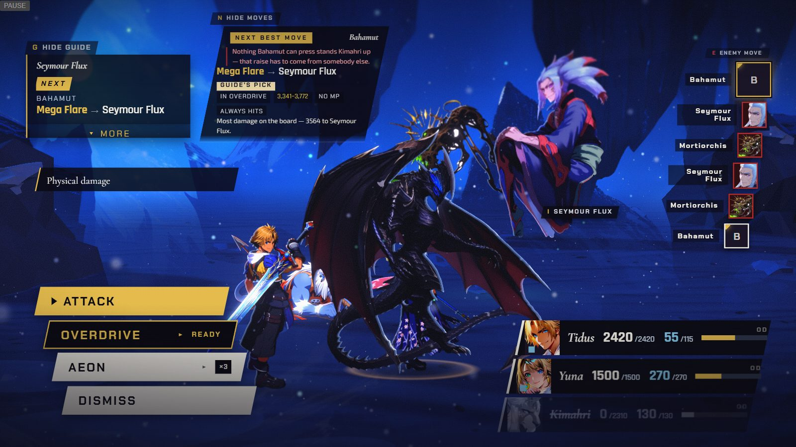

  *A summoned Bahamut's menu: Attack, Overdrive, Aeon and Dismiss.*

- **Both:** petrified fighters now turn to stone: a grey tint with chips falling away.

  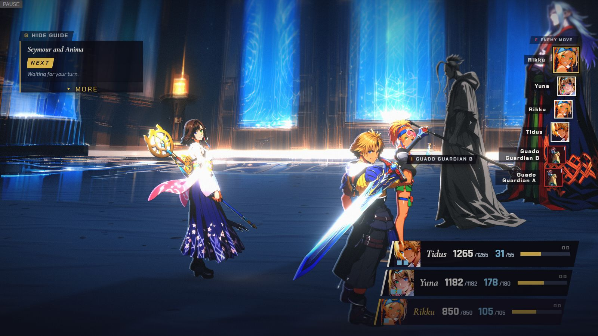

  *A petrified Guado Guardian drawn as stone, from Chapter VII's test build (the chapter is still locked).*

- **FFX:** an enemy's Sensor chip leaves with the enemy instead of lingering after its fall.

  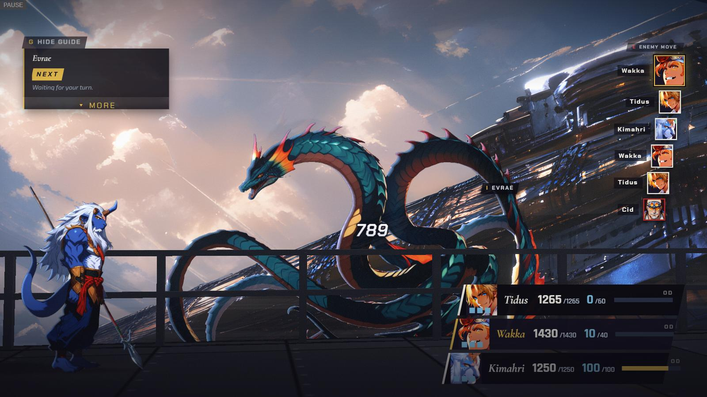
  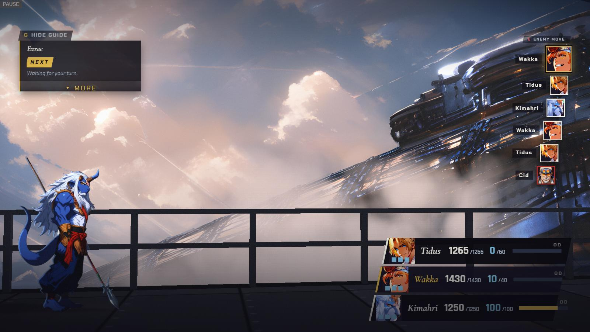

  *Chapter VIII: Evrae's chip at the last blow (left) and gone once it has fallen (right).*

- **FFX-2:** the top-right banner now shows Steal, Pilfer Gil and every other battle message, and a steal
  names its reward (Bahamut's says Mute Shock).

  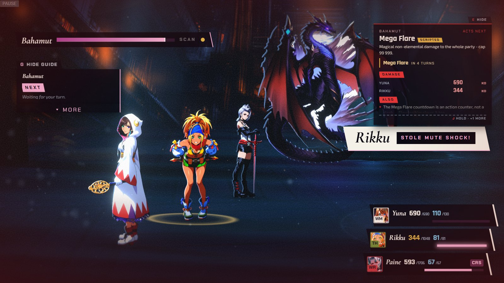

  *Chapter IV: "Rikku STOLE MUTE SHOCK!" in the banner.*

- **FFX-2:** Leblanc's fan is fully open in Chapter VI.

  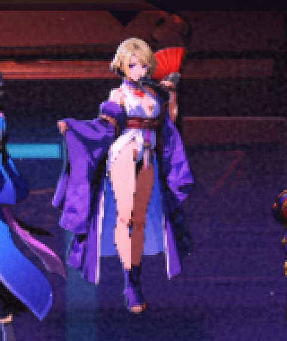

  *Leblanc with her fan open (Chapter VI, magnified).*

- **Both:** Auron's briefing counts the playable fights by itself, and the coaching lines stop calling the
  command menu a "list".

  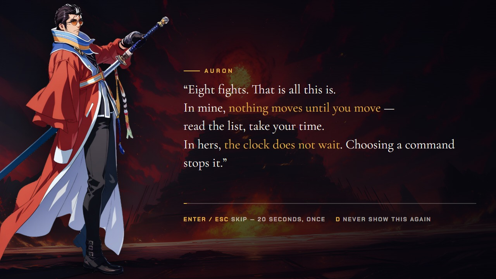
  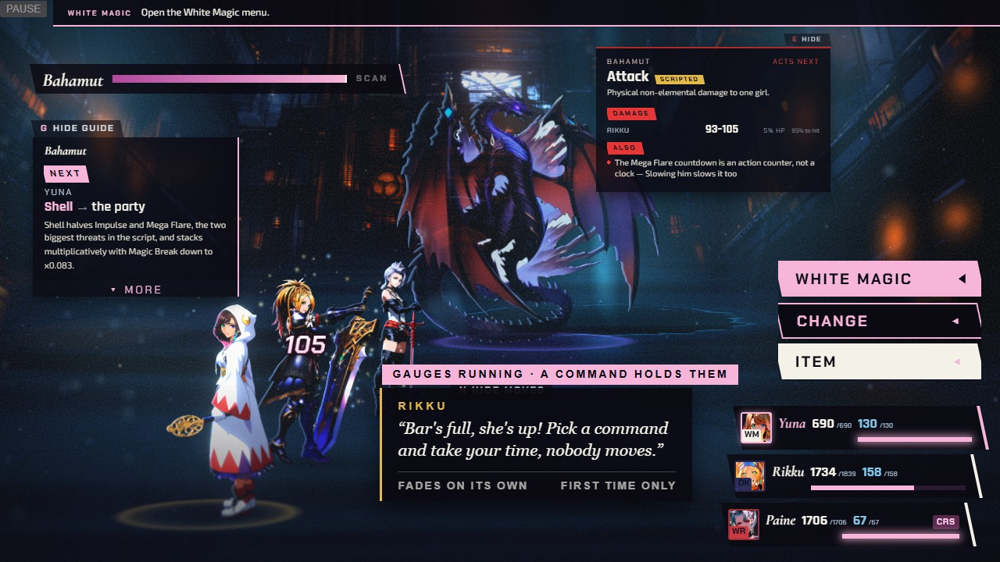

  *Auron's briefing (left) and the FFX-2 Wait badge and first-turn line (right).*

- **Both:** battles load in the background behind party prep and the opening scene, and the board's
  paintings are ready before the title wipes away, so the first menu comes up sooner.

- **Both:** chain fights keep one music track at a time: Chapter III's aeon gauntlet stays under Yu Yevon's
  theme, and Chapter V no longer starts Shuyin's theme early.

- **Behind the scenes:** the paintings for the next chapters (Omnis, Trema, Isaaru, Den of Woe) ride along
  in this build, but those chapters are not playable yet.
