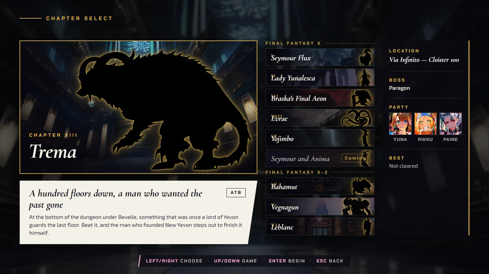
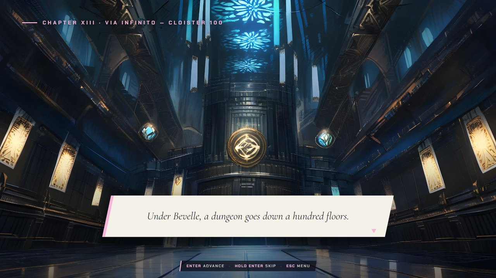
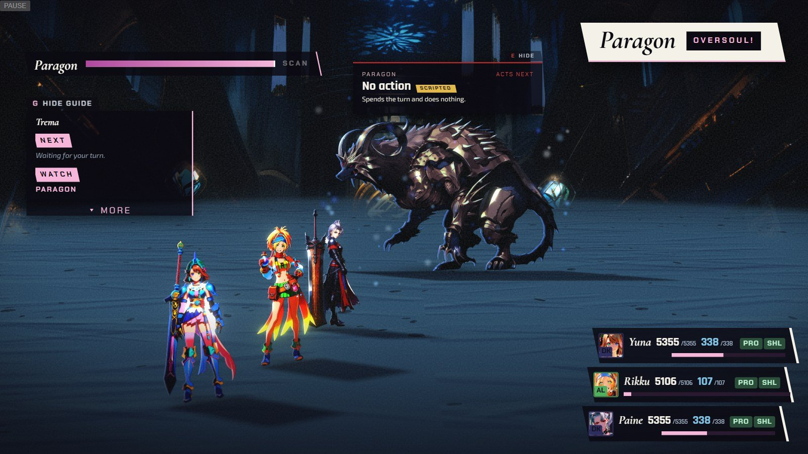
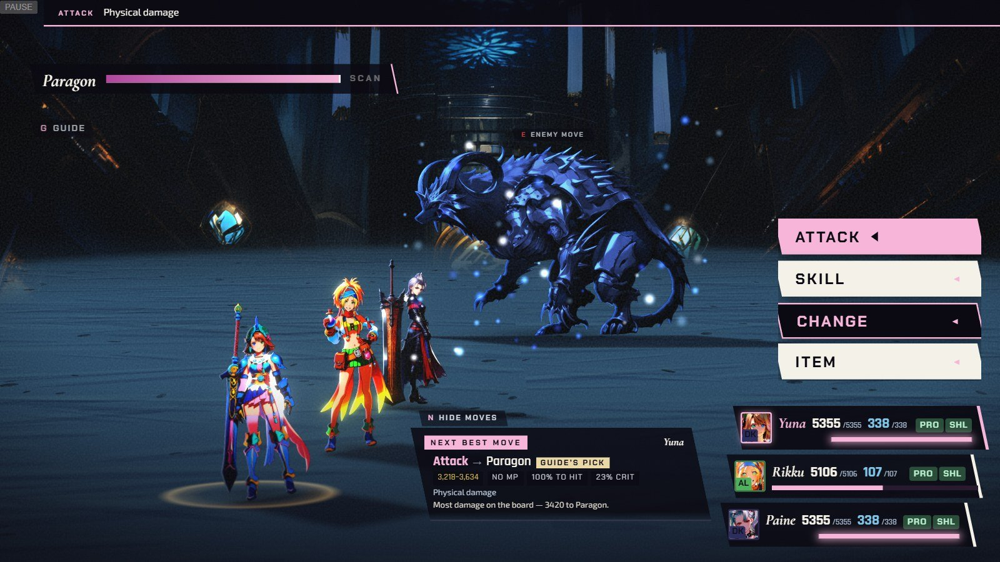
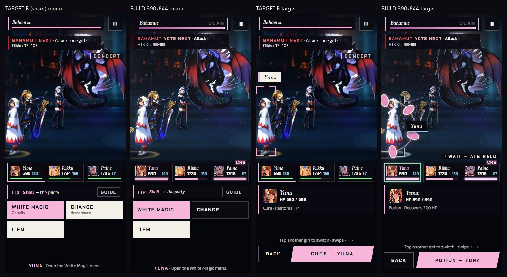
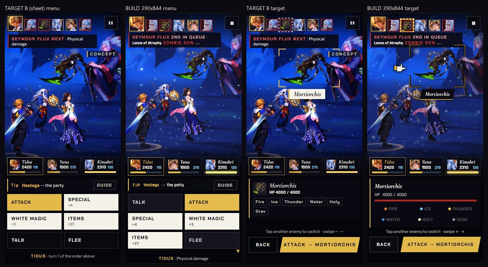
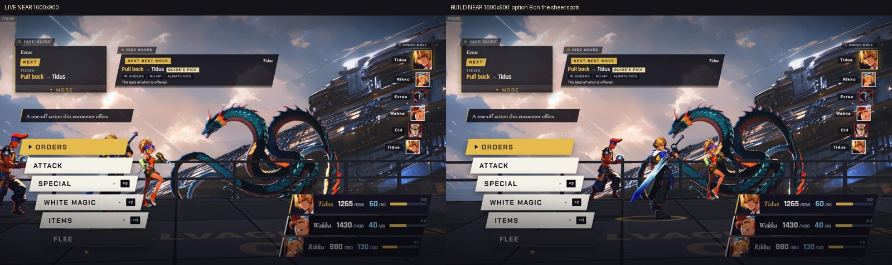
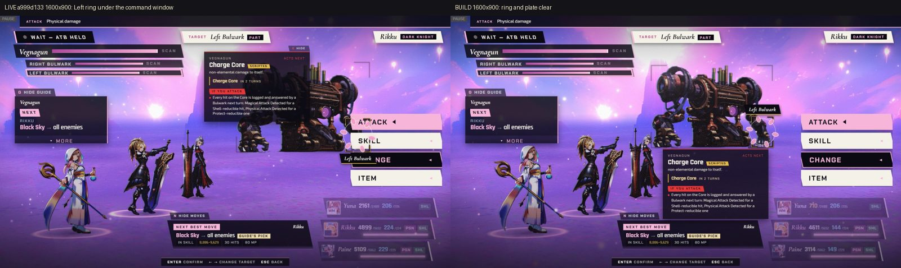

[Back to the changelog](../../CHANGELOG.md)

# 2026-09-25 · Release 16

Address: https://baileypillon.github.io/pyrefly-reprise/ (main fc7f1a20)

*Where a caption says left and right, the left picture comes first.*

- **FFX-2:** Chapter XIII, Trema, is playable: the optional superboss on Cloister 100 of the Via Infinito,
  Paragon first and then Trema, with a level 99 party.

  
  
  

  *Chapter XIII: the board card, the opening scene, and the first menu against Paragon.*

- **FFX-2:** Paragon's Oversoul gets its own look: an "Oversoul!" caption, then a blue cast, rim and motes.

  
  

  *Oversoul Paragon: the moment of the action with its caption (left), then the blue cast (right).*

- **FFX-2:** in Chapter XIII, Beguiling Mire's Stop and Paragon's Confuse wear off, and normal Paragon's
  physical attacks always land, as the sources say.

- **FFX-2:** a dressphere change no longer drops a girl's accessories (Crystal Bangle, Rabite's Foot) for
  the rest of the battle.

- **Both:** the phone battle screen is rebuilt as a compact rail: the turn list or boss gauge on top, big
  command tiles in thumb reach, the advisor as a one-line tip with GUIDE, three party chips, and a target
  card with Back and Confirm.

  
  

  *The approved phone layout (left of each pair) and the build (right), in Chapter IV and Chapter I.*

- **FFX:** in Chapter VIII the party is laid along the rail, so the command stack no longer covers Tidus.

  

  *Chapter VIII at near range: before (left) and after (right) the party is laid along the rail.*

- **FFX-2:** in Chapter V the Body stands on a new spot so the Left Bulwark's ring and plate clear the
  command window, and the Bulwark name plates dock clear of the enemy-intent card.

  

  *Chapter V, Left Bulwark targeted: the ring sits under the command window before (left) and clears it after (right).*

- **FFX-2:** the enemy-move card now sits above the fighters, keeps its chip with it, and clears when its
  enemy is KO'd.

  *(no screenshot from the time)*
