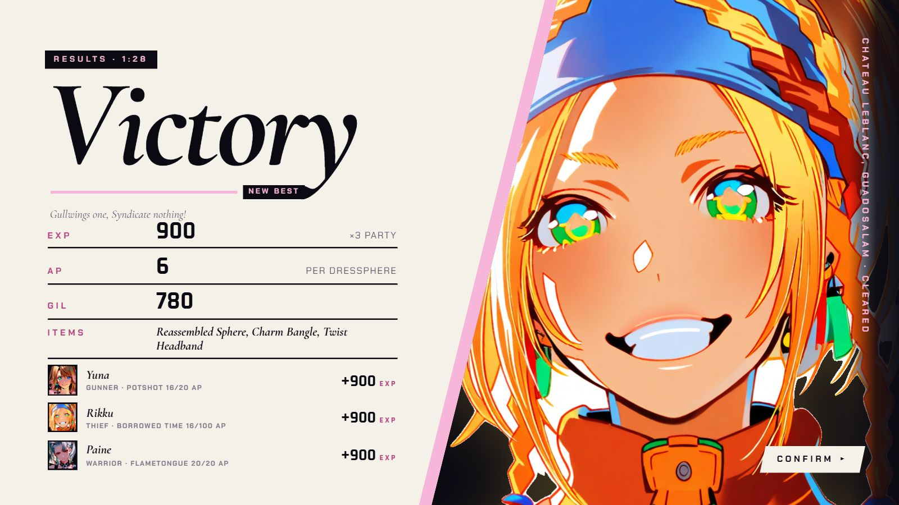
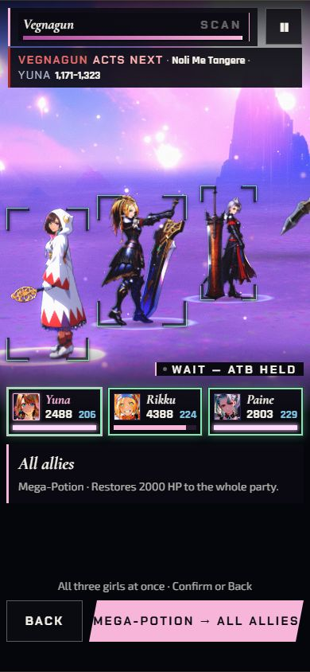

[Back to the changelog](../../CHANGELOG.md)

# 2026-09-25 · Release 17.1

Address: https://baileypillon.github.io/pyrefly-reprise/ (main 1a680e41)

*Where a caption says left and right, the left picture comes first.*

- **FFX-2:** the results screen's portrait wedge shows Yuna, Rikku and Paine in their FFX-2 art; it had
  drawn their FFX versions. A fallen leader lies down in the dressphere she wore. FFX results are unchanged.

  
  

  *Chapter VI results: Rikku (left) and Yuna (right) in their FFX-2 art.*

- **FFX-2:** on phones, tapping a menu row now moves the cursor to that row first, so the target card and
  Confirm name the command you tapped.

  

  *Chapter V on a phone: a tapped Mega-Potion makes the card and Confirm read "Mega-Potion → All allies".*
