[Back to the changelog](../../CHANGELOG.md)

# 2026-09-25 · Release 17

Address: https://baileypillon.github.io/pyrefly-reprise/ (build e45ed3c1, cut from a side branch)

*Where a caption says left and right, the left picture comes first.*

- **FFX-2:** 22 new painted battle poses for Yuna, Rikku and Paine in their dresspheres. Those moments used
  to show the standing painting.

  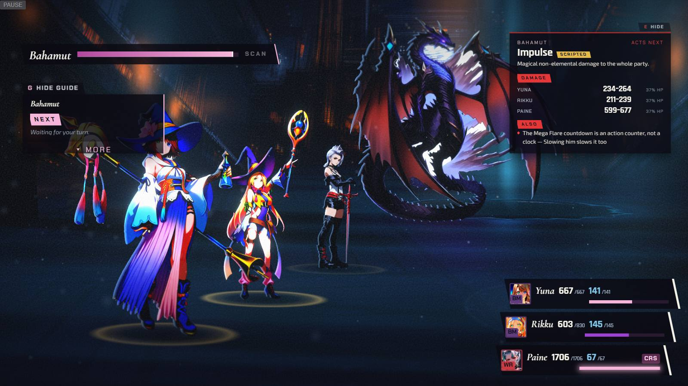
  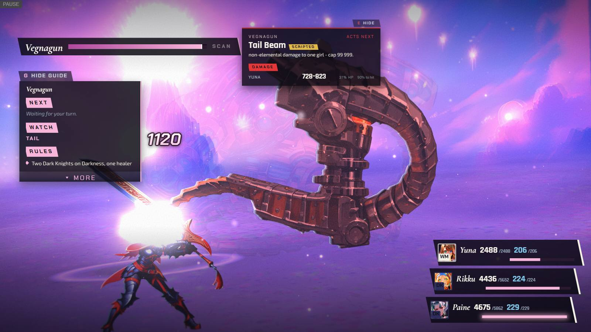
  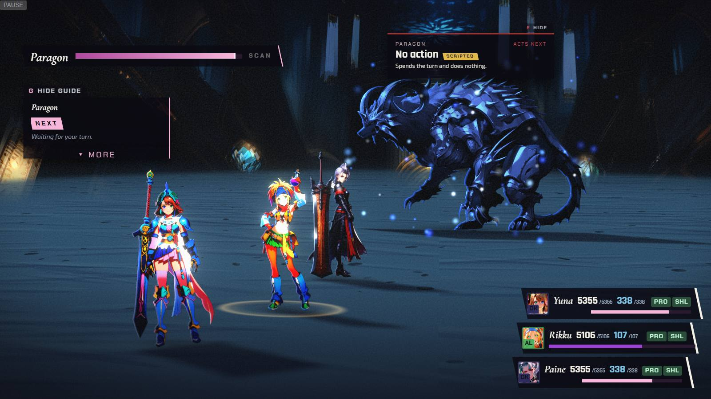

  *New poses in play: Rikku's Black Mage cast (Chapter IV), Paine's Dark Knight attack (Chapter V) and Rikku's Alchemist cast (Chapter XIII).*

- **Both:** the phone battle screen is repaired. ALL-target commands (Pray, Mega-Potion, group spells) get
  a touch Confirm step, the field slides to keep your party and the aimed figure whole, and every phone
  battle text is at least 14 px.

  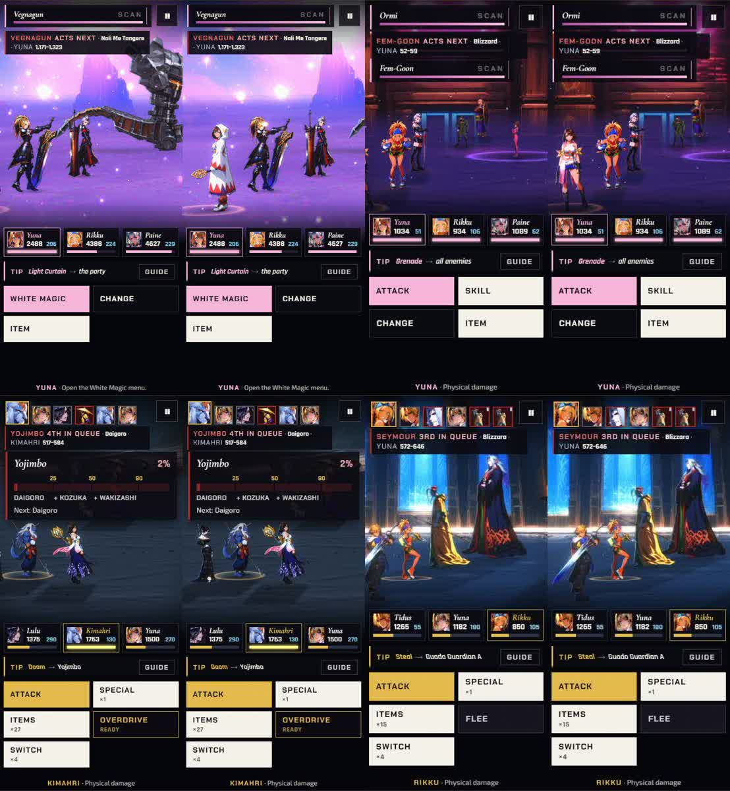
  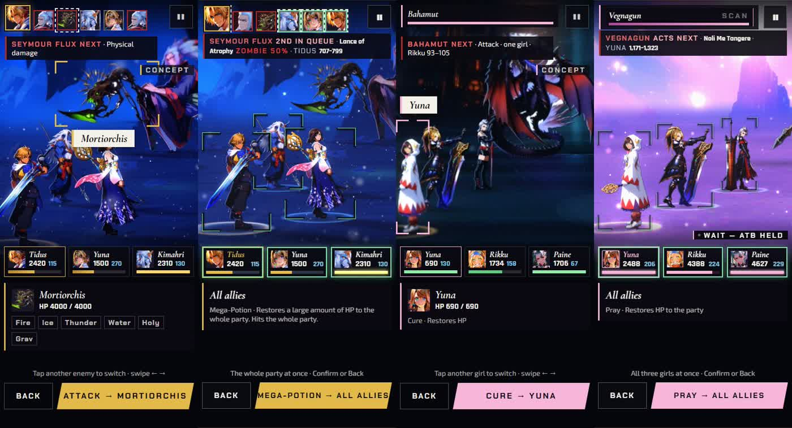

  *Phone framing, each pair before (left) then after (right): Yuna in Chapters V and VI and Lulu in Chapter IX are back in frame. The second picture shows phone target steps, including ALL-target commands with a Confirm bar.*

- **Both:** the results screen stands the speaker of the victory line in the portrait wedge, and the lines
  now rotate through the party. Chapter III's results card goes quiet.

  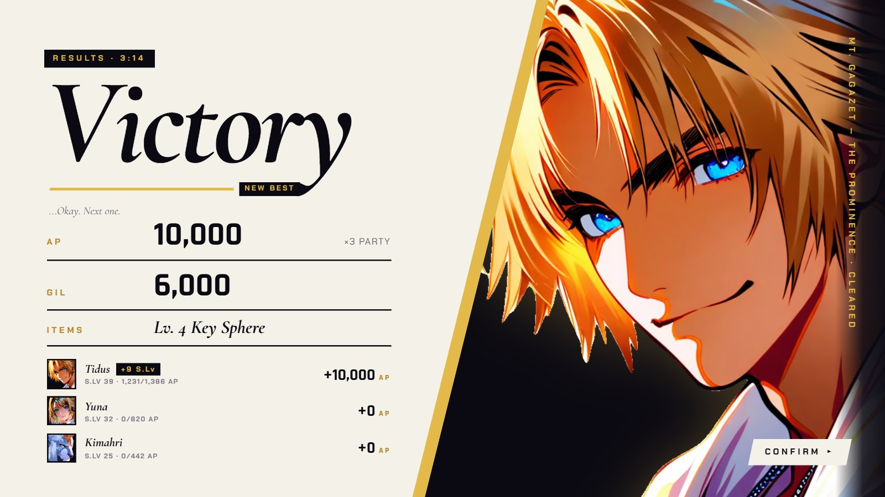
  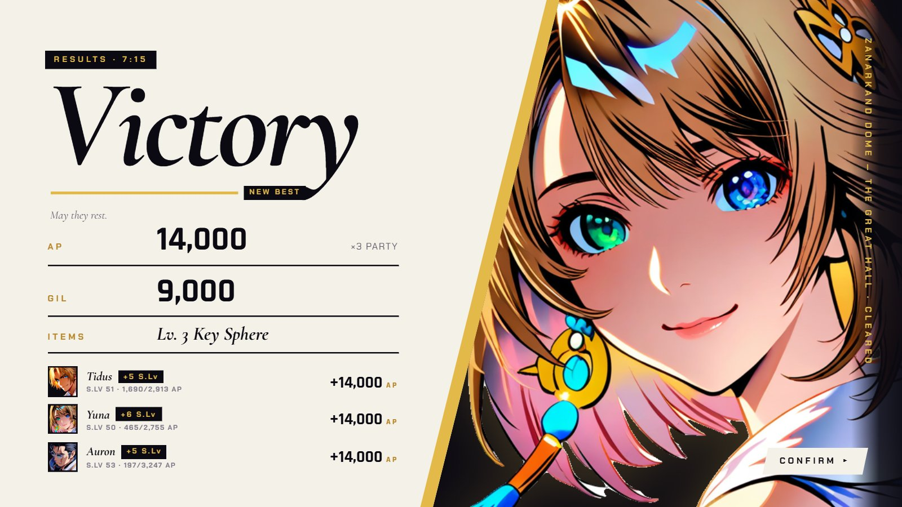

  *Results with the speaker in the wedge: Tidus after Chapter I (left), Yuna after Chapter II (right).*

- **FFX:** Chapter IX plays four mid-battle callouts, from Lulu, Auron, Kimahri and Yuna.

  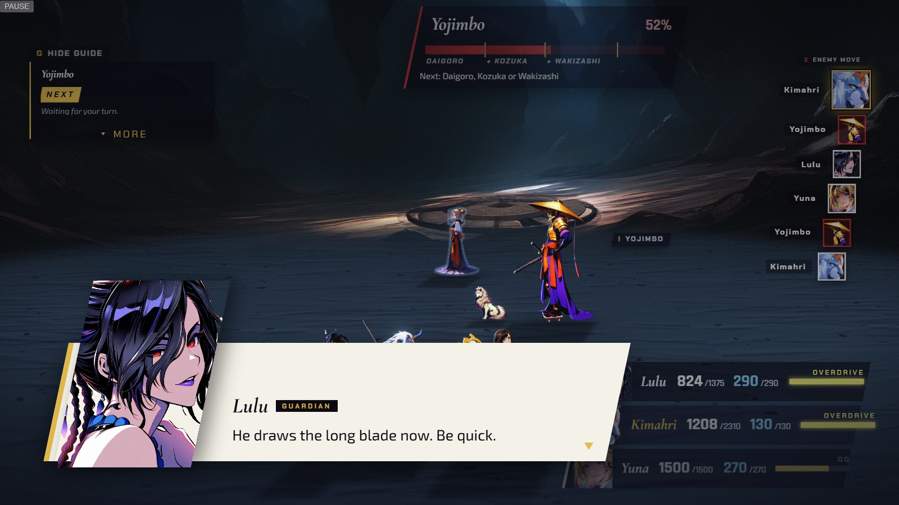
  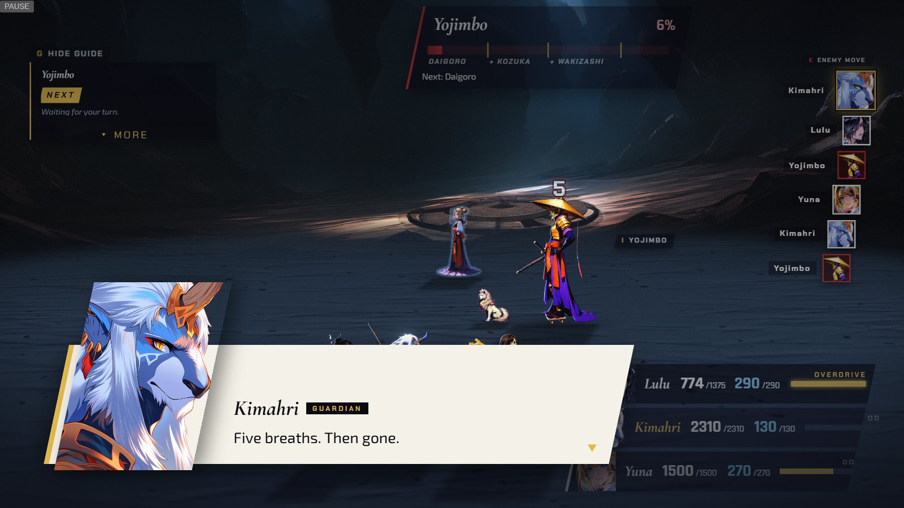

  *Chapter IX callouts: Lulu's (left) and Kimahri's, while he is doomed (right).*

- **Both:** Chapter IX no longer draws placeholder silhouettes after an update. The browser re-checks the
  art list instead of trusting an old copy.

  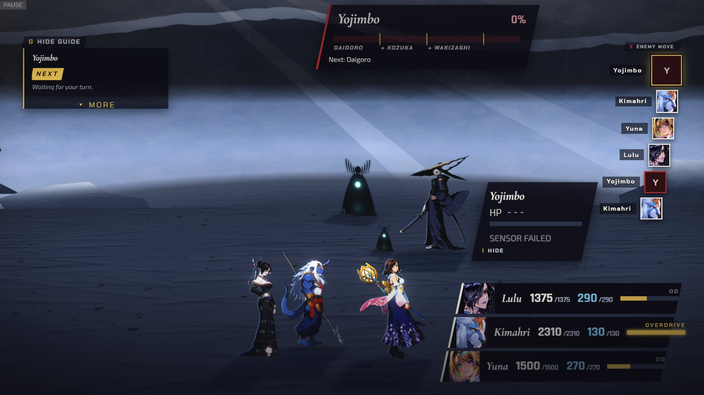
  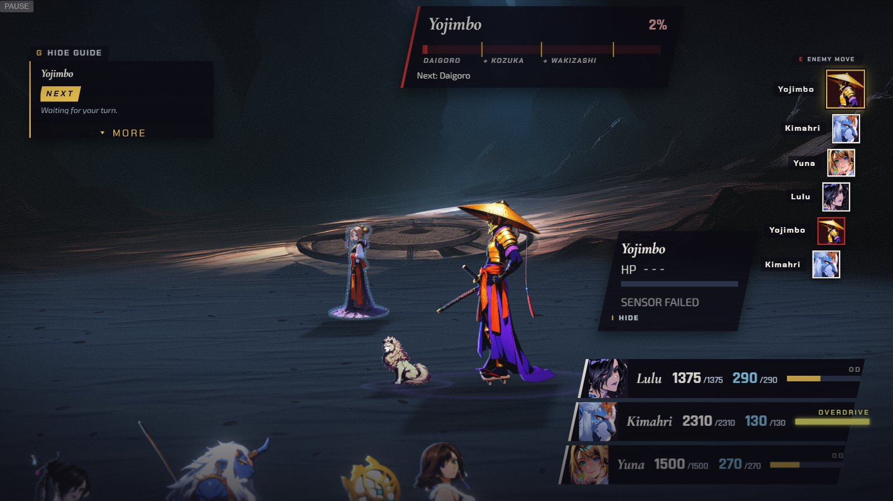

  *Chapter IX's battle with a stale art list (left, a stand-in where Yojimbo should be) and after the fix (right, Yojimbo and Daigoro painted).*

- **FFX-2:** Chapter XIII polish: the enemy-move card steers clear of the target ring, the pause CHAPTER tab
  leaves Trema's face clear and prints DRESSPHERE and GARMENT GRID in full, the phone view shows the
  Cloister fighters at full size, and the guide names the current link.

  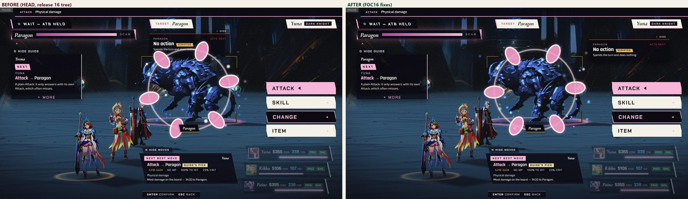
  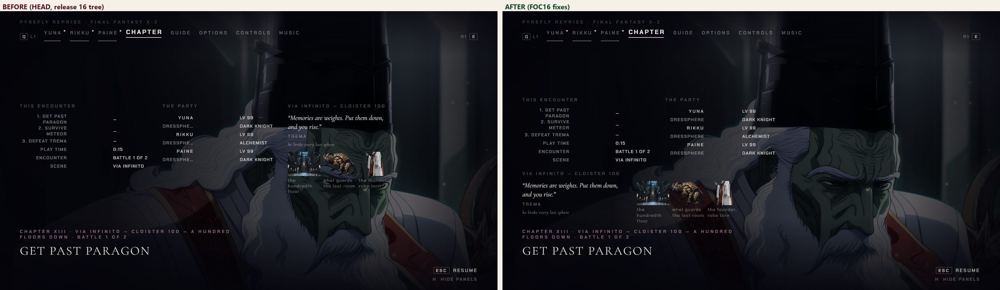

  *Chapter XIII, before (left half) and after (right half) of each frame: the target step, then the pause CHAPTER tab.*

- **FFX-2:** an enemy hit on a girl whose command menu is open closes that menu, and she gets a fresh one
  at once.

  *(no screenshot from the time)*

- **Both:** a chapter's first attempt no longer always plays the same fight. It draws a fresh seed, so a
  newcomer's first try at Chapter I is no longer always the same loss.

- **FFX:** Chapter I's guide stops calling Protect a defence and stops promising a Holy Water turn.

  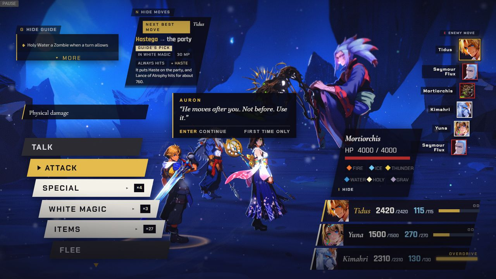

  *Chapter I's guide card with the reworded line.*

- **FFX-2:** the guides for Chapters V and VI open with the Wait habit: pick a command at once, because the
  clock keeps running until you do.

  *(no screenshot from the time)*

- **Both:** Auron's briefing says plainly when each clock runs: in the FFX fights nothing moves until you
  act, and in the FFX-2 fights the clock keeps running until you pick a command.

  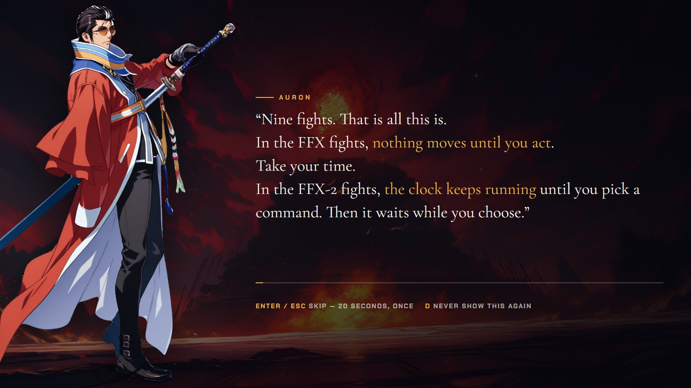

  *Auron's briefing after the reword.*
