[Back to the changelog](../../CHANGELOG.md)

# 2026-09-26 · Release 19

Address: https://baileypillon.github.io/pyrefly-reprise/ (main 43dca986)

- **FFX-2:** new Chapter XV, the Den of Woe. Three fights in a row against the shades of Baralai,
  Gippal and Nooj. You arrive with three Hero Drinks and eight extra levels.

  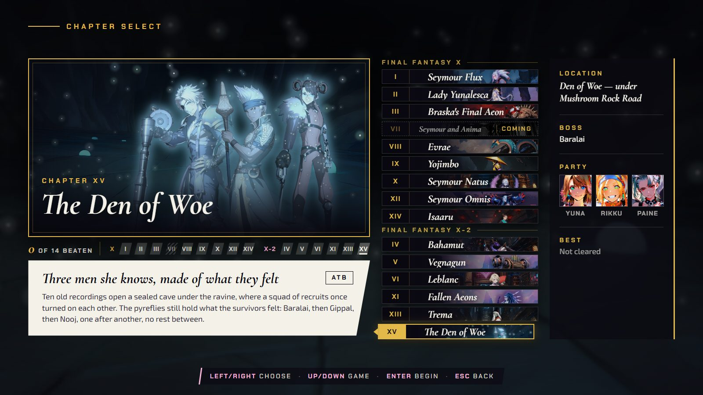

  *The new Chapter XV card on the board, the last in the FFX-2 group.*

  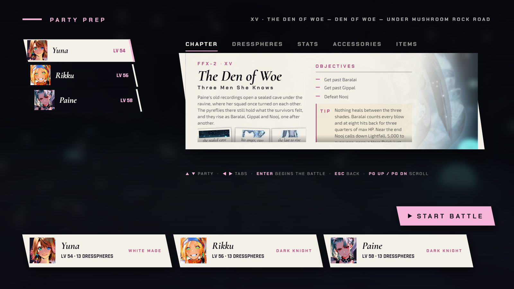

  *Party prep: the three girls arrive at LV 54, 56 and 58, and the card lists the three objectives (get past Baralai, get past Gippal, defeat Nooj).*

  

  *The first menu against Baralai's shade, in the cave under Mushroom Rock Road.*

  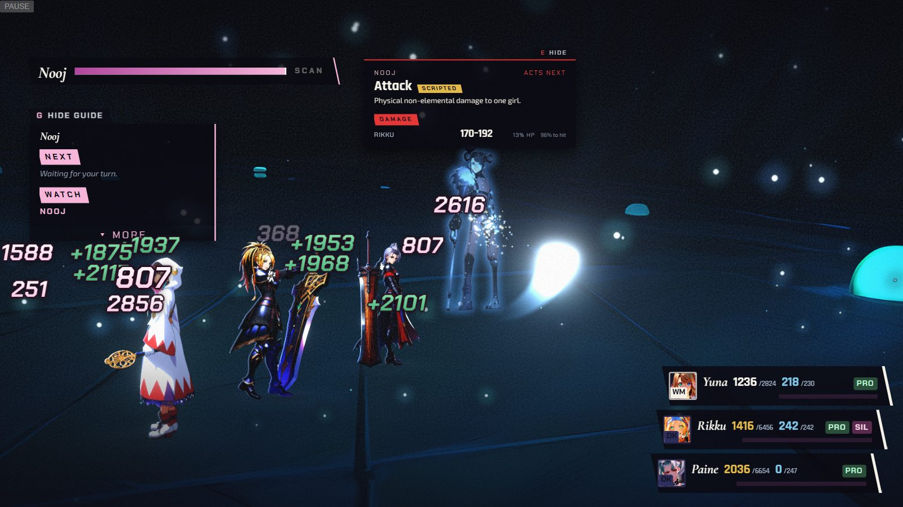

  *The third fight, against Nooj's shade.*

- **FFX:** in Chapter III the advisor no longer sends a healing item at a Zombie ally, and it letters
  the twin Yu Pagodas A and B on its card, the strategy panel and the target plate.

  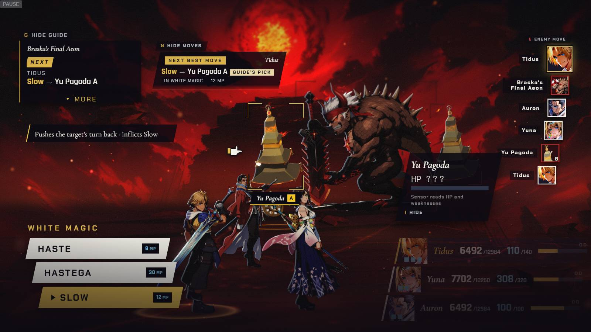

  *Chapter III: the advisor card (top centre) and the strategy panel (top left) both say "Slow, Yu Pagoda A", and the target plate on the pagoda carries the same A.*

  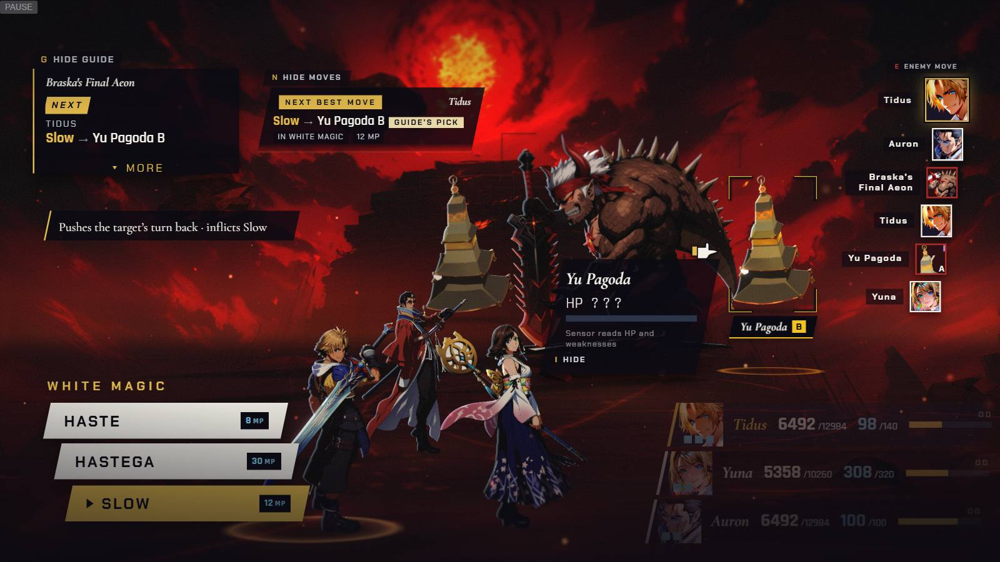

  *With the other pagoda aimed, card, panel and plate all say B.*

  *(no screenshot from the time of the Zombie fix)*

- **Both:** the intent card lists every possible target of a random-target move, and the phone intent
  strip keeps its SCRIPTED / MOST LIKELY badge so a guess never reads as certain.

  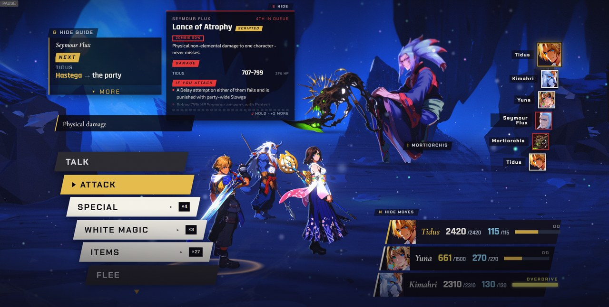

  *Before (release 18, Chapter I): Lance of Atrophy lists only Tidus, though it can land on any of the three.*

  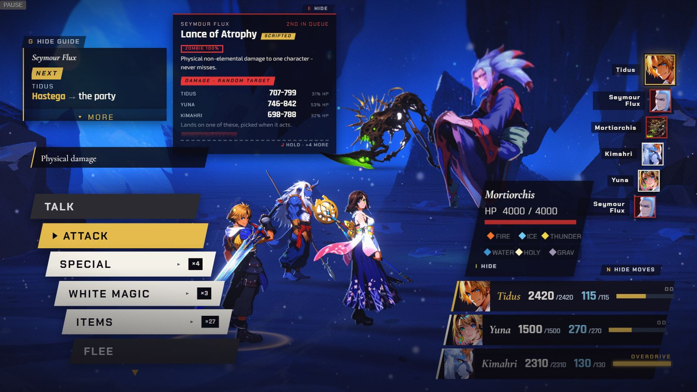

  *After (release 19): "Damage, random target" lists Tidus, Yuna and Kimahri, and says it lands on one of them.*

  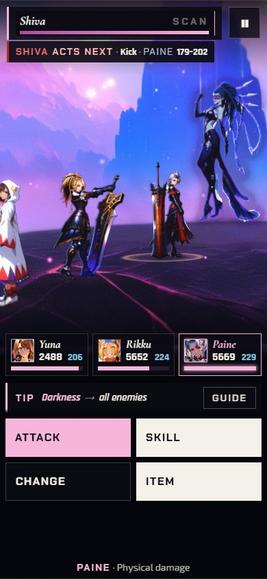

  *Before (release 18, Chapter XI, 390x844): the strip reads "Kick, PAINE 179-202" with no qualifier, so a guess reads as certain.*

  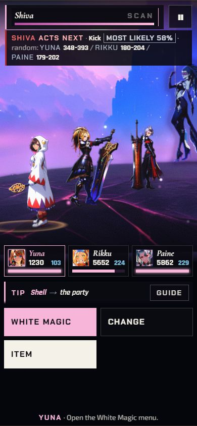

  *After (release 19): it reads "Kick, MOST LIKELY 58%" and lists every candidate.*

- **FFX-2:** Shuyin's charge bar names the spell he is casting (Chapter V).

  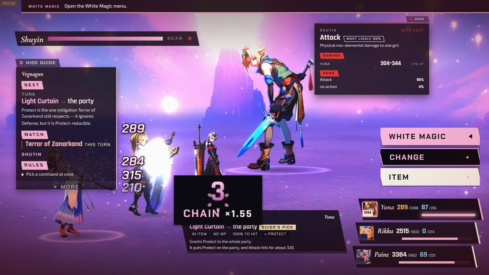

  *Before (release 18, Chapter V, link 5): the intent card says "Attack, MOST LIKELY 96%" while the guide's WATCH row says "Terror of Zanarkand this turn".*

  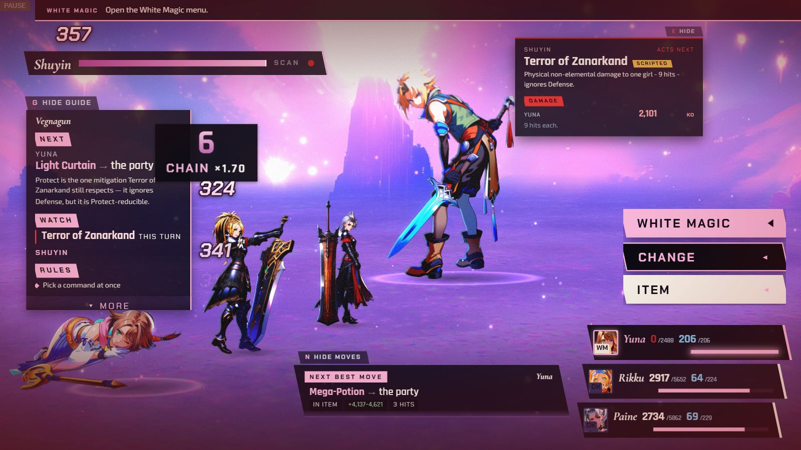

  *After (release 19): while the red charge dot is lit beside Shuyin's bar, the card names "Terror of Zanarkand", and so does the guide.*

- **Both:** the advisor card keeps the chip that names the menu a move lives in, even at its smallest
  size.

  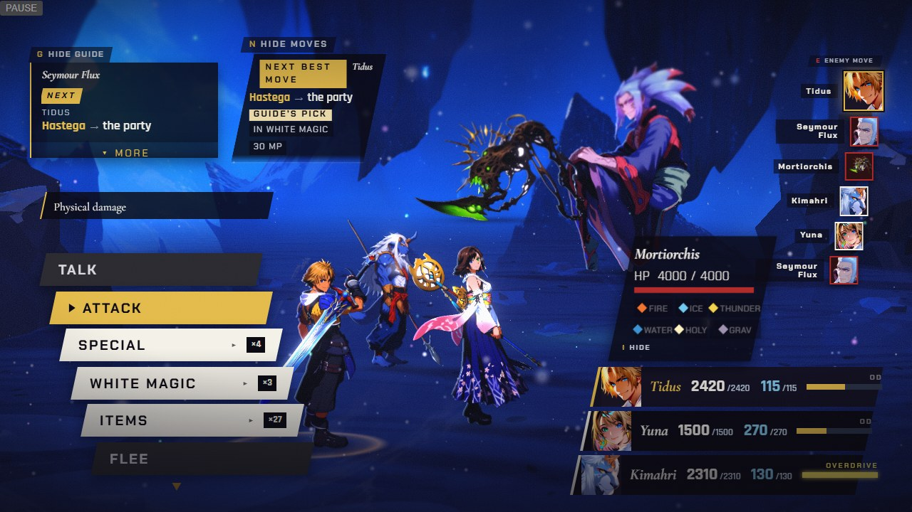

  *After (release 19, 1280x720, Chapter I): the narrow advisor card at the top still carries its "IN WHITE MAGIC" chip.*
