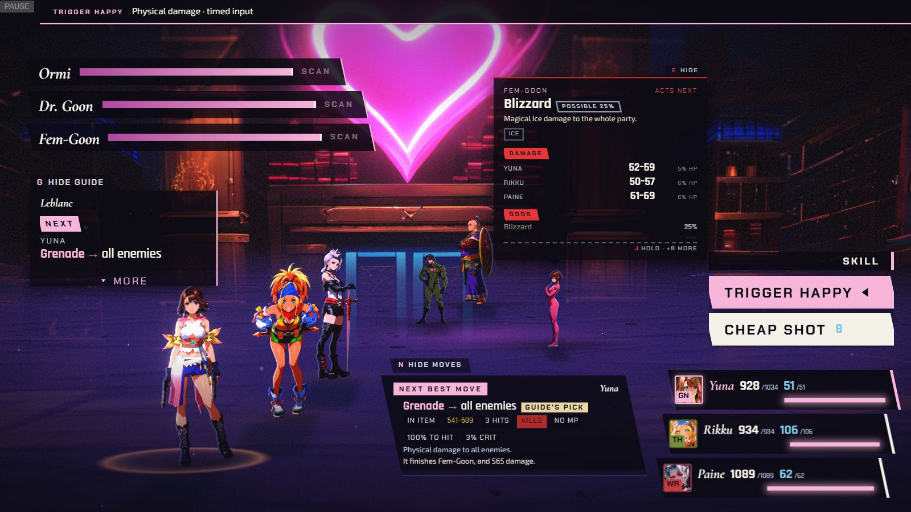
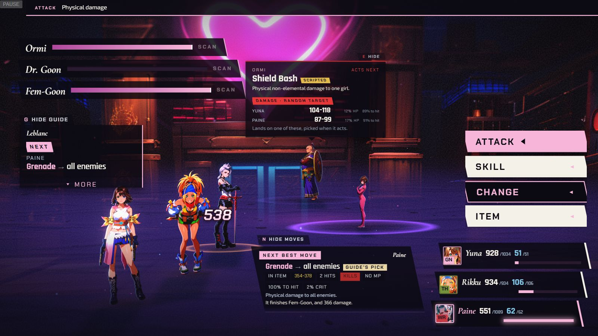
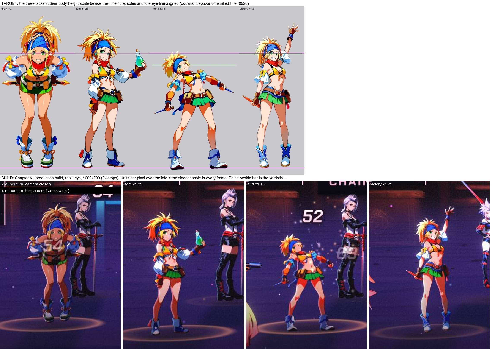
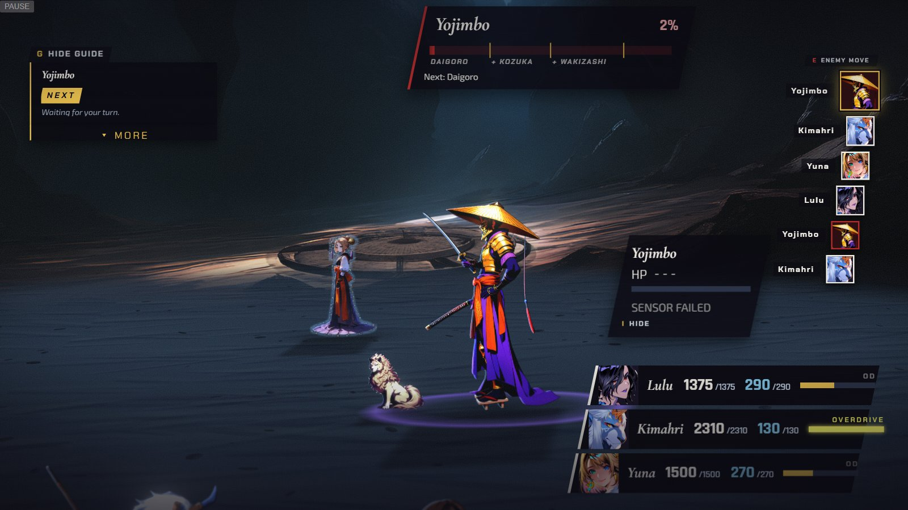

[Back to the changelog](../../CHANGELOG.md)

# 2026-09-26 · Release 20

Address: https://baileypillon.github.io/pyrefly-reprise/ (main ce05b02c)

- **FFX-2:** an all-target move now hits each target once. It used to wrap onto a girl already hit and,
  in Chapter V, skip a living Redoubt. Acta Est Fabula heals only the two Redoubts.

- **FFX-2:** an enemy's plain hit no longer closes your open command menu. Only a Delay or
  Action-cancel ability does.

  

  *Chapter VI, ACTIVE mode: Ormi's Shield Bash hits Yuna for 106, and her open Skill list (Trigger Happy, Cheap Shot) stays open.*

  

  *Ormi's Supercollider, a Delay move, hits Paine for 538, and her menu closes back to the top row (Attack, Skill, Change, Item).*

- **FFX-2:** 23 new battle poses for the girls' dresspheres (Gunner, Warrior, Dark Knight, Alchemist,
  Songstress, White Mage, Black Mage and Rikku's Thief), seen in Chapters IV, V, VI and XIII.

  

  *Twenty of the new poses as they play in the game at 1600x900, each labelled with its dressphere, move and chapter (IV, V, VI and XIII).*

  

  *Rikku's three Thief poses (item, hurt and victory). Top: the paintings beside her idle. Bottom: the same three in Chapter VI.*

- **FFX:** Sensor no longer opens a plate (a name, dashes and "SENSOR FAILED") for a target that is
  immune to it, such as Yojimbo, Isaaru and Seymour Omnis.

  

  *Before (Chapter IX, a build from 25 September): Yojimbo's plate at the right reads "HP ---" and "SENSOR FAILED".*

  *(no screenshot from the time of the after: the plate simply no longer appears)*
