[Back to the changelog](../../CHANGELOG.md)

# 2026-09-27 · Release 22

Address: https://baileypillon.github.io/pyrefly-reprise/ (main a44297ca)

- **Both:** mid-battle story lines show on a small card that stays clear of the party and of whoever
  is speaking.

  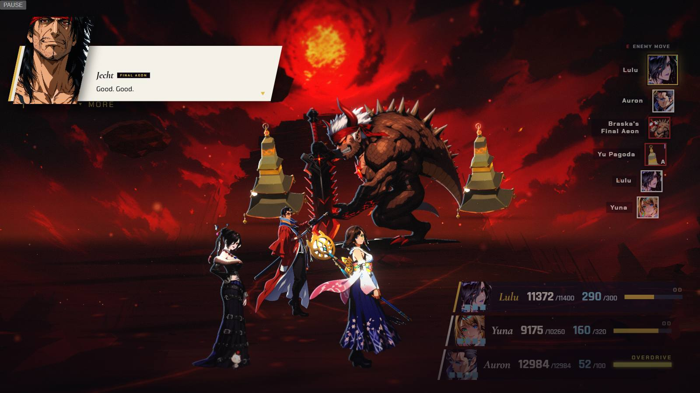

  *Chapter III: Jecht's line on a small card in the top left, clear of the party and of Braska's Final Aeon.*

  

  *Chapter V: Shuyin's line, with the card clear of the girls and of Shuyin himself.*

- **Both:** a fiend that is sent dissolves into pyreflies from the feet up with a gold burn. Pyreflies
  drift only where the story puts them: none in the Chateau Leblanc, and Macalania's Chamber-door
  motes wait until Seymour falls.

  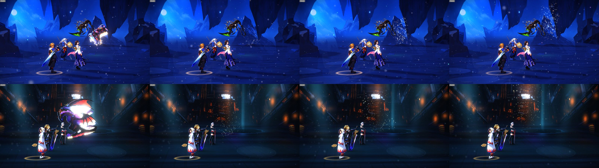

  *Frames from 0.15 to 2.4 seconds after a fiend is sent, in a forced capture. Top row: Seymour Flux in Chapter I. Bottom row: Bahamut in Chapter IV. Each takes a gold burn, then breaks into pyreflies that rise from where it stood.*

- **Both:** the arena's light shifts on key beats (Seymour Flux's Reflect, Yunalesca's later forms,
  Anima, Bahamut's countdown, Vegnagun's links), and shadows under fighters read on dark floors.

  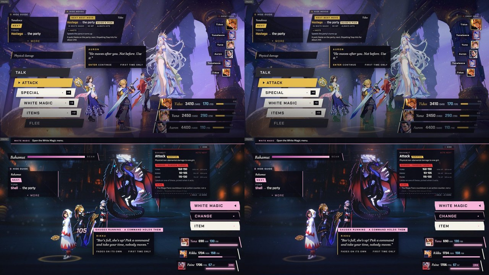

  *Forced captures of the same moment without (left) and with (right) a beat's lighting. Top: Chapter II with the lighting for Yunalesca's later forms, where the backdrop dims and cools. Bottom: Chapter IV with Bahamut's lighting cue. The shift is subtle.*

  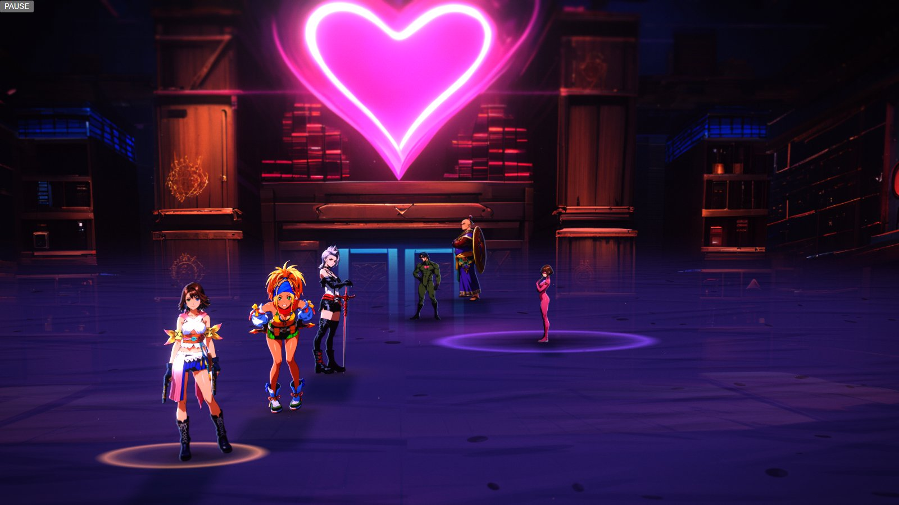

  *Chapter VI at the first menu: the girls and the Syndicate each stand on a soft contact shadow that still reads on the dark floor.*

- **Both:** Spiral Cut (FFX) and Mega Flare (FFX-2) are drawn as particle effects.

  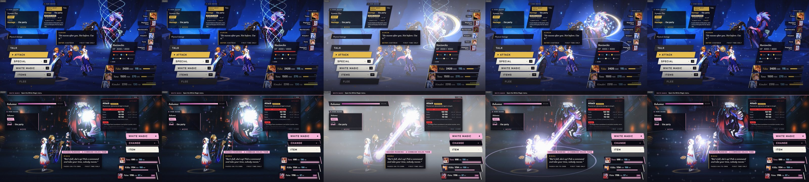

  *Top row: Spiral Cut (FFX, Chapter I). Bottom row: Mega Flare (FFX-2, Chapter IV, against Bahamut).*

- **FFX-2:** in Chapter V, losing to Shuyin retries from Shuyin with your HP carried, Vegnagun's
  Bulwark rings are flattened to the picked frame, and the enemy-move card stays off Vegnagun's face
  and weapons.

  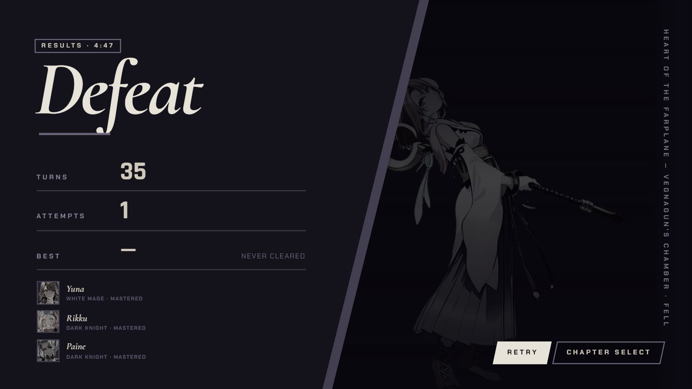
  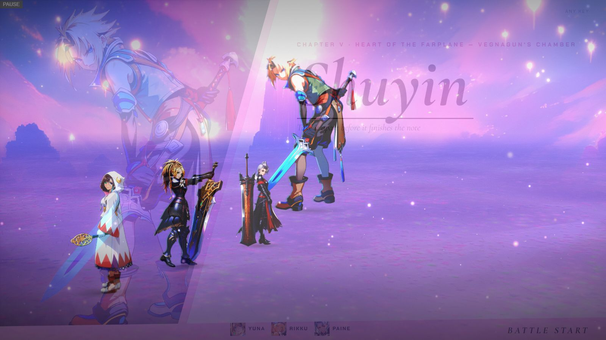

  *Chapter V: after a defeat to Shuyin, RETRY starts again at Shuyin's fight rather than at the start of the chapter.*

  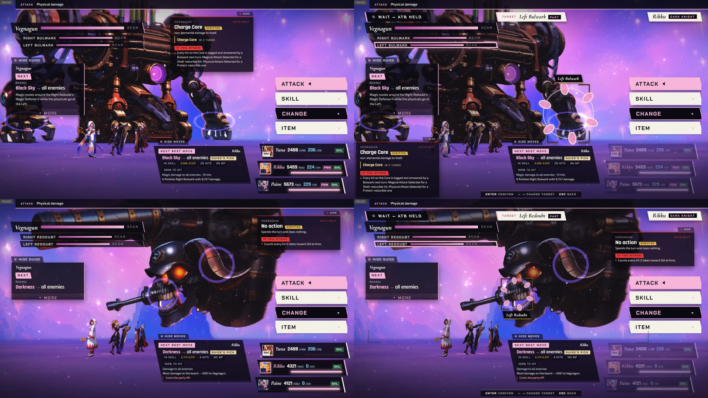

  *Chapter V, played by real keys. Top, link 3: the Bulwark rings lie flat on the ground at the legs. Bottom, link 4: the enemy-move card (upper right) sits clear of the skull's face and the gun.*

- **FFX-2:** a chained fight shows the spoils of every battle, not just the last, and an
  all-petrified party is a Game Over at once.

  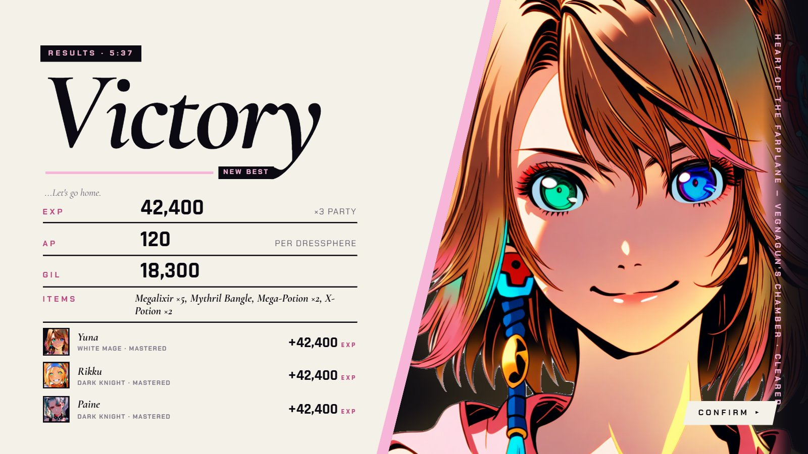

  *Chapter V: the results add up the whole chain (42,400 EXP, 120 AP, 18,300 Gil and the items), not just the last fight.*

- **FFX:** Chapter X's Talk gives Tidus, Auron and Yuna a line each, and Seymour answers. Mid-battle
  lines are spoken only by characters who are fielded, with stand-ins.

  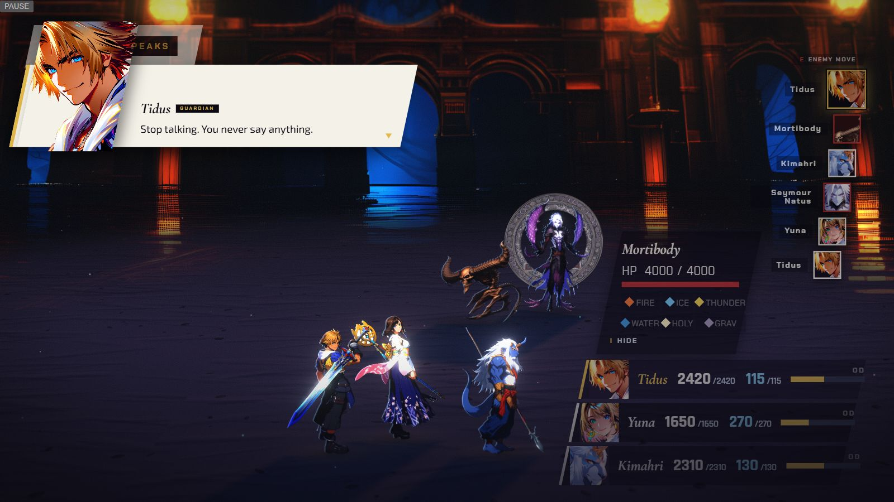

  *Chapter X: Tidus's Talk line shows on the card while the fight with Seymour Natus goes on.*

- **FFX:** in Chapter VIII, Rikku starts at sphere level 41 (our estimate; it was 53), and her line
  after Brother's is reworded.

- **FFX:** the target name plate sits off the party's faces, an Overdrive shows a "Tidus · Overdrive"
  plate, aeon tiles on the turn list show the aeon's painting instead of letters, and the Zanmato
  gauge holds until Yojimbo's strike ends. Kimahri's first turn has no dead key press.

  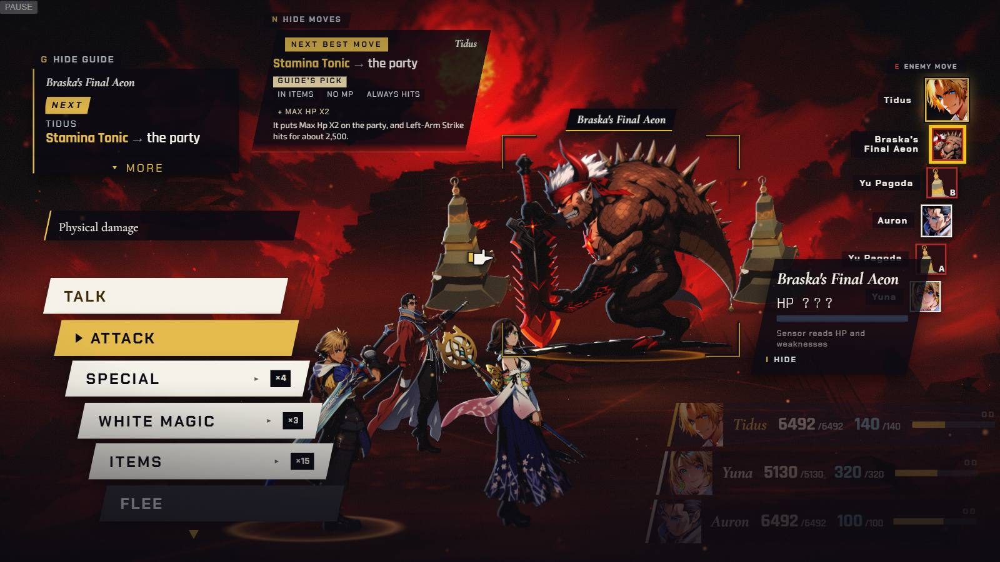

  *Chapter III, aiming at Braska's Final Aeon: the target's name plate sits against the enemy, well clear of the party's faces.*

  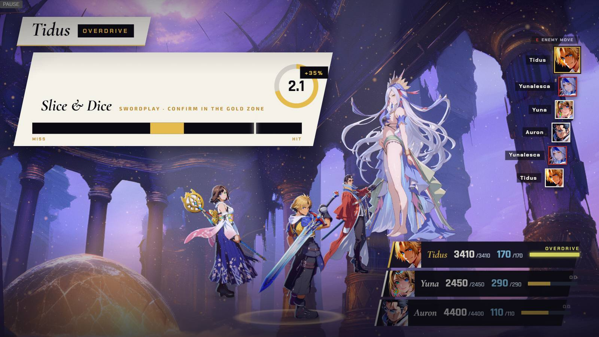

  *Chapter II: a "Tidus · Overdrive" plate sits above the Swordplay slab.*

  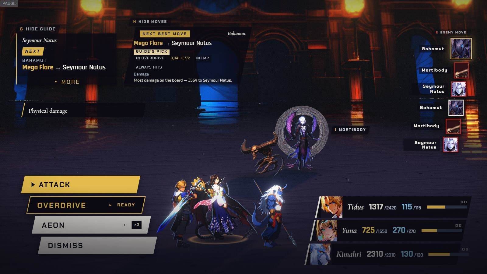

  *Chapter X: the turn list on the right shows Bahamut's painting, not a letter.*

- **Both:** the title opens on the picture, never black. The chapter board comes back on the last
  chosen chapter after a prep Esc, a results CONFIRM or a reload. The pause music stops when you
  resume a scene with no music, and a painting reloads once if a network hiccup drops it.

  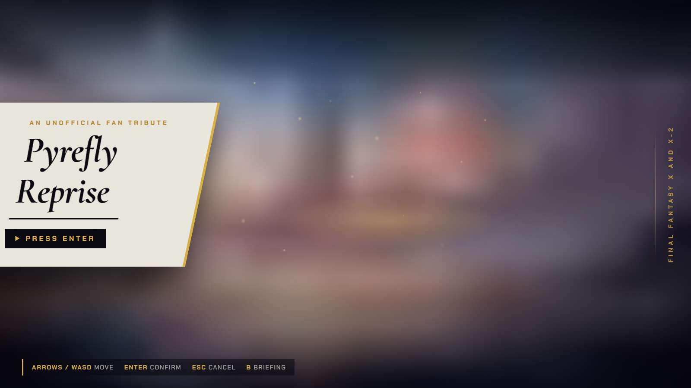

  *The title's first frame is the painting, softened, with the card already on it.*

  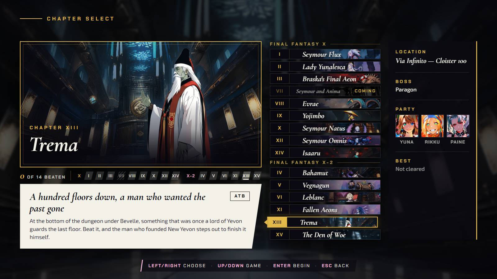

  *After Esc from party prep, the chapter board is back on Chapter XIII, Trema.*

  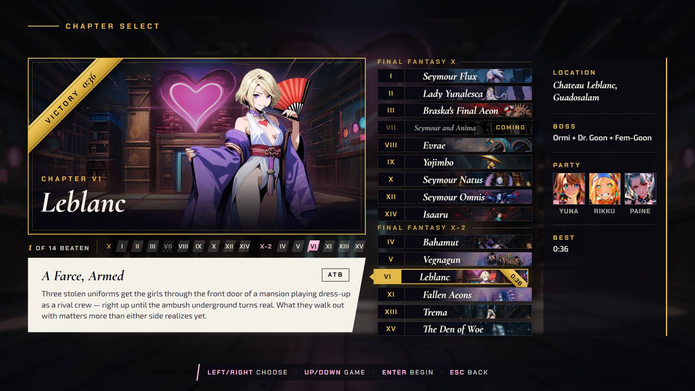

  *After CONFIRM on the results, it is back on Chapter VI, Leblanc, now with a VICTORY sash and a best time.*

- **Both:** a smaller download: unused audio auditions and raw art renders no longer ship (about 180
  fewer files).
