[Back to the changelog](../../CHANGELOG.md)

# 2026-09-27 · Release 23

Address: https://baileypillon.github.io/pyrefly-reprise/ (main ff3884fb)

- **FF7 (hidden):** a hidden Final Fantasy VII experiment: a Guard Scorpion fight in the No. 1 Reactor,
  with its own ATB battle, menus and Tail Laser warning, behind a secret door on the chapter select.
  It keeps its own record and never touches your save.

  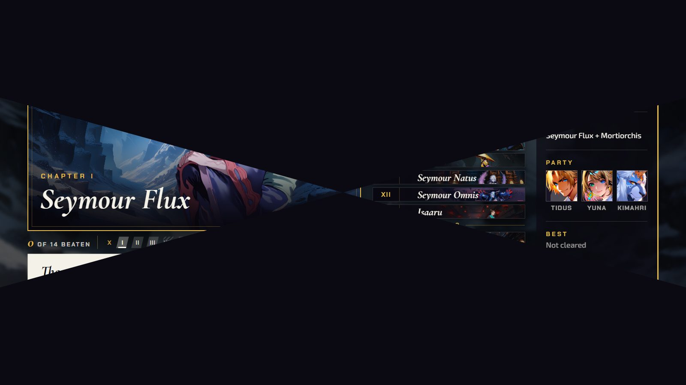

  *The secret door: the chapter board pinches and twists away as the fight opens.*

  

  *The No. 1 Reactor: the Guard Scorpion on the left, the party on the right, and the first command window (Attack, Magic, Item) with its time gauges.*

  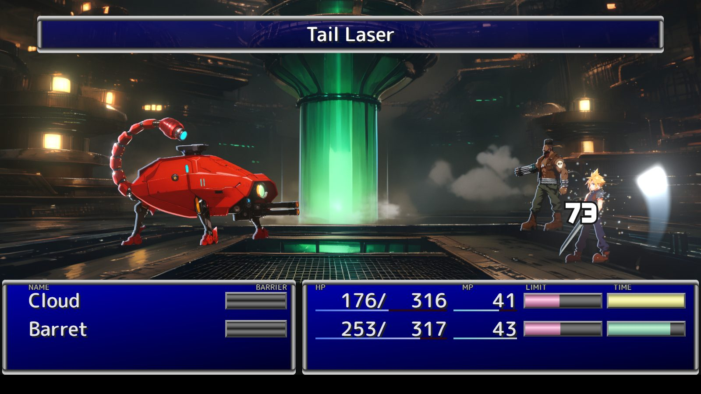

  *The Tail Laser: its name is announced across the top as the beam hits Cloud.*

- **Both:** the camera rolls on an attack's first hit instead of its swing, and adds no time.

  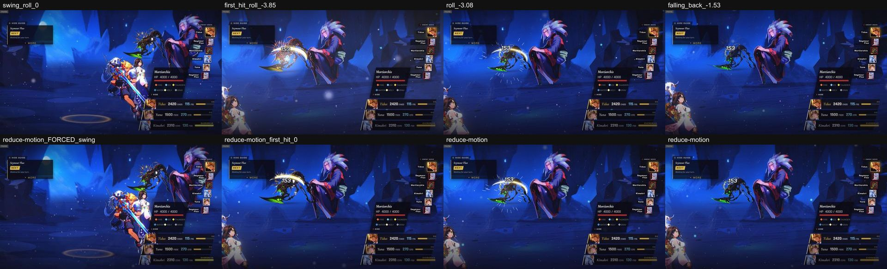

  *Chapter I, 1600x900. Top row: the camera is level at the swing, rolls to about -4 degrees as the first hit lands, and falls back. Bottom row: under REDUCE MOTION it stays level.*

- **Both:** the party stays in frame. A push-in stops short of cutting a standing fighter, and FFX-2
  shots keep the enemy and the girls on screen.

  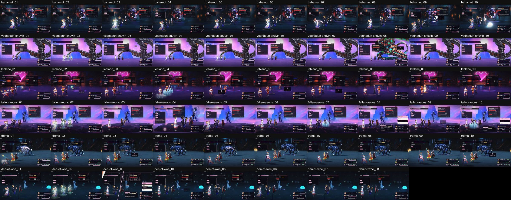

  *FFX-2's camera while the ATB clock runs, ten frames from each of Chapters IV, V, VI, XI, XIII and XV (eight from XV): the enemy and the girls stay in view in 56 of the 58 frames.*

  *(no screenshot from the time of the FFX push-in)*

- **Both:** on an upright phone every chapter stands the camera back at the start until the fight
  fits, and actions stay on that shot.

  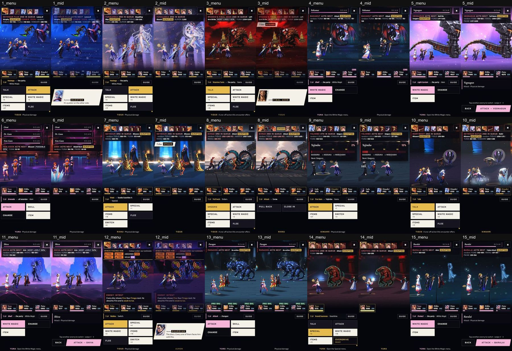

  *Each chapter on a 390x844 phone, at the first menu and mid-fight: the camera stands back at the start so more of the fight fits inside the narrow picture.*

  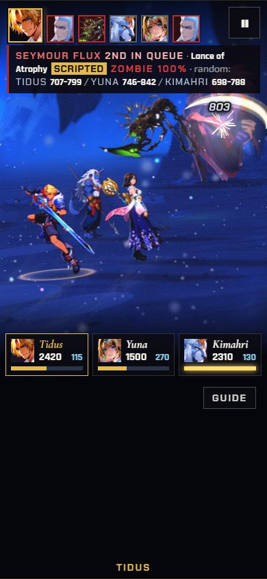
  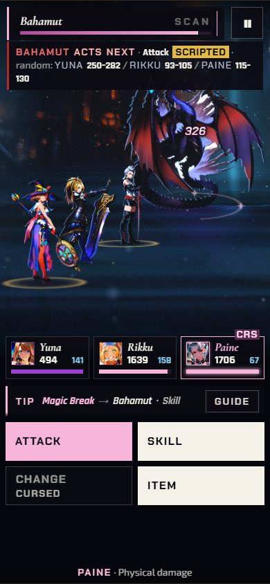

  *Actions stay on that shot: Tidus's hit on Seymour Flux (Chapter I) and Fira on Bahamut (Chapter IV).*

- **Both:** the first menu opens sooner, because opening callouts and the Sensor read now run under the
  fight.

- **Both:** a battle that takes more than 0.4 seconds to load shows the battle-start card, with a gold
  hairline.

  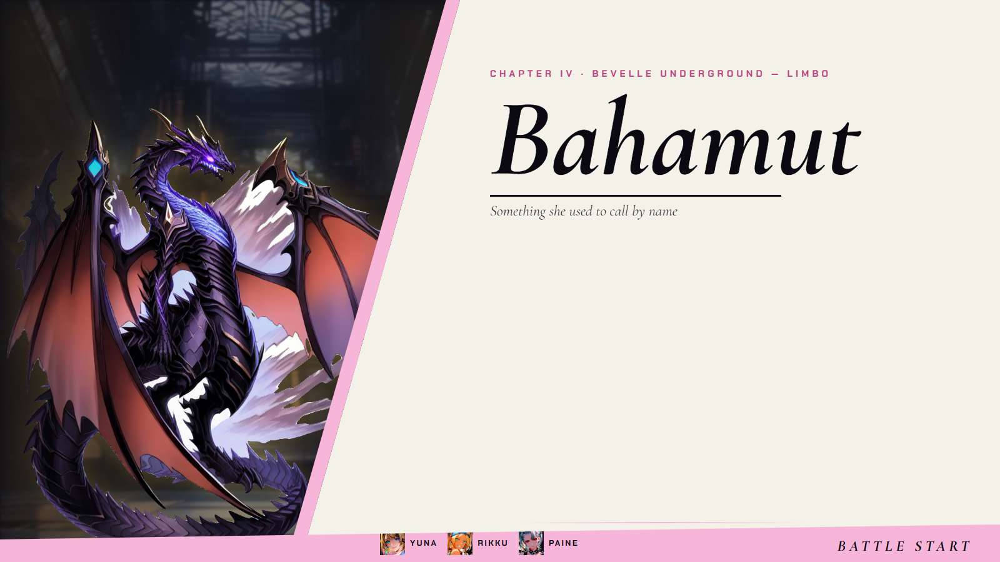

  *Chapter IV: a slow load raises the battle-start card for Bahamut over the entry.*

- **FFX-2:** the next girl's cut-in is held for 0.8 seconds at most, so a charge's effect tag reads
  first. Vegnagun's parts get contact shadows where they meet the Farplane in Chapter V.

  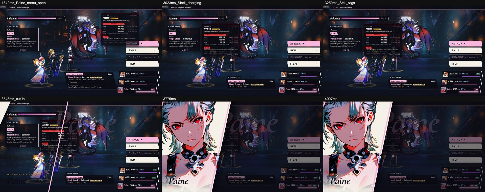

  *Chapter IV, frame by frame: Paine's menu is open, Shell is charging, the SHL tags light on the girls' rows, and only then does Paine's cut-in come in.*

  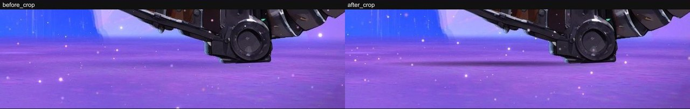

  *Chapter V, first link: where Vegnagun's tail arm meets the Farplane. Left, before: nothing under it. Right, after: a contact shadow.*

- **FFX:** Chapter IX's Yojimbo shot opens upward only on a 4:3 screen, so heads stay in frame.

  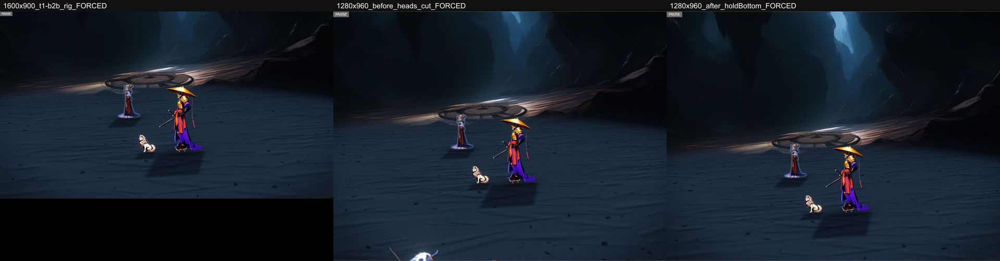

  *Chapter IX. Left: the 16:9 shot, for reference. Middle, before (1280x960): a head pokes in along the bottom edge. Right, after (1280x960): the shot keeps it out.*
