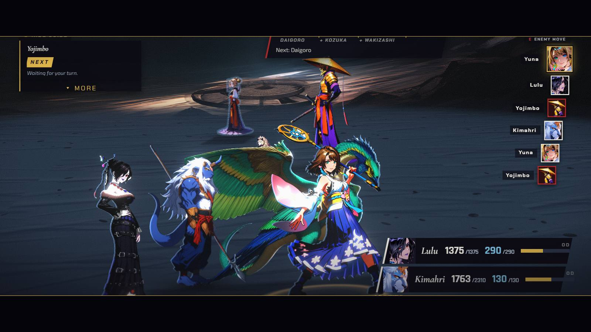
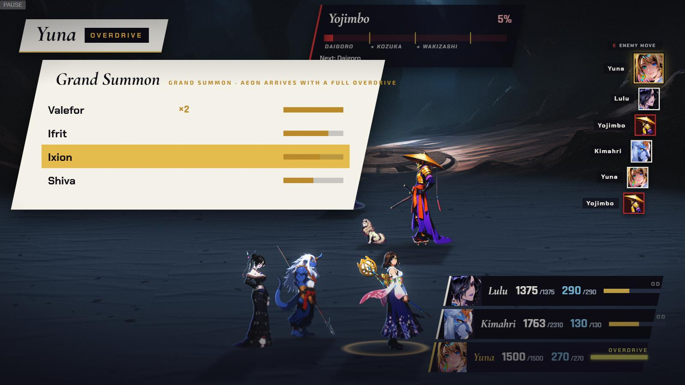
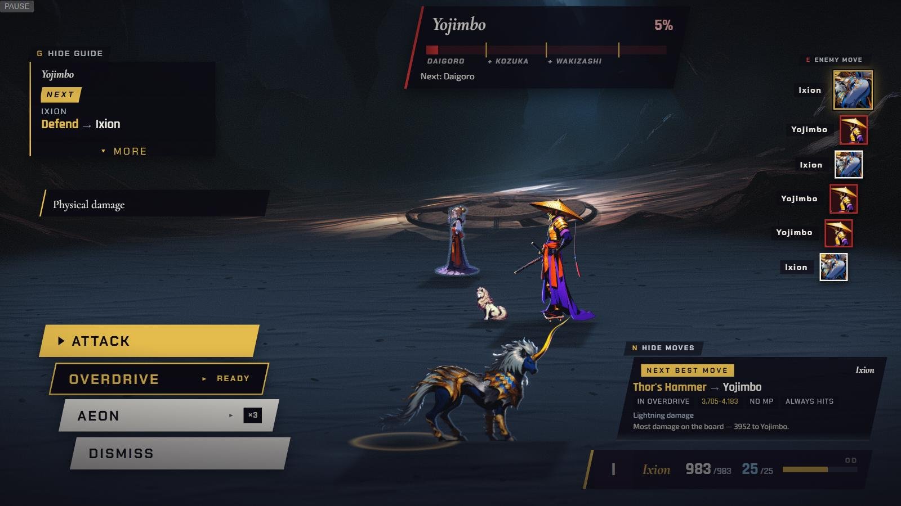
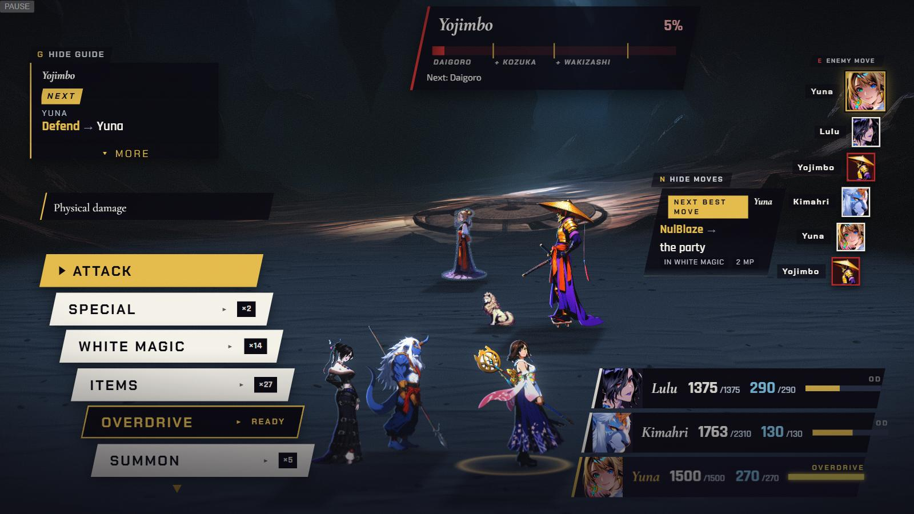
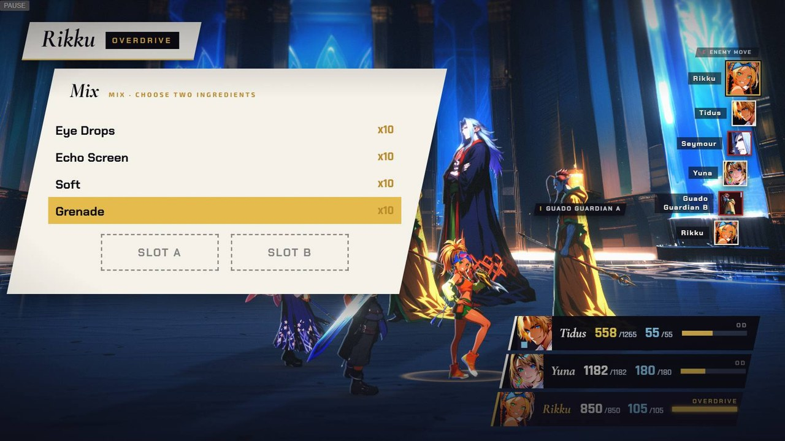
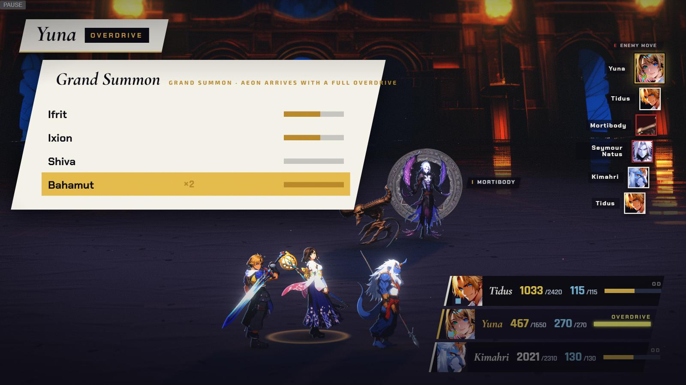
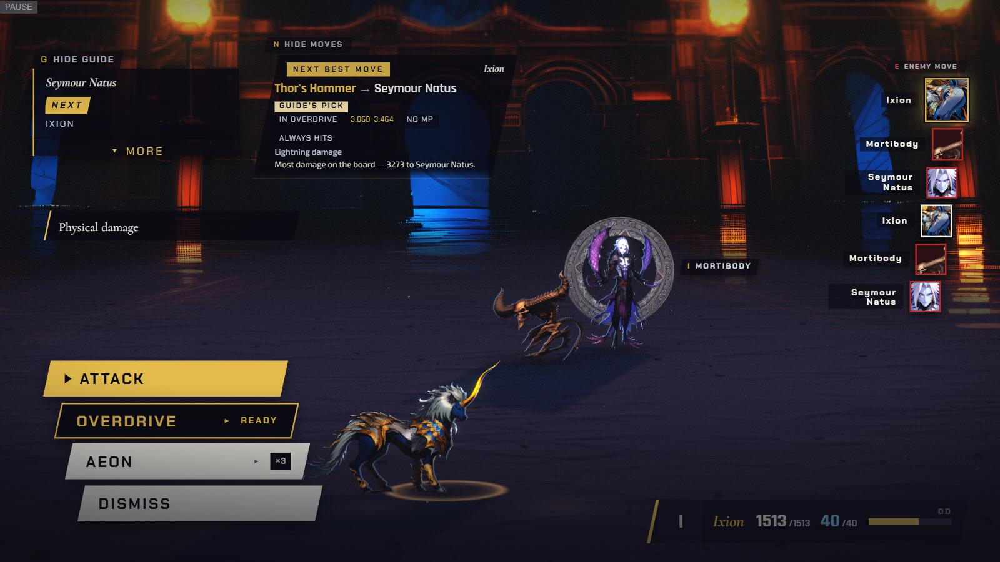
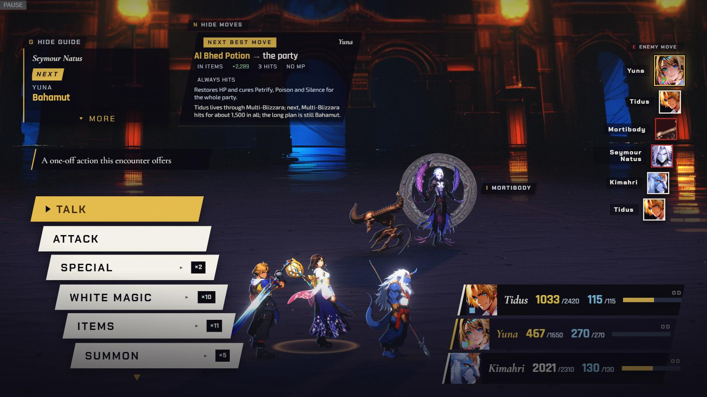

[Back to the changelog](../../CHANGELOG.md)

# 2026-09-27 · Release 24 (hotfix)

Address: https://baileypillon.github.io/pyrefly-reprise/ (main bc4e70ee)

- **FFX:** Yuna's Grand Summon now calls the aeon you pick. A crash in the picker had made it put
  Valefor out every time.

  

  *Before (release 23, Chapter IX): Grand Summon skips the picker and puts Valefor out, with Lulu, Kimahri and Yuna still standing around her.*

  
  

  *After (release 24): the picker opens with Ixion chosen on its third row, and Ixion comes out, with the party gone from the field.*

- **FFX:** backing out of Grand Summon, Mix or Rage with Esc returns you to the character's menu with
  the Overdrive gauge kept.

  

  *Chapter IX: after backing out of Grand Summon with Esc, Yuna's menu is back, with OVERDRIVE still READY and her gauge full.*

- **FFX:** Rikku's Mix list no longer opens empty.

  

  *Chapter VII: Rikku's Mix list shows the ingredients (Eye Drops, Echo Screen, Soft, Grenade, each x10) and waits for two to be picked into SLOT A and SLOT B.*

- **FFX:** the Overdrive lists scroll to follow the cursor (Bahamut, the fifth Grand Summon row, was
  chosen out of sight).

  

  *Chapter X: the list has scrolled to keep the chosen row, Bahamut (the fifth), in view.*

- **FFX:** while an aeon is out the party leaves the field and returns when it is dismissed, KO'd or
  banished, and the status rows show the aeon's row alone.

  

  *Before (release 23): Valefor stands among Lulu, Kimahri and Yuna, and the party's status rows stay.*

  

  *After (release 24, Chapter X): the party has left the field, and the status rows show Ixion's row alone.*

  

  *The party is back once the aeon is dismissed.*
