[Back to the changelog](../../CHANGELOG.md)

# 2026-09-27 · Release 25

Address: https://baileypillon.github.io/pyrefly-reprise/ (main 79adc4ff)

- **Both:** a battle opens with a transition chosen by situation, not the old swirl: FFX blurs out of
  a scene and shatters on a skip or retry, FFX-2 has its own shatter, and REDUCE MOTION cuts.

  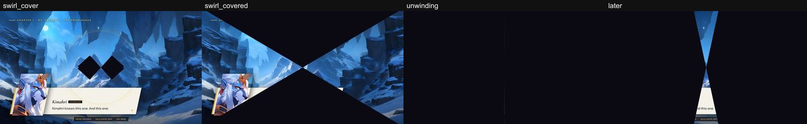

  *Before (Chapter I, a slowed forced capture): the old swirl pinches the scene away into black before the fight.*

  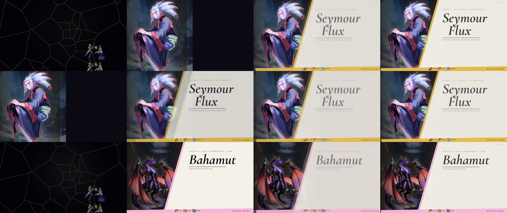

  *Frames of the new entries into a battle, each ending on the battle-start card. Top row: FFX's shatter on a skip (Chapter I). Middle row: Chapter I entered from its scene, which blurs out instead of shattering. Bottom row: FFX-2's own shatter (Chapter IV).*

- **Both:** the party holds its battle stance after Yunalesca, Bahamut, Shuyin and Trema, with no
  victory pose.

  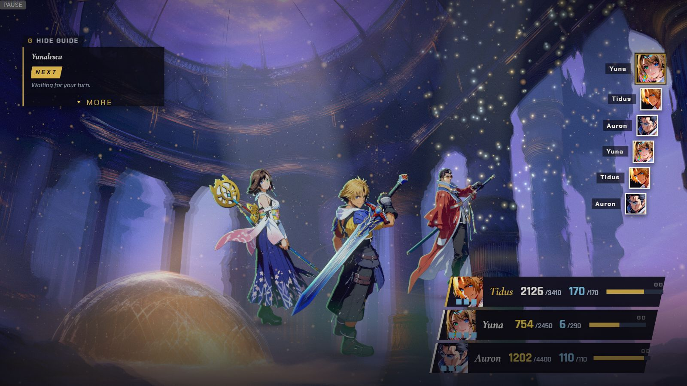

  *Chapter II: after Yunalesca falls, the party stays in its battle stance.*

  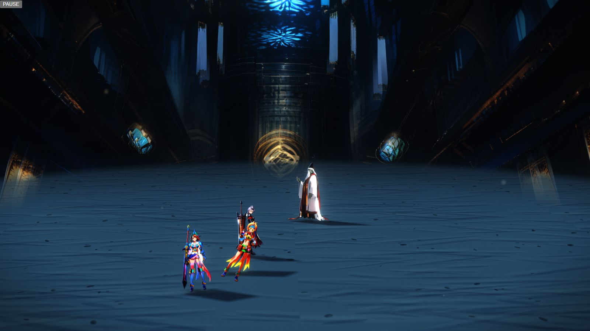

  *Chapter XIII: after the fight with Trema, the girls hold their battle stance.*

- **FFX:** the enemy's ability name shows in the top help bar while it acts. It was never shown.

  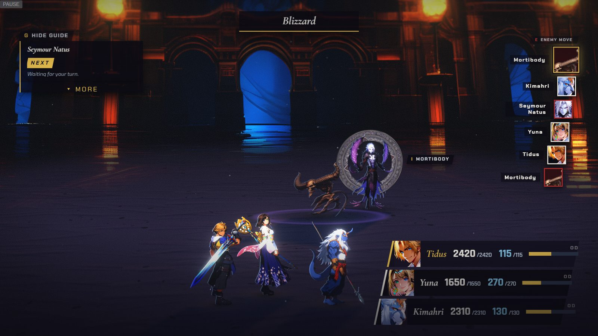

  *Chapter X: "Blizzard" is named in the help bar across the top while Seymour Natus casts it.*

- **FFX:** attacking a lone enemy opens the target step first, as in the original game, and a target
  that is immune to Sensor says "Immune to sensors." instead of showing nothing.

  

  *Chapter II: choosing Attack against the lone Yunalesca goes straight to aiming. Brackets close around her and her name plate appears.*

  *(no screenshot from the time of the "Immune to sensors." line)*

- **FFX:** the TARGET plate names the aimed target and stays off the advisor card. In Chapter III the
  Sensor card folds while you aim, and cards fade while an action plays.

  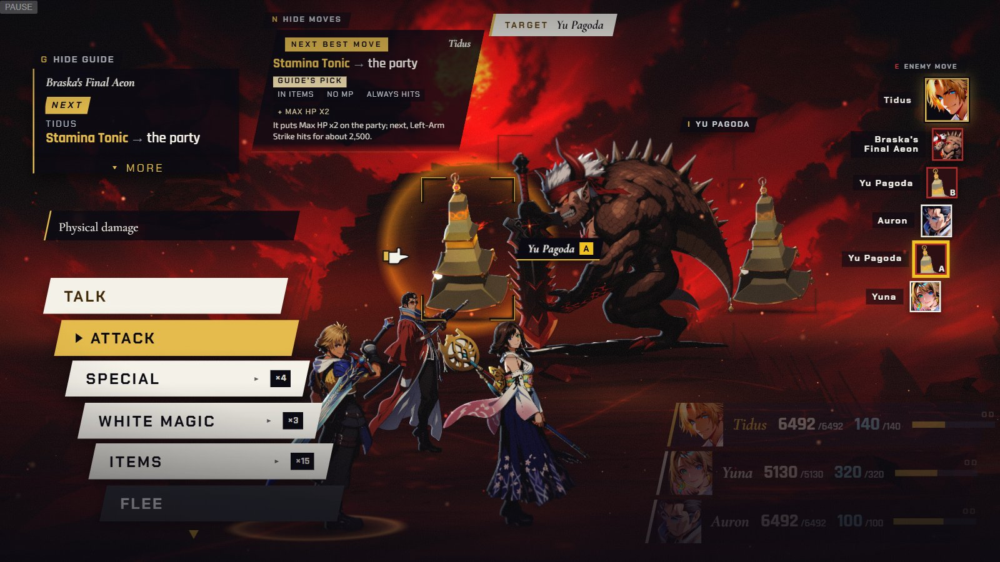

  *Chapter III: aiming at a Yu Pagoda. The TARGET plate (top) names it beside the advisor card, and the Sensor card has folded to a small "Yu Pagoda" chip.*

  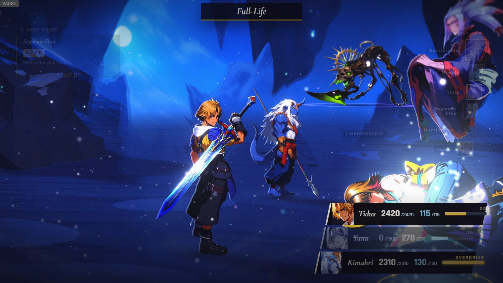

  *Chapter I: while Seymour Flux's Full-Life plays, named in the help bar at the top, the guide card (top left) and the turn list (right) fade out of the way.*

- **FFX:** a stalemate you cannot win ends on a WITHDREW card with RETRY.

  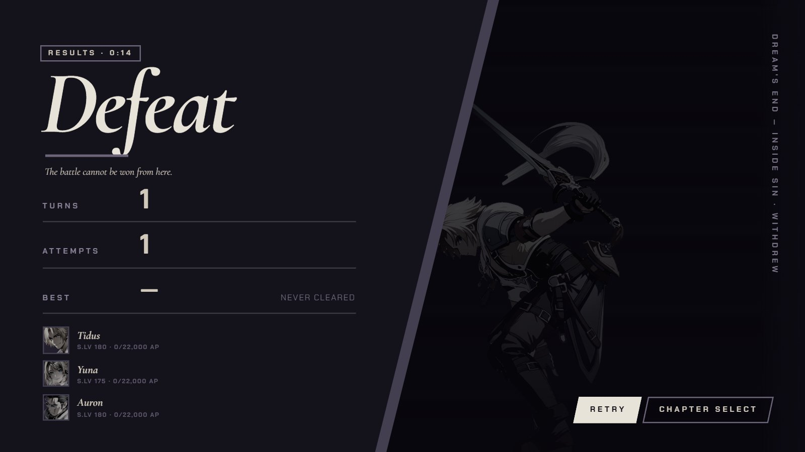

  *Chapter III: the card for a battle that cannot be won, marked WITHDREW, with RETRY and CHAPTER SELECT.*

- **FFX:** Yunalesca's hair and Valefor's wing no longer fade into a straight pale column. Chapter
  IX's sakura canopy ends on its own blossom, its tree is grounded, and the enemy shot clears the
  party's heads.

  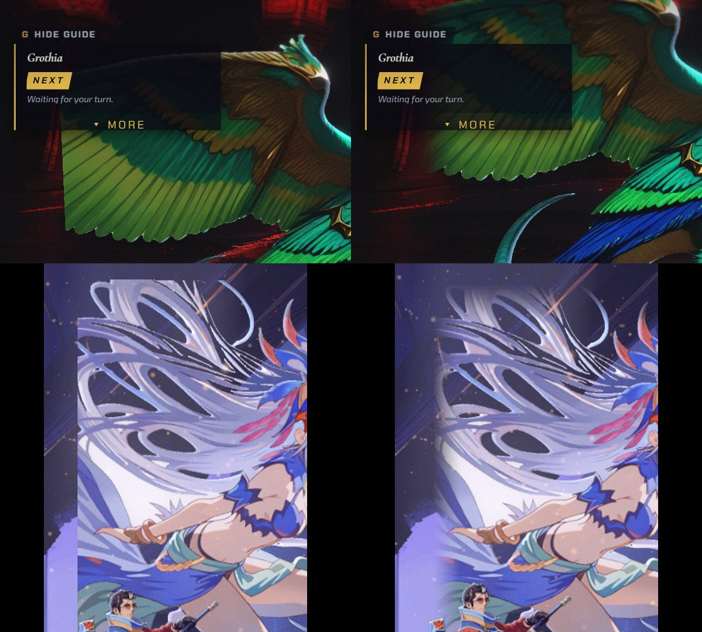

  *Left, before: the painting ends on a hard, straight vertical edge. Right, after (release 25): the edge dissolves along the painting. Top row: the wing of the green aeon in Chapter XIV. Bottom row: Yunalesca's hair (Chapter II).*

  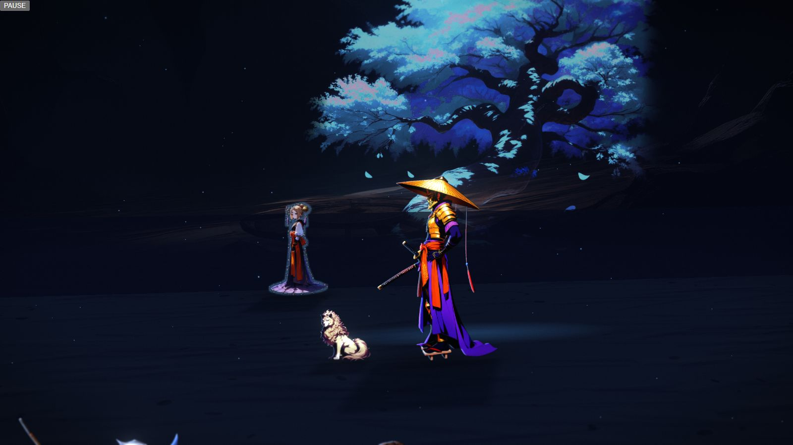

  *Before (Chapter IX, the arrival): the sakura canopy ends on a smooth, straight, soft edge at the right, and the tree hangs above the ground.*

  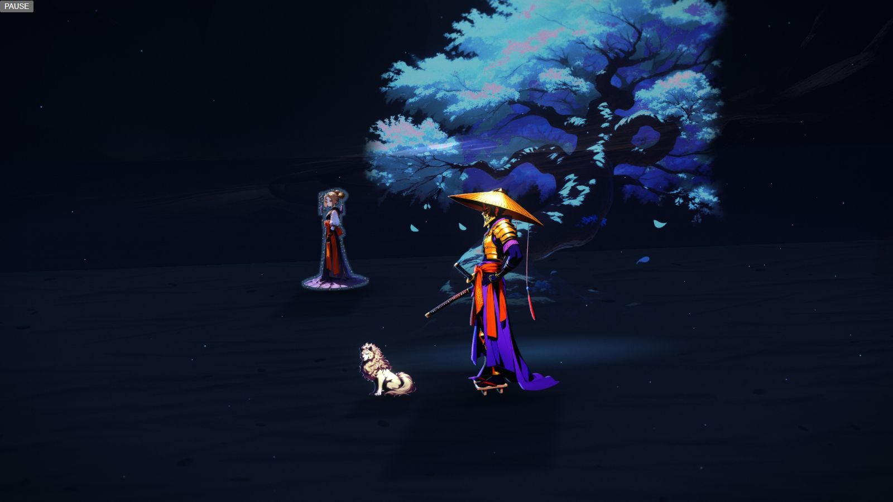

  *After (release 25): the canopy's edge follows its own blossoms, and the tree stands lower, on the ground.*

- **FFX:** on a phone, Seymour Flux stays below the HUD's top strips.

  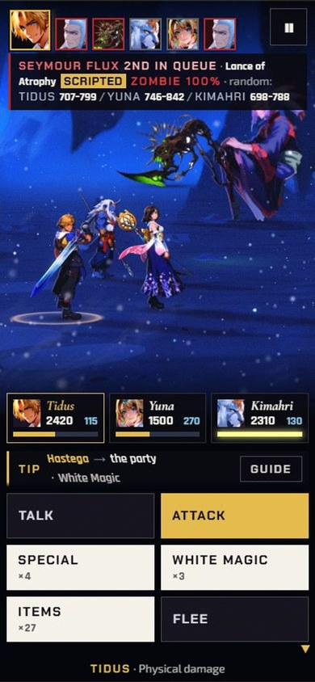

  *Before (release 23, 390x844, Chapter I): Seymour Flux's head is lost behind the enemy-intent strip across the top.*

  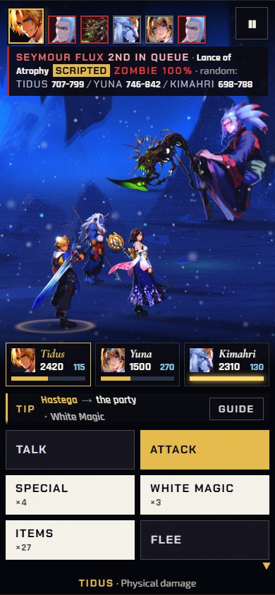

  *After (release 25, 390x844): his head and hair sit below the strip.*

- **FFX-2:** Chapter XI names the Magus Sisters at their seam, and Chapter VI's Syndicate stands across
  the floor from the party.

  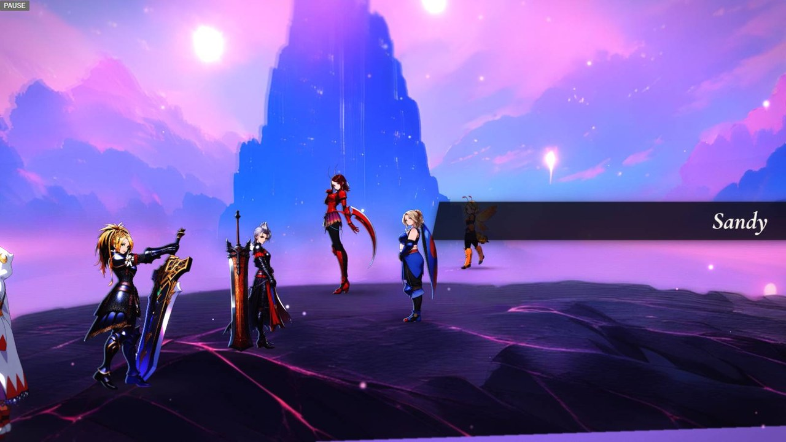

  *Before (release 18, Chapter XI): the seam before the Sisters is labelled with one sister's name only, "Sandy".*

  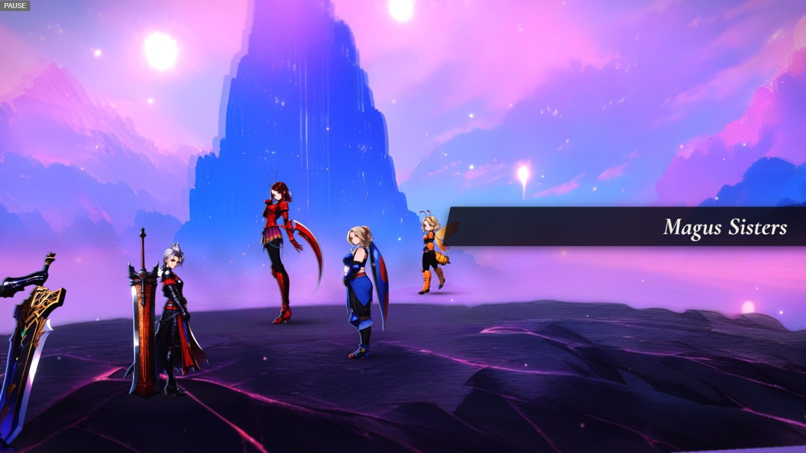

  *After (release 25): the same seam is labelled "Magus Sisters".*

  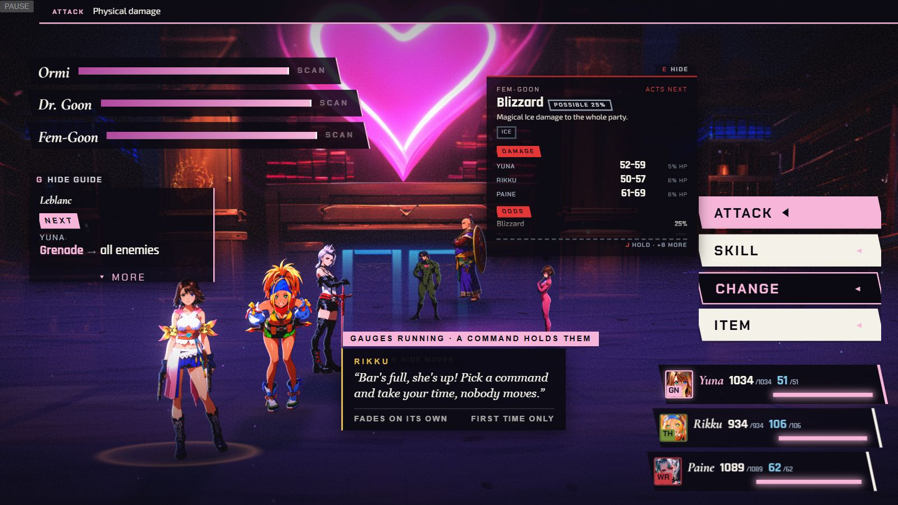

  *Before (Chapter VI, first link): Dr. Goon, Ormi and Fem-Goon stand close to the party.*

  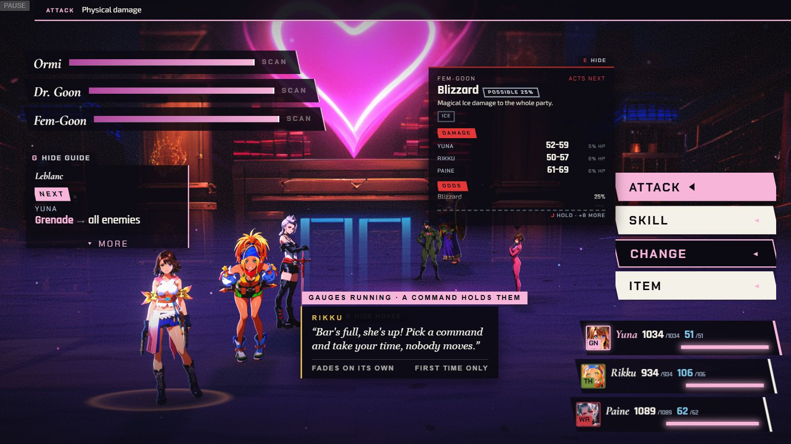

  *After (release 25): the same moment, with the Syndicate farther to the right, across the floor from the party.*

- **FFX-2:** after a retry from a checkpoint, the summed spoils include the links you won before it.

  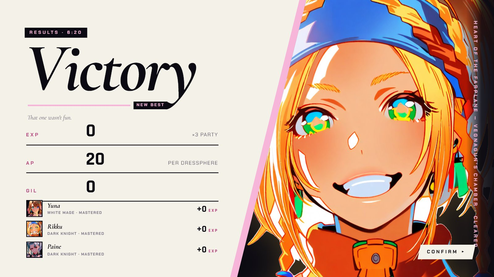

  *Before (Chapter V, a win after losing to Shuyin and retrying from his checkpoint): the results show only the last fight's spoils, EXP 0, AP 20 and Gil 0.*

  *(no screenshot from the time of the fixed results)*
