[Back to the changelog](../../CHANGELOG.md)

# 2026-09-28 · Release 26

Address: https://baileypillon.github.io/pyrefly-reprise/ (main d89541b6)

- **FFX-2:** new Chapter XVI, Ixion at Djose. One boss fight against Ixion in the Chamber of the
  Fayth, then a story close: Yuna's fall into the Farplane Abyss, Shuyin, and the four whistles. The
  Chamber and Abyss paintings are provisional.

  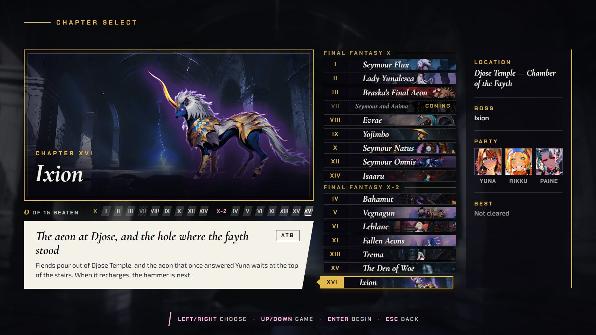

  *The new Chapter XVI card on the chapter board, in the FFX-2 group.*

  

  *The fight in the Chamber of the Fayth: Ixion, in his violet possessed look, faces Yuna, Rikku and Paine (provisional painting).*

  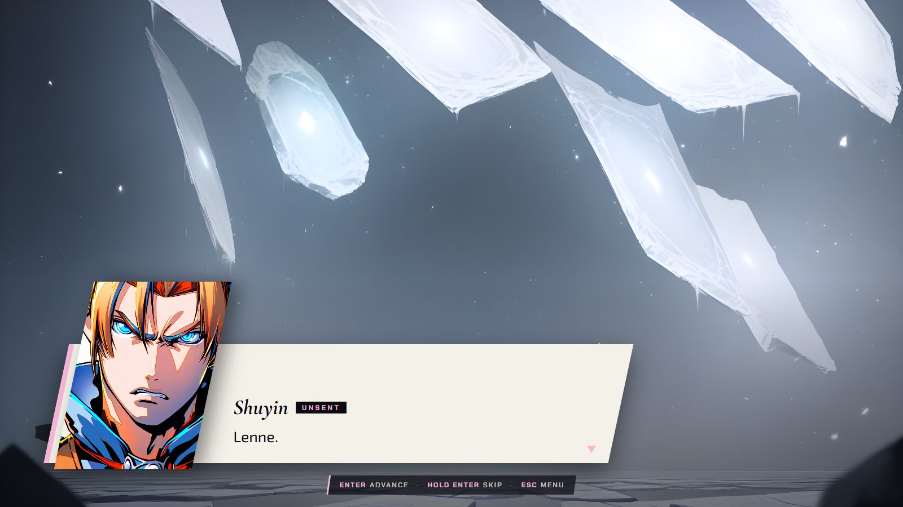

  *The story close in the Farplane Abyss, where Shuyin speaks ("Lenne.") against an icy backdrop (provisional painting).*

- **FFX-2:** the move advisor counts commands already underway, so it no longer tells you to use a
  Mega-Potion you just chose, or a move you are holding.

  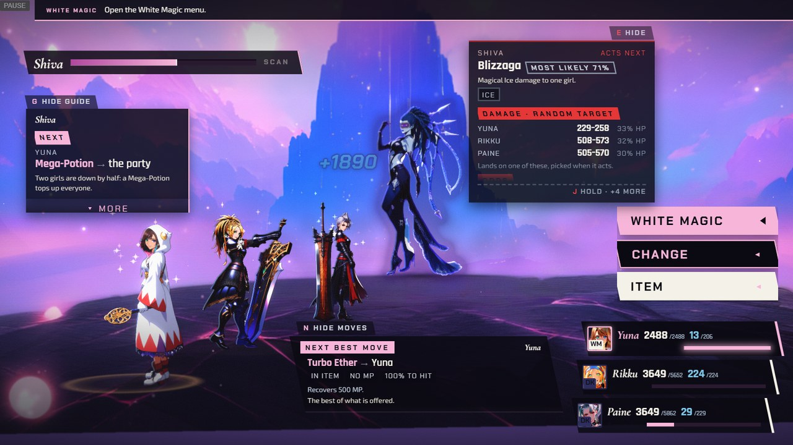

  *Before the final fix (a build earlier in release 26, Chapter XI): Rikku's Mega-Potion is charging. The advisor card at the bottom has moved on to Turbo Ether, but the guide at the top left still says "Mega-Potion, the party".*

  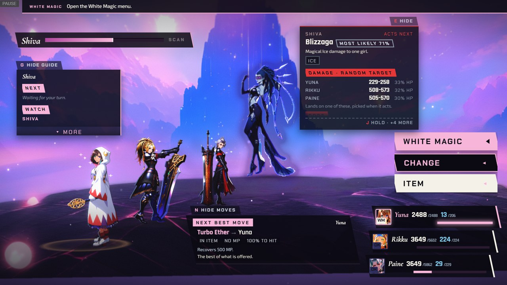

  *After (release 26): the same moment. The guide now says "Waiting for your turn" and the card says Turbo Ether.*

- **Both:** the advisor puts a raise on top for a fallen ally the chapter's line would leave down.

  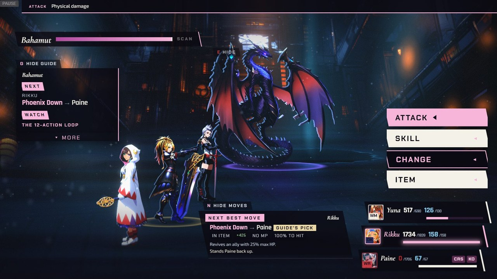

  *Chapter IV: Paine is down (0 HP, KO), and the advisor card for Rikku, and the guide above it, put Phoenix Down on her.*

- **FFX-2:** a hit an enemy is immune to no longer opens a chain. In Chapter VI, Leblanc's failsafe
  fires once and turn 5 is Fan Slap.

- **FFX:** Yuna's aeons use the sourced Mt. Gagazet stats in Chapters I and IX (for example Valefor
  1,530 HP and Bahamut 2,935 HP), and Bahamut in Chapters X and XIV takes the same row.

- **FFX-2:** an Itchy girl's card names Change, the only row her menu offers. Intent cards say what a
  move really does: Delta Attack leaves the party at 1 HP and 0 MP, and a Dispel removes buffs.

  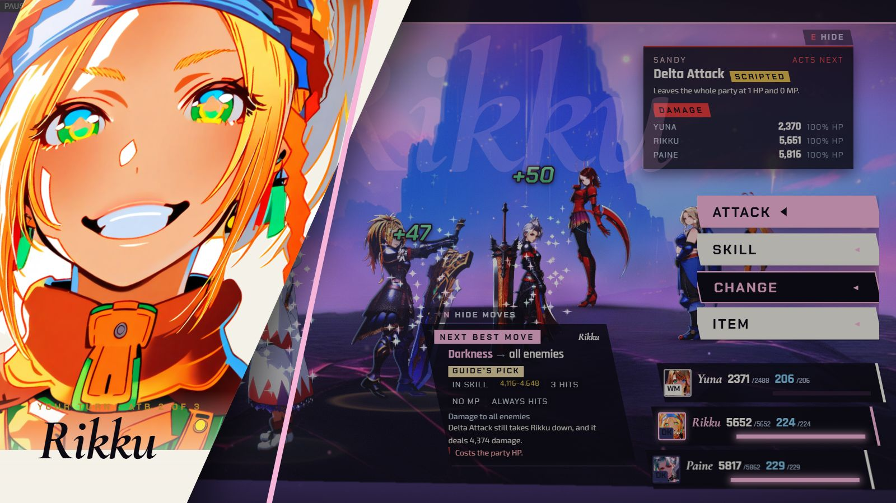

  *Chapter XI: the intent card for Delta Attack (top right) now reads "Leaves the whole party at 1 HP and 0 MP."*

  *(no screenshot from the time of the Itchy girl's Change card)*

- **FFX-2:** advisor and intent cards step back while an action plays over a fighter, disabled command
  rows are opaque so every row state reads clearly, and on a phone the enemy-move line steps off
  Vegnagun's leg in Chapter V.

  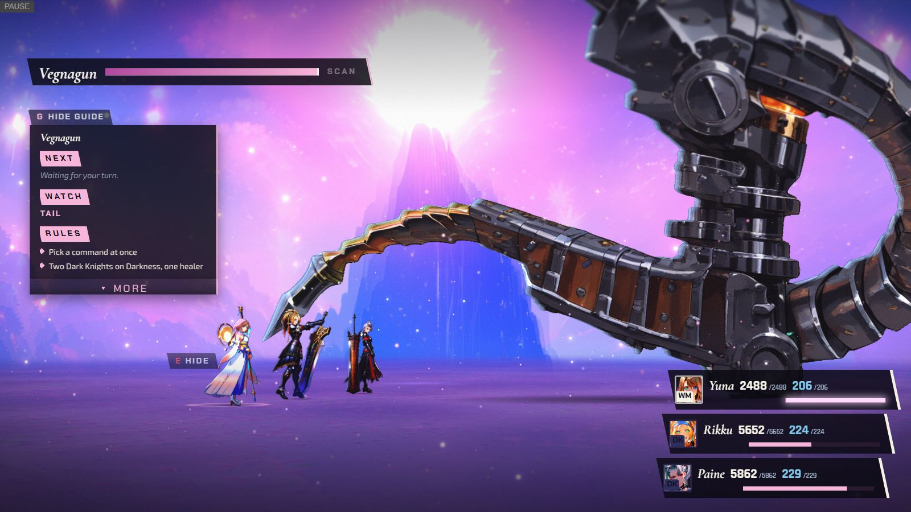

  *Chapter V: while Yuna acts, the enemy-intent card and the advisor card have faded out of the way (only the small "E HIDE" tab is left), and the guide stays.*

  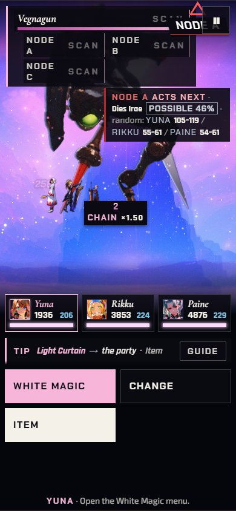

  *Chapter V, link 2, on a phone (390x844): the enemy-move line sits beside Vegnagun's leg and leaves its green lens in view.*

- **Both:** pause screen: the CHAPTER tab names the scene properly ("Cavern of the Stolen Fayth") and
  keeps the Chapter II and IX boss faces clear, the H key's legend says what it does, and long names
  are no longer cut.

  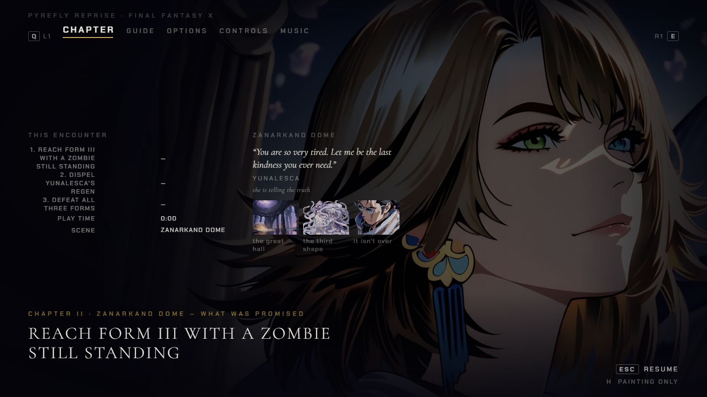

  *Chapter II: the CHAPTER tab, with the big painted face at the right kept clear of the text columns.*

  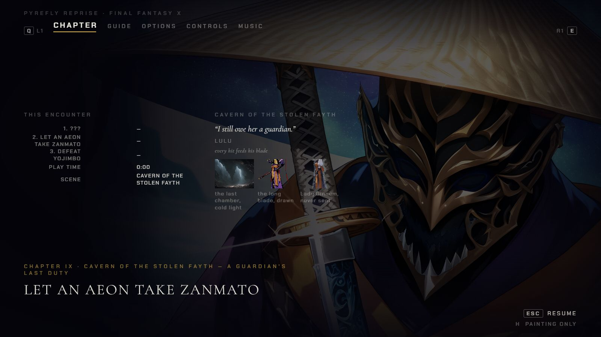

  *Chapter IX: the SCENE row reads "Cavern of the Stolen Fayth" and Yojimbo's face stays clear.*

  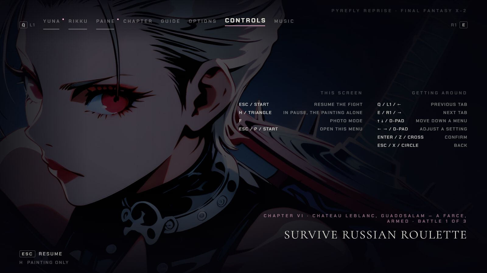

  *The CONTROLS tab (Chapter VI): H or Triangle reads "in pause, the painting alone", F is photo mode, and every sentence is whole.*

- **Both:** on the chapter board, selecting a card no longer nudges the cards below it, and the chosen
  chapter's battle starts loading while you read its card (a cold first visit used to wait 14 to 20
  seconds).

  *(no screenshot from the time: the nudge was 2 px and the loading is invisible)*

- **Both:** small text is at least 14 px on the advisor and intent cards and on the phone title and
  chapter select. Yuna's portrait chips no longer crop through her hair, and the pause plate fades out
  at 4K instead of ending in a hard black edge.

  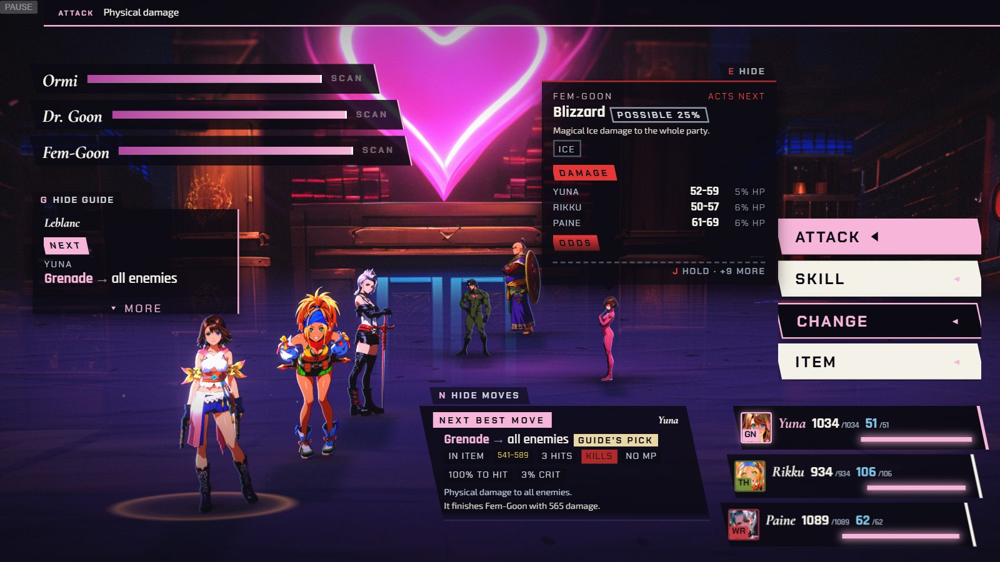

  *Chapter VI at 1600x900: the intent card (top centre) and the advisor card (bottom) at the 14 px floor.*

  *(no screenshot from the time of the phone title and chapter select text, the portrait chips or the 4K pause plate)*
