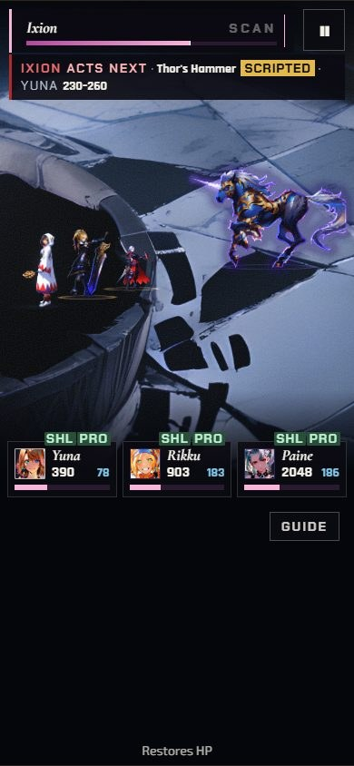
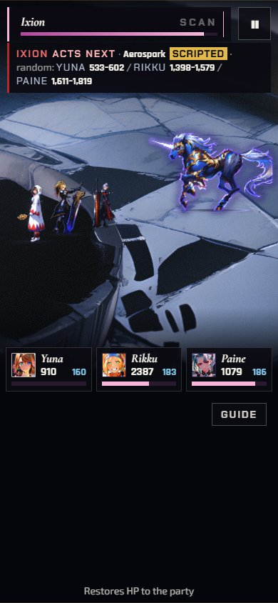
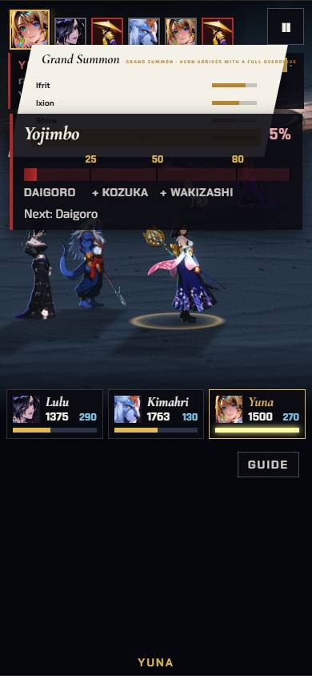
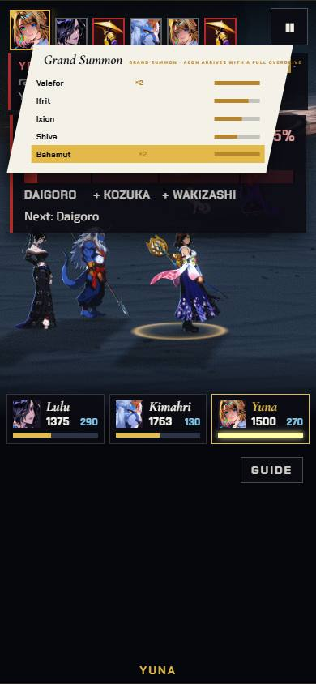
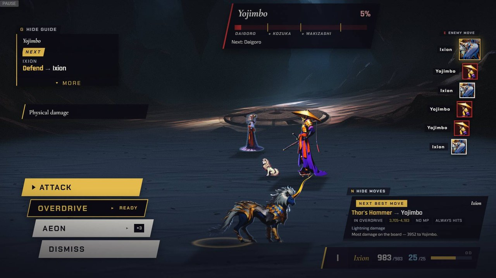
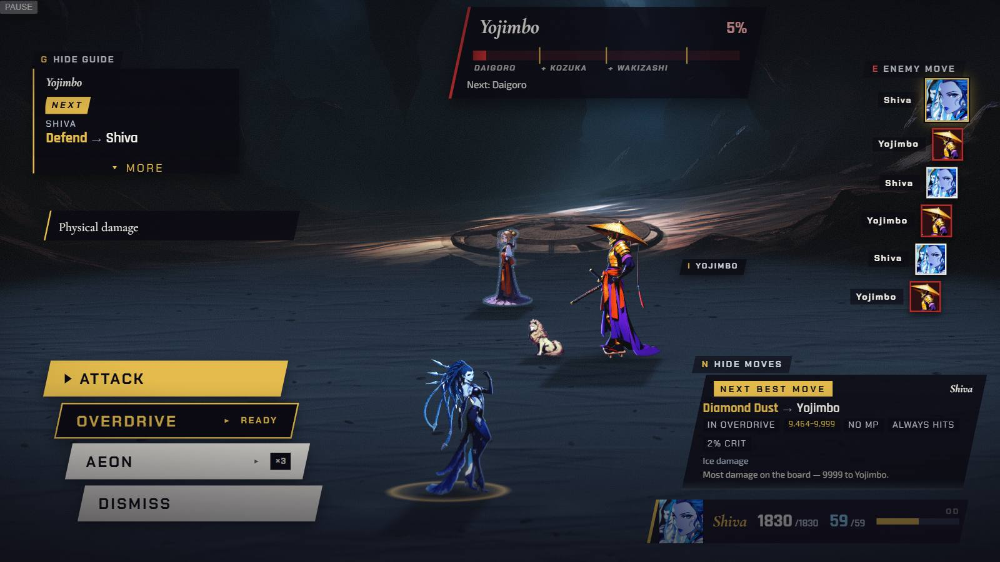
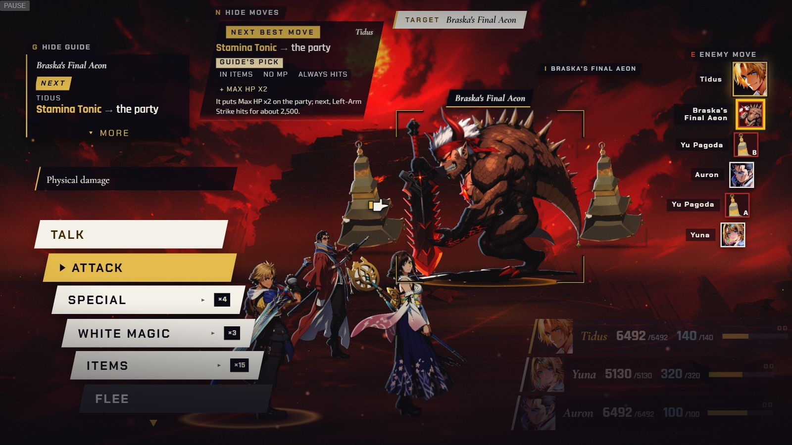
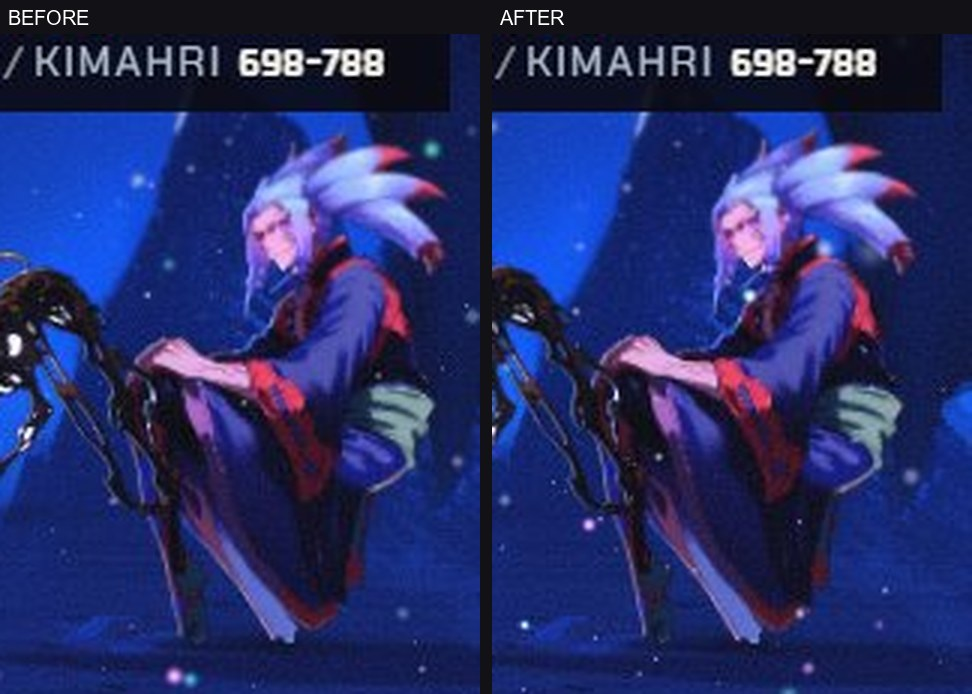

[Back to the changelog](../../CHANGELOG.md)

# 2026-09-28 · Release 28

Address: https://baileypillon.github.io/pyrefly-reprise/ (main 6ea8528f)

- **FFX-2:** on a phone, Ixion in Chapter XVI stands on lit stone instead of a dark slab.

  

  *Before (release 26, 390x844): Ixion stands over dark painted slabs, with black patches in the floor around him.*

  

  *After (release 28, 390x844): the same chapter and framing, with Ixion on lit stone.*

- **FFX:** on a phone, Chapter IX's Grand Summon list stays above the Zanmato gauge and shows all
  five aeons.

  

  *Before (release 24, 390x844): the Yojimbo gauge panel is drawn over the lower rows, so only Ifrit and Ixion show.*

  

  *After (release 28, 390x844): Valefor, Ifrit, Ixion, Shiva and Bahamut, with Bahamut chosen.*

- **FFX:** an aeon's status row shows its own portrait, the one on the turn list, instead of a letter.

  

  *Before (release 24, 1600x900): Ixion's row at the bottom right carries a letter.*

  

  *After (release 28, 1600x900): Shiva's row carries her own portrait.*

- **FFX:** in Chapter III the folded Sensor chip lifts clear of the target while you aim.

  

  *Before (release 25, 1600x900): the chip sits against Braska's Final Aeon's bracket and name plate.*

  

  *After (release 28, 1600x900): the chip floats well above the bracket and the name plate.*

- **FFX:** on a phone, Seymour Flux's hair tips no longer touch the right edge (Chapter I).

  

  *Chapter I on a 390x844 phone, enlarged three times. Left, before (release 26): the hair tips come within 10 px of the screen's right edge. Right, after (release 28): they are 16 px clear of it.*
