[Back to the changelog](../../CHANGELOG.md)

# 2026-09-29 · Release 30

Address: https://baileypillon.github.io/pyrefly-reprise/ (main 1475ff6b)

*Where a caption says left and right, the left picture comes first.*

- **FFX:** Sin arrives as two new chapters, bringing the board to 18. Chapter XVII, Sin: the Fins
  and the Core, has you tear off both fins, jump onto its back and destroy its Core, with no healing
  between links. Chapter XVIII, Sin: the Face, is a fight against the clock as its mouth opens.

  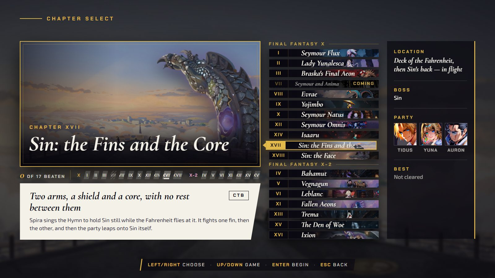
  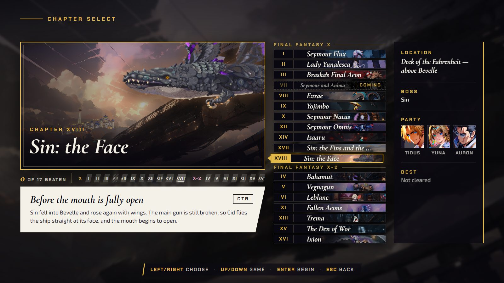

  *The chapter board with XVII, Sin: the Fins and the Core, and XVIII, Sin: the Face.*

  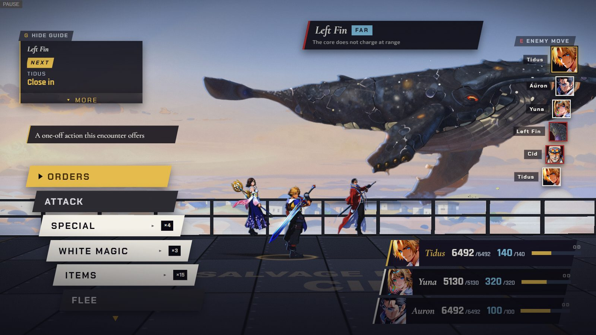
  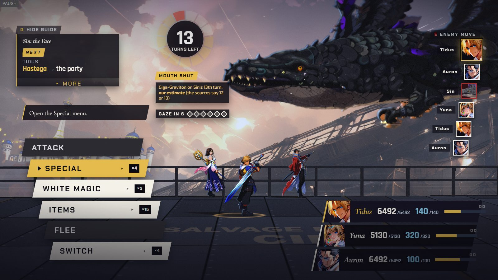

  *The first command menus: the Left Fin on the Fahrenheit's deck in Chapter XVII, and Sin's head with the 13-turn mouth clock in Chapter XVIII.*

- **FFX:** both Sin chapters come with new paintings (the head, both fins, Genais, the Core,
  backdrops, pause art and turn-list icons) and new HUD pieces: a mouth-ring clock in XVIII and a
  range-and-charge plate for the fins in XVII.

  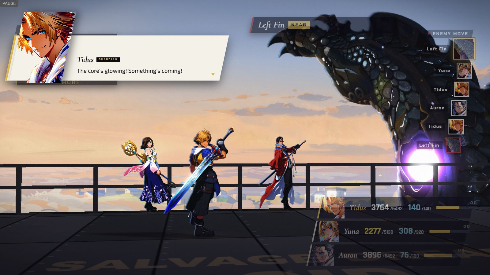
  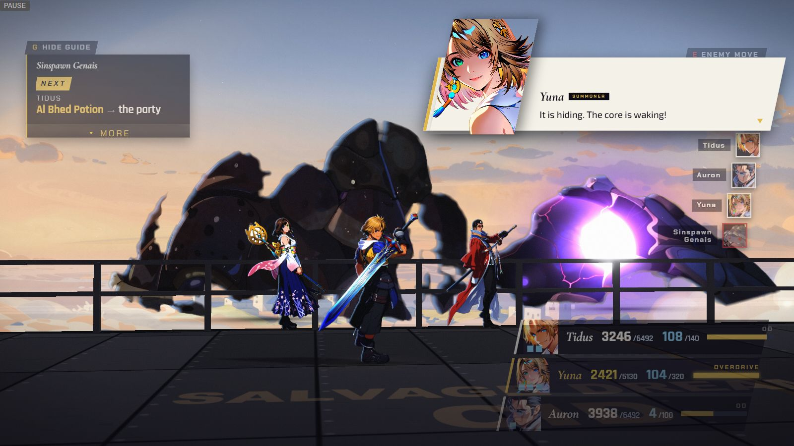
  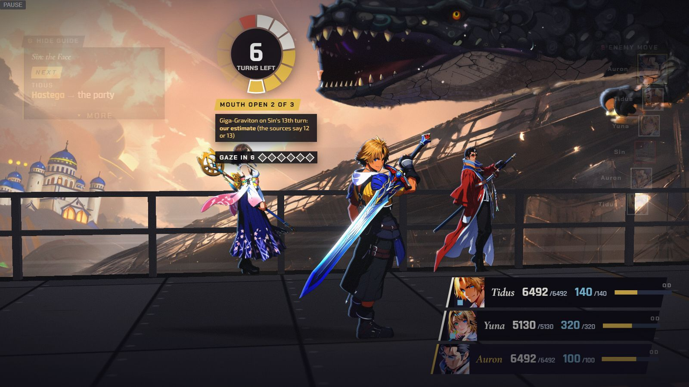

  *The Left Fin charging beside its range plate, Genais's shell with the Core charging on Sin's back, and the mouth-ring clock in Chapter XVIII.*

- **FFX-2:** Rikku and Paine get their own Songstress paintings, and the party rows frame their
  faces.

  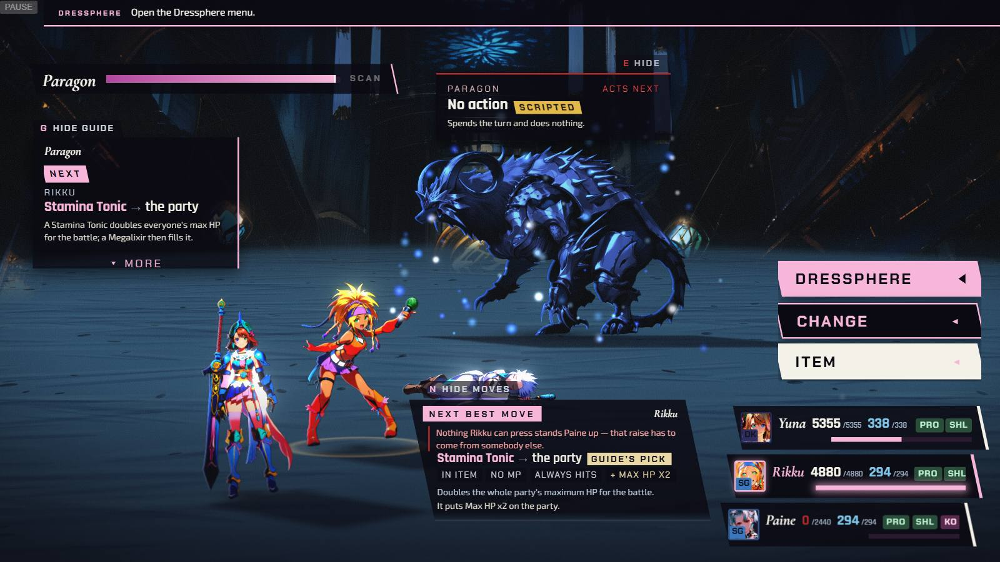
  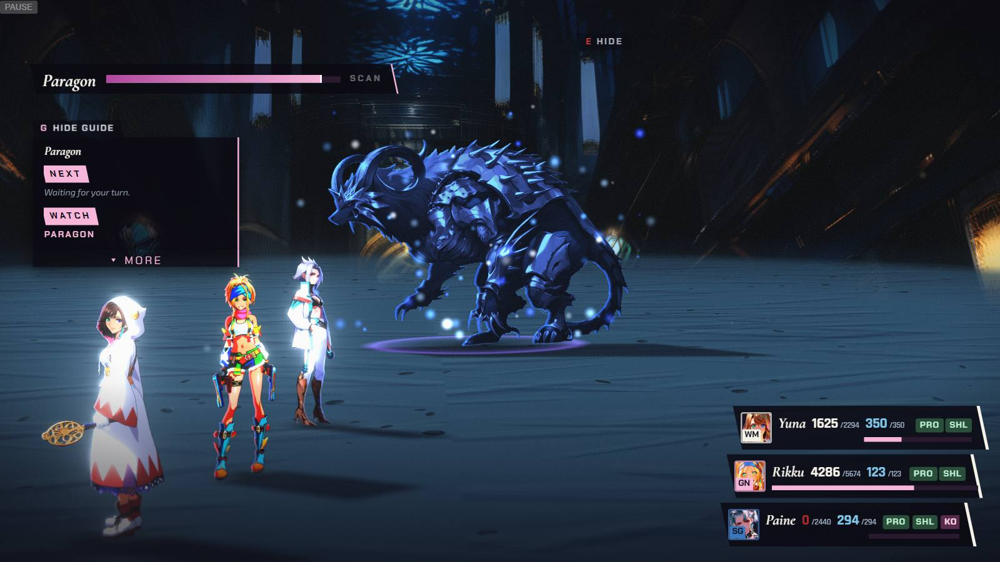

  *Rikku attacking and Paine standing in their Songstress paintings in Chapter XIII.*

- **FFX:** a sharper move advisor: it now searches several turns ahead, in a background worker, on
  every device.

- **FFX:** Chapter VII's battle card shows Seymour instead of a Guado Guardian, the aftermath shows
  Seymour on screen with the kneel, fall and sending captioned (it was an empty plate), and the
  first Boost callout says "half again", not twice.

  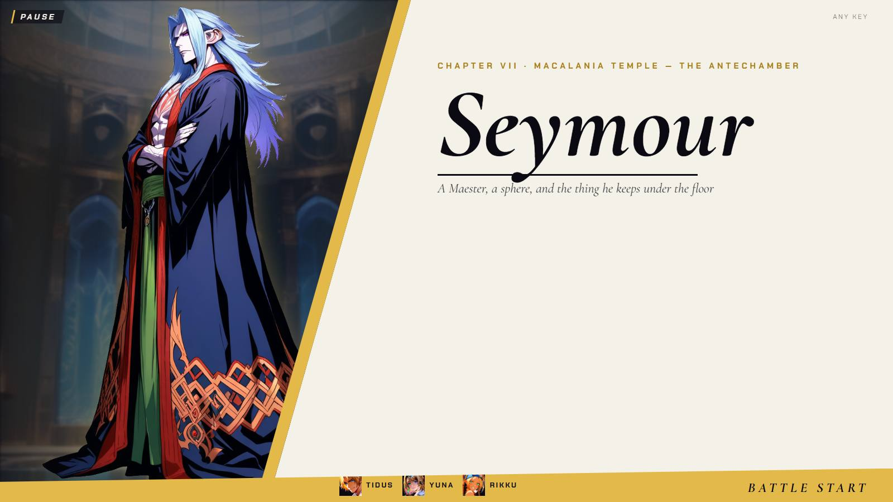
  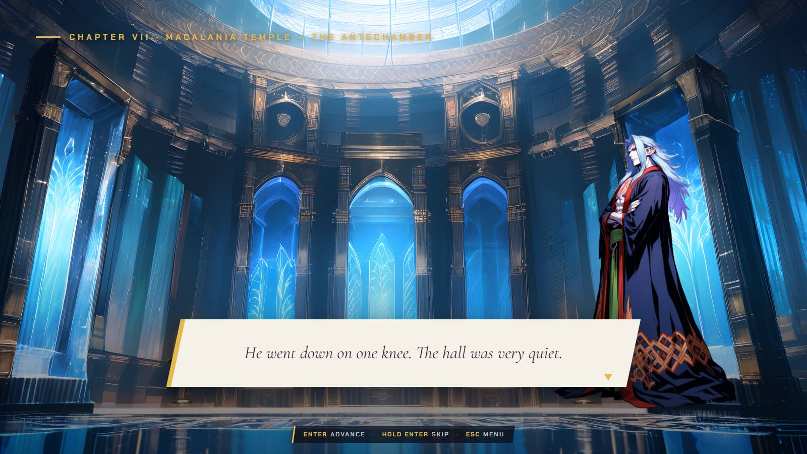

  *Chapter VII's battle card now shows Seymour, and the aftermath shows him on screen with the kneel captioned.*

- **Both:** the move advisor no longer offers a revive on an enemy or on a living ally (it had
  offered Phoenix Down on the knocked-out Guado Guardian).
