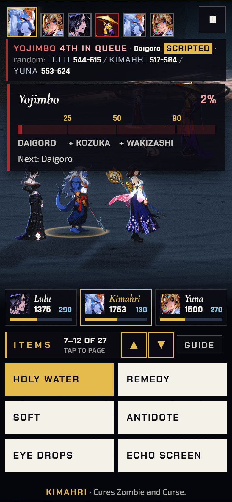

[Back to the changelog](../../CHANGELOG.md)

# 2026-09-29 · Release 31a

Address: https://baileypillon.github.io/pyrefly-reprise/ (build 52a431d0, cut from a side branch)

- **Both:** the whole score is re-mastered to fix the thin, hollow sound: the left and right
  channels were out of step with each other, and the bass is now centred. 23 of 25 cues change;
  Vegnagun's boss theme and the Bevelle Underground scene keep the old render.

- **Both:** chapter music and menu music no longer play together after you choose a chapter. A cue
  replaced before it was heard is stopped, not faded out from full volume.

- **FFX:** on a phone, long command lists get two page buttons and an "N-M OF T" counter in place of
  the tiny marks.

  
  

  *The phone Items list in Chapter IX: two page buttons and an "N-M OF 27" counter (items 1 to 6, then 7 to 12).*

- **Behind the scenes:** this is release 31 without the OPTIONS accessibility rows, which change the
  save format and waited for a review. They came in release 32.
