[Back to the changelog](../../CHANGELOG.md)

# 2026-09-30 · Release 32

Address: https://baileypillon.github.io/pyrefly-reprise/ (main 1a6fd3cc)

- **Both:** OPTIONS gains TEXT SIZE (100, 115 or 130 percent), REDUCE MOTION and LOW EFFECTS. TEXT
  SIZE enlarges the text in FFX's battle HUD and in dialogue cards (FFX-2's battle HUD and the pause
  stay at 100); REDUCE MOTION turns camera moves into cuts and stops shake; LOW EFFECTS thins hit
  sparks.

  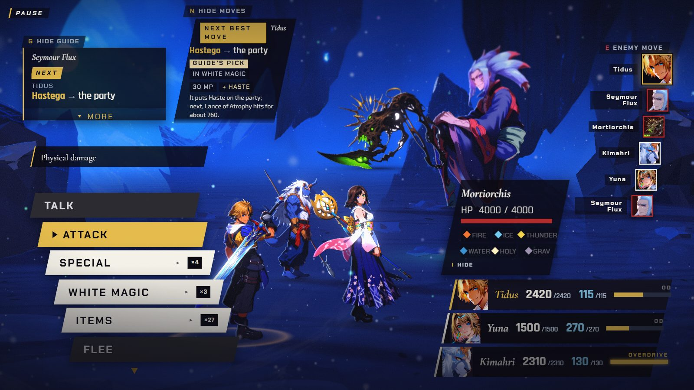
  

  *The FFX battle HUD at TEXT SIZE 100 percent, then 130 percent.*

  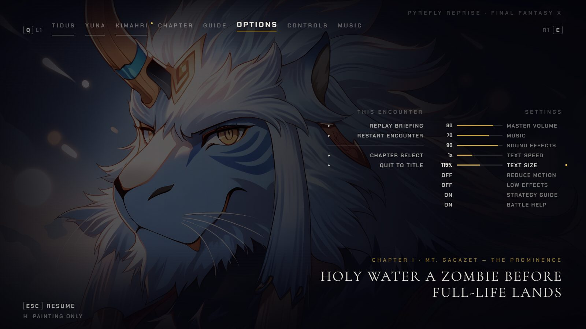

  *The new OPTIONS rows (TEXT SIZE shown at 115 percent), with REDUCE MOTION and LOW EFFECTS below it.*

- **FFX:** six Sphere Grid fixes after a friend's playtest: a travelled step shows its real S.Lv
  price, an opened lock reads as open and stays open when you leave party prep and come back, HP and
  MP nodes add to the base stat, walk mode keeps the cursor on nodes you can reach, and clicks say
  what they do.

  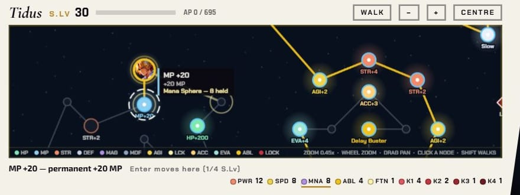
  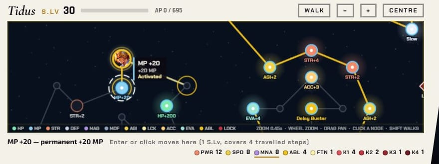

  *A travelled step: the caption said "1/4 S.Lv" while a whole S.Lv was spent (first), and now says "1 S.Lv, covers 4 travelled steps" (second).*

  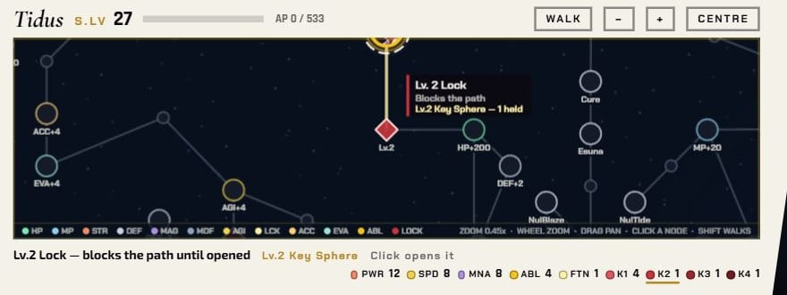
  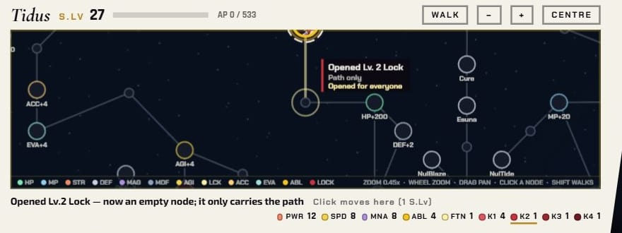

  *After opening a Lv.2 lock, leaving party prep and coming back: the lock was closed again (first) and now stays open (second).*

  
  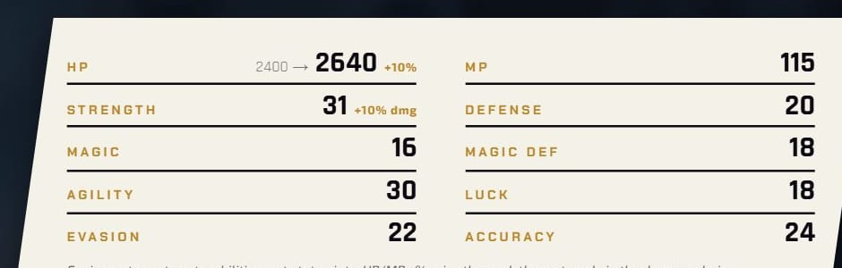

  *Tidus after an HP +200 node: the base stayed at 2,200 and max HP read 2,620 (first); the base now rises to 2,400 and max HP reads 2,640 with the armour's +10 percent (second).*

- **FFX:** a Zombie now shows first, in green, on the party plate, and aiming a healing item at a
  Zombie ally warns "Zombie: 1,000 damage" or "this KOs". A Hi-Potion on a zombified Kimahri in
  Chapter I used to hurt him with no warning.

  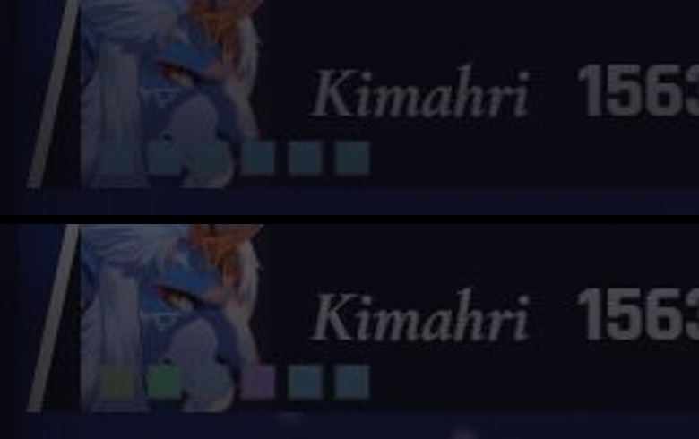

  *Kimahri's party plate under Mighty Guard: before (top) the Zombie pip was dropped; after (bottom) it leads, in green.*

  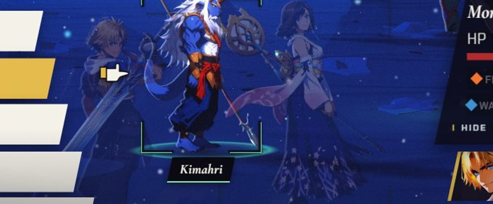
  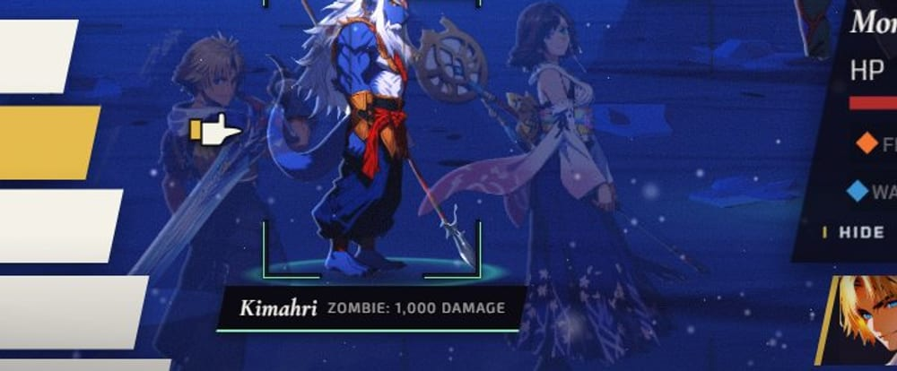

  *The target plate while aiming a Hi-Potion at Kimahri: it read only "Kimahri" (first) and now reads "ZOMBIE: 1,000 DAMAGE" (second).*

- **Both:** long command lists scroll: the wheel and triangles work in FFX, and the highlight
  follows the scroll in FFX-2.

  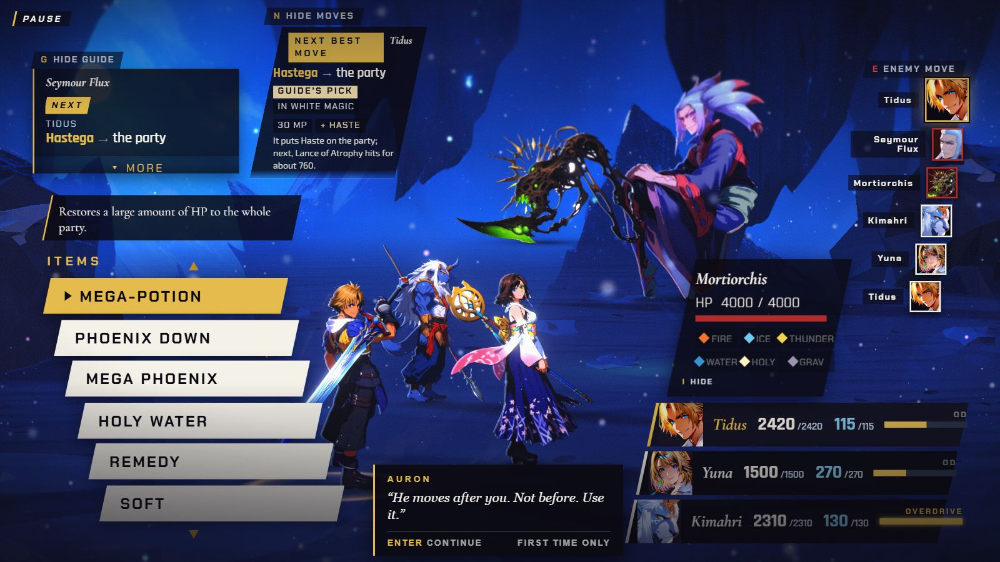

  *FFX: the Items list scrolled by the mouse wheel in Chapter I (it did not move before).*

  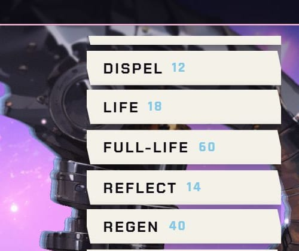
  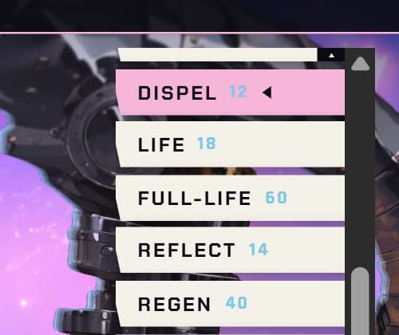

  *FFX-2 White Magic after a wheel scroll: no row was highlighted (first); the highlight now follows the scroll and a scrollbar shows (second).*

- **Both:** a miss plays a whiff instead of the menu's cancel tone.

- **Both:** the first-time coach line comes down with a tap or click on the menu, and says TAP on a
  phone.

  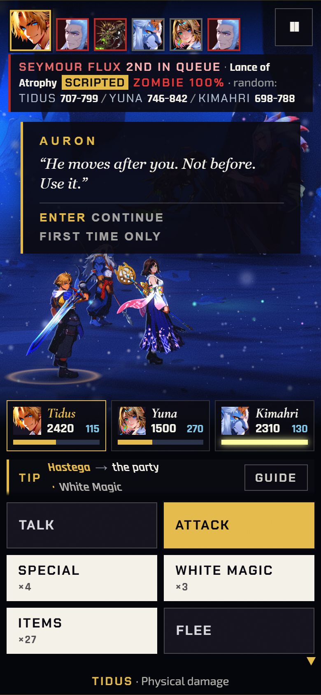
  

  *On a phone, the first-time coach line read "ENTER CONTINUE" (first) and now reads "TAP CONTINUE" (second).*

- **Both:** the advisor card, guide rail and coach line step once per shot instead of sliding while
  the camera moves.

  *(no screenshot from the time)*

- **Behind the scenes:** calmer-camera, steadier-pacing and louder-effects presets can be tried with
  web-address switches (off by default). They became the defaults in release 33.
