[Back to the changelog](../../CHANGELOG.md)

# 2026-10-02 · Release 35

Address: https://baileypillon.github.io/pyrefly-reprise/ (main ef3f6bbf)

*Where a caption says left and right, the left picture comes first.*

- **Both:** 80 painted poses: wind-up, impact, follow-through, cast, item and victory paintings for
  the party (FFX: Tidus, Yuna, Auron, Wakka, Lulu, Rikku; FFX-2: 15 dresspheres) and hurt, KO and
  attack paintings for 31 bosses (13 FFX, 18 FFX-2). On desktop, 24 of the biggest paintings
  (Vegnagun's tail, Sin's fins, Overdrive Sin, Evrae and others) also ship sharper 2x masters;
  phones keep the 1x art.

  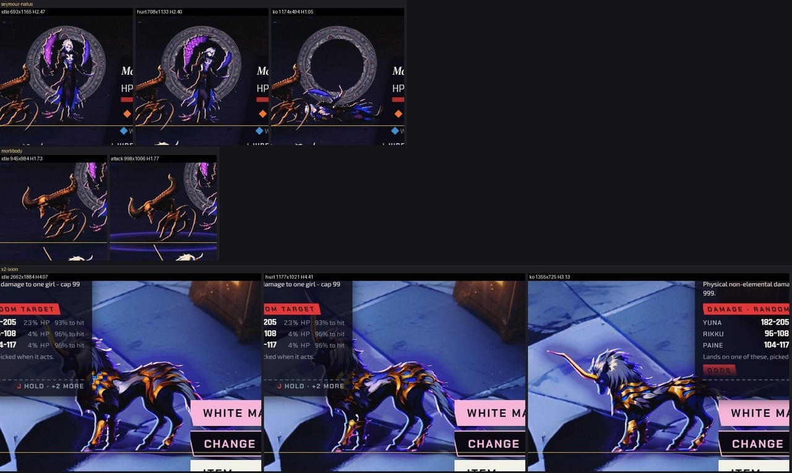
  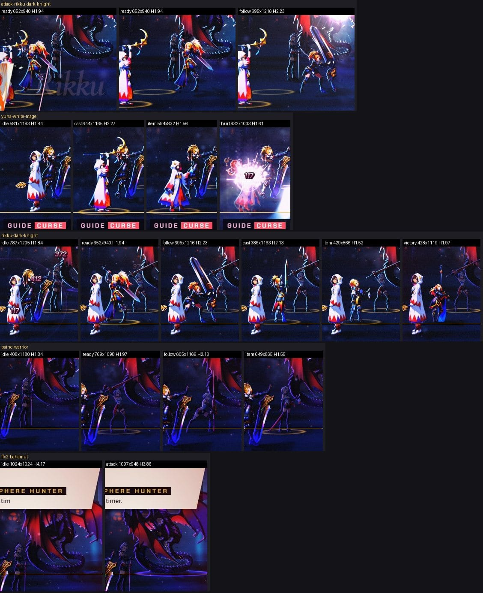

  *The new keys in battle: boss hurt, KO and attack paintings (with the 2x masters), and FFX-2 party wind-up, follow-through, cast, item and victory paintings.*

- **Both:** attacks play in painted beats: the wind-up until the lunge reaches its apex, the impact
  painting at the apex, the follow-through when the hit lands. The lunge now holds at its apex until
  the hit or miss plays, so blows land on the strike.

  

  *Tidus's attack beats in Chapter I: the wind-up and the follow-through paintings.*

- **FFX-2:** Yuna's White Mage dressphere wears her hood in its cast, item and victory paintings.

  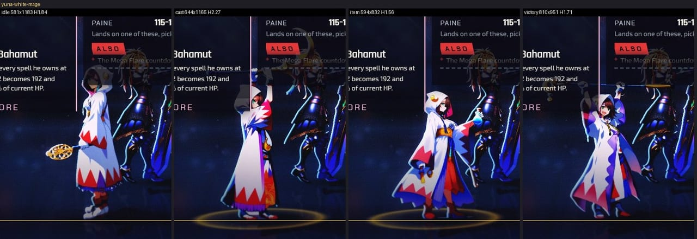

  *Yuna's White Mage in Chapter IV: idle, cast, item and victory paintings, all hooded.*

- **Both:** a knocked-out party member stays down through the victory instead of standing up to
  cheer, KO paintings are drawn at the standing figure's size, and a member with no KO painting lies
  on the floor.

  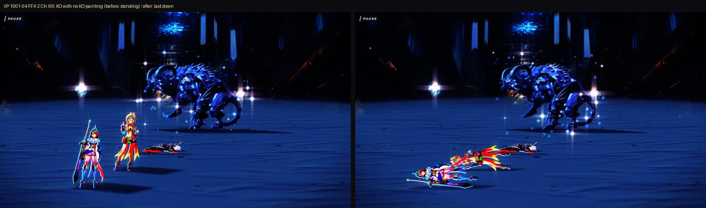
  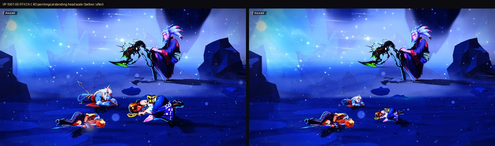

  *Before (left) and after (right): a knocked-out girl with no KO painting now lies on the floor (Chapter XIII), and KO paintings are drawn at the standing figure's size (Chapter I).*

- **FFX:** Mortiorchis leaves with Seymour Flux in a pyrefly dissolve instead of standing through
  the victory.

  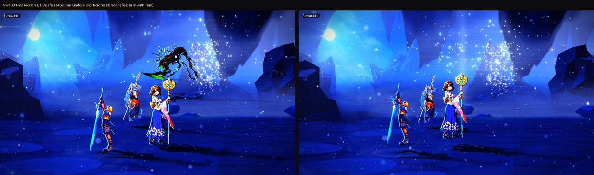

  *Before (left) and after (right): Mortiorchis dissolves with Seymour Flux instead of standing through the victory.*

- **Both:** shadows follow the figure's shape instead of a box, and eye candy's rim light is capped
  at 1.5 screen pixels so low-density bosses lose their sticker halo.

  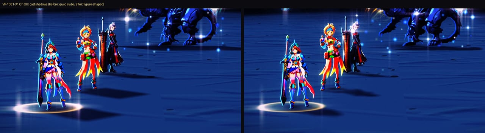
  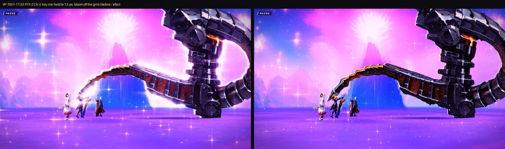

  *Before (left) and after (right): figure-shaped shadows in Chapter XIII, and the rim light capped and the bloom off the girls against Vegnagun in Chapter V.*

- **FFX-2:** the Den of Woe returns toward its approved look (no star flares, teal floor and walls),
  the Road to the Farplane carries its stone below the frame instead of a flat violet band, and
  bloom stays off the girls on the bright Farplane plate.

  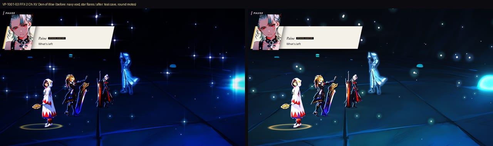
  

  *Before (left) and after (right): the Den of Woe loses its star flares and gets its teal floor and walls back, and the bottom edge of the Chapter XI backdrop carries its stone instead of a violet band.*

- **Both:** layout fixes: panels fade while an Overdrive or Special splash prints through them,
  clipped labels wrap instead of ending in dots, panels stop covering the intent text and the enemy
  it describes, and the status line queues its messages (Esuna on three statuses shows every line).

  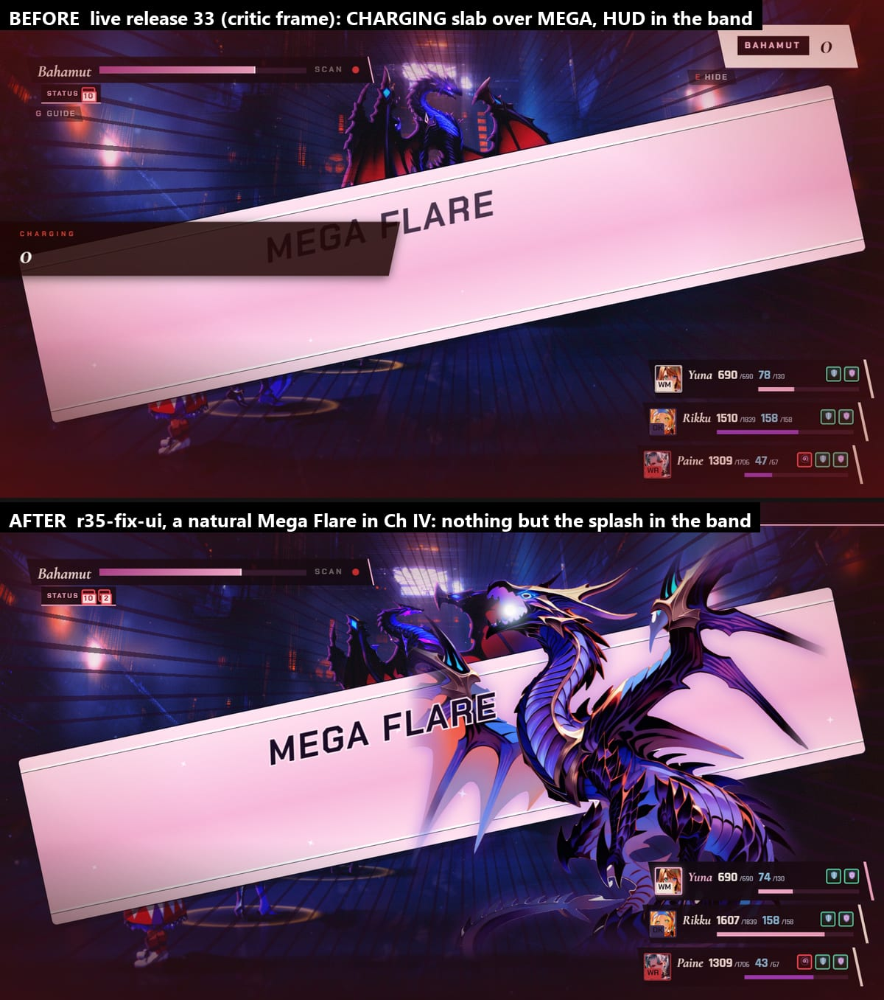
  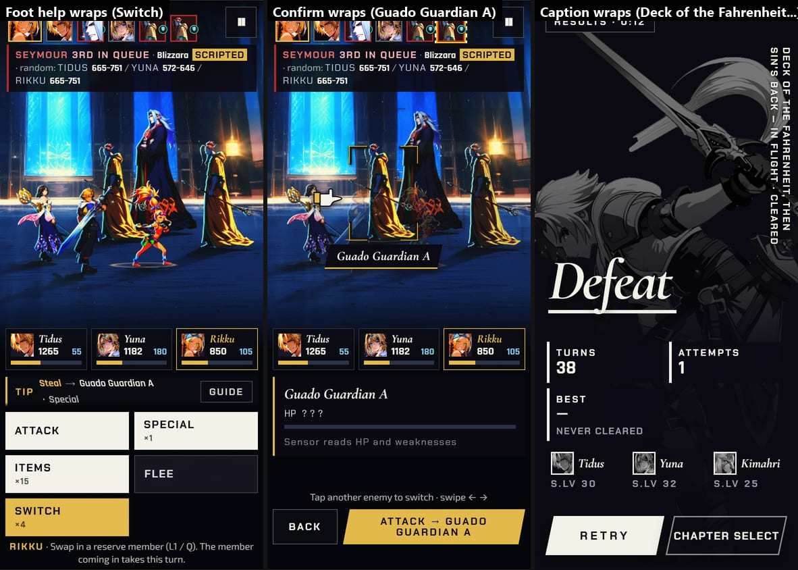

  *Chapter IV's Mega Flare splash, before (top of the first picture) and after (bottom): the HUD panels used to print through it and now fade out while it plays. On a phone, clipped labels wrap inside their windows.*

- **FFX:** the first Esc at Chapter I's first command menu opens the pause, and after a victory or
  defeat the last enemy action's banner and the advisor card clear off the field.

  *(no screenshot from the time)*

- **FFX:** both Sin chapters show the advisor card at the first command menu, Chapter XVII's link on
  Sin's back lists no dead PULL BACK or CLOSE IN rows, and the Sphere Grid's AUTO-LEARN and ? button
  get key and gamepad routes.

  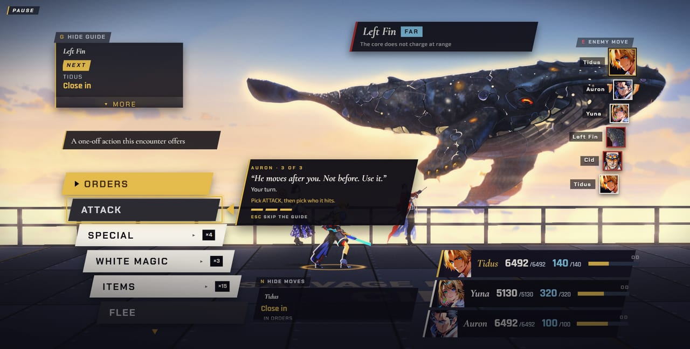
  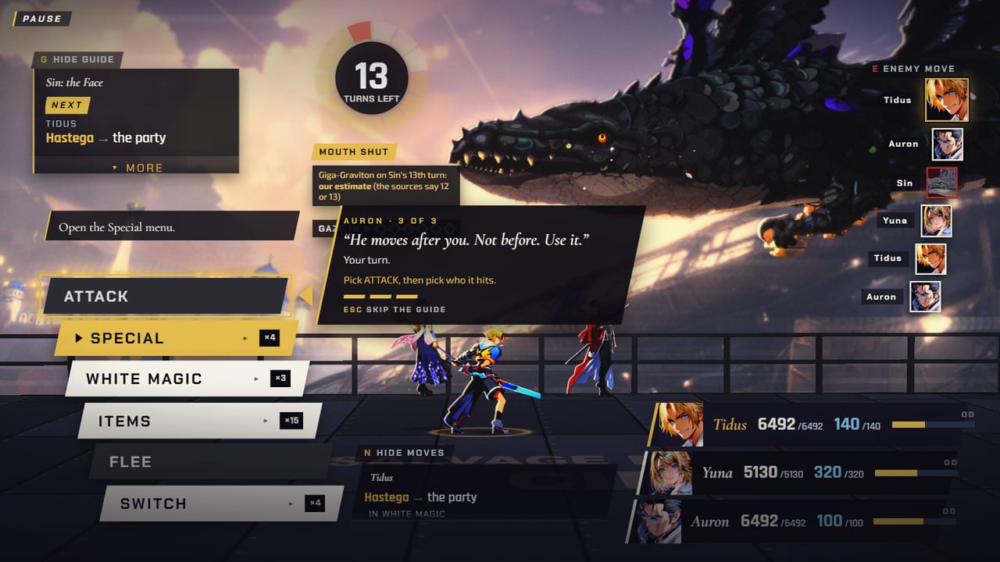
  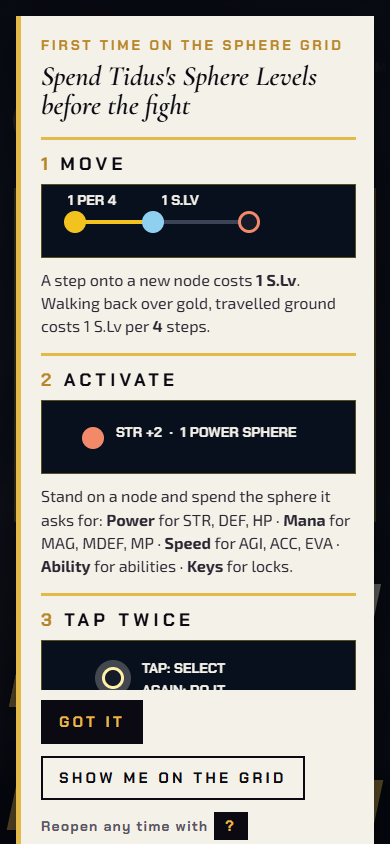

  *The advisor card in a strip of clear deck under the party at the first menus of Chapters XVII and XVIII, and the Sphere Grid explainer on a phone.*

- **Behind the scenes:** the deploy tool falls back to pushing changed files only when a full upload
  times out, and a stray 404 on battle entry is gone.
