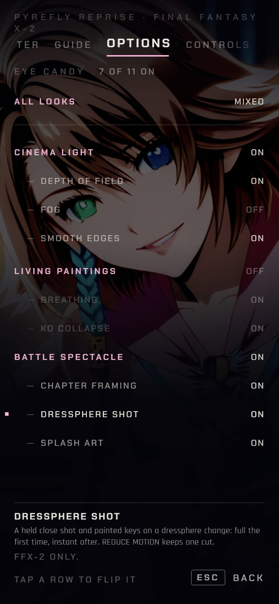
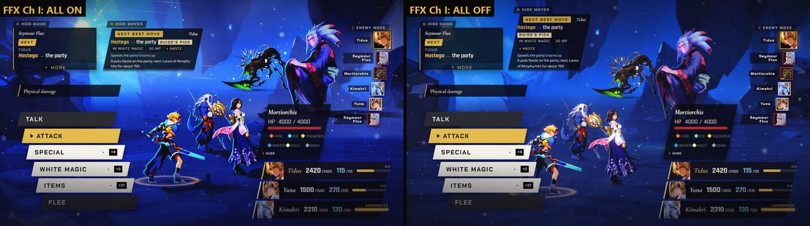
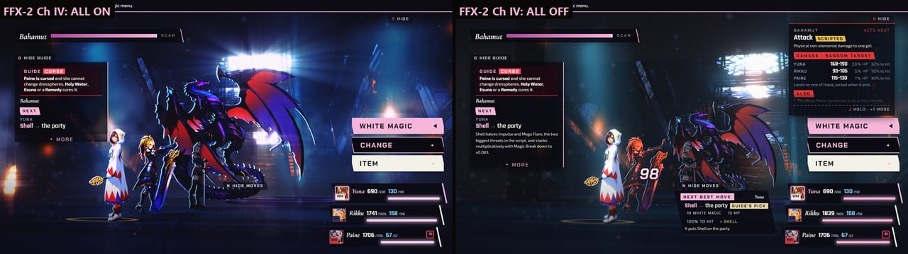
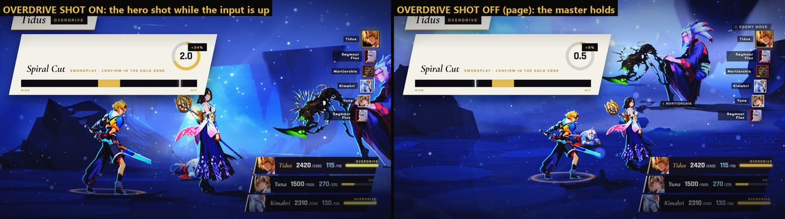
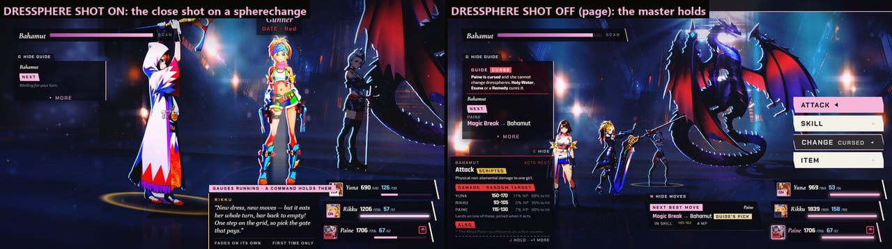
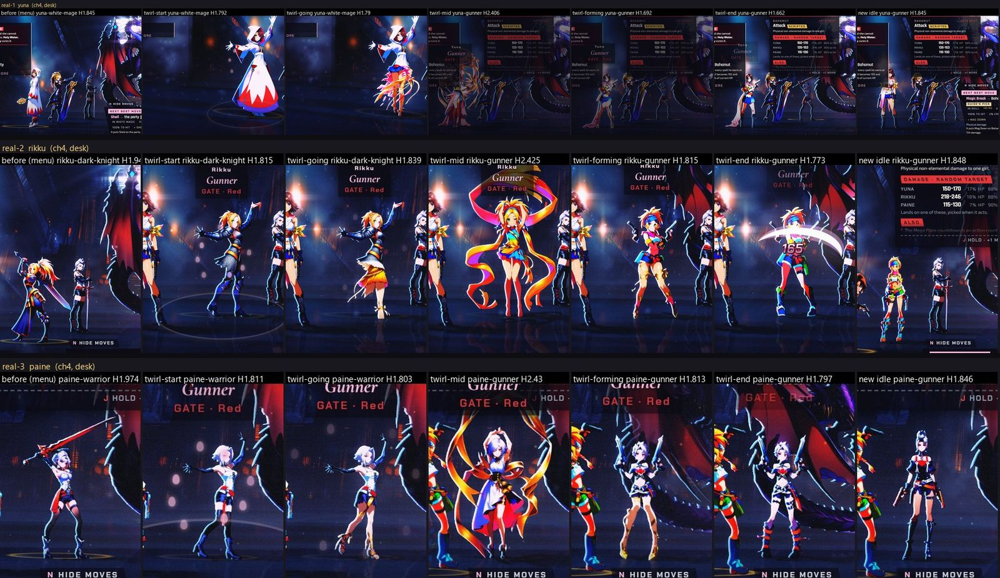
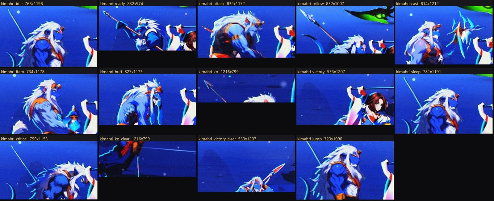
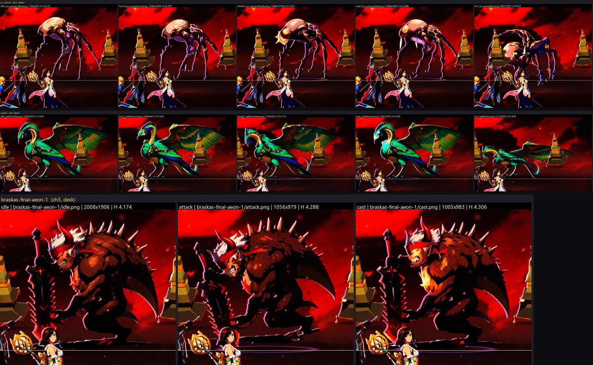
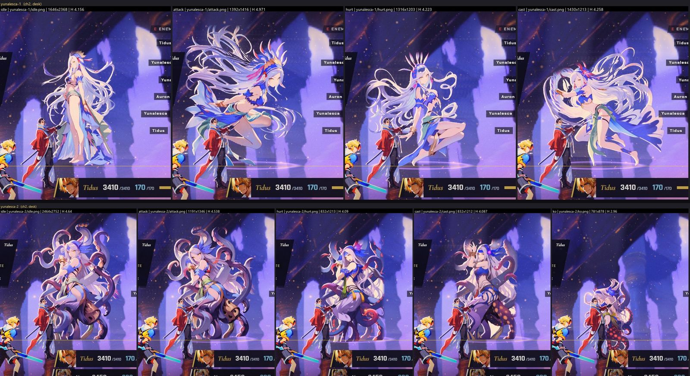
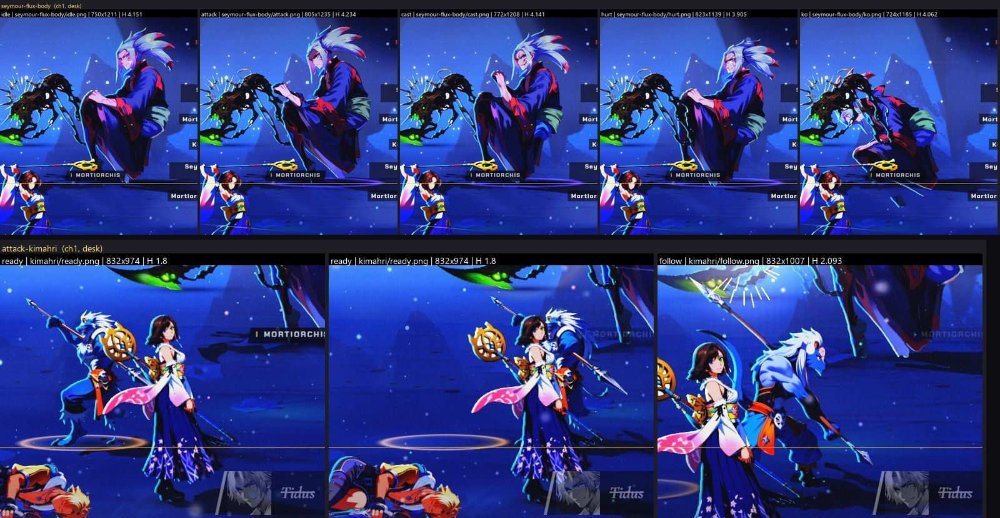

[Back to the changelog](../../CHANGELOG.md)

# 2026-10-03 · Release 36

Address: https://baileypillon.github.io/pyrefly-reprise/ (main c69de96a)

*Where a caption says left and right, the left picture comes first.*

- **Both:** a new EYE CANDY page in OPTIONS gives each part of the three looks (CINEMA LIGHT, LIVING
  PAINTINGS, BATTLE SPECTACLE) its own switch, nine in all. A look turned OFF turns its parts off,
  and the page says OFF HERE or LESS HERE where a phone or the low tier trims a part.

  
  

  *The EYE CANDY page in FFX on a desktop (all on) and in FFX-2 on a phone (Fog and Living Paintings switched off): three looks, each with its own parts and a help line.*

- **Both:** a big visuals pass, the MAX mix: big bosses framed larger with the party where the
  backdrop allows (Yojimbo, Bahamut), a depth-of-field blur, room fog, smoother edges, figures that
  breathe and buckle when knocked out, and splash art cropped to its focus.

  
  

  *Every part on (left) and every part off (right): Chapter I in FFX and Chapter IV in FFX-2.*

- **FFX:** on desktop, the camera holds a close shot of the attacker during an Overdrive input, and
  the name banner sits clear of the party.

  

  *Tidus entering Spiral Cut: the hero shot while the input is up (left) and the old fixed camera (right).*

- **FFX-2:** a dressphere change plays a painted twirl (69 of the 77 keys). On desktop it also holds
  a close-up of the girl, skipped where a dressphere still has only a stand-in figure.

  
  

  *The close shot on a dressphere change (left) against the old camera (right), and the painted twirl frames for Yuna, Rikku and Paine.*

- **Both:** 122 paintings (42 replace older ones): Kimahri's single broken horn on all twelve of his
  paintings, whole wings for Valefor and Pterya, redone Yu Yevon, Yunalesca and Seymour Flux poses,
  new party poses, and new hurts for Leblanc, Ormi, Trema and the goon.

  
  
  
  

  *Some of the new paintings in battle: Kimahri's broken horn on every pose, Yu Yevon, Valefor's whole wing and Braska's Final Aeon, Yunalesca, and Seymour Flux's new action poses.*

- **Behind the scenes:** the new switches change the save format, so the build was reviewed in depth
  before it went live, and every switch is proved to stop its effect by real keys and touch in both
  games.
