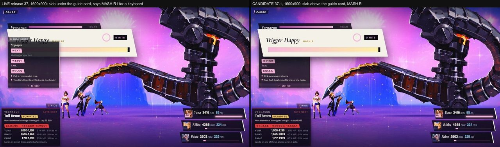
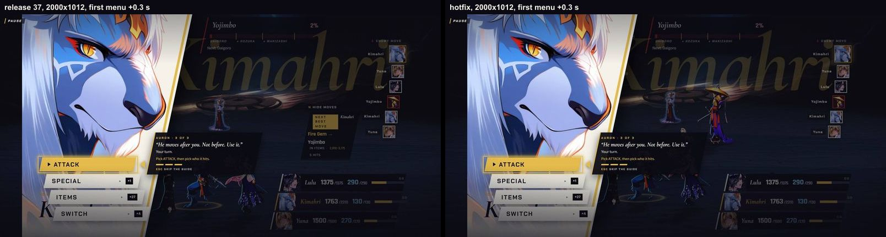

[Back to the changelog](../../CHANGELOG.md)

# 2026-10-03 · Release 37.1

Address: https://baileypillon.github.io/pyrefly-reprise/ (main f4244e1f)

*Where a caption says left and right, the left picture comes first.*

- **FFX-2:** Trigger Happy counts gamepad R1 and taps or clicks on its bar, not only the R and Page
  Down keys, and its prompt names the right button for your device (MASH R, MASH R1, MASH TAP or MASH
  CLICK). Enter does not count, because it is not the bound button.

  

  *The three routes, from the hotfix's own check. Release 37 (left): the prompt said MASH R1 for a keyboard and the bar sat under the guide card. Release 37.1 (middle and right): twelve presses of R give 12 HITS and the prompt says MASH R; twelve pad R1 presses give 12 HITS and it says MASH R1.*

  

  *On a phone, release 37 (left) hid the bar under the intent card, where it could not be tapped. Release 37.1 (right) puts it on top: three taps give three hits, and the prompt says MASH TAP.*

  

  *From the review of the 37.1 candidate, at 1600x900: release 37 (left) draws the bar under the guide card with MASH R1, the candidate (right) draws it above the card with MASH R.*

- **FFX:** in Chapter IX, Yojimbo and Daigoro appear at the first menu after a hurried opening.

  
  

  *Chapter IX's first menu 0.3 seconds in after a hurried opening: on release 37 (left) Yojimbo and Daigoro are not drawn; on 37.1 (right) all three enemies are. The second picture is the same pair at 2000x1012.*
