[Back to the changelog](../../CHANGELOG.md)

# 2026-10-03 · Release 37

Address: https://baileypillon.github.io/pyrefly-reprise/ (main cd9dbbb0)

*Where a caption says left and right, the left picture comes first.*

- **Both:** the pause screen's ten portraits come alive: they blink, glance aside, and their eyes
  follow the highlighted tab or row. LIVING PAINTINGS and REDUCE MOTION switch it off.

  
  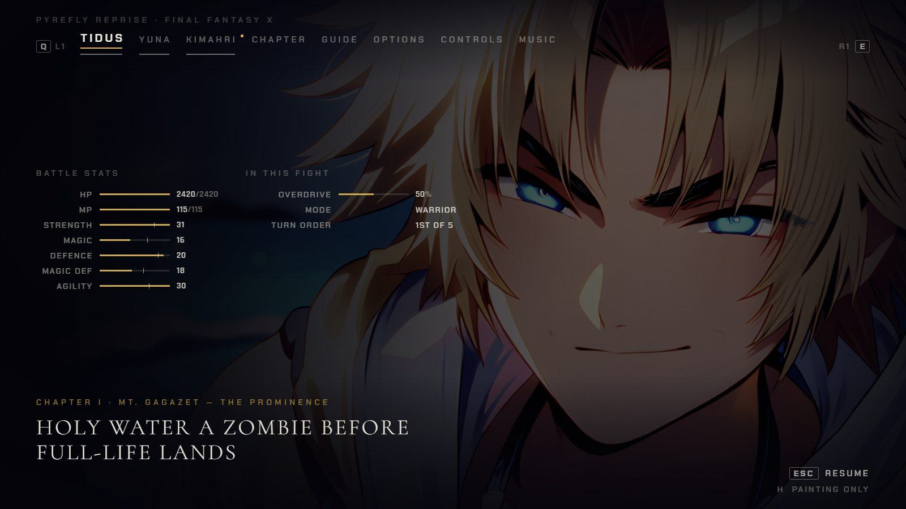
  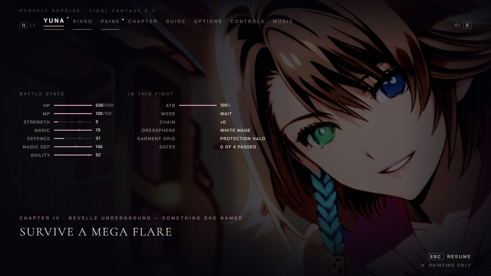

  *The living pause portraits: Tidus at two moments of his loop, and Yuna's FFX-2 portrait.*

- **Both:** eight more backdrops get depth layers and a slow drift, with the far layers softening as
  the camera moves. FFX: Zanarkand, Dream's End, the Garden of Pain, Via Purifico. FFX-2: the
  Farplane, Leblanc, Via Infinito, the Den of Woe.

  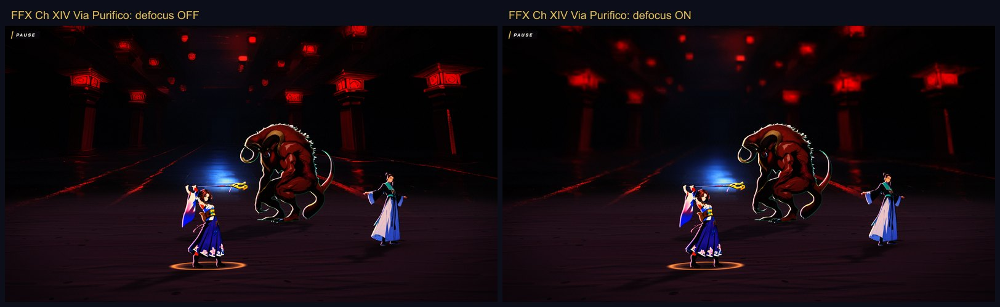
  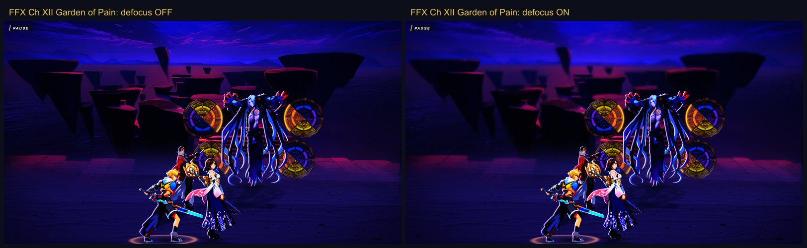
  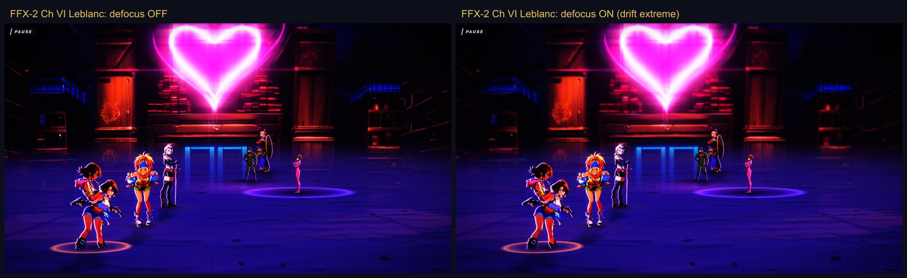

  *Far-layer softening off (left) and on (right) with the camera drifted to its extreme: Via Purifico and the Garden of Pain in FFX, Leblanc's stage in FFX-2.*

- **FFX-2:** all 77 dressphere twirl keys are in (the last 8 added), and the close-up now holds its
  full 1.6 seconds, so a change takes about a second longer. The coach line steps aside for it.

  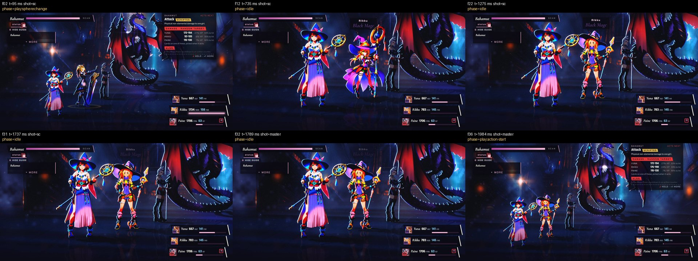

  *One dressphere change in Chapter IV (Rikku to Black Mage): the close shot holds for about 1.7 seconds, then the camera returns and Bahamut's action begins.*

- **Both:** 35 more boss paintings. FFX-2: Bahamut, Vegnagun's tail, Leblanc and her gang, Trema,
  the Den of Woe shades, the Magus Sisters. FFX: Sin's fins and Genais, the Guado Guardian, Evrae,
  Mortibody.

  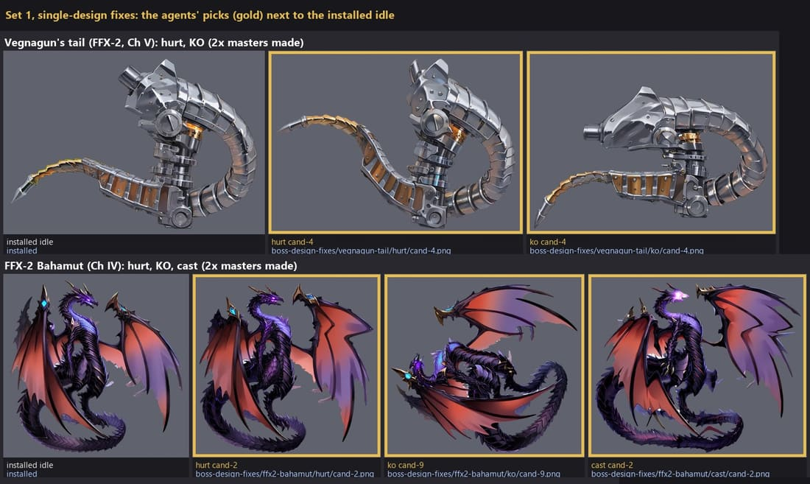
  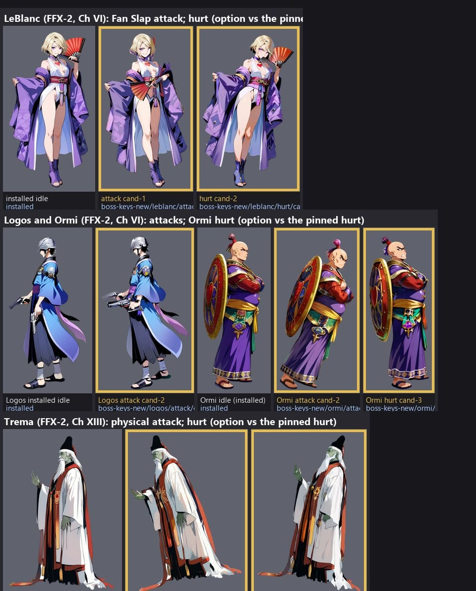
  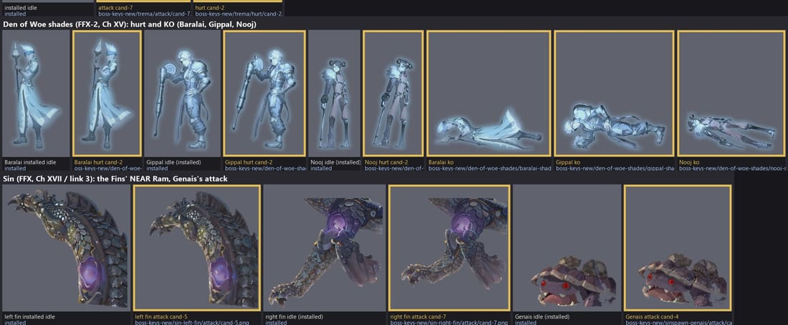
  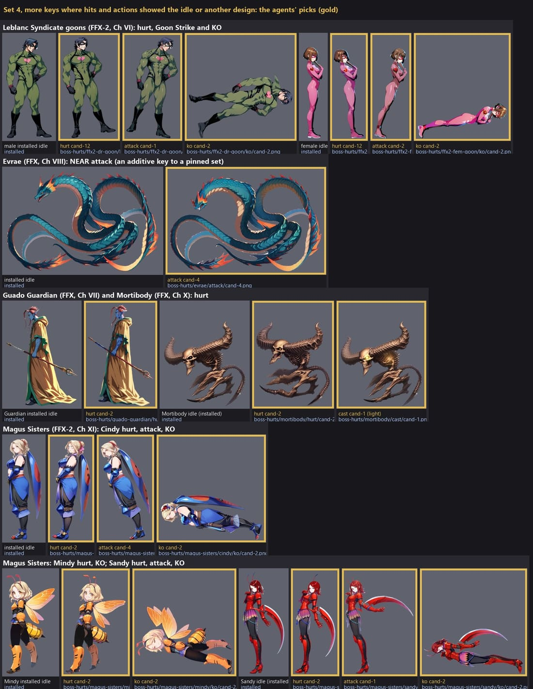

  *Contact sheets from the art run: each figure's installed idle (grey) beside its picked key paintings (gold frames). This release installed the attack, hurt, KO and cast keys named above; a few hurt paintings on the sheets (Leblanc, Ormi, Trema and the male goon) had already come in with release 36.*

- **FFX:** in Chapter IX, Lady Ginnem gets a breathing cool halo and a shell of pyrefly motes, in
  the fight and in the scene after it.

  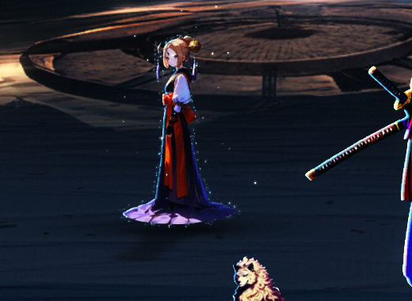
  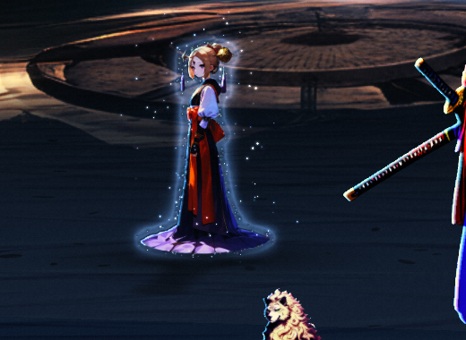

  *Lady Ginnem in the Chapter IX fight (cropped): glow off, then on.*

- **FFX-2:** Lady Luck's reels follow the sourced pay table (a spin pays or is a Dud) and your own
  spin reaches the battle. No dressphere grid offers her yet.

  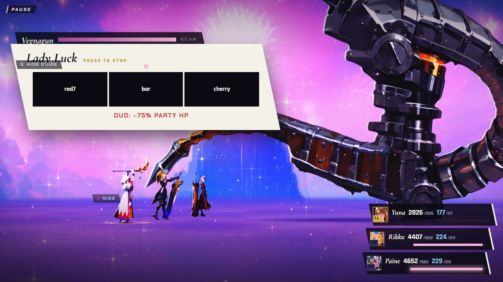
  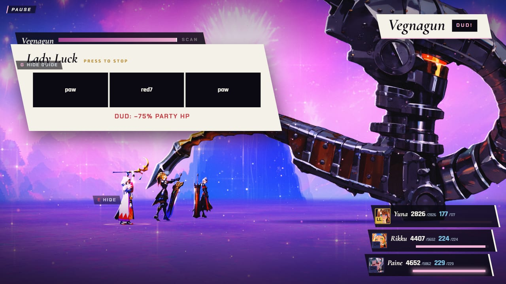

  *Lady Luck in Chapter V: the reel overlay with its Dud warning (minus 75 percent of party HP), and the three reels stopped on paw, red 7, paw, which is a Dud.*

- **FFX-2:** Trigger Happy now takes your own press count instead of rolling 6 to 16 hits, but only
  the R and Page Down keys count; gamepad and touch get one hit until 37.1.

- **FFX-2:** the enemy's message and telegraph clear at the last blow, and on windows 2000 px wide
  and up Chapters IV and XV fill the frame with a mirrored backdrop edge (Chapter IV's lamp shows
  doubled).

  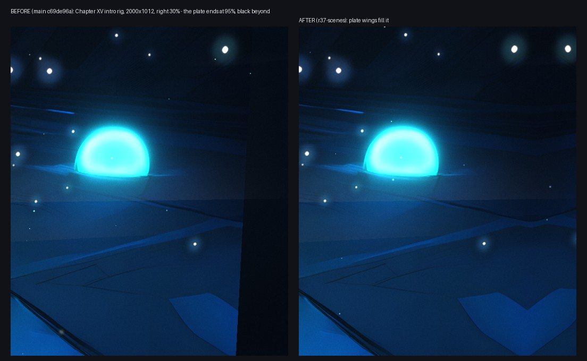

  *The right 30 percent of Chapter XV's opening on a 2000 px window: before (left) the painted backdrop ended and black showed beyond it; after (right) a mirrored wing fills the frame.*

- **Both:** a knocked-out party member lies clear of the status rows, and holding skip through a
  hurried opening reaches the first menu in about 4 seconds, not 12.

  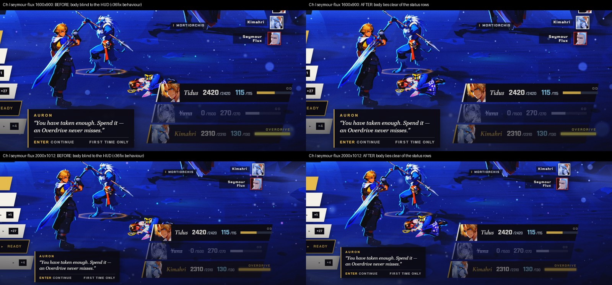

  *Chapter I: a knocked-out Yuna lies clear of the status rows (before on the left, after on the right, at 1600 px and 2000 px).*

  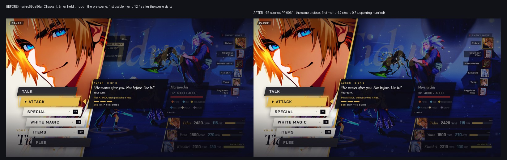

  *Holding skip through the opening of Chapter I: the first menu came up 12.4 seconds after the scene began (left) and now 4.2 seconds (right).*

- **FFX:** the Chapter XVII move advisor follows the sensible line's priorities, so its top pick now
  wins about half the time, up from about 4 percent.

- **FFX:** overkilled enemies drop double items, Auron gives a one-time disc tip in Chapter XII,
  Braska's Final Aeon's Talk beat gets a smaller line card, and Ronso Rage is no longer called a
  timed input.

  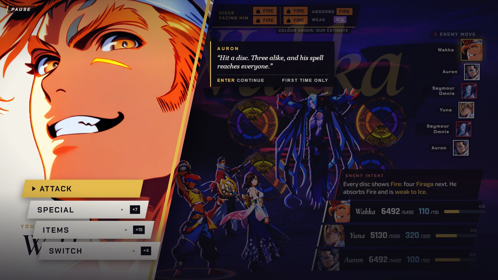
  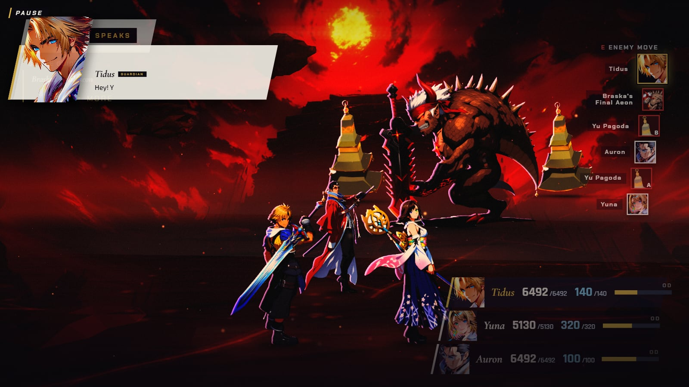
  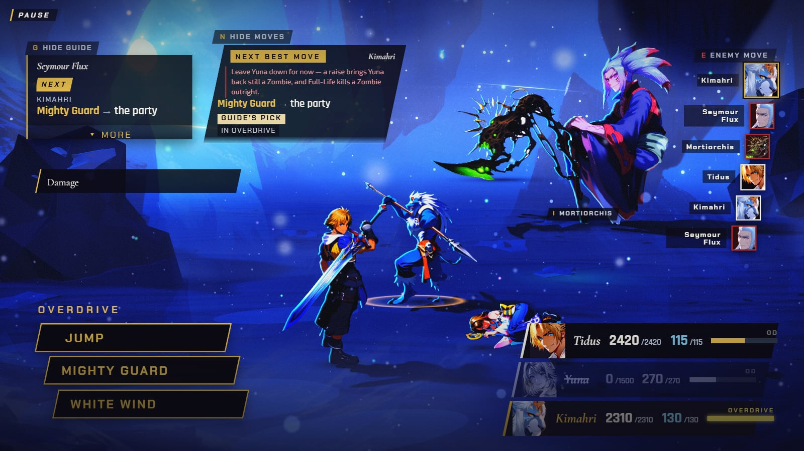

  *Auron's one-time disc line in Chapter XII (first), the smaller line card at Braska's Final Aeon's Talk beat (second), and Kimahri's Overdrive menu, where Jump's help now reads just "Damage" (third).*

- **Behind the scenes:** no source maps ship any more (22.8 MB lighter), and the audio checks gain
  an automated listener that screens new music.
