[Back to the changelog](../../CHANGELOG.md)

# 2026-10-06 · Release 39.1 on echoesofspira.com

Address: https://echoesofspira.com (main d3fe9fe5, bundle B6DQPYhY)

*Where a caption says left and right, the left picture comes first.*

*The pictures come from the lane builds that were merged into this release and from the production-build smoke of the release candidate (1600x900 unless a caption says otherwise), so a lane's frame can differ a little from the final bundle.*

- **Both:** a new title screen. Yuna, Rikku and Paine look out over a lavender flower field to a golden
  crystal spire: the painting Bailey approved in the Art Room. The "Echoes of Spira" panel sits at the
  top left, above the three heroes, and the two black Tidus and Yuna cut-outs are gone. A phone shows
  all three heads. The picture, the panel's place and the cut-outs' removal are Bailey's picks.

  
  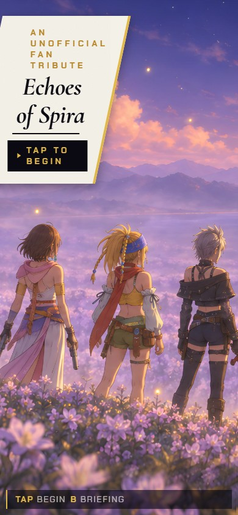

  *The title screen at 1600x900 (first) and on a 390x844 phone (second, "TAP TO BEGIN"). Enter, or a tap on the chip, reaches the chapter board after the first-run brief.*

- **Both:** characters and bosses show their paintings' own colours. The colour chain had never
  applied the display encode, so every painting was drawn with its gamma applied twice: darker, more
  saturated, white clothes and hair tinted lavender. Figures now go through it and read paler and
  calmer against the backdrops; Bahamut's wings go from deep red to the painting's salmon. Adding
  `?figtrue=0` to the address brings release 39's look back. This was Bailey's pick. Still open:
  Bahamut's dark body also lifts from near-black toward charcoal, and that is under investigation.

  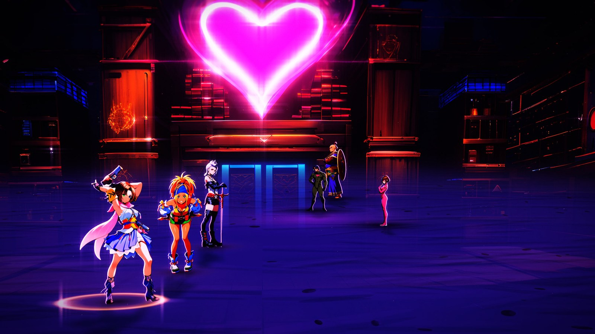
  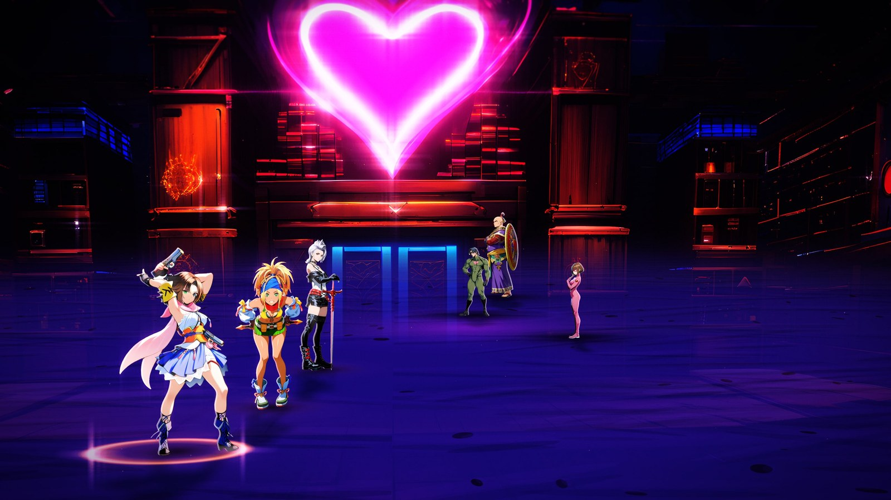

  *Chateau Leblanc (FFX-2 Chapter VI) at 2560x1440, shown at 1600 wide: release 39's colour (first) and the figures-true colour that is now the default (second). Yuna's scarf and Rikku's and Paine's whites keep their own colour and the blue-violet cast is gone. The frames come from the colour lane's build.*

- **FFX:** every attack reaches its target. The lunge is worked out against the painted figures on
  screen, so a strike ends where the two paintings touch instead of at a fixed 1.4 units. In
  Chapter I Tidus used to stop 159 px short of Seymour Flux; the party's strikes there now end at
  0 px (3 of 3 within 12 px). Over the FFX chapters 73 to 80 percent of the party's strikes and 65 to
  82 percent of the fiends' end within 12 px of their target.

  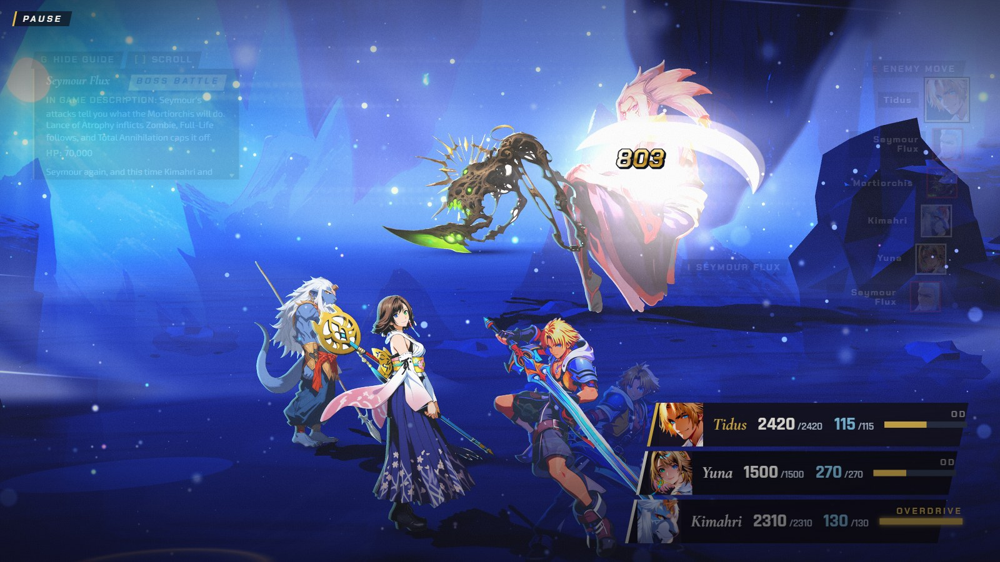

  *Chapter I, Tidus at the impact of his strike on Seymour Flux (803 damage), after the lunge that now closes the whole gap.*

- **FFX-2:** fiends reach their target too (Bailey's call: the sources say nothing about how an FFX-2
  fiend approaches), and a girl who runs in reaches after her run-in. A girl who fires from where she
  stands (Gunner, Lady Luck and the other long-range dresspheres) still does not step in. Bahamut's
  strike at Yuna in Chapter IV left a 153 px gap and now closes it at the apex; Dr. Goon's gap to
  Rikku in Chapter VI fell from 560 px to 174 and Ixion's median gap from 231 px to 27.

  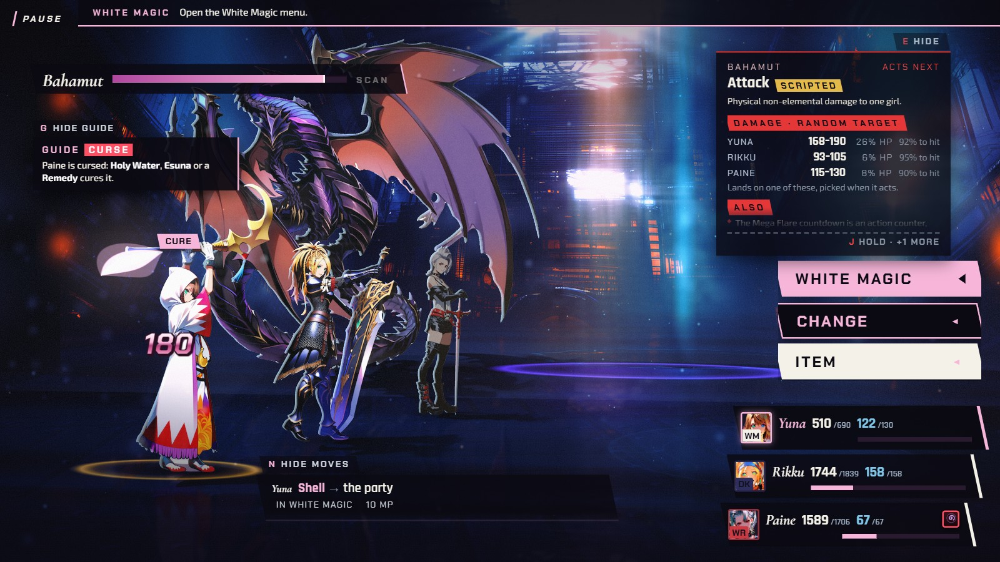

  *FFX-2 Chapter IV, the apex of Bahamut's strike at Yuna (the white mage at the left): his lunge is 3.04 units against the house 1.4, and the painted gap to her is 0 px at the apex (153 px at rest).*

- **Both:** a figure keeps its head size and stays planted when it changes pose, in every chapter.
  All 24 dresspheres, Lady Luck's three sets and the FFX party have measured head and foot positions,
  42 foes and bosses have a measured stance, and a KO's lying painting is compensated. In the
  critic's 18-chapter run on the live build, head swaps over the tolerance fell from 1,688 to 5 and
  feet slides from 1,749 to 1 of 10,500 measured swaps (the worst slide is 4.2 px). A KO still
  cuts in one frame (see "Still open").

  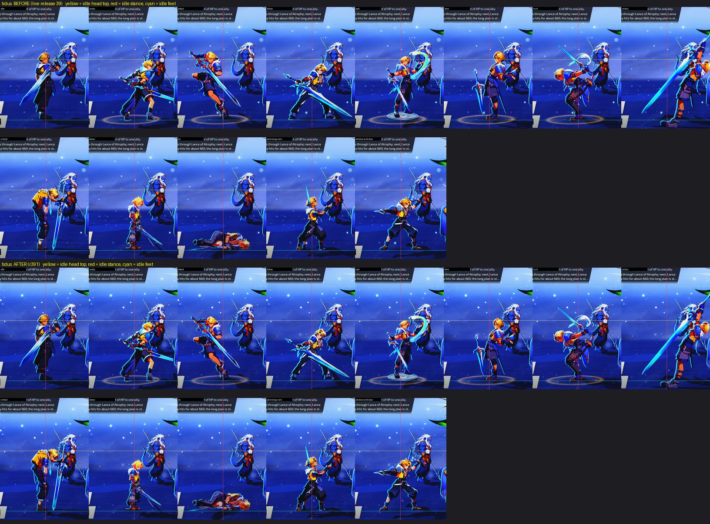

  *Tidus in each of his 13 poses on Chapter I's stage: release 39 (top two rows) and release 39.1 (bottom two). Yellow is his idle head top, red his idle stance, cyan his feet.*

- **FFX:** Lulu's critical pose stands lower and its head matches her idle's (head x1.08 of her idle's
  before, x0.98 now). **FFX-2:** Rikku's Berserker ready pose the same (x1.14 before, x1.00 now). Both
  were the one pose of their game where the minimum height rule had kept the head large; every other
  pose keeps the rule. This was Bailey's pick. No chapter's Garment Grid offers Berserker yet, so no one
  will see Rikku's until it does.

  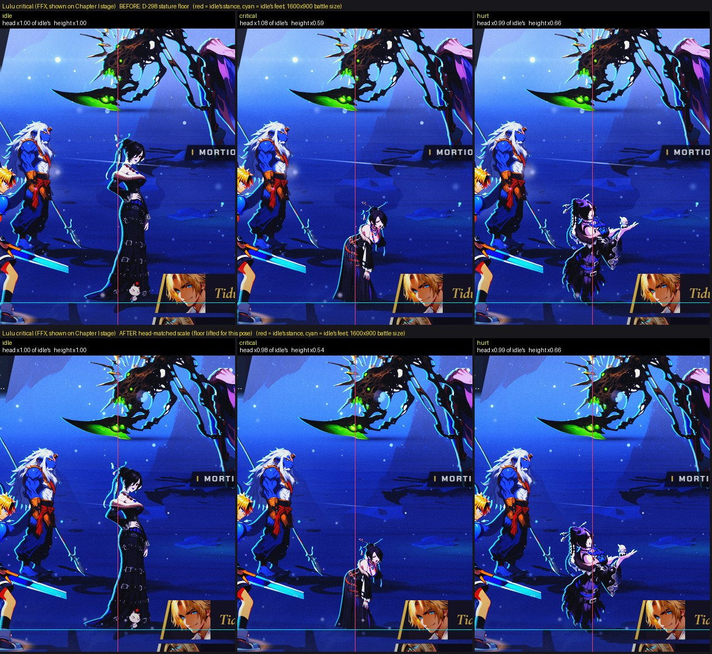
  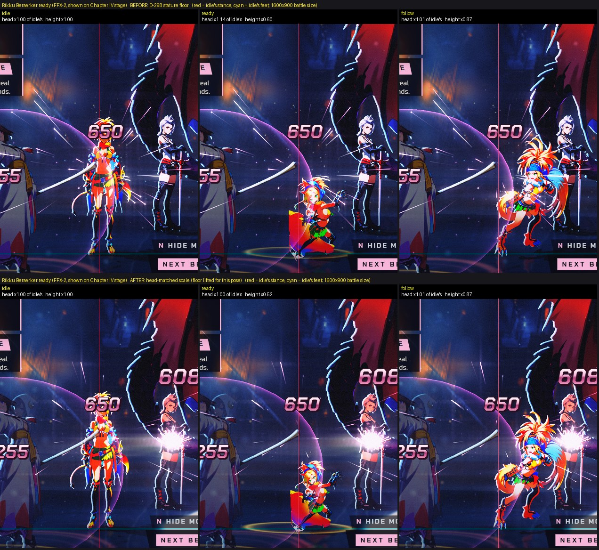

  *Lulu's critical pose on Chapter I's stage (first) and Rikku Berserker's ready pose on Chapter IV's (second): before (top row) and after (bottom row). Left to right: idle, the lifted pose, and a third pose for comparison (hurt for Lulu, follow for Rikku). The red line marks the idle's stance, the cyan line its feet.*

- **Both:** fewer 100 to 300 ms hitches when a sharp painting arrives. Release 39 swapped a 2x to 4x
  painting in mid-turn and the graphics card took 145 to 216 ms to accept it. Now the painting is sent
  ahead a slice at a time and swapped in between two draws. In Chapters I, IV and VIII at 1440p the
  frames over 50 ms that carried an upload fell from 13, 9 and 8 to 4, 0 and 0. It costs memory:
  Chapter I's first menu holds 1,338 MB of textures, up from 715. `?stage=off` puts the old path back.
  The critic's run did not see fewer slow frames in FFX-2's Vegnagun and Fallen Aeons.

- **FFX:** in Chapter XII Tidus, Yuna and Auron stand apart instead of in a heap: at the first menu the
  biggest overlap of two figures fell from 0.69 to 0.08 to 0.11 and the least visible figure rose from
  0.20 to 0.82 to 0.84 of itself. The cost is a party about a fifth smaller on screen. The four
  Mortiphasm discs stand 0.30 of Seymour's height higher, so none sits behind the party or the intent
  card.

  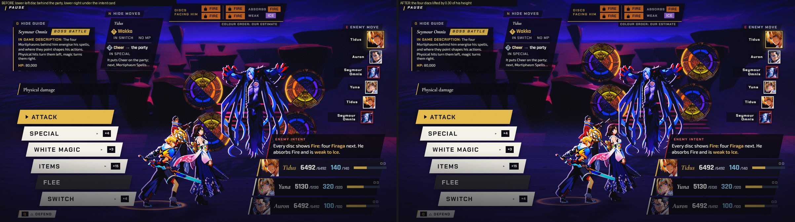

  *Chapter XII's first menu: before (left, a disc behind the party and one under the intent card) and after (right, the four discs lifted by 0.30 of his height).*

- **FFX:** Seymour Natus's Sensor card no longer touches his wing tips at 1280x720 and 1366x768 (it
  covered 6.9 to 7.8 percent of him, now 0).
- **Both:** the move advisor's card never ends a sentence in "..." any more: a reason is whole or
  gone, and Chapters XII and XVIII print the card's effect.
- **Both:** the strategy guide never shows half a line and says it scrolls: a `[ ] SCROLL` chip
  beside G HIDE GUIDE (R-STICK SCROLL with a pad) and arrow marks at its foot. In the measured test
  64 of 72 states cut a line before and 0 do now. The phone's sheet is unchanged.
- **FFX-2:** the guide no longer disappears at TEXT SIZE 115 and 130 in Chapters IV and VI: it folds
  to its G GUIDE tab and G opens it over the boss strips, never over a girl.
- **FFX-2:** the dressphere close-up. The guide and the move advisor step out of the way while it is
  held, and it waits up to 1.0 s (was 0.6 s) for an enemy action already under way. In the test
  (Leblanc, Den of Woe, Fallen Aeons, Vegnagun) the close-up was shown in 23 of 32 changes, up from 20.
- **FFX-2:** the boss reveal in the Den of Woe and Fallen Aeons keeps every girl in the frame:
  Yuna's smallest visible share was 0 and is now 1.00, and the 6.0 s opening is as long as before.
  Bahamut's reveal in Chapter IV still lets Yuna out of the frame for about 2 s; fixing it would
  shrink the camera's push, which is Bailey's call.

  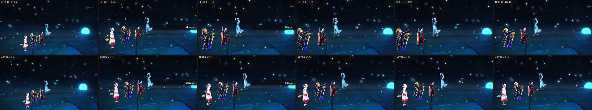

  *The Den of Woe's boss reveal at 1.2, 2.2, 3.0, 3.8, 4.6 and 5.4 s: before (top row) and after (bottom row).*

- **FFX-2:** in Chapter IV the white blob in the gap of Bahamut's neck is gone: the lit pane strip of
  the Bevelle plate behind it is held down to 45 percent.

  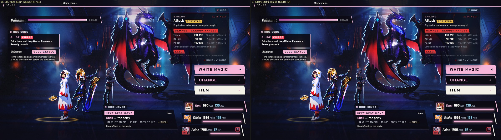

  *Chapter IV's first menu: before (left, a white blob in the gap of Bahamut's neck) and after (right).*

- **FFX:** in Chapter IX Yojimbo's blue sakura arrival is over in 3.6 s instead of 5.8 s (2.3 s when
  the opening is hurried).
- **Both:** the pause screen in a 4K or ultrawide window: where the window is larger than the 3360x1920
  plate, the same pause painting continues behind it, blurred and darkened, instead of a flat dark
  strip. A 1600x900 window is unchanged.

  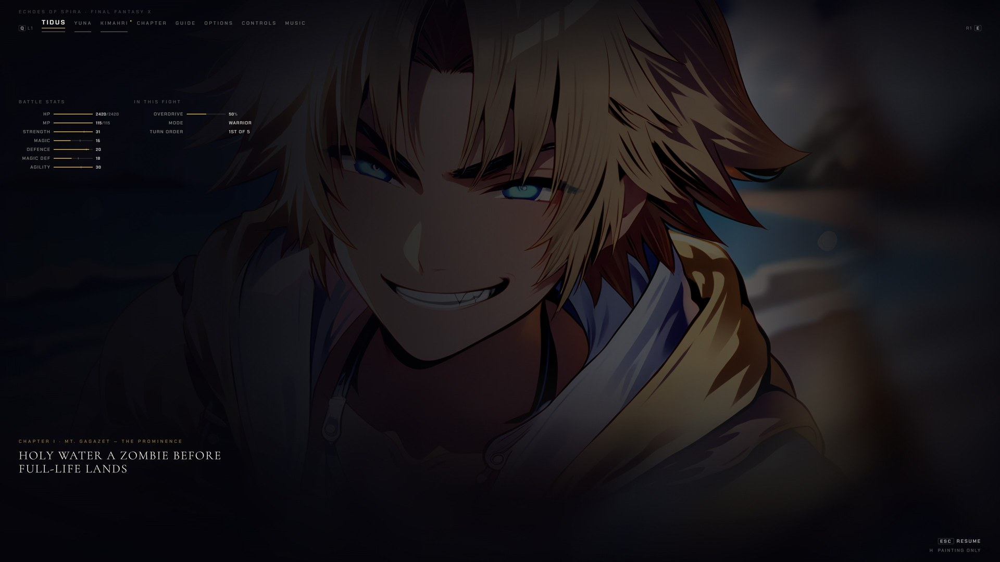
  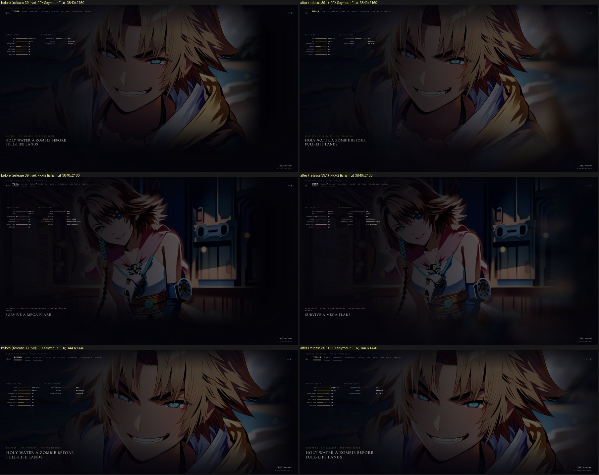

  *The pause screen at 3840x2160 in Chapter I (first, shown at 1920 wide), and the release 39 (left) and 39.1 (right) pause screens at 3840x2160 in FFX and FFX-2 and at 3440x1440 in FFX (second).*

- **FFX:** in a 21:9 window the painted backdrops fade their side edges into the scene's colour where
  the painting ends inside the frame. Yunalesca's frame changes 9.2 percent at 2560x1080; at 1600x900 no
  FFX chapter changes a pixel. FFX-2's backdrops are untouched.

  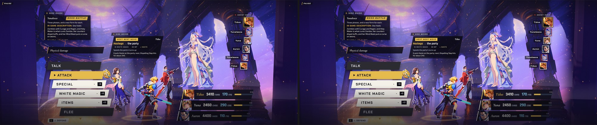

  *Chapter II at 2560x1080: before (left) and after (right), where the backdrop's side edges now fade into the scene's colour.*

- **Behind the scenes:** a hidden mark key (the backtick) saves a record of a battle moment, shows
  nothing on screen and copies a short code you can paste to Bailey; `tools/replay-mark.mjs` plays it
  again. An FFX replay gives the same fight; an FFX-2 replay is near the moment, not it, because its
  ATB clock runs on real time. The critic did not exercise this key.
- **Behind the scenes:** the old title paintings were archived in a private art repository before
  the swap, with the history of every approved painting. The live site holds the same 3,289 art
  files, 8.3 GB in all.

## Still open on this build

The reviews disclosed these. The deep review found no critical or major regression against release 39.

- **Both:** a KO is still a one-frame cut from the standing painting to the lying one (78 of 96
  measured snaps; 0.58 snaps a minute against a limit of 0.25), and most pose changes still show two
  copies of the figure for a few frames (161 swaps at 0.40 or more). Big paintings still jump in one
  frame: Vegnagun's tail by 807 px, Sin's fins, Braska's pagoda hands by 550 px.
- **FFX-2 (Chapter XIII, Trema):** after a lost second link, Retry restarts from the state Paragon's
  fight ended in; with one girl standing it won 0 of 200 test fights, with nothing told to the player.
  This was already so on release 39. Bailey has three measured options to pick from.
- **FFX-2 (Chapter XIII, Trema):** the review saw no victory by real keys in 26 attempts and two long
  runs, so Trema's victory scene is still unseen for the sixth review in a row.
- **FFX (Chapter XVII):** following the move advisor's chain clears 97 of 200 test seeds; Genais's
  Sigh on link 3 is 60 of the 103 losses.
- **Both:** Bailey's listening verdict for the new music and sound effects is still missing, so audio
  is unscored; chapter rows still play stand-in cues; and the hidden FF7 fight's black screen on a
  cold cache is not yet confirmed fixed.
- **Not shown by the review:** the FFX-2 fiend and run-in reach, the Berserker and Lulu frames and the
  guide at larger TEXT SIZE were not each captured on the live build.

## How it was checked

- **Focused review of the candidate:** SHIP, with the changed area UNVERIFIED (pose registration
  clearly better; most of the plan not driven).
- **Live check:** the exact artifact is live: 3,848 of 3,848 files byte for byte, 0 console errors,
  a real-key smoke of FFX Chapter I and FFX-2 Chapter IV.
- **Deep review, round 23 (on the live build):** SHIP, deployment PASS, changed area FAIL. 17 of 18
  chapters reached victory by real keys and Chapter XIII's loss, results and Retry paths were proved.
  The milestone is not accepted.
