[Back to the changelog](../../CHANGELOG.md)

# 2026-10-05 · Release 39 on echoesofspira.com

Address: https://echoesofspira.com (main 816d80f9, bundle DIf_suBq)

*Where a caption says left and right, the left picture comes first.*

*The pictures come from the lane builds that were merged into this release and from the critic's review of the release candidate, so a lane's frame can differ a little from the final bundle.*

- **Both:** high-resolution art. Paintings draw from 2x, 3x and 4x files wherever your window and
  graphics card can use them, so backdrops, floors and figures are far sharper at 1440p and 4K. A
  phone or a weak card keeps the lighter files, and a first battle on a strong desktop loads nearly
  twice as much art.

  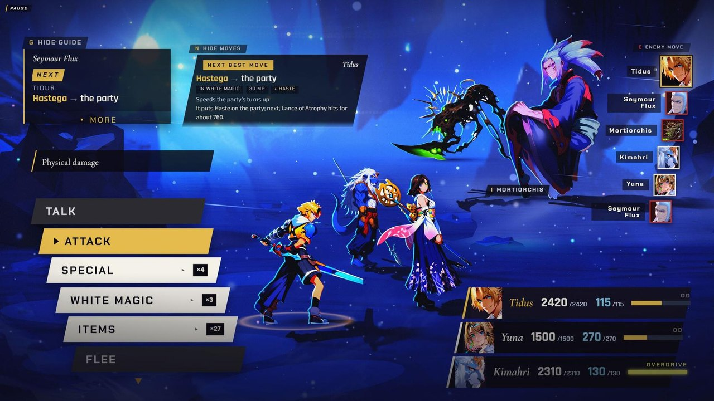
  

  *Chapter I's first menu at 2560x1440, release 38 (first) and release 39 (second): sharper figures and floors, the new scrolling guide at the top left and the Defend tab at the bottom left.*

  

  *Chapter I's backdrop, the moon and the mountain plates, in a 4K window: release 38's engine (left) and release 39's (right), which draws the plates from the 2x master.*

- **Both:** "F plus" is the new default way to draw a battle on a strong graphics card: twice the
  width and height, shrunk with a sharper filter, which brings out fine lines. It steps down by
  itself on a slower card, and a phone draws as before.

  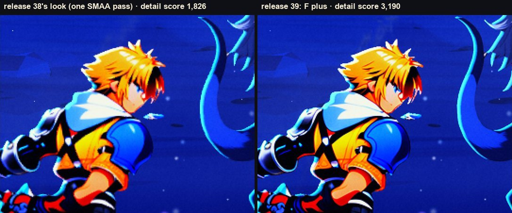

  *Tidus's face at 2560x1440, enlarged twice: release 38's look (left) and F plus (right). The detail score counts fine detail, so higher is sharper.*

- **Both:** almost every character and boss painting has a smooth outline, with the white fringe taken
  out.

  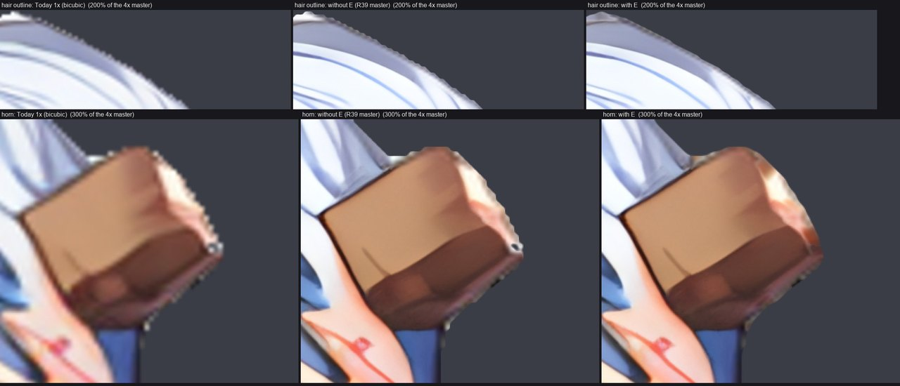

  *Kimahri's hair outline (top, enlarged 200 percent) and horn (bottom, 300 percent): release 38's painting (left), the first 4x master with a stair-stepped edge and a white fringe (middle), and the new smooth outline (right).*

- **Both:** a figure keeps its size and stays planted when it changes pose. In our measured test
  battles the worst head-size jump fell from 57 percent to 8, and feet no longer slide sideways.
  Some size jumps and snaps are left; they are the next job.

  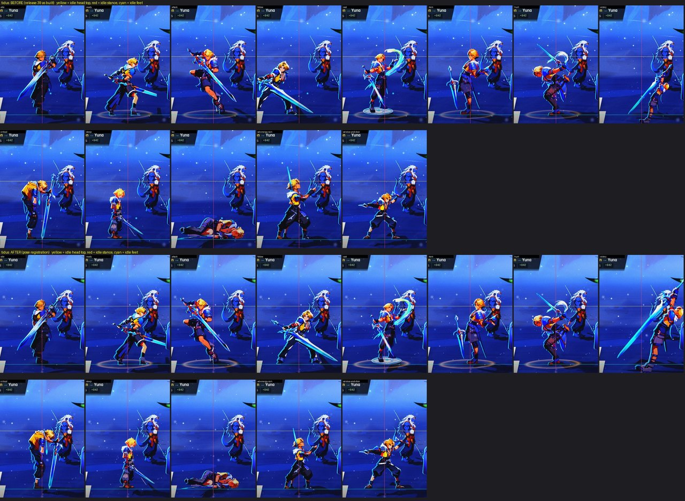

  *Tidus in each pose, without the pose fix (top two rows, which is how release 38 plays) and with it (bottom two rows). The yellow line marks his idle head top, the red line his idle stance and the cyan line his feet: afterwards every pose stands on the same feet, with a head close to the idle's size.*

  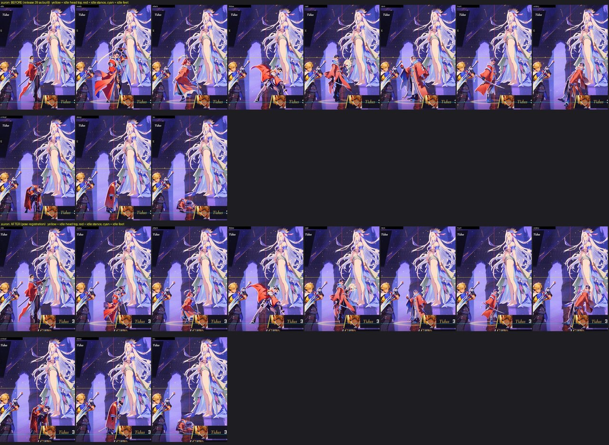

  *Auron in each pose, without (top two rows) and with the fix (bottom two rows). His ready, attack, item and hurt heads were 1.3 to 1.6 times the idle's; now they match to about 1 percent.*

- **FFX:** in Chapter III Braska's Final Aeon stands further right and back, clear of the party, the
  camera is calmer while a menu is open, and the strike runs far enough to reach him.

  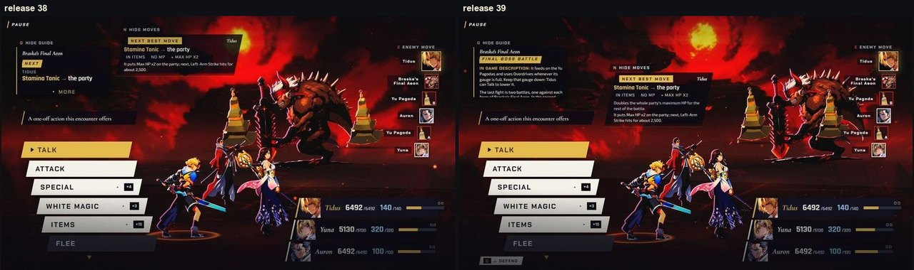

  *Chapter III's first menu: release 38 (left) and release 39 (right). Braska's Final Aeon stands further right and back, and the party no longer overlaps him.*

  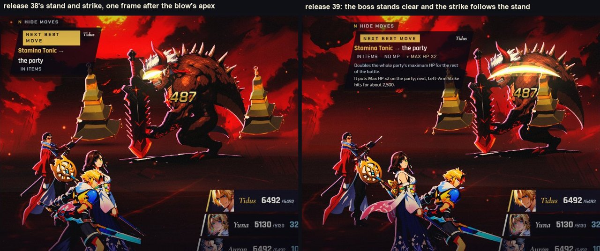

  *Tidus's strike on Braska's Final Aeon, one frame after its apex: release 38 (left) and release 39 (right), where the boss stands further off and the strike runs far enough to reach him.*

- **FFX:** Seymour Natus is bigger in Chapter X: 346 px tall at 1600x900, up from 207. His Sensor
  card stands above him, clear of his painting, in windows 1440x810 and wider.

  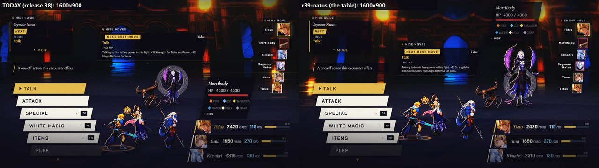

  *Chapter X's first menu at 1600x900: release 38 (left) and release 39 (right). Natus stands 346 px tall instead of 207, with his Sensor card above him.*

- **FFX-2:** four visual fixes. The white rectangle at the start of an outfit change is gone, the
  close-up on a change starts with it, the camera keeps every girl in the frame when one runs in to
  attack, and the dark pipe slabs at the edges of Bevelle's plate in wide windows (Chapters IV and
  XIII) are gone.

  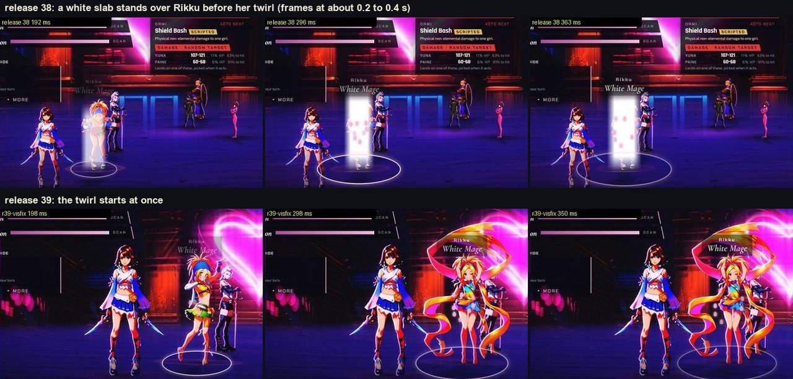

  *Rikku changes to White Mage in Leblanc, 0.2 to 0.4 s after the command: release 38 draws a white slab before the twirl (top row), release 39 starts the twirl at once (bottom row).*

  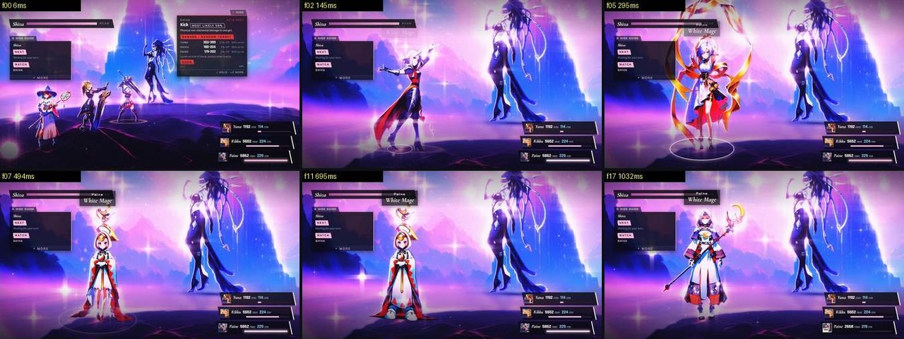

  *Paine changes from Dark Knight to White Mage in Fallen Aeons on release 39: the close-up starts with the change (frames at 6, 145, 295, 484, 695 and 1,032 ms).*

  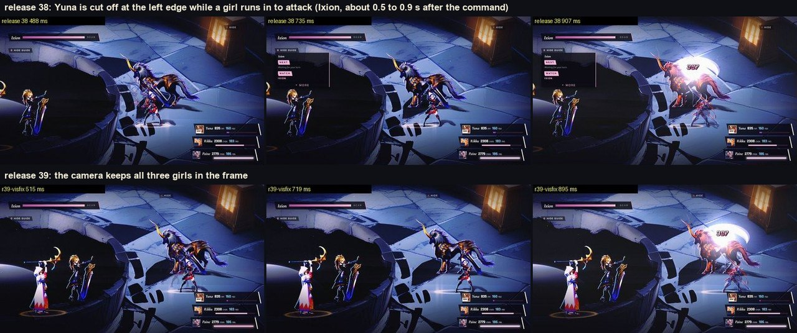

  *A girl runs in to attack Ixion: on release 38 Yuna is cut off at the left edge (top row), on release 39 all three girls stay in the frame (bottom row).*

  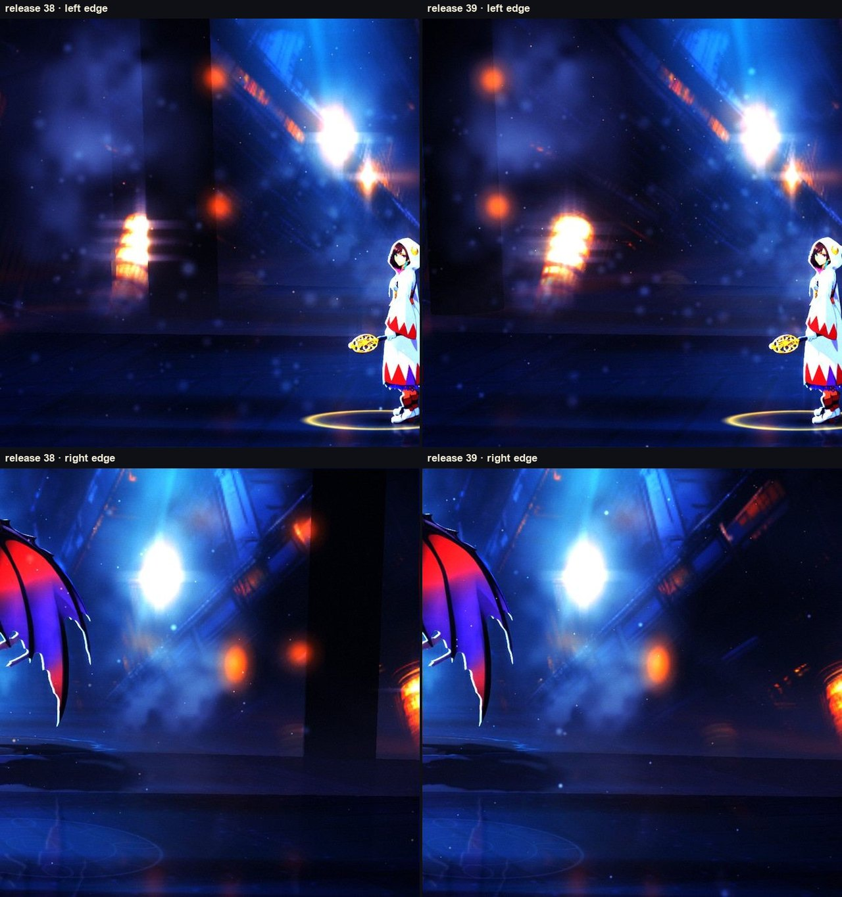

  *Chapter IV's Bevelle plate in a 2560x1080 window, the left edge (top) and the right edge (bottom): release 38 (left) has dark pipe slabs a third of the way in, release 39 (right) keeps them at the frame's edge.*

- **FFX:** Defend is on a tab under the command window: Triangle on a pad, Q on a keyboard, a tap on
  a phone.

  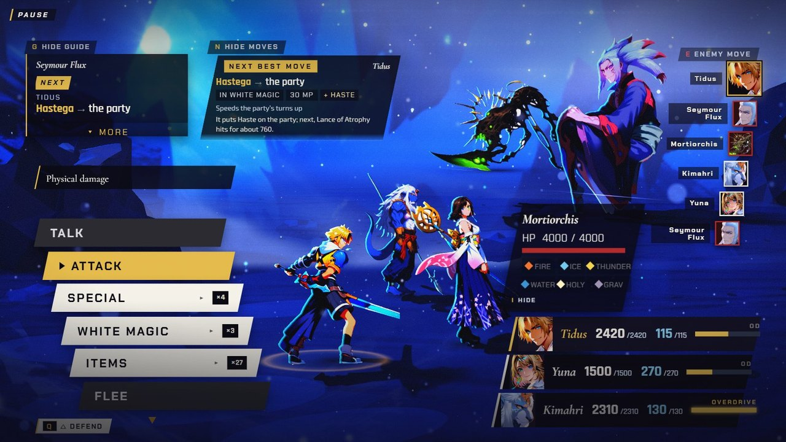

  *FFX's command window with the new Q / Triangle DEFEND tab at the bottom left (Chapter I, 1600x900).*

- **FFX:** Bushido and Swordplay answer taps and clicks, and the Bushido chips name the key for your
  device. The press that closes the last first-turn tip no longer also picks Attack.

  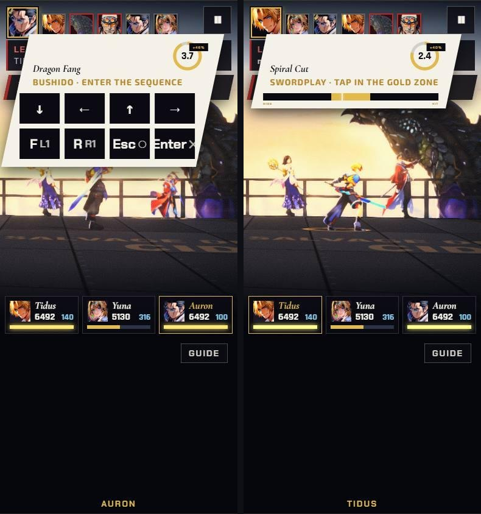

  *Auron's Bushido chips (left) and Tidus's Swordplay bar (right) on a 390x844 phone: tap a chip, or tap the bar in the gold zone. Each chip names the key and the pad symbol.*

- **Both:** the move advisor's card no longer shrinks to a stub in the narrow boxes of Chapters VII,
  IX, XII, XVII and XVIII: it keeps its cost and its effect.

  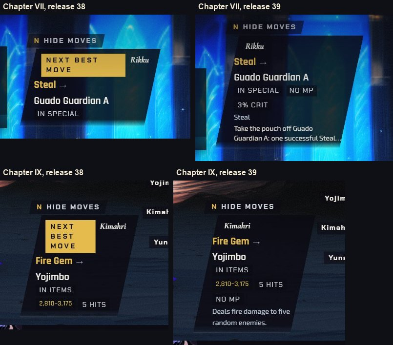

  *The move advisor's card in the narrow box of Chapter VII (top) and Chapter IX (bottom): release 38 (left) shows only the move, release 39 (right) keeps its cost and its effect.*

- **FFX-2:** TEXT SIZE (115 and 130 percent) now reaches the battle screen, as it already did in
  FFX, and both games' pause screens follow it.

  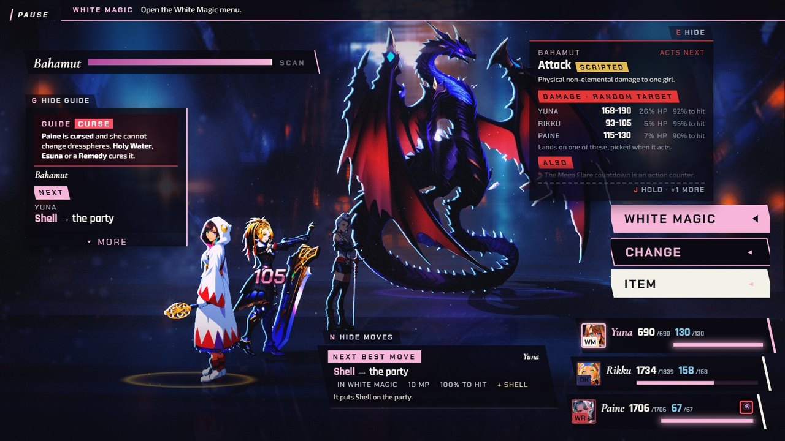
  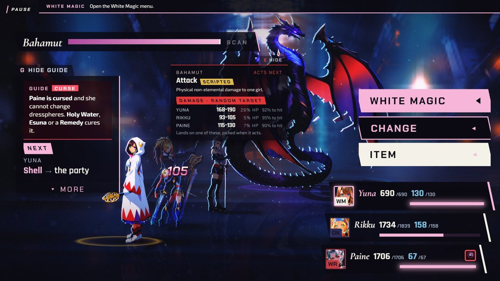

  *FFX-2's battle screen in Chapter IV at TEXT SIZE 100 percent (first, how every setting looked on release 38) and 130 percent (second): the command list, party list, guide and advisor grow.*

- **FFX-2:** Lady Luck joins the Garment Grid in Chapters V, XI, XIII, XV and XVI, with 45 new
  paintings for Yuna, Rikku and Paine. Her reels are timed by you: three reels run on a slow strip
  of pictured symbols, 5 a second, and a press stops the reel the pink arrow marks on the symbol on
  the gold line. A 12 second timer stops any reel left. The slow strip was Bailey's pick; the speed
  and the timer are our estimates.

  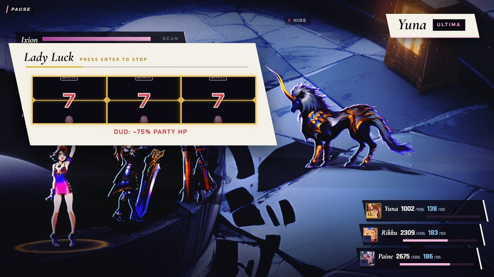

  *Lady Luck's reels at Djose (Chapter XVI, 1600x900): three Red 7s stopped on the gold line, which is Ultima, with Yuna in her new Lady Luck painting at the lower left.*

  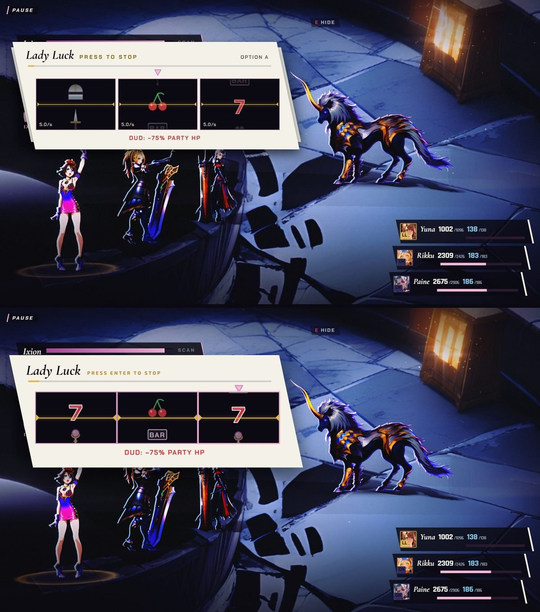

  *The approved target (top, from the options page) above the build (bottom), the same moment.*

- **Both:** the strategy guide is a scrolling page for each boss. It opens on the boss on the field
  and scrolls with the wheel, the `[` and `]` keys or the pad's right stick. In Chapter I it no
  longer says Defend answers Total Annihilation, which is a Magic attack: Shell does.

  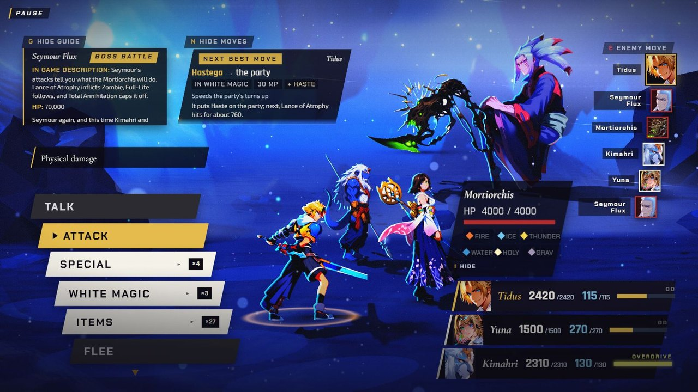
  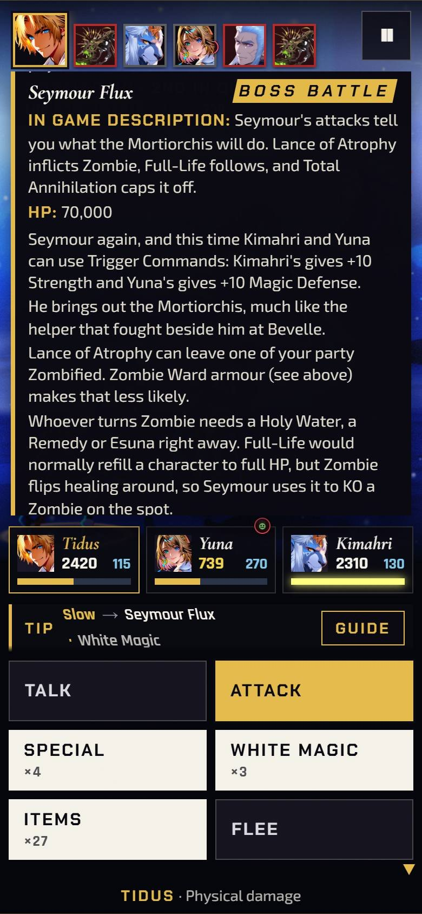

  *Chapter I's guide: Seymour Flux's page in the card at the top left of a 1600x900 window (first), and the same page on a 390x844 phone, where the whole page shows in a sheet (second).*

- **Both:** six backdrops get new 2x paintings that stay true to the originals (Mt. Gagazet, the
  Garden of Pain, Via Purifico and the Road to the Farplane among them), and Evrae has ten new
  high-resolution paintings in Chapter VIII.

  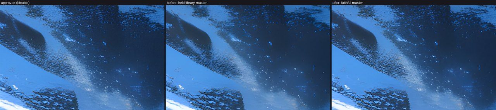

  *A crop of Mt. Gagazet's backdrop: the painting enlarged (left), the earlier 2x master, held back because it drew branches the painting does not have (middle), and the new 2x master that stays true to it (right).*

  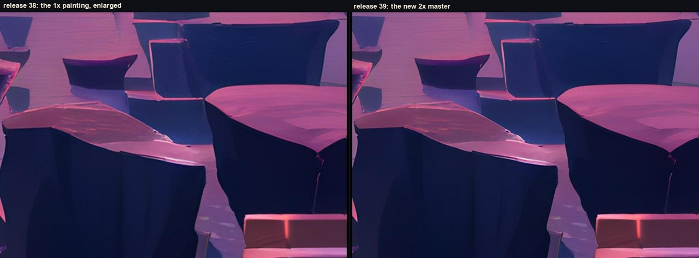
  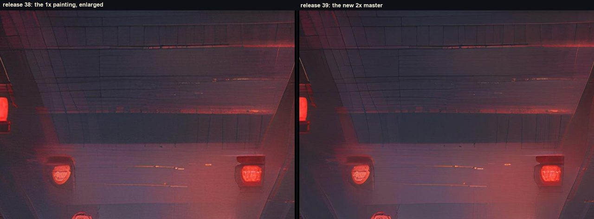
  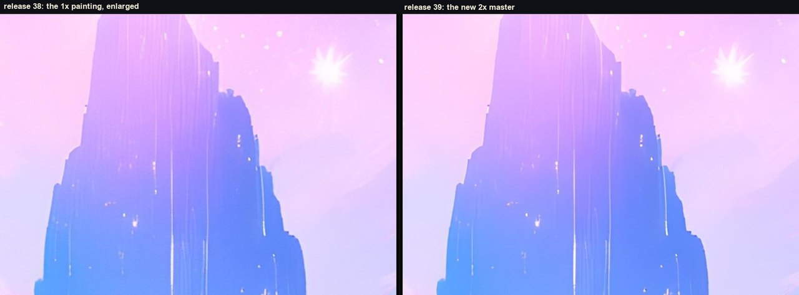

  *Crops of the Garden of Pain (first), Via Purifico (second) and the Road to the Farplane (third): release 38's 1x painting enlarged (left) and the new 2x master (right).*

  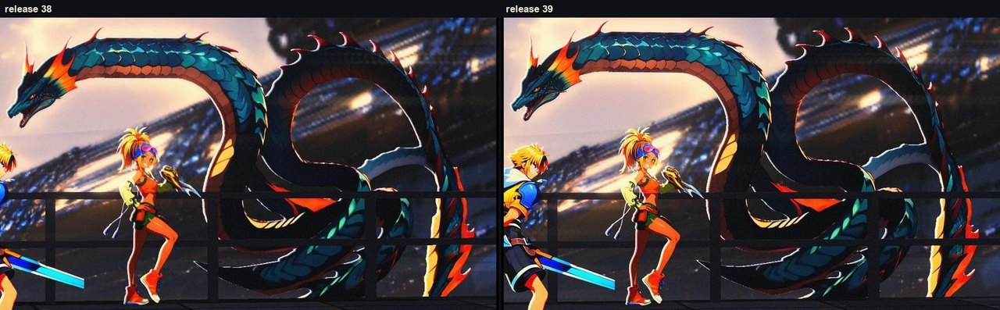

  *Evrae in Chapter VIII at 2560x1440: release 38 (left) and release 39 (right), drawn from the new high-resolution paintings.*

- **FFX:** Tidus's four Swordplay moves now differ. Spiral Cut has the widest gold zone (22 percent)
  on the slowest sweep, Blitz Ace the narrowest (9 percent) on the fastest, and the timers are
  unchanged. The numbers are our estimate.

  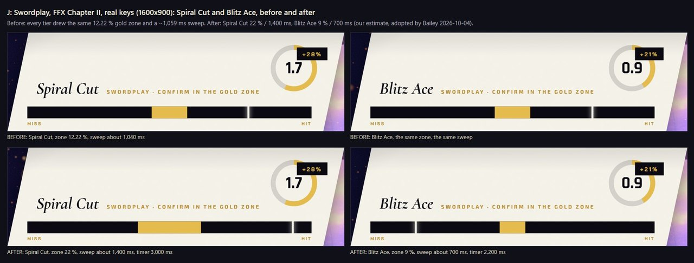

  *Spiral Cut (left) and Blitz Ace (right), before (top) and after (bottom): every move used to draw the same 12 percent zone; now Spiral Cut's is 22 percent and Blitz Ace's 9.*

- **Both:** turning an EYE CANDY look on now switches its parts on too, when all of them were off. A
  part you turn off afterwards stays off.

  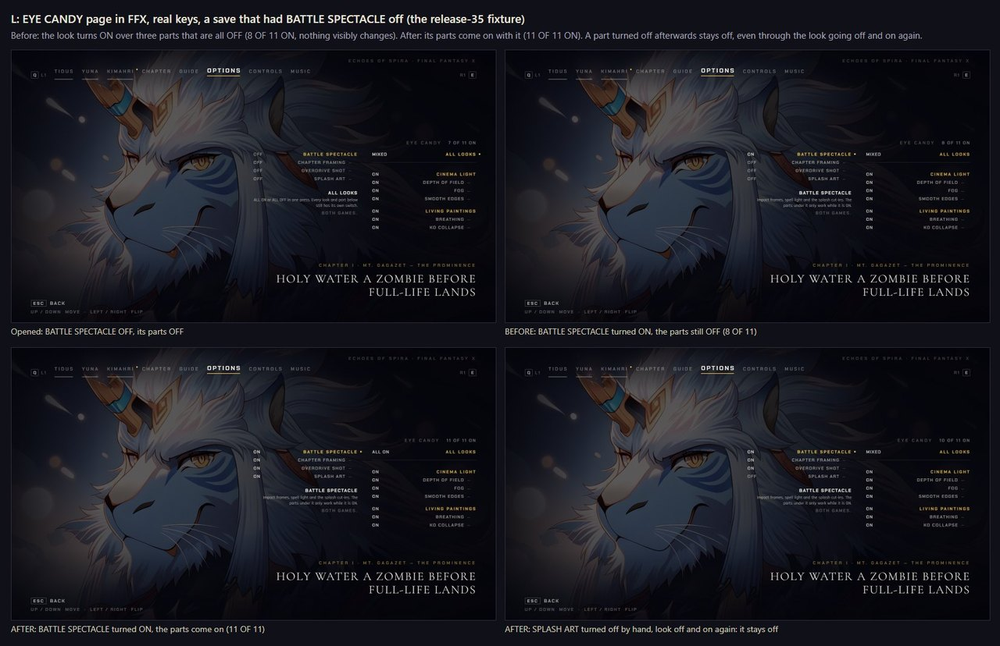

  *The EYE CANDY page in FFX: BATTLE SPECTACLE turned on over parts that were all off (top right) used to leave them off; now its parts come on (bottom left), and a part turned off by hand stays off (bottom right).*

- **Both:** interface polish. Battle labels keep a 14 px floor in 4:3 windows (they drew as small as
  8 px), the phone's pause text is 14 to 15 px (it was 12 to 13), and the chosen row of an Overdrive
  list is filled. In FFX the OD label stays inside a 1024 px window at every TEXT SIZE. In FFX-2 a
  queued command shows its chip over the girl at once, and the enemy-move card keeps off the girls
  at Yuna's White Magic list.

  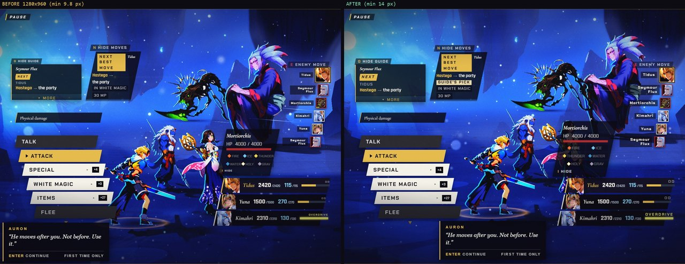

  *FFX Chapter I at 1280x960: the smallest label was 9.8 px (left) and is 14 px now (right). Taken on the interface lane's build of 3 October, so it still shows the old "Guide's pick" tag.*

  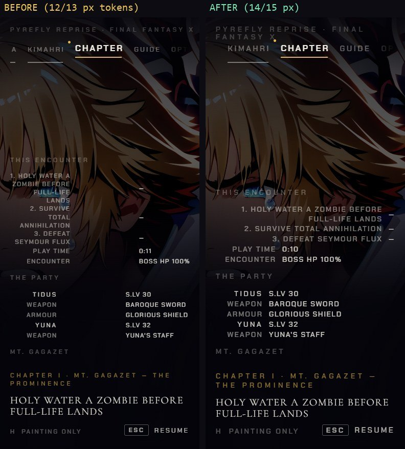

  *The phone's pause CHAPTER tab: 12 to 13 px text (left) and 14 to 15 px (right). Taken before the rename, so it still reads Pyrefly Reprise.*

  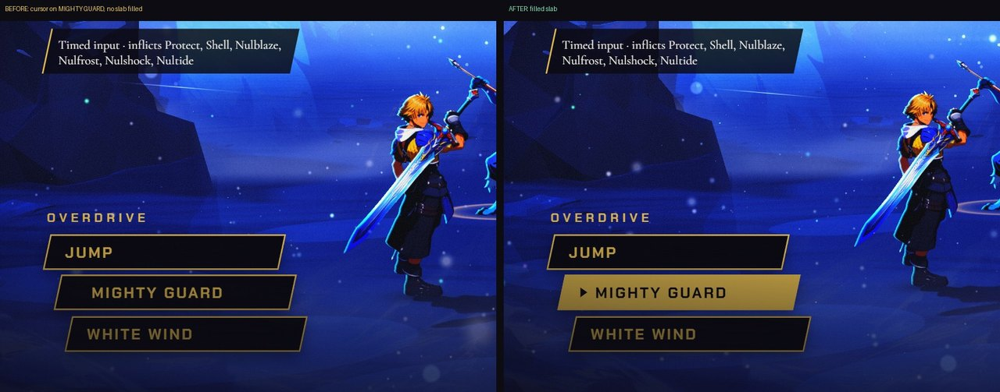

  *Kimahri's OVERDRIVE list: the row under the cursor is now filled (right).*

  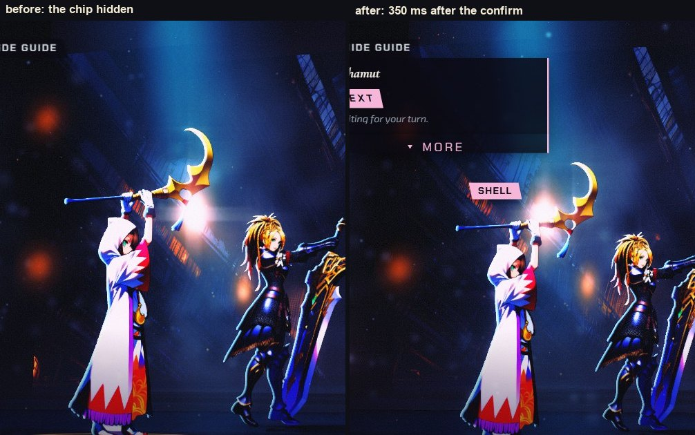

  *Yuna casts Shell under Wait: release 38 names nothing over her until the cast is well under way (left, the same frame with the chip hidden by a script); release 39 shows the SHELL chip 350 ms after the confirm (right).*

- **Both:** the first-run tip says "Start with this one." when you pick a chapter other than the
  first.

  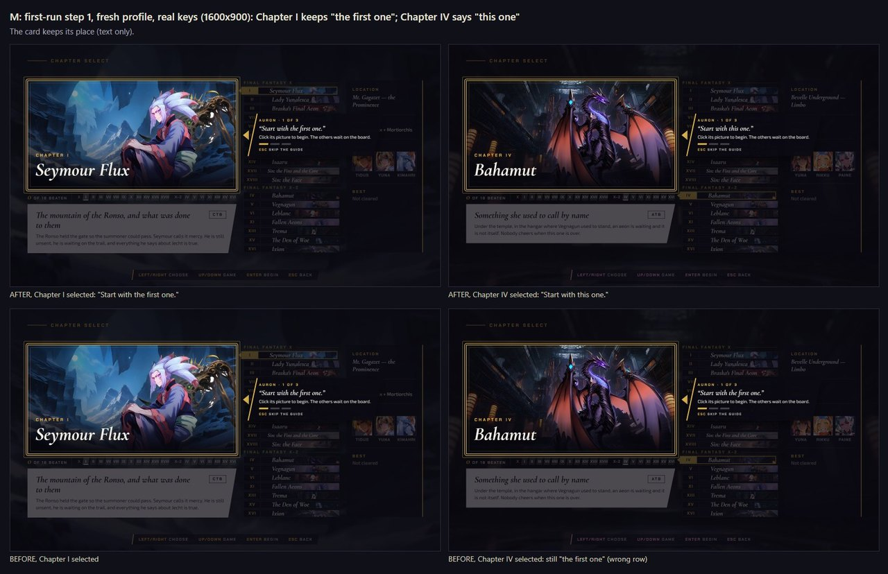

  *The chapter board's first-run tip: after (top) Chapter I keeps "Start with the first one." and Chapter IV says "Start with this one."; before (bottom) Chapter IV still said "the first one".*

- **Behind the scenes:** the critic now measures pose size jumps and snapping frame by frame (two
  new checks, with score caps), and every deep review adds a first-time-fan reviewer. The live site
  now holds 3,289 art files, 8.3 GB in all (0.8 GB before). A figure true-colour switch is built in,
  off by default, waiting for Bailey's pick.

  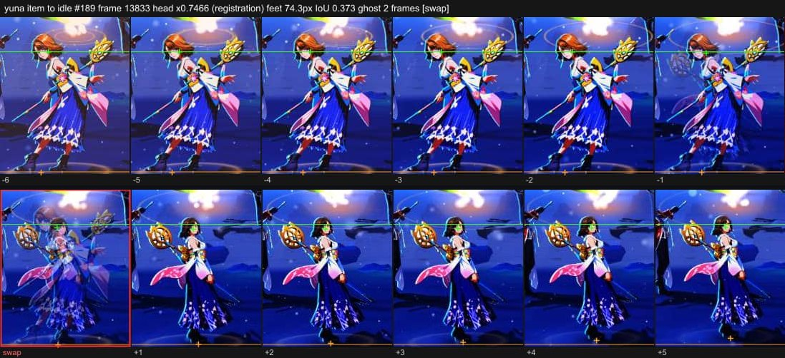

  *What the new checks see, on release 38: Yuna switching from her item pose back to idle makes her head a quarter smaller (x0.75) and moves her feet 74 px. Top row: the six frames before the swap; bottom row: the swap and the five frames after.*
