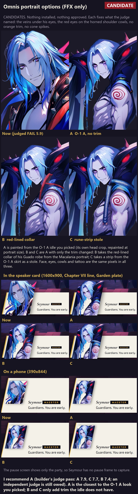

# Chapter XII (Seymour Omnis): three speaker-portrait options

**Which game (rule 14): FFX only.** Omnis exists only in FFX (`research/ffx-seymour-omnis.md` §0.3).

**Status: CANDIDATES.** Nothing is installed. `public/art/portraits/seymour-omnis.png` is untouched
(sha `ce32e75a6031`), nothing was added to `approved-hashes.json`, and nothing here is approved until Bailey
names it (rule 9). Until Bailey picks, B17 still falls back to the approved Macalania portrait.

**Recommendation: A.** It is the closest to the O-1 A look Bailey picked. It has the veins, both red cowl
eyes and no trim that the idle lacks. B and C are for Bailey only if he wants trim.

## What the judge named, and what each option does about it

The judge (`../production/JUDGE.md`, FAIL 5.9, then the masked repair in `../INSTALLED.md`) named these
problems: the costume is off the O-1 A body (red and orange trim, grey cone spikes, none of the dark indigo
horned shoulders or their red eyes), the veins under the eyes are missing, a blown forehead, a hair-crown
notch and an edge fringe. The repair fixed only the last three, because the rest needed a repaint.

| | How it was made | Veins | Horned cowls + red eyes | Trim |
|---|---|---|---|---|
| **A: O-1 A, no trim** | img2img of the **installed O-1 A idle's own head-and-shoulders crop** (`init_a.py`, denoise 0.6, IP-Adapter 0.3 on the same crop), seed 925514 | dark violet veins under both eyes | both, from the idle | none (the idle has none) |
| **B: red-lined collar** | A, plus a red lining on the high collar and the shoulder band, taken from his Guado robe in the approved Macalania and Chapter I portraits. Drafted in PIL, then a masked img2img inside a box on the collar only (denoise 0.5, seed 925572). Every pixel outside the box is A's | as A | as A | red: a deliberate return of the robe's red, which Bailey can reject |
| **C: rune-strip stole** | A, plus a stole in the colours of the O-1 A skirt strips over the shoulder and down the chest. Drafted in PIL, then a masked img2img (denoise 0.58, seed 925562). A's upper arm and spiral tattoo are kept pixel for pixel (`tattoo_mask.py`) | as A | as A | pale woven chevrons on dark blue |

The face, the eyes, the cowls and the tattoo are the **same pixels** in all three options, so the only thing
Bailey is choosing between is what sits on the shoulders. That choice is the one the judge failed. If Bailey
dislikes the face itself, the other A renders are in the backup (`a.q2` and `a.p1` read well). Exact
prompts, seeds and denoise values are in [`recipes.json`](recipes.json), and the scripts are in
[`scripts/`](scripts/).

**Canvas, crop and framing:** 832x1216, like every approved portrait. Head and shoulders in a three-quarter
view, looking at the viewer. White-ground matte (`matte.py`, the same method as the production matte and
the O-5 B fringe peel). Binary alpha, one island. The hair and the cowls are cut by the frame, as in every
approved portrait. **Facing:** his body turns toward screen right, like the O-1 A idle.

## Pilot and look (1:1, on night tone and on white)

- **A:** 7 renders from the idle crop at denoise 0.45 to 0.65. All kept the cowls, the red eyes and the
  spiral. `a.p3` (0.65) had a blown white wedge on the forehead, the same failure as the old portrait, so it
  was dropped. I picked `a.q4` because it has the clearest veins under both eyes and a clean forehead.
  Hair-crown pocket: the first matte bit a 60 px notch out of the crown, so the matte's face box was
  extended over the crown and the notch is gone. The other transparent pockets are real gaps between the
  hanging hair strands and the bead string.
- **B:** a prompt alone at img2img 0.6 to 0.7 added no collar (`c.p1` to `c.p3`), so the lining was drafted
  in PIL. `b2.p2` and `b2.p3` dripped into tendrils, and `b2.p1` and `b2.q1` read as a red strap. I picked
  `b2.q2` because it reads as a lined collar edge.
- **C:** `c2.p1` came out as pixel-pattern diamonds, `c2.p3` grew orange shapes and `c2.p4` was too faint
  to read. I picked `c2.p2`. Its first paste warmed the shoulder skin toward orange, so A's upper arm was
  restored inside a feathered ellipse.

### Method check (rule 15): the frontal option failed twice and was dropped

- **What failed:** a straight-on third option made with txt2img. The first try (`b.p1` to `b.p3`, IP
  reference 0.35, "curved horns" wording) drew ram horns on his head and put red eyes in his face. The
  second try (`f.p1` to `f.p4`, reference 0.45, "beast-head shoulder guards" wording) drew no cowl at all,
  plus a hand and a red face eye.
- **Why:** words do not carry the O-1 A cowl, which is two hooded beast heads with one red eye each. The IP
  adapter carries colour and mood but not that structure. The only pixels that have the structure are the
  idle's, and the idle is three-quarter, not frontal.
- **What is different now:** no third txt2img try. All three options come from the idle's own pixels, and
  the variable Bailey can judge is the trim, the point the judge failed.

## Judge pass: measured, then scored at 1:1 and in the card

**This pass is the builder's own, not independent.** The brief asks for an independent judge, but this
agent could not start one (no sub-agent tool, and the brief says not to delegate). **An independent judge
pass on all three is still owed** before any option is locked. The scores follow the JUDGE.md method and
columns, with bar 7.

Measured (`measure.py`, the JUDGE.md method; near-white = min channel above 235, alpha above 200):

| File | Opaque px | Islands | Soft alpha | Near-white (largest 3) | Edge halo |
|---|---|---|---|---|---|
| A (`614b399f1c13`) | 792,819 | 1 | 0 | 1,398, 482, 370 (hair highlights at the crown; the forehead has none) | 1.2 % |
| B (`8cd16ea5da3f`) | 793,110 | 1 | 0 | the same as A | 1.3 % |
| C (`81069683e277`) | 795,460 | 1 | 0 | the same as A | 1.2 % |
| now: `seymour-omnis` (`ce32e75a6031`, repaired) | 826,452 | 1 | 0 | 3,345, 1,665, 989 | 0.9 % |
| approved `seymour-macalania` / `seymour-natus` | | 1 / 1 | 0 / 0 | 26,806 / 18,129 | 6.9 % / 21.0 % |

| Option | Identity to O-1 A | Anatomy | Costume | Edges | Finish | Game read | **Overall** | Verdict (builder) |
|---|---|---|---|---|---|---|---|---|
| A | 9 | 7 | 8 | 8 | 7.5 | 8 | **7.9** | PASS |
| C | 8.5 | 7 | 7.5 | 8 | 7.5 | 7.5 | **7.7** | PASS |
| B | 8 | 7 | 6.5 | 8 | 7 | 7.5 | **7.4** | PASS |

What limits each option, worst first:

- **All three (shared pixels):** the chest is a little lumpy. The pectoral planes are over-cut at 1:1, which
  does not show in the card. The pale strips at the left edge are cut by the frame. A small yellow-green
  tint sits on the blue shoulder band in A. B and C repainted that area, so they do not have it.
- **A:** nothing else. In the card, the first things the eye finds are the two red cowl eyes, the veins and
  the cold smile.
- **B:** the red lining has a hard, clean edge, but the collar's form is ambiguous at 1:1. It reads partly as
  a red bracket or strap. It also brings back red trim on purpose, which pulls away from the O-1 A body.
- **C:** the stole reads as woven cloth, but its chevrons are pale, not the idle's red runes. The strip ends in
  two small copper tips.

## Frames

- **Speaker card, 1600x900:** Chapter VII's dialogue card over the installed Garden plate, with each option
  served in place of `seymour-macalania.png` by request interception (`talk.mjs`). The card uses the
  Macalania face-crop row, so the framing is representative, not final. An installed option needs its own
  `face-crops.json` row. The pupils were read off a 4x gridded crop of A, and B and C share A's face: (326, 425)
  and (439, 386), so fx 0.4597, fy 0.3335, ipd 0.1437. "Now" is the existing `../o5-portrait/dialogue-a-1600.jpg`.
- **Phone, 390x844:** the same card on a phone.
- **Pause:** the pause screen (`src/app/screens/pause/PortraitStage.ts`) shows only the party. Seymour
  never appears there, so there is no pause frame to capture.
- Private Vite server on port 5793 (HMR off, watch off, GPU browser). It was stopped by its PID, and the port
  was confirmed free.

## Budget and safety

- **GPU: 27 renders, 5.6 minutes** (`gpu-ledger.json` in the backup). Every prompt was submitted with fewer
  than 3 pending. ComfyUI was never restarted, there were no black frames and nothing was downloaded.
- `verify-approved.mjs` before and after: 185 ok, 0 mismatched, 0 missing. The installed portrait is unchanged (`ce32e75a6031`).
- Backup of every render, sidecar, init, mask and paste, plus the three option PNGs:
  `D:/Tools/pyrefly-art-backup/candidates/2026-09-25-gpu2/seymour-omnis-portrait/`.
