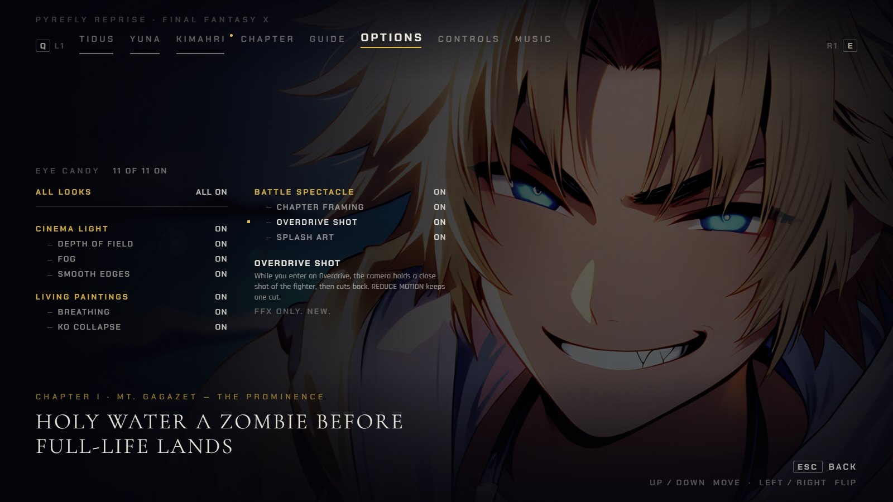
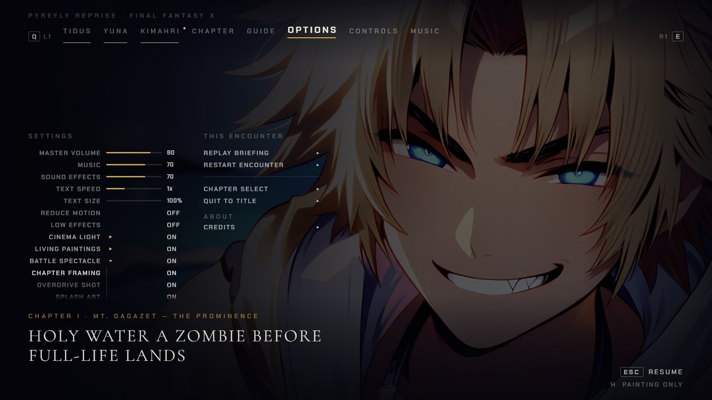
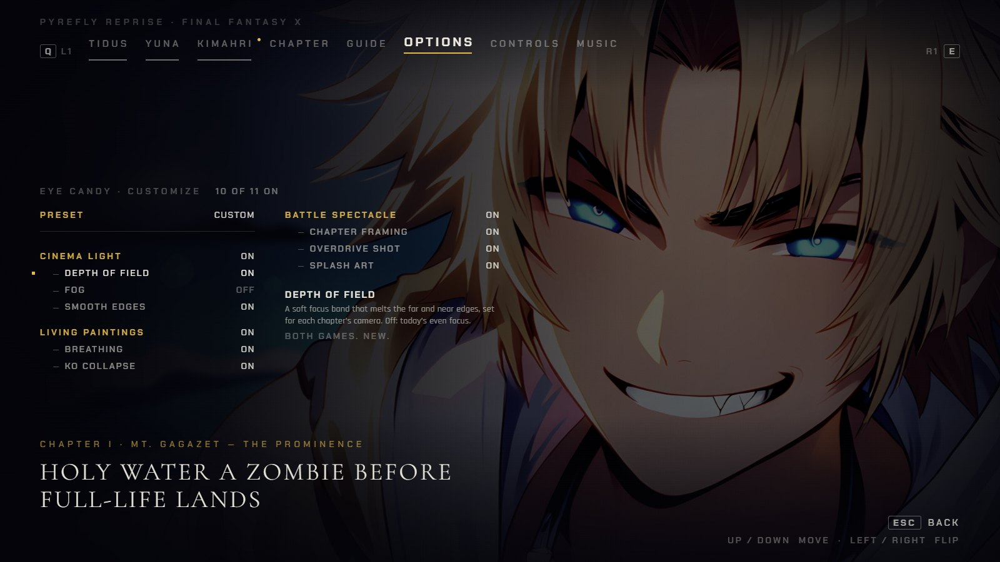

# Eye-candy settings: where the MAX mix's switches live (2026-10-02)

**Status: options for Bailey. Nothing is built.** This is an end-state round (AGENTS.md rule 9): three places for
the new switches, drawn on the real pause screen, and one recommendation. Bailey picks (or mixes); a pick approves
only what Bailey names. The frames are mockups. No file under `src/` changed, nothing was written to a save, and
nothing is deployed.

**Why now.** Bailey, 2026-10-01 ~21:00 EDT: "all your recommendations, godspeed" adopted the recommended MAX mix
(D-316). D-297 (2026-09-29): "in the settings I want to be able to turn each one off. Default will be on." D-316 and
the judges (`docs/concepts/eye-candy-max-2026-10-01/JUDGE.md`) expected an EYE CANDY sub-page and asked for a mockup
of where the switches live before anything is built. The OPTIONS settings column already scrolls at 14 rows in FFX-2.

**Game case (rule 14): both.** FFX is gold, FFX-2 is pink (the pause's own accent). Two switches belong to one game:
OVERDRIVE SHOT is FFX only, DRESSPHERE SHOT is FFX-2 only. FF7 draws none of this and shows none of the rows, as the
three look rows are dropped there today (`src/app/screens/pause/panels.ts`).

## How the frames were made, and what is real

- **Build.** main `ea025e94` (the HEAD of this session) built to a scratch folder with `vite build --outDir`, served
  by `vite preview` on port 5700, headless Chromium on the real GPU (`PYREFLY_BROWSER=gpu`). Chapter I
  (`seymour-flux`, FFX) and Chapter IV (`ffx2-bahamut`, FFX-2), seed 1.
- **Real.** The pause was opened with the real Esc key, walked to OPTIONS with real Q presses, and entered with a real
  Down (the four `today-options-*` frames). Every key count below was also checked with real keys on that build
  (`capture/presses.mjs`: the flat row order, the wrap from the first row to CREDITS, and Enter, Right and Left each
  flipping CINEMA LIGHT).
- **Composed.** The proposed rows and pages are built on that live pause from its own markup and classes
  (`capture/mock.js`), with a short extra stylesheet that follows `pause-credits.css` and the pause's own tokens
  (`capture/mock.css`). Type never goes below 14 px on a desktop window or 12 px on a phone. An audit ran after every
  frame and found no clipped label except where a frame is meant to show one (`c3-balanced-*-390x844.jpg`).
- **Sizes.** Desktop frames are 1600x900. Phone frames are the 390x844 viewport captured at 2x, so 780x1688.
- **State shown.** FFX frames have every switch ON, except the CUSTOMIZE page (FOG off, so the preset reads CUSTOM).
  FFX-2 frames have FOG off and LIVING PAINTINGS off, so the OFF look and the dimmed parts are on view. The cursor is
  on the row each frame's name or caption says.

| Today, real keys | Desktop | Phone |
|---|---|---|
| FFX, Chapter I | `today-options-ffx-1600x900.jpg` | `today-options-ffx-390x844.jpg` |
| FFX-2, Chapter IV | `today-options-ffx2-1600x900.jpg` | `today-options-ffx2-390x844.jpg` |

## 1. The switches the mix needs

D-316 names these parts of the options round (`docs/concepts/eye-candy-max-2026-10-01/OPTIONS.md`): C's colossus
masters, depth of field and fog, defringe and the held Overdrive and spherechange shots; B's no-render parts (splash-art
crops, the Overdrive hero shot, the spherechange keys); A's KO collapse and breathing. The living portraits on the
pause screen ride LIVING PAINTINGS. That is twelve switches in all: the three that exist, and nine new ones. Each game
shows eleven. Every one is ON by default.

| Look (exists) | New part | Game | What it does | From OPTIONS.md | REDUCE MOTION | LOW EFFECTS and phone tier |
|---|---|---|---|---|---|---|
| CINEMA LIGHT | DEPTH OF FIELD | both | A soft focus band set for each chapter's camera; extends today's tilt-shift | C | held still | none in the LOW tier; the phone tier keeps the tilt-shift only |
| | FOG | both | Haze layers between the party and the colossi | C | held still | not specified there; the build decides, the switch stays |
| | SMOOTH EDGES | both | SMAA on the figure layer plus the premultiplied-alpha defringe (VP-17, -18) | C `aa` | no motion involved | the phone tier uses FXAA instead of SMAA |
| LIVING PAINTINGS | BREATHING | both | Chest-only idle breathing, nothing below the hips moves | A `breath` | stilled | phone: coarse grid; LOW: breathing only |
| | KO COLLAPSE | both | The fighter buckles and sinks, then cuts to the KO painting | A `kocollapse` | a cut to the KO painting | none stated |
| BATTLE SPECTACLE | CHAPTER FRAMING | both | One authored camera per chapter: low and wide for the colossi, boss scale, lens shift clear of the HUD | C `masters`, `scale`, `lensshift` | keeps the master, at most one cut per action | none stated |
| | OVERDRIVE SHOT | FFX | A held three-quarter shot of the actor while the Overdrive input window is open, then back | B and C `herocut` | one cut | none stated |
| | DRESSPHERE SHOT | FFX-2 | A held close shot of the girl plus the painted keys on a dressphere change; full the first time, instant after | C shot, B keys | one cut | none stated |
| | SPLASH ART | both | Painted art, a focal crop of an approved painting, on the aeon Overdrive and boss Special splashes (no render) | B `splashart` | static | none stated |

The living portraits (the Until Dawn pause's `PortraitDriver`, in flight on the release-35 portraits lane) ride the
LIVING PAINTINGS switch and get no row of their own. If Bailey wants them separable, one more row under LIVING
PAINTINGS (PAUSE PORTRAITS) fits every layout below without redrawing anything.

**Merged, because I expect each pair would always be flipped together.**
- CHAPTER FRAMING is C's `masters`, `scale` and `lensshift`. A low colossus camera needs the boss at 1.5 to 3 times
  party height and the lens shift that clears the HUD. Either one alone is a wrong picture.
- OVERDRIVE SHOT is one switch because B and C both list `herocut`: it is the same shot.
- DRESSPHERE SHOT is C's held close shot and B's painted keys. The keys are drawn for that framing.
- SMOOTH EDGES is SMAA and the defringe. Both exist only to clean an edge, and C lists one switch (`aa`) for both.

**Kept apart.** DEPTH OF FIELD and FOG (blur and haze bother different people, and the options doc gives depth of
field its own tier rules: the phone drops the bokeh and Low drops it, while fog has none). BREATHING and KO COLLAPSE
(one is ambient, one is an event; REDUCE MOTION treats them differently).

**No row, because D-316 does not name them.** A's HAIR AND CLOTH, BLINKS, ATTACK WEIGHT, BOSS LIFE and VICTORY
GESTURES; B's EXTRA POSE KEYS, SMEAR FRAMES, OVERDRIVE CHOREOGRAPHY and HIGH-RES PAINTINGS (D-316 puts B's painted key
sets "later, in rounds Bailey approves"; HIGH-RES is forced off on a phone); C's FIGURE RELIGHTING, SPELL LIGHT,
CONTACT SHADOWS and PHONE FULL FRAME (D-316's reading: figure relighting is not in the mix). ACTION CUTS is a
question, below.

**The model (my choice; Bailey can say otherwise).** Each of today's three rows stays the switch of its look and keeps
its id (`fxLight`, `fxLiving`, `fxSpectacle`) and its meaning. A new part is a part of a look: it works only while its
look is ON, and it keeps its own value while the look is OFF (drawn dim). So anyone who turned a look off before this
release keeps that choice for the new parts, with nothing new to find, and D-297 still holds: every part can be turned
off on its own. The master rows of options A and C (ALL LOOKS, PRESET) are derived from the twelve values and add no
saved field.

**Names.** OVERDRIVE SHOT and DRESSPHERE SHOT are mine. The longer names the options doc implies (OVERDRIVE HERO SHOT
194 px, SPHERECHANGE SHOT 182 px, measured in the pause's key style) do not fit the shipped 163 px label cell. These
two do (144 and 159 px; BATTLE SPECTACLE, today's longest, is 160), so no layout below widens a column
(`capture/measure.mjs`).

**Save data.** Nine new boolean fields (working names `fxDof`, `fxFog`, `fxEdges`, `fxBreath`, `fxKo`, `fxFraming`,
`fxHero`, `fxSphere`, `fxSplash`), default true. The upgrade follows the `fxLight` precedent: a missing field keeps the
shipped default through the `...raw.settings` spread, a stored non-boolean reads as ON (`migrateFxLooks`), and
`SAVE_VERSION` stays 1. It is the save-data class, so a deep review runs before the build goes live
(AGENTS.md, Release).

## 2. Three places for the switches

### A. One EYE CANDY page

One new row, EYE CANDY, sits where the three look rows sit now. It opens a page of all the switches, grouped by look,
with ALL LOOKS on top. The page swaps in over the two columns the way the CREDITS panel does (D-305, approved
2026-09-30): the tab strip, the brand line and the painting stay, the page takes its own `Esc BACK` prompt, and on
desktop the objective line stays visible. Each switch has a help line for the focused row. The value of the EYE CANDY
row reads ALL ON, ALL OFF or `n OF 11`.

| Frame | Desktop 1600x900 | Phone 390x844 |
|---|---|---|
| OPTIONS with the one new row, FFX (cursor on EYE CANDY) | `a1-list-ffx-1600x900.jpg` | `a1-list-ffx-390x844.jpg` |
| The page, FFX (cursor on OVERDRIVE SHOT) | `a2-page-ffx-1600x900.jpg` | `a2-page-ffx-390x844.jpg` |
| OPTIONS with the one new row, FFX-2 | `a1-list-ffx2-1600x900.jpg` | `a1-list-ffx2-390x844.jpg` |
| The page, FFX-2 (7 of 11 on; cursor on DRESSPHERE SHOT) | `a2-page-ffx2-1600x900.jpg` | `a2-page-ffx2-390x844.jpg` |
| The page with REDUCE MOTION on (FFX: BREATHING `ON · STILL`, OVERDRIVE SHOT `ON · CUT`) | `a3-page-reduce-motion-ffx-1600x900.jpg` | `a3-page-reduce-motion-ffx-390x844.jpg` |
| The same, FFX-2 | `a3-page-reduce-motion-ffx2-1600x900.jpg` | `a3-page-reduce-motion-ffx2-390x844.jpg` |

- **Rows.** The OPTIONS settings column goes from 12 rows to 10 in FFX and from 14 to 12 in FFX-2. At 1600x900 FFX-2
  today needs 423 px in a 378 px window, so BATTLE HELP is below the fold (`today-options-ffx2-1600x900.jpg`); with A
  the column is 369 px and fits.
- **Keys to flip one switch**, from the OPTIONS tab with the cursor on the strip (Down enters, Up wraps, Confirm,
  Left or Right flips): 9 to open the page, then 10 for ALL LOOKS (Left is ALL OFF), 11 for CINEMA LIGHT, 13 for FOG,
  11 for SPLASH ART, at worst 16 for BREATHING. FFX-2 is the same.
- **Focus.** Up and Down move the cursor (the page is one flat list, column one then column two, as OPTIONS is). The
  cursor dot is drawn, because the page's scroller leaves it room (see Findings).
- **Touch.** One swipe in the five-row window to find EYE CANDY, one tap to open, one tap on a row. Page rows are
  40 px tall, twice today's 20 px rows.
- **Phone fit.** All twelve rows fit one 390x844 screen with the help line pinned at the bottom: scroll height 570 px
  inside a 570 px box, measured on both games. Desktop: the page is 302 px tall and ends at y=599; the objective
  line at y=702 stays visible, which CREDITS cannot do.
- **Risk to today's rows.** CINEMA LIGHT, LIVING PAINTINGS and BATTLE SPECTACLE move down one level. Their ids, their
  `adjustSetting` path and their saves are unchanged. The tests that pin them on the OPTIONS list move with them:
  `tests/unit/pause-fx-looks-rows.test.ts`, `save-fx-looks.test.ts`, `save-comfort-migration.test.ts`. The page is a
  second overlay beside `creditsPanel.ts`, so it needs the same care: its own input claim, Esc, X, Start and the pad's
  Circle going back with the cursor on EYE CANDY, L1, R1, Q and E closing it and changing tab, mirror rules and phone
  rules copied from `pause-credits.css`.

### B. Fold open in place

The three look rows stay where they are and become group headers. Each folds open to show its parts right under it. A
header's value reads ON, OFF or `2 OF 3`; Left and Right flip the whole look as today, and Confirm or a tap folds and
unfolds it.

| Frame | Desktop 1600x900 | Phone 390x844 |
|---|---|---|
| Three headers folded, FFX (cursor on CINEMA LIGHT) | `b1-folded-ffx-1600x900.jpg` | `b1-folded-ffx-390x844.jpg` |
| BATTLE SPECTACLE unfolded, FFX (cursor on CHAPTER FRAMING) | `b2-unfolded-ffx-1600x900.jpg` | `b2-unfolded-ffx-390x844.jpg` |
| All three unfolded, FFX (cursor on SPLASH ART) | `b3-all-open-ffx-1600x900.jpg` | `b3-all-open-ffx-390x844.jpg` |
| Three headers folded, FFX-2 (`2 OF 3`, `OFF`) | `b1-folded-ffx2-1600x900.jpg` | `b1-folded-ffx2-390x844.jpg` |
| CINEMA LIGHT unfolded, FFX-2 (cursor on FOG) | `b2-unfolded-ffx2-1600x900.jpg` | `b2-unfolded-ffx2-390x844.jpg` |
| All three unfolded, FFX-2 | `b3-all-open-ffx2-1600x900.jpg` | `b3-all-open-ffx2-390x844.jpg` |

- **Rows.** 12 folded and 20 with everything open in FFX; 14 and 22 in FFX-2. The desktop column shows about 14 rows,
  so an open look scrolls the list: 585 px of content in a 378 px window in FFX, 639 px in FFX-2 (the `b3-all-open`
  frames). STRATEGY GUIDE and BATTLE HELP leave the visible window.
- **Keys to flip one switch.** The whole look: 9, 10 and 10, as today. One part: 11 to 14 in FFX (FOG 12, SPLASH ART
  14), 11 to 15 in FFX-2. All three looks off: 13.
- **Touch.** One swipe, one tap to unfold, one tap on the part, on 20 px rows, and the five-row window shows only the
  first part of an open look (`b2-unfolded-ffx-390x844.jpg`). A touch player cannot flip a look itself, because a tap
  folds it; a second hit target (the value) would be needed.
- **Phone fit.** The window stays 100 px. Eight more rows go into it.
- **Risk to today's rows.** The most of the three. Confirm and a tap on a look fold it instead of flipping it, and
  `pause-fx-looks-rows.test.ts` pins "Enter flips it". The value becomes three-state. The settings column's own overflow
  hides the cursor dot, as it does today. The part names fit the shipped label cell, so no column widens.

### C. A preset, then customize

One row, EYE CANDY, cycles FULL, BALANCED, CALM and OFF (Left and Right step, with wrap). A second row, CUSTOMIZE,
opens the same page as A with PRESET on top. The preset reads CUSTOM when the twelve values match none of them. It is
derived, not saved.

| Frame | Desktop 1600x900 | Phone 390x844 |
|---|---|---|
| The two rows, FFX (preset FULL, cursor on it) | `c1-preset-ffx-1600x900.jpg` | `c1-preset-ffx-390x844.jpg` |
| The CUSTOMIZE page, FFX (10 of 11 on, reads CUSTOM) | `c2-customize-ffx-1600x900.jpg` | `c2-customize-ffx-390x844.jpg` |
| BALANCED in the row, FFX (cursor on CUSTOMIZE) | `c3-balanced-ffx-1600x900.jpg` | `c3-balanced-ffx-390x844.jpg` |
| The two rows, FFX-2 (reads CUSTOM) | `c1-preset-ffx2-1600x900.jpg` | `c1-preset-ffx2-390x844.jpg` |
| The CUSTOMIZE page, FFX-2 | `c2-customize-ffx2-1600x900.jpg` | `c2-customize-ffx2-390x844.jpg` |
| BALANCED in the row, FFX-2 | `c3-balanced-ffx2-1600x900.jpg` | `c3-balanced-ffx2-390x844.jpg` |

- **Rows.** 12 to 11 in FFX and 14 to 13 in FFX-2 (13 rows is 396 px, so FFX-2 desktop still scrolls).
- **Keys.** A preset step is 9 presses, and OFF is one Left from FULL, so ALL OFF is 9. CUSTOMIZE opens in 10; a part
  is 12 to 17 (FOG 14, SPLASH ART 12, BREATHING 17).
- **Touch.** A tap only steps forward, so OFF is three taps from FULL. CUSTOMIZE is one swipe and two taps.
- **Phone fit.** The page fits as in A. BALANCED does not fit the phone's value cell: 72 px of text in a 66 px cell
  (`c3-balanced-*-390x844.jpg`). A name of six letters or fewer fits (CUSTOM does).
- **Risk to today's rows.** The three rows leave OPTIONS as in A. It adds a third master beside LOW EFFECTS and REDUCE
  MOTION with overlapping jobs, and it needs A's page anyway, so it is A plus a row plus logic.
- **My guess at the presets (rule 15: inferred, ask before building).** FULL: all twelve on. BALANCED: DEPTH OF FIELD
  and FOG off (the two that cost frame time and soften the picture). CALM: BREATHING, KO COLLAPSE, OVERDRIVE SHOT and
  DRESSPHERE SHOT off (nothing new moves or cuts). OFF: all twelve off. BALANCED is close to what the lighter tier
  already drops, and CALM is close to what REDUCE MOTION already stills.

## 3. Side by side

Keys are from the OPTIONS tab with the cursor on the strip, FFX; FFX-2 differs by at most one (B's BATTLE SPECTACLE
parts). `capture/counts.mjs` computes them from the row order checked with real keys.

| | Today | A, one page | B, fold in place | C, preset and page |
|---|---|---|---|---|
| OPTIONS settings rows, FFX (FFX-2) | 12 (14) | **10 (12)** | 12 to 20 (14 to 22) | 11 (13) |
| FFX-2 at 1600x900: needs a scroll to see BATTLE HELP | yes, 423 of 378 px | **no, 369 px** | yes, up to 639 px | yes, 396 px |
| Keys to flip CINEMA LIGHT | 9 | 11 | **9** | 12 |
| Keys to flip one new part | not a switch | 11 to 16 | **11 to 14** | 12 to 17 |
| Keys to turn everything off | 13 (three looks) | 10 | 13 | **9** |
| Phone: taps to flip one switch | 1 swipe, 1 tap | **1 swipe, 2 taps, 40 px rows** | 1 or 2 swipes, 2 taps, 20 px rows | 1 swipe, 2 taps |
| Phone: what is on screen | five rows at a time | **all twelve** | five rows at a time | all twelve; BALANCED clips |
| A help line per switch | no | **yes** | no | **yes** |
| Cursor dot visible | no (clipped) | **yes** | no (clipped) | list no, page yes |
| New code | none | one overlay like CREDITS | fold state, three-state values | A's overlay plus preset logic |
| Existing rows | | move one level, same ids | change meaning (Confirm folds) | move one level, plus a third master |

## 4. Recommendation: A

1. **It is the shape the decision and the judges already assumed, and it copies something Bailey approved.** The CREDITS
   panel (D-305, option O1, 2026-09-30) swaps in over the two columns and brings its own prompts. A does the same with
   switches in it, so the build has a template (`creditsPanel.ts`, `pause-credits.css`, `PauseOverlays`).
2. **OPTIONS gets shorter, not longer.** 12 rows to 10 in FFX and 14 to 12 in FFX-2, which also ends the hidden BATTLE
   HELP row at 1600x900. No existing row changes name, id or meaning.
3. **The phone gets the most from it.** Today's OPTIONS shows five 20 px rows at a time. The page shows all twelve
   switches on one screen in 40 px rows.
4. **Room to explain, and room to grow.** FOG and SPLASH ART mean nothing from the name, so each switch gets a help
   line. B's painted key sets and the 2x paintings (forced off on a phone) arrive in later rounds and land on this page,
   with no change to OPTIONS.
5. **Focus is visible.** The page draws the cursor dot. The settings column cannot today.
6. **It does not rule C out.** A preset row can be added later on top of A as one row.

The cost is keys: 11 to 16 presses to flip one part, against 9 for one look today, and 10 for ALL OFF. For a setting
people set once, that is acceptable. B is best on keys and worst on risk. C duplicates LOW EFFECTS and REDUCE MOTION
and its preset contents are guesses.

## 5. What Bailey decides

1. A, B or C (recommended: A), or a mix.
2. Does a look's switch also switch off its parts (the model above), or are all twelve independent?
3. Should the living portraits get their own switch? Default: no, they ride LIVING PAINTINGS.
4. D-316's game-case text says FFX "cuts on meaningful beats", and one gate covers FFX-2 cuts. If those action cuts
   ship they need a switch (ACTION CUTS, one more row under BATTLE SPECTACLE). Default: no row in this round.
5. The two names, OVERDRIVE SHOT and DRESSPHERE SHOT.

**Record of the pick (fill after Bailey answers; rule 15).**
- Liked:
- Disliked:
- Must remain:
- Must change:
- Undecided:
- Inferred, mine, ask before building: the master-and-parts model; the two names; the four groupings; the preset
  contents; the help-line copy; ALL LOOKS values (ALL ON, MIXED, ALL OFF) and Left, Right and Confirm on it.

## 6. Findings along the way

1. **The cursor dot is cut off in the OPTIONS settings column today.** The 5 px gold square that marks the selected
   row hangs 13 px left of its row. The column's `overflow-y: auto` makes its x overflow clip it (`pause-labels.css`,
   added with the three look rows, on desktop; `pause-screen.css` on a phone since PR-0098). I measured it on desktop
   with real keys: `finding-cursor-dot-clipped.jpg` shows today's frame, and the same frame with the overflow set to
   visible, where the dot appears. The phone's column has the same rule. Only the brighter text shows where the cursor
   is. A one-line fix (padding on the column) is out of scope here and not made.
2. **OPTIONS.md says FFX-2 has an "existing SPHERECHANGE setting". It does not.** Neither the save nor the pause has
   one. The real FFX-2 has a Config entry called Spherechanges (`research/ffx-vs-ffx2-presentation.md`), but our pause
   shows only X-2 BATTLE and ATB SPEED. DRESSPHERE SHOT is a new row, FFX-2 only.
3. **Today's FFX-2 desktop OPTIONS overflows.** 423 px in a 378 px window; BATTLE HELP sits below the fold
   (`today-options-ffx2-1600x900.jpg`). Option A ends that.

## 7. Notes for whoever builds the pick

- Settings: add the nine fields next to `fxLight`, `fxLiving` and `fxSpectacle` in `fxLooks.ts` (a part table with a
  parent), keep `migrateFxLooks`' coercion rule, extend `applyComfort` so each part reaches `EyeCandy`. Today's URL-only
  sub-effects (`?fxsub=-shafts`, `-sway`, `-hitstop`) can take the same switches later. Add a save fixture exported from
  the build, next to `tests/fixtures/saves/release-30.json` and `release-31a.json`.
- Rows to drop for FF7, as `optionsColumns` does for the three today. Per game: OVERDRIVE SHOT only in FFX, DRESSPHERE
  SHOT only in FFX-2 (rule 14).
- Option A's keys, copied from the CREDITS panel's contract: Up and Down move; Left, Right and Confirm flip the focused
  row (on ALL LOOKS: Left is ALL OFF, Right is ALL ON, Confirm flips between ALL ON and not); Esc, X, Backspace, Start
  and Circle go back with the cursor on EYE CANDY; Q, E, L1 and R1 close it and change tab; a click or tap flips a row. The D-pad and stick act as the arrows, and
  Cross is Confirm.
- Gates still owed by D-316 before anything here is built into the game: A's FFX hit blackout proven gone; C's masters
  re-staged so the party and every boss part stay in view and clear of the HUD; FFX-2 cuts never fire while a girl's
  menu is open. A deep review runs before the build goes live.

## Files

- Frames: `today-options-*`, `a1-list-*`, `a2-page-*`, `a3-page-reduce-motion-*`, `b1-folded-*`, `b2-unfolded-*`,
  `b3-all-open-*`, `c1-preset-*`, `c2-customize-*`, `c3-balanced-*`, each for `ffx` and `ffx2` at `1600x900` and
  `390x844`. `finding-cursor-dot-clipped.jpg`.
- `capture/` (mockup tooling, not product code; run from the repo root against a `vite preview` of a scratch build):
  `lib.mjs`, `capture.mjs` (composes every frame), `mock.js`, `mock.css`, `base.mjs` (today's frames), `presses.mjs`
  (real-key counts), `counts.mjs` (press table), `measure.mjs` (label widths), `probe-marker.mjs` (the cursor-dot
  finding).
