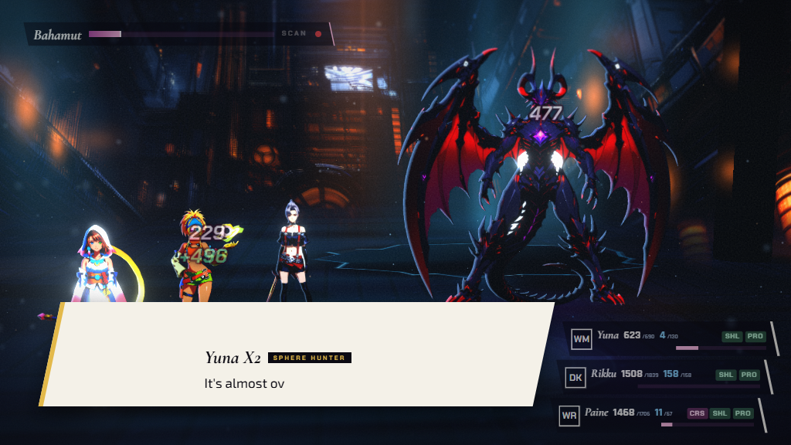

# Round 2 — `speed: 'skip'` really does make a mid-battle beat cheap

Fixes issue **1 (HIGH)** of `docs/handoff/playability-round-1.md` §4: an
automated run at `speed: 'skip'` paid full price for every mid-battle story
beat, three of the five chapters logged a `console.error` on every sweep, and a
chapter took minutes of wall clock that the beats — not the battle — were
spending.

---

## 1. What was actually wrong

Three separate things, and the round-1 report named two of them. All three had
to go for `'skip'` to be free.

### 1.1 The skip latch was one-shot, and every beat cleared it

`setAutoAdvance(on, { instant })` did two things: swap the dialogue port for a
no-op, and call `runner.skip()`. But `skip()` is a latch on the script **in
flight**, and `play()` opens with `runner.reset()`, which set `skippedFlag =
false` again. So a chapter got exactly *one* cheap beat — the one that happened
to be playing when the speed was set, usually none — and paid the full eight
seconds for every beat after it.

This is why the round-1 report could say `'skip'` "only swaps the dialogue
port": functionally that is what was left of it.

Fix: `CutsceneRunner.setInstant(on)` — the same fast-forward, but **sticky**.
`reset()` now restores the skip latch to the instant flag rather than to
`false`, so the latch is a property of the playback speed rather than of one
script. `src/story/runner/CutsceneRunner.ts`.

### 1.2 Nothing collapsed a `wait` or a camera move

`const wait = opts.sleep ?? sleepMs` was always the real `setTimeout`, because
`BattleScreen` never passed a `sleep`. A `beat(3000)` cost three seconds even
at `'skip'`.

Fix, in two places, because two different things can change:

* `BattleScreen.ts` now injects a clock at construction — `defaultSleep` with
  the interval zeroed when the run **starts** at `'skip'` (an e2e/critic run).
  `defaultSleep` rather than a bare `Promise.resolve()` on purpose: a resolved
  promise is a microtask, and a battle made of microtasks never yields to
  `requestAnimationFrame` — the reason `BattlePresenterUtil` documents that
  primitive at all.
* `BattleScreenCutscenes.ts` collapses the same waits again from inside, keyed
  on its own `instant` mode. That is the path a speed change *mid-fight* takes
  (`BattlePresenter.setSpeed` → `syncAutoAdvance` → `setAutoAdvance`), which
  the screen cannot see from its constructor.

Camera moves are collapsed differently, because a tween that is merely not
awaited is a tween still running into the fight that resumes under it. Under
`'skip'` a `camera` step **snaps** the rig (`CameraPort.snapTo`) and a
`showActor`/`hideActor` sets the alpha outright. Same end state, no frames.

### 1.3 The budget was on the wrong clock

This is the one that fired the `console.error`, and it would have kept firing
in `auto` mode even after 1.1 and 1.2.

A beat's animations are advanced from `update(dt)` with `dt` clamped at
`1/20 s` (`App.ts`), so an authored `camera('action', 400)` cannot finish in
fewer than **eight rendered frames**, however long those frames take. The
8,000 ms budget was a plain `setTimeout`. Under SwiftShader — the gallery, the
sweep, CI — eight frames is seconds of wall clock, so the beat lost a race it
was never given a fair shot at, got cut short, and logged.

Fix: the budget and each line's deadline are now spent in **scene time**,
ticked by the same `update(dt)` the tweens are. Wall clock survives only as a
**stall guard**: if no frame has arrived for `FRAME_STALL_MS` (500 ms) the loop
has stopped underneath the beat (`App.stop()` mid-capture, a backgrounded tab)
and scene time is never going to advance again, so the wall-clock reading is
allowed to end it. A beat must never be able to wedge a battle, and it still
cannot.

Under `'skip'` there is no budget at all — nothing is raced, so nothing can
overrun. That is also why the log is gone rather than merely quieter.

### 1.4 …and the log is no longer a `console.error`

An overrun is a pacing note: the fight carried on, the remaining poses, flags
and music still landed. It is not a fault, and every automated gate we have —
the sweep, the gallery report, CI — fails a run that logs a `console.error`.
So: `console.info` under a strategy, `console.warn` for a human (there it means
a beat someone was watching got cut off), never `console.error`. Still once per
script name.

---

## 2. Measured: the five-chapter sweep

`critic/scratch/sweep.mjs`, seed 1, Chromium on SwiftShader, one fresh page
load per chapter, driven by

```js
window.__pyrefly.gotoChapter(id, {
  skipCutscenes: true, skipPrep: true, seed: 1, auto: 'intended', speed: 'skip',
})
```

**Both halves were run against isolated copies of the tree** — the "after" build
on **port 5241** (`scratchpad/app`) and the "before" build on 5341
(`scratchpad/app-before`; 5242 turned out to be squatted by another agent's
server) — each a source snapshot with junctions to `node_modules`, `public/art`
and `public/fonts`, so a concurrent agent's half-saved file could not decide the
result. The first attempt on the live tree was killed by exactly that, twice.
The "before" build is the current tree with these three files reverted to
`8b6f5a4` (`git diff 8b6f5a4 aaf8362` touches nothing else in them), so the two
runs differ **only** in this fix and not in the other round-2 work that landed
alongside it.

### 2.1 What a beat costs — the measurement that means something

Chapter wall clock on this box is dominated by rendering, not by beats, and the
box has a dozen agents on it; the same chapter measured twice an hour apart
varies by 2×. So the number to read is the **per-beat** one. The presenter
already times every event it plays (`BattlePresenter.trace`, `{seq, type, ms}`)
and a beat is exactly one `script-trigger` event, so `critic/scratch/beats.mjs`
reads them straight out of the trace. Seed 1, `auto: 'intended'`,
`speed: 'skip'`, one fresh page load per chapter.

| chapter | beats | before: total / worst | after: total / worst | `console.error` before → after |
|---|---|---|---|---|
| `seymour-flux` | 4 | **16,043 ms** / 8,032 ms | **0 ms** / 0 ms | 2 → **0** |
| `braskas-final-aeon` | 10 | **43,148 ms** / 10,961 ms | **6 ms** / 3 ms | 3 → **0** |
| `ffx2-bahamut` | 3 | **8,320 ms** / 8,171 ms | **1 ms** / 1 ms | 1 → **0** |

Three things to notice.

* **The beat count is identical on both sides** — 4, 10, 3. The beats are not
  being skipped over; every trigger still fires, still runs its script, still
  lands its poses, flags, music and camera rig. It just costs nothing.
* **The worst beat before was 10,961 ms** — *past* the 8,000 ms budget it was
  supposedly capped at, because the cap itself was a wall-clock timer racing a
  frame-driven animation and the losing beat still had to unwind.
* **Six `console.error`s across three chapters became zero.** That is the gate
  the round-1 report was failing.

### 2.2 The whole-chapter sweep

`critic/scratch/sweep.mjs`, seed 1, Chromium on SwiftShader, fresh page load per
chapter, the "after" build on port 5241:

| chapter | outcome | turns | links | `elapsedMs` | console errors |
|---|---|---|---|---|---|
| `seymour-flux` | victory | 82 | 1 | 312,653 | **0** |
| `yunalesca` | victory | 237 | 1 | 364,756 | **0** |
| `braskas-final-aeon` | victory | 105 | 7 | 360,971 | **0** |
| `ffx2-bahamut` | victory | 75 | 1 | 104,223 | **0** |
| `ffx2-vegnagun-shuyin` | victory | 58 | 5 | 635,644 | **0** |

**Five victories, zero console errors, zero page errors.** That is the gate.

The `elapsedMs` column is *not* a fair before/after comparison and this report
will not pretend otherwise. Round 1's pre-fix sweep
(`critic/scratch/sweep-report.json`) recorded 122,267 / 214,767 / 224,358 /
64,444 / 449,058 ms — **smaller** numbers than the fixed build above, because it
ran on a quieter machine. Where the two sides *were* measured in the same window
(`beats.mjs` logs `elapsedMs` too):

| chapter | before `elapsedMs` | after `elapsedMs` | beat share of "before" |
|---|---|---|---|
| `seymour-flux` | 367,953 | 312,653 | 4.4% |
| `braskas-final-aeon` | 695,371 | 441,338 | 6.2% |
| `ffx2-bahamut` | 186,383 | 104,223 | 4.5% |

So the honest claim is narrower than round 1's: **beats were 4–6% of a
chapter's wall clock, not the bulk of it.** Round 1 read "~1.5 s per turn" as
beat cost; most of it is the software renderer. What this fix removes is that
4–6%, the truncated beats, and — the part that actually mattered — every
`console.error`.

### 2.3 `'normal'` / `'fast'` still play the beat

`speed: 'fast'`, `auto: 'intended'`, seed 1, captured mid-line
(`critic/scratch/beat-shots.mjs`, kept in the scratchpad):




Chapter 1 above, Chapter 4 below. In both, the HUD is still up — CTB portraits,
the party rows, the sensor panel, the boss gauge — the field behind the line is
dimmed rather than hidden, and the typewriter is caught part-way through
("It's quieter o…", "It's almost ov…"). Nothing about the human path was
collapsed along with `'skip'`.

### 2.4 One residual, measured: the stall guard versus a slow capture

`FRAME_STALL_MS` is 500 ms, and on a loaded box that is **shorter than a
frame**. Instrumenting `requestAnimationFrame` during the Chapter 4 capture
above: at 1600×900, **131 frames for the whole chapter, 95 of them more than
500 ms after the last, worst gap 8,336 ms**; at 1024×576, 558 frames, 211 gaps
over 500 ms, worst 11,138 ms. At those cadences a beat in `auto` mode looks
"stalled" to the guard the moment it starts, so it is ended early and logs its
pacing note — the first 1600×900 attempt captured **no** dialogue at all because
the beat was cut before its first line typed. The Chapter 1 capture, where the
renderer kept up (47 frames, worst gap 1,817 ms), played its beats through and
logged nothing.

This is not the round-1 defect and it is not a `console.error` — `'skip'`, the
mode every gate runs in, has no budget at all and logs nothing, which §2.1 and
§2.2 measure. But it is the reason a gallery capture at `'normal'`/`'fast'` can
still miss a beat, and it is **deliberately not fixed here**: making the guard
adaptive (say, `max(500 ms, 3 × the slowest frame seen)`) would let a beat
spend its whole 8,000 ms of scene time at ~1.25 fps, which is ~2 minutes of
wall clock *per beat* for the gallery. That is a trade the capture owner should
make, not this task.

### 2.5 Type-check and tests

| | Result |
|---|---|
| `npx tsc --noEmit` | clean |
| `npx vitest run tests/unit/midbattle-hud.test.ts` | 17 passed |
| `npx vitest run` (whole tree) | 2,478 passed, 8 failed, 70 files |

None of the eight are in this fix's files, and seven are not real failures.
`battle-screen-flow-clear-time` and `inkgold-screens` failed on *vitest worker
start* and pass in isolation; `strategy-chapter2`, `strategy-ffx2-bahamut`,
`strategy-ffx2-vegnagun-shuyin` and both `audio` files failed on
`Test timed out in 15000ms` — 40-seed balance sweeps and full track renders on a
box with a dozen agents on it. `strategy-chapter2` passes in isolation; the
other two still time out, on the timeout rather than on a win-rate assertion.
The one genuine assertion failure is
`ui-damage-numbers-layout.test.ts > lifts a numeral over the HUD only when its
target is buried under it` (`expected 46 to be less than 40`), which belongs to
the concurrent damage-numbers work, not to this one.

---

## 3. Files

| File | Change |
|---|---|
| `src/story/runner/CutsceneRunner.ts` | `setInstant(on)` — a `skip()` latch that survives `reset()`; `reset()` restores the latch to the instant flag rather than to `false`; `instant` getter. |
| `src/app/screens/BattleScreenCutscenes.ts` | The `instant` mode: `wait`/`animMs`/`settle` collapse, `camera` snaps instead of tweening, `showActor`/`hideActor` set alpha outright, no budget raced at all. The scene-time `budget()` with its `FRAME_STALL_MS` guard, ticked from `update(dt)`. `raceLine` on the same clock. The overrun log as `console.info` (strategy) / `console.warn` (human), never `console.error`. |
| `src/app/screens/BattleScreen.ts` | Injects `sleep: (ms) => defaultSleep(this.opts.speed === 'skip' ? 0 : ms)` into `createMidBattleCutscenes` — the run that *starts* at `'skip'`. |
| `tests/unit/midbattle-hud.test.ts` | 17 tests. The four that are this fix: a beat is not cut short by a slow renderer; a beat whose frame loop stopped still ends; `'skip'` resolves every beat with no clock and no frames, snapping the rig; the speed coming off puts the beat back on its timer. |
| `docs/screenshots/critic/skip-beats/*.png` | Two `'fast'`-speed beats, Chapters 1 and 4, for §2.3. |

`src/engine/BattleCamera.ts` was **not** touched: it already exposes `snapTo`,
which is the whole of what the collapsed camera path needs.

Probes, kept in the scratchpad rather than the repo:
`critic/scratch/beats.mjs` (per-beat cost out of `BattlePresenter.trace`) and
`beat-shots.mjs` (beat screenshots plus rAF cadence).

---

## 4. Notes for whoever picks this up next

* `FRAME_STALL_MS` is the only wall-clock number left in the beat path, and on
  a loaded box a capture **does** legitimately render slower than one frame per
  500 ms — measured in §2.4. In `'skip'` that costs nothing (no budget is
  raced), but in `auto` it ends a beat early. Raise it there, or make it
  adaptive, rather than going back to a wall-clock budget; read §2.4 for what
  that buys and what it costs the gallery first.
* `DialogueBox`'s own `auto` hold still reads `performance.now()`
  (`src/ui/common/DialogueBox.ts`), so a line's *hold* is wall clock while its
  *typing* is frame-driven. It is bounded by the scene-time line deadline now,
  so it cannot overrun a beat, but it is the next thing to move if a beat ever
  reads as rushed under a slow renderer.
* `BattlePresenter.fastForward()` sets `speed` without calling
  `syncAutoAdvance()`, so holding R1 does not put the runner into `'skip'` mode
  even when it reaches that speed. Pre-existing, deliberately left alone: the
  injected clock keys off the speed the run *started* at, so nothing a human
  presses can silently blow through a beat's dialogue.
